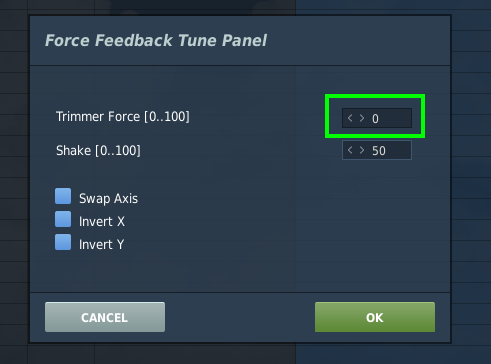
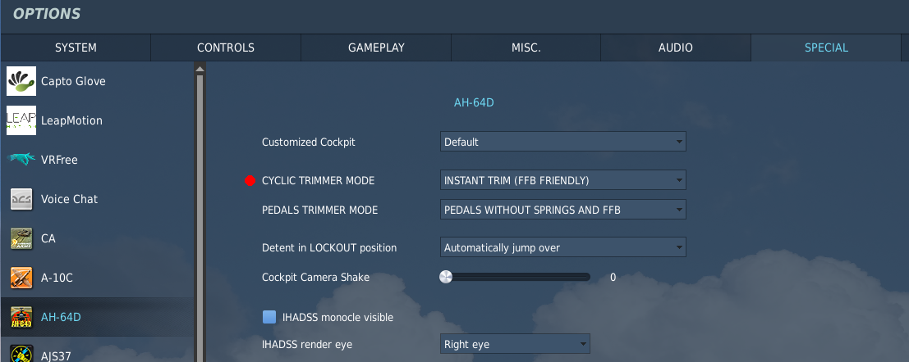
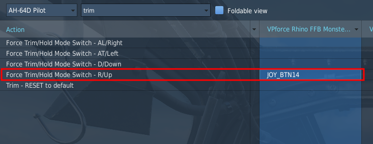
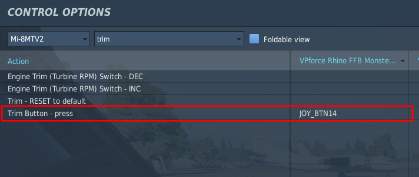
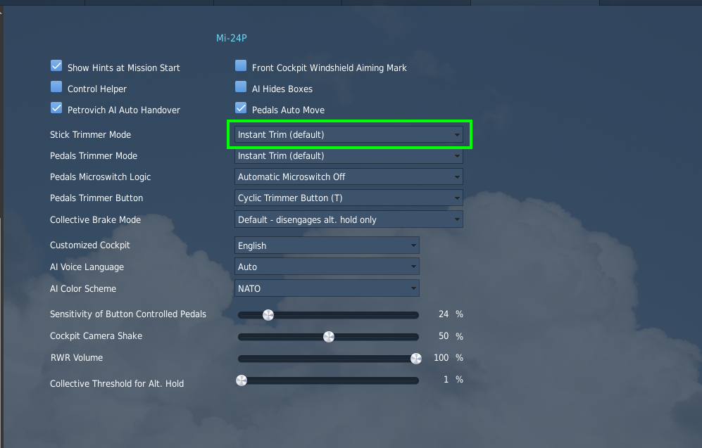
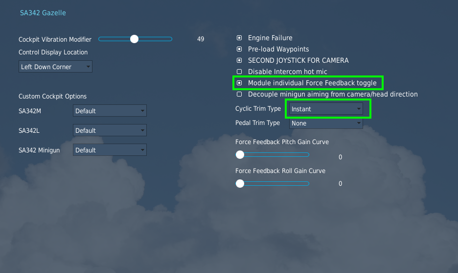
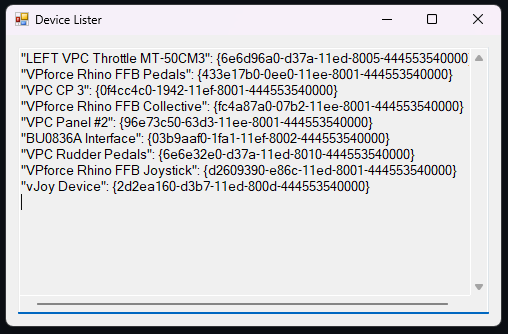

# Game Specific FFB Settings, Tips and Tricks

This section consists basically of a massive amount of collective knowledge in the community, from years of getting or trying to get force feedback to work in a variety of simulators. A lot of it concerns generic force feedback devices, but Rhino specific instructions are included where applicable.

This section is expected to be updated somewhat regularly when it inevitably becomes necessary.

## DCS World

DCS World is easy to get started with, because it offers native force feedback support through DirectInput. It's impossible to define a general level of force feedback support, though, because it varies so much based on the module. Generally the helicopters have force trim, warbirds model control stiffness from airflow (try getting one of your elevators shot off and enjoy the pleasantly light control feel), high AoA shake and weapons effects and the modern stuff varies from basically nothing at all to pretty good effects.

DCS offers fairly good data export, enabling projects like the TelemFFB to tap into the simulator and enhance the FFB experience - see the relevant section in this manual for more information.

The basic setup for Force Feedback is simple. Go to Options - Misc and enable Force Feedback as in the image below:

{ width="624px" height="342px" }

And that's pretty much it. The real work is in the modules, though, so it's not quite that simple.

!!! note
    If you have axis curves or saturation settings in the DCS axis tune configs, you will need to disable those as both curves and saturation are incompatible with FFB.

DCS FFB Support varies based on aircraft types:

-   **Warbirds**

    -   Flight surface pressure depending on speed (stick is limp on > ground, pressure builds up during takeoff)
    -   Stall effect (buffeting)

-   **Cold War Era**

    -   Stick center offset (F-5E, A10C, F-14 \...)
    -   Stick offset through trimming
    -   Autopilot features take full control over the stick (Mig21 \...)

-   **Helicopters**

    -   Full force trim (stick offsets and hold in position)
    -   Trim button released means forces are applied
    -   Trim button depressed means forces are off (for maneuvering)

-   **Modern Jets:**

    -   standard stick functionality (spring effect)

### General note on DCS Helicopter Force Trim settings

All of the DCS helicopter modules support force trim in one fashion or another. For *all* helicopters "Special" settings menu, you will want to choose the "**Instant**" or "**Default**" trimming option for the cyclic. The settings names are somewhat confusing however and prior experience with the "instant" trimmer and non-ffb joysticks often leads new FFB users down the wrong path. Without FFB enabled in DCS and with no FFB joystick, the "instant" trim mode results in an immediate doubling of the input when the trim button is released. This behavior changes when FFB is enabled. On many helicopters there is also a setting that is usually called
"**Joystick with no springs and FFB**". The actual intent of this setting seems to vary from helicopter to helicopter. For most helicopters it does not result in the desired behavior and the developers seem to have interpreted the meaning as "with no springs and with no ffb". In only one case (the KA-50) does it seem to behave the same as the "instant" mode.
**However, in all cases, the "instant" or "default" trimmer modes will work with FFB.**

!!! note
    Note that DCS does not support FFB pedals, even if many of the helicopter modules have pedal trimmer settings in the special menu. None of the pedal modes for any of the helicopters has been found to be of any use for FFB.

### Setup tips for DIY FFB Pedals and/or Collective devices

DCS does not natively support any FFB devices other than joysticks. While you can connect and use other FFB devices (like pedals), DCS does not understand what these devices are and does not differentiate them from the X/Y axes that are part of the joystick. DCS will broadcast all "FFB events" to all connected FFB devices with the assumption that they all behave like joysticks with x/y axes tied to the control surfaces.

What this means is that if your pedals (or collective) are connected to DCS and you adjust the aileron trim in an aircraft, the spring offset that is generated for your joystick will \*also\* be sent to your pedals X axis. Similarly for a collective type device, the Y axis conflicts with the Y (pitch) axis when it comes to receiving FFB events from DCS.

The VPforce TelemFFB application adds some basic pedal support for DCS (see section on TelemFFB).

The solution to this is to disable FFB trim forces for those devices in the DCS **"FF Tune"** menu. Many people don't know these settings exist in DCS.

You can disable the FFB spring force per device, per aircraft in DCS. To do so:

-   Enter the controls configuration for the aircraft and ensure that > "**Foldable view**" is **unselected**.

-   Select the column header for your pedals/collective

-   Then select the '**FF Tune**' button.

-   In the resulting window, change the "Trimmer Force" value to 0 and > apply

-   Repeat for additional FFB devices and aircraft configurations.

{ width="569px" height="356px" }

{ width="491px" height="364px" }

### AH-64D Apache

The AH-64D Apache by Eagle Dynamics basically only offers support for force trim - but it is a very nice feature indeed and one of the best uses for force feedback in simulators so it's well worth having and the implementation in the AH-64D is good.

To enable FFB trim for the RHINO, go to Options - Special - AH-64 and set `CYCLIC TRIMMER MODE` to `INSTANT TRIM (FFB FRIENDLY)`. For once, a feature is basically what it claims to be.

{ width="597px" height="249px" }

{ width="596px" height="231px" }

The `PEDALS TRIMMER MODE` option should be whatever best suits your hardware, it will have no effect on the RHINO.

!!! note
    Note that as in many other helicopters in DCS World, anything that affects the in-game cyclic will affect the RHINO. It is highly recommended to do the initial testing and any troubleshooting in a scenario where the aircraft is guaranteed to be intact, properly configured and ready to go.

### UH-1H Huey

The UH-1H Huey offers the always useful force trim feature, like most other DCS helicopters. The implementation is good and well worth the effort.

To enable FFB trim for the RHINO, go to Options - Special - UH-1H and set Trimmer Mode to Default as in the picture below. The other modes are designed for non-FFB controllers.

{ width="624px" height="236px" }

{ width="624px" height="216px" }

As with many other DCS helicopters, RHINO functionality is tied to the in-game cyclic functionality and if the aircraft is without power, configured incorrectly or broken, force trim won't work. Don't forget to turn on the force trim switch shown below:

{ width="624px" height="481px" }

!!! tip
    It is highly recommended to do the initial setup or any troubleshooting in a scenario where the aircraft is guaranteed to be intact, correctly configured and ready to go.

### Ka-50 Black Shark

As is typical to DCS helicopters, The Ka-50 offers force trim functionality, but no other effects. To enable force feedback for the Ka-50, go to Options - Special - Ka-50 and choose `INSTANT TRIM (DEFAULT)` in the `STICK TRIMMER MODE`:

{ width="624px" height="313px" }

PEDALS TRIMMER has no effect on the Rhino. It seems that generally DCS helicopter trims default to correct force trim functionality and the extra options are different workarounds for non-FFB controllers.

Also typically, the Ka-50 force trim on the Rhino is dependent on what happens in the virtual cockpit, so make sure the aircraft is intact, powered up and ready to go before initial setup and testing.

### Mi-8MTV2

Just like the other helicopters so far, The Mi-8MTV2 offers a well working force trim option, but no other effects. To enable force trim, choose `INSTANT TRIM (DEFAULT)` as the `STICK TRIMMER MODE` as in the image below:

{ width="556px" height="339px" }

{ width="555px" height="235px" }

As usual, during the initial setup and for troubleshooting, make sure the aircraft is intact, powered up and ready to go. The Rhino force trim will mirror the in-cockpit one and won't work if the aircraft is not set up correctly

### Mi-24P Hind

The Hind follows the same configuration logic as most of the other helicopters. In the special settings menu, be sure that the Stick Trimmer Mode is set to "Instant Trimmer (default)"

The Mi-24 supports "beep trim" trim following. Depressing the trim hat will cause the stick to move in the appropriate direction

{ width="560px" height="358px" }

{ width="599px" height="282px" }

### SA342 Gazelle

The Gazelle is the only helicopter which has its own FFB toggle in the special settings menu.

Enable the "Module individual Force Feedback toggle" setting and ensure the Cyclic Trim Type is set to "Instant"

The Gazelle supports "beep trim" trim following. Depressing the trim hat will cause the stick to move accordingly.

The trim on/off bindings control the trim actuator switch that will enable/disable beep trim.

{ width="561px" height="334px" }

{ width="587px" height="245px" }

## Il-2 Sturmovik: Great Battles

The latest iteration of Il-2 supports force feedback directly through DirectInput, which makes it very simple to get working. Supported effects include control stiffening with air pressure, stall shake, ground bouncing and gun recoil. Note that the effect of trimming will be different depending on the plane. The level of support is fairly consistent throughout, although thus far only WW1 planes seem to model elevator droop on the ground.

To enable force feedback, simply go to Settings - Input devices and enable Force Feedback as in the image below:

{ width="624px" height="199px" }

The feedback power setting will adjust the overall spring forces applied by any given aircraft. The 'shaking' setting will affect the haptic feedback effects like gunfire and stall buffeting.

Some glitches such as force reversion can occur. Sometimes the simulator rights itself simply after a restart. If reversion occurs after reversing the axis in game, the nuclear option is to do the reversal in FFB Configurator software. This will of course affect every other software that has something to do with the RHINO.

Other glitches may occur when changing windows focus to another window and then back to IL-2. Depending on the aircraft, you may notice loss of spring forces in one or both axes, or a large shift in the center point of the spring forces.

## Microsoft Flight Simulator

The latest iteration in the MSFS franchise does not offer native support for force feedback. It does offer a multitude of exports, though, which enables external software such as VPforce TelemFFB to approximate force feedback effects from the telemetry.

For more information see TelemFFB **[MSFS and X-Plane Section][msfs-and-x-plane]**.

!!! note
    The VPforce TelemFFB application implements full support for FFB with MSFS 2020/2024.

## X-Plane

The X-Plane franchise does not offer native support for force feedback. It does however have a full SDK that can be used to access the necessary telemetry data to implement FFB externally. The TelemFFB application enables full support for FFB with X-Plane 11/12 by implementing its own plugin which is installed into X-Plane that enables exporting telemetry data.

!!! note
    The TelemFFB application implements full support for FFB with XPlane 11/12

## IL-2 Cliffs of Dover

CLoD supports DirectX FFB but has issues with device enumeration. As soon as it finds a joystick device that advertises FFB support, that is where it stops looking. Any other FFB device that is connected is ignored in terms of FFB generation.

For many people this first device may be 'vJoy Device', even if FFB is disabled in the vJoy settings. The result is that *FFB does not work*, when in reality, CLoD is sending FFB commands to vJoy, or, in the case of users with multiple FFB devices (i.e. pedals or collective), to the wrong FFB device.

The solution is to use [*devreorder*](https://github.com/briankendall/devreorder/releases) to fix the enumeration order of the joystick devices on your system ([*https://github.com/briankendall/devreorder/releases*](https://github.com/briankendall/devreorder/releases)).

After unzipping the devreorder package:

Run DeviceLister.exe and make note of the output:

{ width="508px" height="334px" }

This is the exact order in which CLoD will see the joystick devices. You can see from the output that my FFB Pedals appear before my Joystick. The end result is that my Pedals are being given the FFB effects during game play.

Here is the procedure to resolve the issue:

-   From the devreorder package, make a copy of **devreorder.ini** and place it in the root folder of CLoD (i.e. *Program Files (x86)\\Steam\\steamapps\\common\\IL-2 Sturmovik Cliffs of Dover Blitz*)

-   From the devreorder package, copy **x64/dinput8.dll** and place it in the **/parts/core** folder of your CLoD install.

!!! note
    The instructions for performing this that are hidden away in the game help document make specific reference to the x86 version of the dll file. However it seems the game has been updated to 64bit and requires the x64 version (as of 12/20/24 using standard steam install)

-   **Open DeviceLister.exe** from the devreorder package

-   **Edit the new devreorder.ini file** that you placed into the game folder

    -   Follow the guideline documentation inside the ini file but, in general, paste the **NAMES only** of the devices (excluding the quotes and GUID values) , in the order you want them to be enumerated, into the **\[order\]** section of the ini file.

    -   Make sure that your VPforce Rhino Joystick (or appropriate name) is listed before any other FFB capable device (including vJoy!!!)

Using the above devicelister output as an example, here is the resulting ini file \[order\] section:

{ width="556px" height="386px" }

*You can see here that the only difference is that I have placed my Joystick at the top of the list.*

After making these changes, the FFB effects are applied to the correct device.

!!! note
    I have read many reports of general FFB issues with CLoD, often resulting in people modifying the "ffe" files that are included with the game. That is outside the scope of this guide.

This guide is only intended to get CLoD to use the correct FFB device

## Prepar3D

Left blank for future TBD
