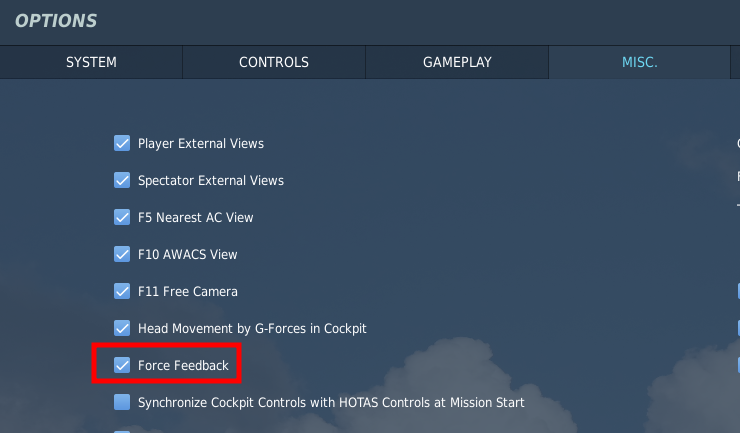
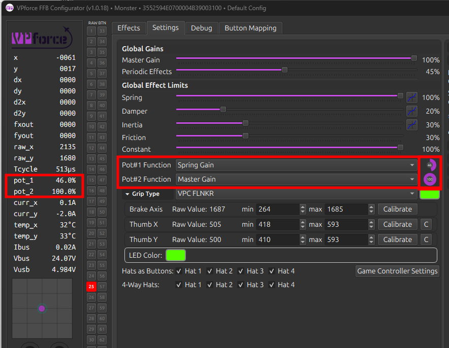
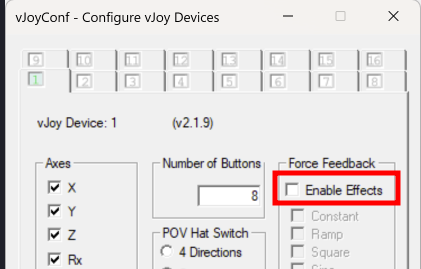

# Troubleshooting

## General Troubleshooting Steps

Before diving into specific issues, try these general troubleshooting steps that resolve many common problems:

### Reset to Factory Defaults

If you're experiencing unexpected behavior, instability, or effects issues, resetting to factory defaults is an excellent first troubleshooting step:

1. Open **VPforce Configurator**
2. Click **"Factory Reset"** button
3. Click **"Import Rhino Defaults"** button
4. Click **"Store Settings"** to save

This ensures you're working with known-good baseline settings and eliminates configuration issues as a potential cause.

!!! tip "When to Factory Reset"
    Factory reset is particularly useful when:
    
    - Effects feel wrong or inconsistent
    - After firmware updates
    - Before testing new configurations
    - When troubleshooting stability issues

## Power Issues

### Base Does Not Power On At All

**Issue:**  
The Rhino base shows no signs of life - no LED indicators, no response when connected, and does not appear in Windows Device Manager or VPforce Configurator.

**Understanding Rhino's Power System:**

The Rhino has two separate power systems:

1. **USB Power (5V):** Powers the control electronics, USB communication, and status LEDs
2. **DC Power (20V):** Powers the motors and drive electronics

If the base does not power on at all, the USB power path is the most likely culprit.

#### Diagnostic Steps

**Step 1: Verify USB Connection**

1. **Check USB cable connection:**

    - Ensure the USB cable is firmly seated in both the Rhino and your PC
    - Try a different USB cable if available
    - USB cables can fail internally while appearing physically intact

2. **Test different USB ports:**

    - Try multiple USB ports on your PC (front panel, rear panel, different USB controllers)
    - If available, test USB 3.0/3.1 ports (blue) and USB 2.0 ports (black)
    - Some USB ports have better power delivery or signal integrity than others

3. **Eliminate USB hubs:**

    - If currently using a USB hub, disconnect it
    - Connect the Rhino directly to a motherboard USB port
    - USB hubs can introduce power delivery and signal integrity issues

**Step 2: Check for Windows Recognition**

1. **Open Device Manager:**

    - Press `Win + X` and select **Device Manager**
    - Look for the Rhino under "Universal Serial Bus devices" or "Human Interface Devices"

2. **Check for unknown devices:**

    - Look for devices marked with a yellow exclamation mark or listed as "Unknown Device"
    - These may indicate the Rhino is partially detected but not functioning correctly

3. **Listen for connection sounds:**

    - Windows typically plays a sound when USB devices connect/disconnect
    - If you hear no sound when plugging in the Rhino, the USB signal path may be faulty

**Step 3: Test USB Cable Independently**

1. **Use the same cable with another USB device** (mouse, keyboard, etc.)

    - If the cable doesn't work with other devices, it's faulty
    - Replace with a known-good USB cable

2. **Test the Rhino with a known-good cable:**

    - Borrow a cable from another working device
    - Verify that cable works with the Rhino

#### Common Causes and Solutions

**1. Faulty USB Cable**

USB cables are a frequent point of failure, particularly if subjected to repeated bending or tension:

- **Solution:** Replace with a high-quality USB cable
- USB 2.0 cables are sufficient for the Rhino's data needs
- Ensure cable length is reasonable (under 3 meters for reliability)

**2. USB Port Issues**

Some motherboard USB ports have poor power delivery or signal integrity:

- **Solution:** Test multiple USB ports systematically
- Document which ports are most reliable
- Prefer motherboard rear-panel USB ports over front-panel ports (front-panel ports often have longer internal cables)

**3. USB Hub Power Delivery**

USB hubs, especially unpowered hubs, can fail to provide adequate power:

- **Solution:** Always connect the Rhino directly to a motherboard USB port
- If a hub is absolutely necessary, use a powered USB hub with external power supply

**4. Electrical Noise or Ground Loops**

Electrical noise from the PC's USB bus can prevent proper device recognition:

- **Solution:** Use a **USB isolator** (see recommendation below)
- This is particularly effective if you have many high-power USB devices

**5. Mainboard Damage (Rare)**

In very rare circumstances, the Rhino mainboard can be damaged by:

- Electrostatic discharge (ESD) during handling
- Ground loops between PC and power supply
- Voltage transients on the USB bus

**Solution:**

- If all troubleshooting steps fail, and you've verified the USB cable and ports are good, the mainboard may be damaged
- Contact VPforce support for further diagnostics and potential RMA

!!! tip "USB Isolator Recommendation"
    If you suspect electrical noise or ground loops are causing recognition issues, consider using a **USB isolator** (see [USB Isolator Recommendation](#usb-isolator-recommendation) section). This device provides electrical isolation that can resolve many obscure USB issues.

---

### Device Powers On But Motors Have No Power

**Issue:**  
The Rhino appears in Windows and VPforce Configurator shows the device connected, but the motors remain unpowered. The stick feels completely limp, and FFB effects have no effect. Motor status may show `OFFLINE` or `FAULT_UNDERVOLTAGE`.

**Understanding the Problem:**

This scenario indicates the **USB power path is working** (electronics are powered), but the **DC power path (20V) is faulty**. The motors require 20V DC to operate, supplied by an external power supply.

#### Diagnostic Steps

**Step 1: Verify Power Supply Operation**

1. **Check PSU power LED:**

    - Most power supplies have an LED indicator when powered on
    - Verify the PSU LED is illuminated

2. **Measure PSU output voltage** (if multimeter available):

    - Set multimeter to DC voltage measurement (0-30V range)
    - Measure voltage at the PSU's DC output connector
    - Should read approximately 20V (acceptable range: 19V - 21V)
    - If voltage is below 18V or reads 0V, the PSU is faulty

3. **Test PSU under no load:**

    - Disconnect the PSU from the Rhino
    - Measure output voltage with nothing connected
    - If voltage is correct with no load but drops when connected, see "PSU insufficient capacity" below

**Step 2: Inspect DC Power Connections**

1. **Check DC connector on Rhino:**

    - Inspect the DC barrel jack on the back of the Rhino
    - Ensure the connector is firmly seated and not loose
    - Wiggle the connector gently - if it moves easily, poor connection may be the issue
    - Poor DC connections can also cause intermittent operation or ground loops

2. **Inspect DC cable:**

    - Look for visible damage, kinks, or fraying
    - Check that connectors on both ends are tight and not damaged
    - If possible, try a different DC cable with the same connector type

3. **Check E-Stop switch (if installed):**

    - If you have an E-Stop switch in the DC power path, ensure it's not engaged
    - E-Stop switches can develop internal resistance or fail over time
    - Bypass the E-Stop temporarily to test if it's the culprit

**Step 3: Verify Power Delivery to Rhino**

1. **Measure voltage at Rhino DC input** (if multimeter available):

    - With PSU connected and Rhino powered on, measure voltage at the DC barrel jack
    - Should read approximately 20V
    - If voltage is correct at PSU but not at Rhino, cable or connector is faulty

2. **Check for voltage sag under load:**

    - Measure voltage while attempting to activate FFB effects
    - If voltage drops significantly below 18V under load, PSU is insufficient or failing

#### Common Causes and Solutions

**1. Faulty Power Supply**

Power supplies can fail over time, particularly under sustained high-current loads:

- **Symptoms:**

    - No voltage output
    - Voltage significantly below 20V
    - Voltage drops dramatically under load

- **Solution:**

    - Replace with a known-good 20V power supply
    - Ensure replacement PSU meets minimum current capacity (typically 6-8A recommended)

**2. Poor DC Connector Contact**

The DC barrel jack can become loose or develop poor contact over time:

- **Symptoms:**

    - Intermittent motor power
    - Motors work sometimes but not others
    - Vibrations cause power loss

- **Solution:**

    - Ensure DC connector is firmly seated
    - If connector is loose, consider replacing the DC cable or jack
    - Apply light pressure to connector while testing to verify if this is the issue

**3. Faulty DC Cable**

DC cables can develop internal breaks or high resistance:

- **Symptoms:**

    - Voltage present at PSU but not at Rhino
    - Intermittent operation depending on cable position

- **Solution:**

    - Replace DC cable with known-good cable
    - Ensure cable gauge is adequate for current (typically 18AWG or heavier)

**4. Failing E-Stop Switch**

E-Stop switches can develop high internal resistance or fail to make contact:

- **Symptoms:**

    - `FAULT_UNDERVOLTAGE` errors
    - Motors intermittently lose power
    - Voltage sag under load

- **Solution:**

    - Temporarily bypass E-Stop to test
    - If bypassing resolves issue, replace E-Stop switch

**5. Insufficient PSU Capacity**

Power supply may not provide sufficient current for high-torque operation:

- **Symptoms:**

    - Voltage correct at idle but drops under load
    - Motors work at low forces but fault at high forces
    - `FAULT_UNDERVOLTAGE` during intense FFB

- **Solution:**

    - Upgrade to higher-capacity power supply (8A or higher recommended)
    - Verify PSU can sustain rated current continuously

!!! important "Ground Loops and Electrical Noise"
    Poor DC connections can introduce ground loops that cause both power delivery issues and USB instability. If you experience both motor power issues and USB connection issues simultaneously, inspect DC connections first - fixing the DC path often resolves USB issues as well.

#### Verification After Repairs

1. **Measure DC voltage at Rhino input:**

    - Should read approximately 20V with no load
    - Should remain above 18V under typical FFB load

2. **Check motor status in Configurator:**

    - Motor status should show `RUNNING` or `IDLE`
    - Should not show `OFFLINE` or `FAULT_UNDERVOLTAGE`

3. **Test FFB effects:**

    - Activate test effects in VPforce Configurator
    - Verify motors respond with appropriate force
    - Check for consistent operation without intermittent drops

## USB Connection Issues

**Issue:**
The Rhino exhibits intermittent connection problems, instability, or appears to disconnect and reconnect frequently. This typically manifests as effects stuttering, dropping out momentarily, or the device appearing offline in VPforce Configurator.

**Common Causes & Solutions:**

Check the following items in order:

1. **USB Hub**

    - If you are currently using a USB hub, disconnect it and connect the Rhino directly to your PC
    - USB hubs can introduce latency, power delivery issues, and signal integrity problems
    - Test the direct connection for stability

2. **USB Port**

    - Try a different USB port on your PC
    - Some USB ports have better power delivery or less electrical noise than others
    - Test multiple ports to identify if the issue is port-specific
    - If available, try USB 3.0/3.1 ports (blue ports) rather than USB 2.0 (black ports)

3. **USB Cable**

    - Try a different USB cable if possible
    - USB cables can degrade over time or have internal damage
    - A faulty cable is a common cause of intermittent connection issues

4. **DC Power Plug**

    - Inspect the DC power connector on the back of the Rhino
    - If the DC power plug pulls out easily or feels loose, vibrations during operation might be causing intermittent power connection loss
    - Poor DC connections can also introduce ground loops, causing electrical noise and instability
    - Ensure the power plug is firmly seated and making good contact
    - This is a frequent cause of instability during intense FFB effects

!!! tip
    If you have access to multiple USB cables and ports, systematically test each combination. Document which configuration is most stable—this can help identify whether the issue is related to your specific port, cable, or something else entirely.

!!! important
    Once you have confirmed a stable connection with direct PC connection and a known-good cable/port, the instability is likely resolved. If problems persist, the device itself may have a hardware issue and should be checked by support.

### USB Isolator Recommendation

As a best practice or if you continue to experience intermittent connection issues after testing the above steps, or if your PC has noisy USB power delivery, consider using a **USB isolator**. A USB isolator is a device that sits between your PC and the Rhino, providing electrical isolation that eliminates ground loop noise and reduces EMI (electromagnetic interference) that can cause connection instability.

{ width="250" }

Benefits of a USB isolator:

- Eliminates electrical noise from your PC's USB bus
- Provides cleaner power delivery to the Rhino
- Can resolve connection issues in systems with high electrical noise (common in gaming rigs with multiple high-power devices)

This is a proven solution for users experiencing persistent USB stability issues, particularly in systems with many power-hungry components.

**Where to Find USB Isolators:**

Search for **AduM3160** isolator boards on AliExpress, Amazon, or other electronics retailers. The AduM3160 is a popular, affordable USB 2.0 isolator IC commonly available on ready-made isolator boards. When searching, look for:

- "AduM3160 isolator board" or "USB isolator AduM3160"
- Pre-assembled USB isolator modules (no soldering required)
- Boards with both USB-A connectors or USB-A to USB-C options

Cost is typically low (under $10-20 USD), making it an economical troubleshooting step if you suspect USB noise issues.

## WinUSB / WebUSB Firmware Update Issues

### Legacy Firmware WebUSB Issue (1.0.16 and older)

**Issue:**
On **Windows 10/11** with **firmware 1.0.16 and older**, the Rhino may appear correctly in Windows, but **WinUSB fails to operate**, preventing firmware updates through WebUSB. Users may see `network error`s in the WebUSB tool. This problem is fixed in newer firmwares.

You can apply a simple registry fix to restore WebUSB functionality. This requires administrative privileges.

**Steps:**

- Press **Start**, type PowerShell, right-click **Windows PowerShell**, and select **Run as administrator**.
- Paste the following command and press **Enter**:
    `HKLM:\\SYSTEM\\CurrentControlSet\\Enum\\USB\\VID_FFFF&PID_2055&MI_03\\\*\\DeviceParameters\" -Name \"DeviceInterfaceGUID\" -Value`
- **Unplug** the Rhino from the USB port and **plug it back in**.
- Test the connection in the WebUSB tool - firmware updates should now work as expected.

!!! note
    - This workaround only applies to **firmware 1.0.16 and older**. Updating the latest firmware will remove the need for this registry modification.
    - Only run the command exactly as provided; editing the registry incorrectly can cause system issues.

### WinUSB Driver Conflicts and Cleanup

Many Windows systems handle Rhino’s WebUSB interface without any special setup. Others don’t. The difference usually comes down to what Windows has stored from past hardware or software. Windows keeps old USB drivers in its internal driver store, and sometimes it silently reuses those drivers for new devices. If one of those older drivers isn’t compatible with WebUSB, Rhino may get matched to the wrong driver and the browser will show connection or “network” errors even though the device is working correctly in Configurator or game itself. The steps below clear out these leftover drivers so Windows can load the correct Microsoft WinUSB driver that WebUSB needs.

If you encounter WebUSB connection issues, driver conflicts from previous installations (particularly from Zadig or other USB tools) may be preventing proper WinUSB operation. Follow these steps to clean up conflicting drivers and restore proper WebUSB functionality.

#### Quick Reset (try this first)

1. Disconnect Rhino from the PC
2. Reboot Windows
3. Connect Rhino directly to a USB port on the PC (not a hub)
4. Test WebUSB connection

If errors persist, continue with the full driver cleanup procedure below.

#### Full Driver Cleanup Procedure

**Step 1: Remove old Rhino drivers from Device Manager**

1. Open Device Manager (Win + X)
2. View → Show hidden devices
3. Expand "Universal Serial Bus devices", "USB devices", "Other devices", and "LibUSB" (if present)
4. Right-click every entry related to "Rhino DFU" or showing your device's VID/PID → Uninstall device
5. If Windows shows a checkbox "Delete the driver software for this device", enable it before uninstalling

Leave Device Manager open for now.

**Step 2: Clean driver packages from Windows driver store (optional)**

!!! warning "Advanced Procedure"

    The following driver cleanup steps involve modifying Windows driver store using command-line tools. **This procedure is intended for advanced users** who are comfortable with administrative command-line operations. Incorrectly removing driver packages can affect other USB devices on your system. If you are not confident with these steps, you can skip to step 3.

1. Open Start → type "cmd" → right-click → Run as administrator
2. List all driver packages:

```
pnputil /enum-drivers > %temp%\drivers.txt
```

3. Open the file:

```
notepad %temp%\drivers.txt
```

4. In the list, look for driver entries that mention:
    - Rhino
    - Your device VID_FFFF / PID_205*x*
    - WinUSB
    - libusb
    - libusbK
    - libwdi

Each entry shows something like `Published name: oem47.inf`.

5. For each matching driver, run:

```
pnputil /delete-driver oem47.inf /force /uninstall
```

Replace `oem47.inf` with the actual name. If Windows says "driver is in use", unplug the device and run the command again.

**Step 3: Remove ghost interfaces**

Back in Device Manager:

1. View → Show hidden devices
2. Remove any greyed-out duplicates of "Rhino DFU" or anything matching VID/PID
3. Unplug the device after cleaning

**Step 4: Reboot Windows**

A clean reboot ensures Windows forgets cached bindings.

**Step 5: Reconnect Rhino and verify WinUSB installation**

Plug in Rhino. Windows should now load Microsoft's built-in WinUSB (winusb.sys) automatically.

Verify correct driver:

1. Device Manager → open "Rhino DFU" device → Properties
2. Driver tab should show:
    - Provider: Microsoft
    - Driver file: winusb.sys

#### Forcing Windows to Use WinUSB (if automatic installation fails)

If Windows picks the wrong driver, manually bind WinUSB:

1. Right-click "Rhino DFU" in Device Manager → Update driver
2. Choose "Browse my computer for drivers"
3. Choose "Let me pick from a list of available drivers"
4. Select "Universal Serial Bus devices"
5. Pick "WinUSB Device" or "USB Device (WinUSB)" depending on Windows version
6. Install

This uses Microsoft's own signed WinUSB and does **not** require Zadig or third-party tools.

#### Browser Cleanup

After correcting the driver:

1. Chrome/Edge → Settings → Privacy → Site settings → USB devices → Clear permissions for WebUSB tool
2. Clear site data for the WebUSB domain
3. Test connection in a fresh tab or Incognito window

!!! warning "Important: Avoid Zadig for Rhino"

    Zadig and similar USB driver replacement tools can cause persistent driver conflicts with the Rhino. These tools leave fingerprints in the Windows driver store that can prevent proper WinUSB operation even after uninstalling. If you previously used Zadig with Rhino, follow the full driver cleanup procedure above to remove all traces.


## Motor faults

### FAULT_UNSTABLE

**Issue:**
The Rhino reports a `FAULT_UNSTABLE` error. This fault typically occurs suddenly, often preceded by an audible thump or impact sensation from the device.

**Note:**
The device's fault message usually identifies which motor (or axis) triggered the fault. Check the indicated motor/axis first — it typically points straight to the side that needs inspection.

**Cause:**
This fault is most commonly caused by **belt slippage** on either the X-axis or Y-axis. When the belt connecting a motor to its pulley loses tension or alignment, the motor and pulley can slip relative to each other. The sudden slip causes the controller to detect an unexpected position change that doesn't match the expected motor command, triggering the stability check and generating the fault. The audible thump is often the moment when slippage occurs.

**Resolution:**

1.  **Check belt tension:** Inspect the axis belt which produced the fault. The belts should be firm but not over-tightened.

2.  **Re-tighten if necessary:** If either belt is loose, carefully tighten it to restore proper tension. See the **[Belt Tensioning Guide][re-tightening-the-belts]** for detailed instructions.

4.  **Run Auto Calibration:** After adjusting tension and alignment, launch the VPforce FFB Configurator and run **Auto Calibration** from the **Settings** tab.

5.  **Verify calibration values:** Once calibration completes, check the calibration values. You should see values around **C:~2000** for both axes. If the values are significantly different, the belts may need further adjustment.

### FAULT_UNDERVOLTAGE

**Issue:**  
The Rhino reports a `FAULT_UNDERVOLTAGE` error when supply voltage drops below 8 volts.

**Cause:**  
This fault protects motor drivers by halting operation when voltage is insufficient. The 8V threshold ensures reliable operation and prevents damage.

**Under load** (during active force feedback or high-torque movements):

- Poor electrical connection (loose or corroded power connector, high resistance in power path)
- Failing power supply (unable to maintain voltage during peak current draw)
- Insufficient PSU capacity (power supply rated below recommended specifications)
- Failing E-Stop switch (high internal resistance or intermittent disconnection)

**At idle** (no force feedback active):

- E-Stop pressed (normal behavior: motor power cut momentarily shows fault until capacitors discharge, then motor status shows `OFFLINE`)
- Faulty PSU (unable to maintain stable output without load)

**Resolution:**

1. **Check power connections:** Inspect PSU-to-controller cables and connectors. Ensure tight, clean, corrosion-free connections.

2. **Verify PSU output voltage:** Measure PSU output voltage with multimeter under no load. Should match rated voltage.

3. **Test under load:** Monitor PSU voltage during typical Rhino operation. Significant voltage sag indicates insufficient PSU capacity or poor connections.

4. **Replace or upgrade PSU:** If power supply cannot maintain adequate voltage under load, replace with higher-capacity unit. 


## - Game Specific Troubleshooting

Various items can cause issues with FFB depending on the sim in question. This section will cover common issues and basic troubleshooting steps that can be used to identify and fix the problem. This section is a living list that will be updated as new issues/causes/solutions are identified.

### - DCS

By default, the Spring effect, which is the primary 'FFB' effect type, is owned and managed by DCS. The TelemFFB application does not alter the spring effect unless one of the several override options are enabled.

If FFB is not working, follow the below procedure:

!!! note
    This procedure assumes you have already confirmed that your Rhino is connected and working properly with VPforce Configurator and that you can feel FFB effects when using the Configurator's test effects.

!!! important
    DCS does not generate any active FFB effects until you are loaded into an aircraft. Simply being in the main menu or mission editor will deactivate any *Spring* effect set in the *VP Configurator* --- therefore the joystick will remain limp.

#### Ensure FFB is enabled in the DCS Misc. settings

1.  Even with FFB disabled, DCS will create a disabled FFB effect (which renders the joystick limp). However, it will never 'start' the effect, so it remains limp even after loading into an aircraft.

    { width="330px" height="193px" }

2.  Ensure the 'FF Tune' settings for the axes are non zero and at the value you intend (default is %100 and recommended to keep it at %100)

    1. This involves going into a modules' axis settings, ensuring '**Foldable View**' is disabled, **selecting the axis binding** and then choosing the **'FF Tune'** button at the bottom.

    { width="563px" height="330px" }

    2. This is the 'strength' of the spring effect that DCS will use for that axis for that aircraft. Recommended to leave it at %100

#### Test without TelemFFB running

1.  **If the issue persists, TelemFFB is not at fault. Proceed to next step**

2.  If the issue goes away, likely some configuration inside TelemFFB is causing it.

    1. Check the '**Active Effects**' panel on the TelemFFB **Monitor **page. Look for any spring override type effects and disable any which are active.

    { width="251px" height="127px" }

    2. If the cause is one of the effects, please read the documentation for the effect and ensure you understand its use and purpose. All of the TelemFFB override type effects have very specific use cases.

    3. If no active effects are causing the issue, check to see if you are pushing a VPforce Configurator profile or are using the Configurator Gains override feature.
    { width="361px" height="227px" }
        - Both of these options could make it seem like FFB is not working. If you are setting the **master gain** or **spring gain** to 0 with configurator overrides, or you are pushing a configurator profile with 'sticky spring' or the spring gain slider turned down, it will seem as if "FFB is not working"

    4. If TelemFFB has been determined to be the cause, but the above steps did not reveal the issue, reach out to the **#TelemFFB-User** channel on the VPforce discord

#### Check your configurator settings

1.  Make sure that your master-gain and spring gain sliders are nonzero and are high enough that you feel the spring force you are expecting. These sliders define the maximum force that the Rhino can generate and if they are low/zero, it does not matter what the game sets the spring effect at, it will be no stronger than the combination of those sliders.

{ width="319px" height="181px" }

2. Make sure you do not have **'Sticky' **enabled in the spring effect on the VPforce configurator **'Effects' **tab.
    -  This option tells the Rhino to ignore the spring effect from the game and use the one that is configured there in the Effects tab.
    { width="242px" height="184px" }

3.  If the issue is with in-game trimming, ensure you do not have '**Override Trim'** enabled in the hardware force trim section of the VPforce Configurator **Effects **tab
    -  This option tells the Rhino to ignore the spring center information from the game and control the spring center using the hardware trim bindings in the Effects tab

    { width="239px" height="214px" }


4.  Check your **potentiometer settings**.

    -  Make sure the Pot#1 (and 2, if applicable) are configured as you intend and that the current values are what you expect. If your Pot is configured for Master Gain or Spring Gain and turned all the way down, FFB will seem to *not work*.

{ width="493px" height="383px" }

#### Check for 3rd party app issues

1. **vJoy**

    1. vJoy is known to cause issues with FFB, particularly ef the FFB options are enabled, which they typically are by default when vJoy is installed.
    { width="299px" height="191px" }

    2. **SimHaptics** by rKApps

        - SimHaptics has an '**Auto Start**' feature that is known to break FFB for DCS. The app tries to start at the same time the aircraft in DCS is loading and this somehow interferes with DCS starting the FFB Spring effect.

6.  **The Nuclear Test**

    If all of the above fails to reveal the issue, try with a fresh Saved Games folder. This will remove any active mods, or any 3rd party app that makes use of the DCS export environment as a potential cause of the issue

    1.  Close DCS and rename your 'DCS' (or whatever is active) saved games folder to something like 'DCS.backup'

    2.  Start DCS. It will create a completely clean 'DCS' folder with no mods, export scripts or even bindings.

    - Here you can choose to copy your bindings from the `config/input` folder in your real DCS.backup folder over to the new test folder. Restart DCS after doing so

#### Autopilot Misbehaving or Disengaging Unexpectedly

**Issue:**  
Autopilot systems (altitude hold, heading hold, or other AP modes) behave erratically, continuously pitch/roll in one direction, or disengage unexpectedly shortly after engagement. This problem occurs frequently but may occasionally work correctly, making diagnosis difficult. Common in the F-14 Tomcat, but can affect any aircraft with autopilot computers.

**Root Cause:**  
Many aircraft autopilot systems interpret a mismatch between the in-game trim point and the physical stick position as a **hands-on override** — the pilot intentionally taking control. When the physical stick position doesn't match the trimmed neutral point, the autopilot computer detects this as pilot input and either fights the stick position or disengages entirely.  

Aircraft with offset control mechanics (like the F-14 Tomcat, which has forward-offset by design) are particularly susceptible. When autopilot engages or commands trim adjustments, any offset between trim point and stick position causes the autopilot to treat it as active pilot input, leading to erratic behavior or immediate disengagement.

**Diagnostic Steps:**

1. Enable the **Input Overlay** in DCS:

    - Press `RCtrl + Enter` (Right Control + Enter)
    - This displays stick position and trim offset in real-time
    - The overlay shows the physical stick position and the current trim point

2. Observe stick position vs. trim point:

    - Watch the input overlay while the issue occurs
    - Check if the stick closely follows the trimmed point offset
    - If the stick lags behind the trim point → autopilot interprets the mismatch as pilot override
    - The autopilot sees this offset as intentional pilot input and either fights it or disengages

**Solutions:**

1. **Enable Adaptive Recentering** (Recommended)

    - Open **VPforce Configurator**
    - Locate **Adaptive Recentering** feature in the Effects tab
    - This automatically balances the stick to the current trim point, eliminating offset mismatch
    - Prevents autopilot from detecting false pilot override
    - Provides smoother stick behavior overall

2. **Manual Stick Adjustment**

    - Before activating autopilot, manually adjust stick position to match the trimmed point (use Input Overlay to verify alignment)
    - Once synchronized, activate autopilot
    - Less convenient but demonstrates the root cause

4. **Configure Input Deadzone**

    - Open **VPforce Configurator** → **Axes** tab
    - Add a small circular deadzone (e.g., 1-3%)
    - VPforce uses a circular deadzone that affects both axes simultaneously
    - Creates a tolerance zone where minor stick position variations won't register as pilot input
    - Allows autopilot to maintain control despite small trim offset differences
    - Trade-off: Reduces precision for manual control

5. **Disable DCS Input Curves**

    - Open DCS axis settings for the affected aircraft
    - Check if curves are enabled for pitch/roll axes
    - Curves cause the physical stick position and in-game trim position to mismatch increasingly as you move away from center
    - Disable curves by setting the curve to a straight line (linear response)
    - Linear response ensures physical stick position always matches in-game trim position

6. **TelemFFB Dynamic Deadzone** (Aircraft-Specific)

    - TelemFFB supports automatic dynamic deadzone activation when autopilot is engaged for certain aircraft
    - When AP engages, TelemFFB automatically adds deadzone to prevent false override detection
    - Deadzone is removed when AP disengages, restoring full control precision
    - Check TelemFFB documentation for aircraft-specific AP deadzone support

!!! note "Related Issue"
    The F-14 also exhibits the **forward stick drift at 50% position** when loading into the aircraft (same as the A-10). This is intentional module design. The forward offset is part of the FFB implementation and is why trim synchronization is important for autopilot functionality.

If the issue still persists, then you either did not complete all of the steps above, or there is something unknown occurring. As you will have already determined TelemFFB not to be the issue, reach out to the **[#support](https://discord.com/channels/965234441511383080/968208779084701716)** channel on the VPforce Discord.