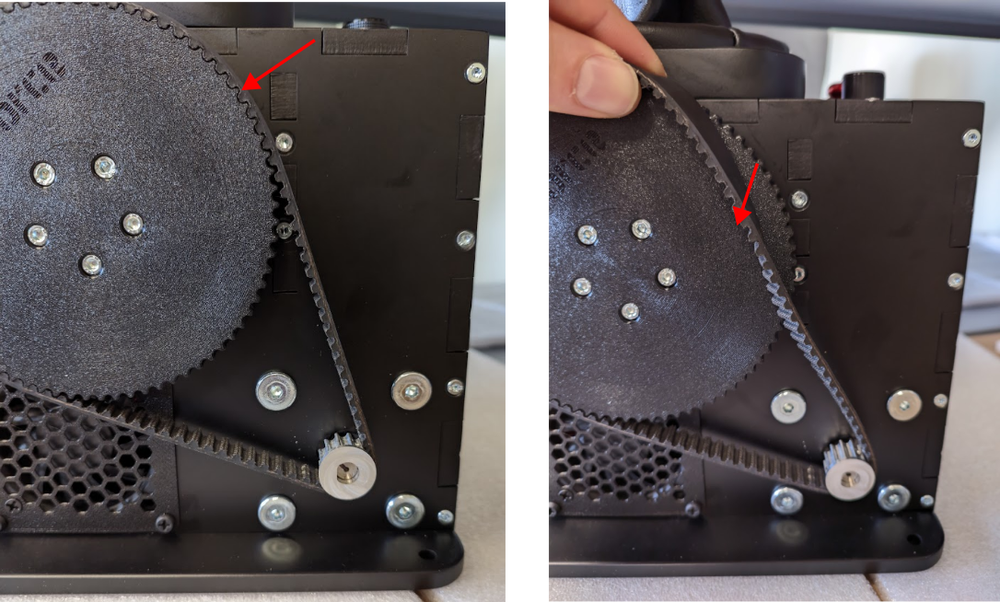
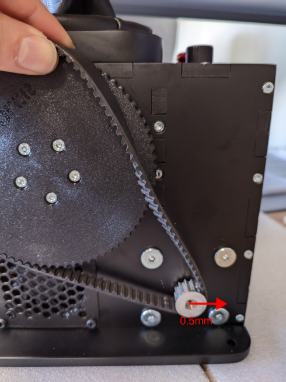
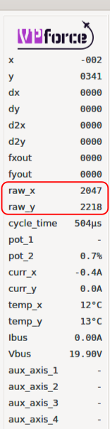
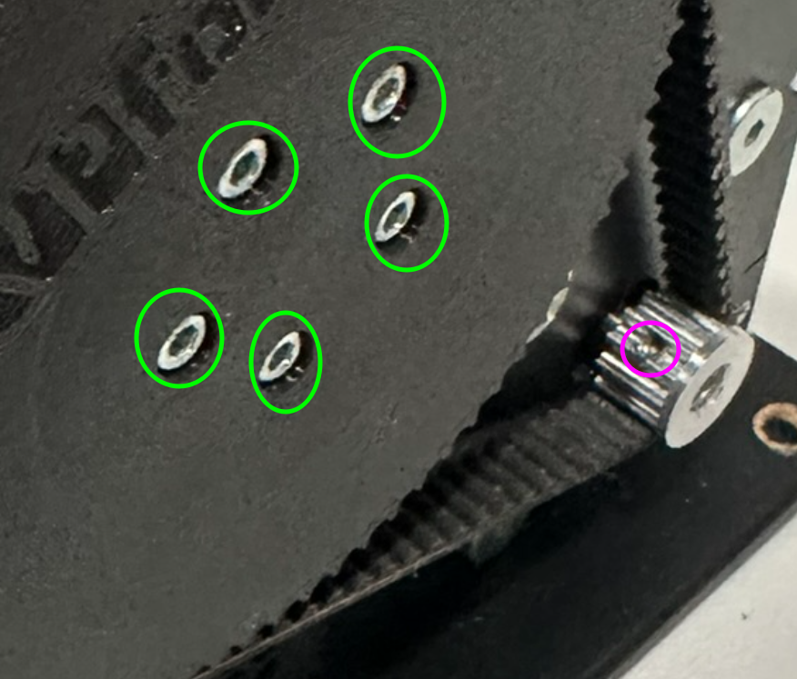
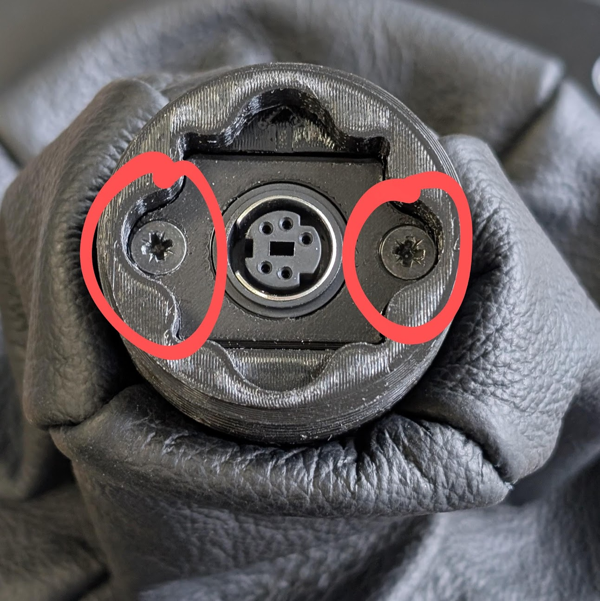
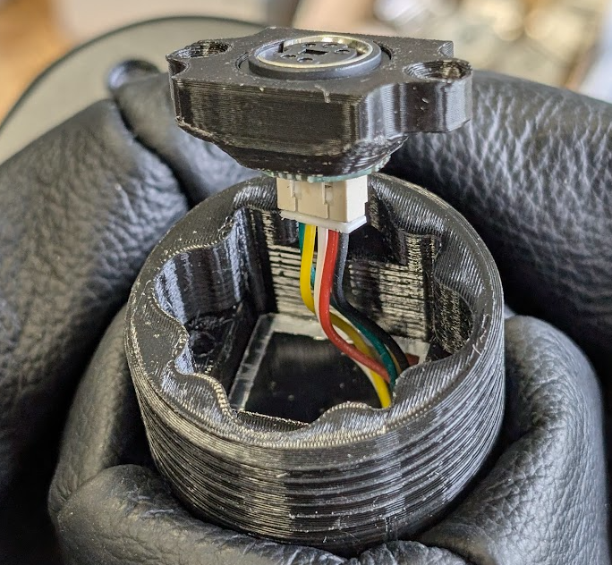
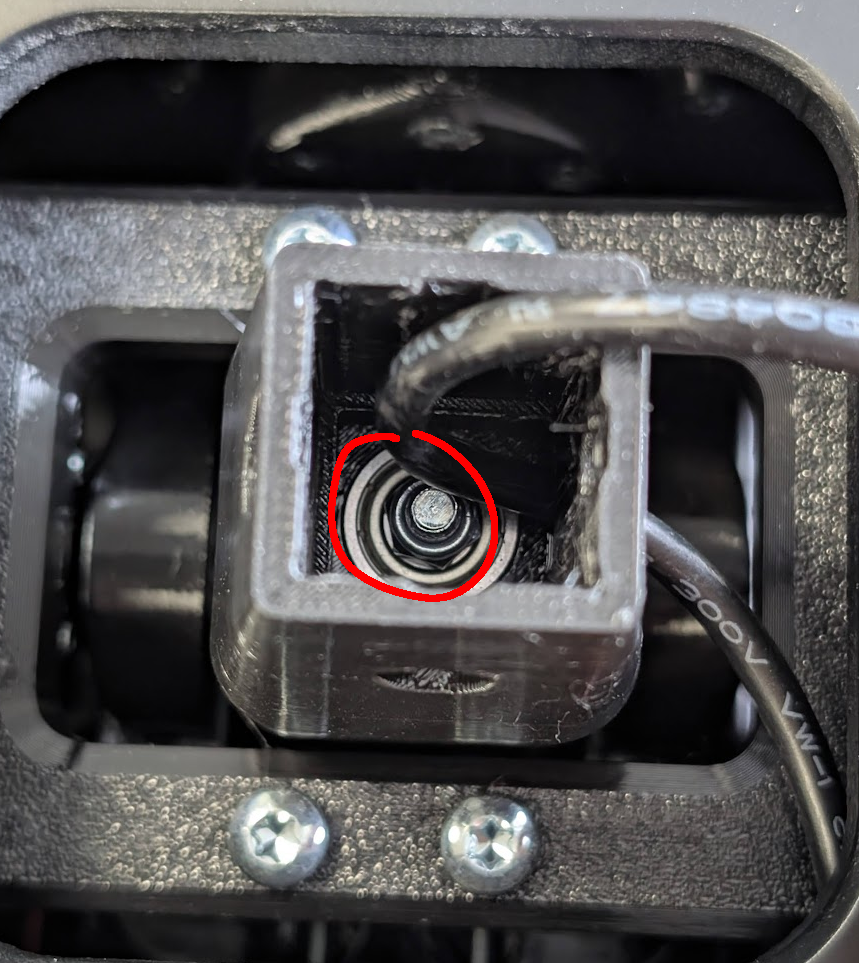

# RHINO Maintenance

This section covers common maintenance tasks for the Original VPforce Rhino, including belt re-tightening, re-alignment after belt slip, addressing stick drift when trimming off center, resolving clicking noise during force reversal, and replacing the grip mount head.

!!! note
    These maintenance tasks applies to the Original VPforce Rhino only. The DIY versions of the Rhino may have different maintenance procedures.

## Re-tightening the Belts

Over time, the drive belts connecting the motors to the pulleys may stretch and lose tension, requiring adjustment. Belt tension is critical for accurate position sensing and preventing slippage. Loose belts can cause position tracking errors, leading to `FAULT_UNSTABLE` errors or unpredictable stick behavior.

The Rhino's design makes belt tensioning straightforward: the motor mounting holes are slotted, allowing you to slide the motor to adjust belt tension without removing the belt entirely.

### When to Re-tension Belts

You should check belt tension if you experience:

- `FAULT_UNSTABLE` errors during operation
- Position tracking drift or inconsistency
- Audible "thump" or sudden force jumps
- Belt visibly loose or sagging

### Understanding the Adjustment Mechanism

**Pitch Axis (Y-axis):**  
Motor slots are horizontal. Push the motor **away from the large gear** to increase tension.

**Roll Axis (X-axis):**  
Motor slots are vertical. Push the motor **down** to increase tension.

!!! tip "Remember"
    Both axes use the same principle: increase distance between motor pulley and large gear to tighten the belt.

### Step-by-Step Belt Tensioning Procedure

#### Step 1: Partially Remove the Belt

Slide the belt **off the large gear only** (leave it on the motor pulley). This provides access to the motor mounting bolts while preserving the motor's calibrated position relative to the belt.

{ width="557px" height="335px" }

!!! warning "Important"
    Do NOT remove the belt completely from both pulleys. Keeping it on the motor pulley maintains approximate calibration alignment and makes reinstallation easier.

#### Step 2: Loosen the Motor Mounting Bolts

Locate the motor mounting bolts (typically two bolts securing the motor to the frame). Loosen these bolts just enough to allow the motor to move freely within the slotted holes.

{ width="276px" height="186px" }

**Do not remove the bolts completely** - just loosen them enough to allow motor movement.

#### Step 3: Adjust Motor Position to Increase Tension

Gently push the motor to increase the distance between the motor pulley and the large gear:

- **Pitch axis (Y):** Push motor horizontally away from large gear
- **Roll axis (X):** Push motor downward (vertically)

A small adjustment of approximately **0.5 mm** is typically sufficient. You're not trying to make the belt guitar-string tight - just firm.

{ width="357px" height="172px" }

#### Step 4: Secure and Test Tension

**Option A: Quick Check (Recommended for First Attempt)**

1. Tighten **one bolt** finger-tight to hold motor position
2. Test belt tension by pressing on the belt between pulleys:

    - Should have slight give but feel firm
    - Should not sag or be excessively loose
    - Should not be so tight it's difficult to deflect

3. If tension feels correct, tighten the second bolt
4. If tension is incorrect, loosen bolt and repeat Step 3

**Option B: Secure Both Bolts**

1. Tighten both bolts while holding motor in position
2. Test belt tension after tightening

{ width="323px" height="189px" }

#### Step 5: Reinstall the Belt

With the motor bolts secured, slide the belt back onto the large gear.

**If the belt won't slip on easily:**

1. Slightly loosen the motor bolts
2. Move the motor fractionally closer to the large gear (reduce tension slightly)
3. Reinstall the belt
4. Re-tighten bolts
5. Re-check tension

The belt should slide onto the gear with moderate resistance - not so tight you have to force it, but not so loose it falls on by itself.

#### Step 6: Run Auto Calibration

After belt tensioning:

1. Open **VPforce Configurator**
2. Navigate to **FFB Axes Setup** tab
3. Click **Auto Calibrate**
4. Move stick through full range of motion in all directions
5. Click **Auto Calibrate** again to deactivate
6. Click **Store Config** to save

Verify calibration values are approximately **C:~2000** for both axes.

{ width="98px" height="378px" }

### Re-alignment After Complete Belt Slip

If the belt has slipped off both pulleys completely, the motor position relative to the stick position must be realigned before reinstalling the belt. This is critical because the motor's absolute position encoder needs to match the physical stick position.

#### Method 1: Manual Realignment (More Control)

1. **Power on the Rhino** (motors will remain unpowered if belt is off)
2. Open **VPforce Configurator → FFB Axes Setup** tab
3. Manually rotate the motor pulley (by hand) while watching the **raw axis value** (raw_x or raw_y)
4. Rotate until raw value reads between **2000-2100**
5. Manually center the stick gimbal physically
6. Reinstall the belt on both pulleys
7. Run **Auto Calibration**

#### Method 2: Automatic Motor Recentering (Easier but Less Precise)

1. Open **VPforce Configurator → FFB Axes Setup** tab
2. Set calibration values:

    - **Min:** 0
    - **Max:** 4096
    - **Center:** 2048

3. Click **Store Config**
4. Navigate to **Effects** tab
5. Enable **Spring** effect with moderate gain (~50%)
6. The motor will automatically rotate to center position (2048)
7. Manually center the stick gimbal physically to match
8. Reinstall the belt on both pulleys
9. Run **Auto Calibration** to restore proper calibration

!!! tip "Verification"
    After realignment and calibration, the final calibrated center value should read approximately **C:~2000**. Values significantly outside this range (below 1900 or above 2200) indicate misalignment.

### Troubleshooting Belt Tension Issues

**Belt too loose after adjustment:**

- Increase motor adjustment distance (push motor further away from large gear)
- Check if belt has stretched significantly and may need replacement

**Belt too tight (won't reinstall or feels guitar-string tight):**

- Reduce motor adjustment distance slightly
- Belt should be firm but not excessively tight

**Position tracking still inaccurate after tensioning:**

- Verify calibration values are approximately C:~2000
- Check for belt damage or wear
- Ensure belt is properly seated on both pulleys (not riding on pulley edges)

## Stick drifts when trimming off center

See section **[3.4 Balancing the Grip](3-using-the-rhino.md/#balancing-the-grip)**

## Clicking Noise During Force Reversal

If you notice a clicking sound or slight looseness when the force direction reverses, it may be due to mechanical play or backlash in the VPforce Rhino hardware. This is often caused by slight movement between components when force is applied in opposite directions. Common reasons include slightly loose joints.

Below are typical sources of backlash, listed in order of how easy they are to check and adjust:

1. **Small 12T Pulley on the Motor Shaft**
*Most common cause of noise due to micro-slippage on the shaft.*
    - This pulley is secured by three M3 grub screws (2 mm hex) spaced 120° apart. If these are not tightened firmly, the pulley may slip slightly under load changes, causing a click or knock.
    - Use a high-quality 2 mm hex key to avoid stripping the screw heads.
    - Apply firm torque and ensure all three screws are tightened evenly.

{ width="208px" height="178px" }

2. **HEX Bolts on the Large Gears**
*Rare source of noise, but very easy to check.*
    - Each large gear (on both axes) is fastened with five M4 HEX bolts.
    - Simply check and tighten these bolts. Even if they are not the root cause, this step takes little effort and helps rule them out.

3. **Axis Coupling in the Center of the Gimbal (X and Y Axes)**
    - A slightly loose coupling here can cause a "clunk" sound during reversal.
    - The X and Y axes are joined via a central bolt that passes through the gimbal and clamps the axes via bearings. If this bolt/nut assembly becomes even slightly loose, the nut may shift slightly under force over the bearing, producing a "clunk".

!!! note
    For the **Y axis**, everything is the same except this axis coupling nut does **not** affect it — force is transferred directly into the gimbal stem, bypassing this joint.

**How to access and tighten (relevant to X axis):**

1. **Lift the leather cover** — do not cut the zip tie.
2. **Remove the grip connector** by unscrewing the two *PH1* screws, pulling out and disconnecting the grip connector. Insert a tool into a screw hole to aid in pulling the socket out. Simultaneously, push the cable under the leather into the stem. This will help lift the socket out.

{ width="217px" height="217px" }
{ width="235px" height="217px" }

3. **Detach the gimbal stem:**

{ width="183px" height="183px" }

   - On older Rhino units: remove the **four** *PH2* screws from all sides.
   - On newer units: remove the **four** *TX20* screws from all sides.
   - Pull out the aluminum tube.

4. Inside the center of the gimbal you'll find an **M5 nut**. Tighten this nut securely using a socket driver from the top.

   - In most cases, tightening from the top is enough.
   - If the bolt spins freely (i.e., the nut doesn't tighten), access the **bottom of the gimbal**:
     - Remove the bottom plate of the unit.
     - Hold the PH2 bolt head in place with a screwdriver while tightening the nut from the top.

{ width="283px" height="317px" }

{ width="294px" height="316px" }

## Replacing the Grip Mount Head

Tools required:

-   TX20 driver/bit or PH2 (for older units)
-   TX10 bit
-   PH1 driver/bit
-   1 pc zip tie

**Instructions:**

1.  **Remove Dust Boot:**

    - Remove the 4pcs T10 screws that secure the dust shoe to the base.
    - Cut the zip tie that holds the leather in place and then remove the dust boot.

2.  **Disconnect Grip Connector Socket:**

    -   Remove the 2 PH1 screws that secure the grip connector socket.
        { width="217px" height="217px" }

    -   Disconnect and remove the socket.

        { width="235px" height="217px" }

    -   Remove the 4 T20/PH2 screws holding the grip mount.

    -   Take off the old grip mount, making sure to note the orientation of the star pattern for proper reinstallation.

4.  **Install New Grip Mount:**

    -   Place the aluminum grip mount in the correct orientation.

    -   Reassemble by screwing all components back in the reverse order.

## Tightening the Power button (E-Stop)

With regular use, the power button (E-Stop) may gradually loosen from its mounting position. If you notice the button becoming wobbly or loose to the touch, it can be easily secured by tightening the retaining nut from inside the unit. This simple maintenance procedure requires only basic tools and takes just a few minutes to complete. Follow the steps below to restore the power button to its proper, secure position.

**Step 1:** Power off the unit and disconnect all cables. Open the rear panel by removing the Torx screws securing it in place. Set the screws aside in a safe location.

{ width="367px" height="410px" }

**Step 2:** Locate the power button (E-Stop) switch from inside the unit. You will see a plastic retaining nut on the threaded shaft of the switch.

**Step 3:** Hold the power button firmly from the outside to prevent it from rotating. Using your fingers or a suitable tool, tighten the plastic nut clockwise until the switch is snug against the panel. Do not overtighten, as this may damage the plastic threads.

**Step 4:** Verify the button feels secure and sits flush against the panel. Replace the rear panel and secure it with the Torx screws, don't overtighten - very little torque is required.

**Step 5:** Reconnect all cables and test the power button to ensure it functions correctly.

##  Installing RHINO Throw Limiter

The RHINO has a significant amount of throw - 22 degrees - and a long shaft compared to most comparable controllers. The long throw does help with accuracy, but especially with extensions the wide movement range can become excessive. It is possible to set limiters in software, but depending on how much force you are using in general, the software limiter may not feel strong enough. The physical throw limiter adapters offer a simple to install alternative solution that sets hard physical limits to the stick's movement.

The adapters come in two pieces - front and back. They can be ordered in different configurations and may have different movement ranges in different directions. To install the adapter plates,

1.  Unscrew the four Torx T5 screws that connect the dust cover at the base of the stick shaft to the RHINO base and lift the cover slightly - you don't need to remove it completely. With the cover out of the way, you should now be able to see the opening the stick shaft goes through and the top of the gimbal assembly inside the base.

2.  Insert the two limiter plates in the stick shaft opening. **Text side is up** and **FWD is forwards**. When installed correctly, the plates should fit snugly in the opening and stay firmly in place.

3.  Place the dust cover plate on top of the limiter plates so that the screw holes align and reattach the screws so that they hold the whole shebang in place. There is no need to go full gorilla on the screws, but do note that they are now holding in place not just the dust cover, but also the limiters that make physical and sometimes somewhat forcible contact with the stick shaft.

4.  Recalibrate the controller for the new throw ranges.