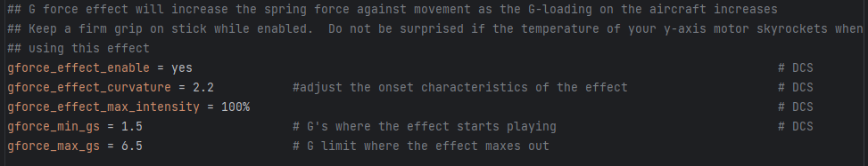

# Appendix B: Legacy TelemFFB Documentation

### Effects Documentation (Legacy)

This section attempts to document and explain each of the effects and
their settings. It is a work in progress.

A majority of the effects will apply to both DCS and MSFS. Where
applicable, each effect setting has a comment in-line with the default
setting to indicate which simulator(s) it applies to.

#### Generic Aircraft Effects (applies to all (or multiple) aircraft types)

##### G-Force Loading Effect

Only applies to fixed-wing aircraft

DCS Only (MSFS has built in G forces in the TelemFFB stick force
implementation)

The G-Force loading effect simulates the increasing force that is
required to pull back on the stick as the g forces increase during a
dive pull-out or hard turn.

{ width="6.5in" height="1.25in" }

-   gforce_effect_enable (yes/no)

    -   enable or disable the effect

-   gforce_min_gs (1.0 or greater)

    -   the g loading where the effect will start playing

-   gforce_max_gs (greater than gforce_min_gs)

    -   g loading where the strength will reach
        > 'gforce_effect_max_intensity'

-   gforce_effect_max_intensity (0.0-1.0 or 0%-100%)

    -   the maximum force applied in relationship to the constant force
        > slider in VPforce configurator

-   gforce_effect_curvature (1.0 or greater)

    -   affects the onset characteristics of the force effect. A value
        > of 1.0 is a linear increase in force across the defined g
        > range. Increasing the curvature value will result in a flatter
        > increase at the beginning of the range followed by an ever
        > increasing force as the effect approaches the top of the
        > range.

    -   Example values (default is 2.2)

    -   { width="5.9165in" height="4.6146in" }

##### Deceleration Effect

Monitors the deceleration g-forces on the aircraft and, if the
aircraft is on the ground will apply a forward force (away from pilot)
equal to the deceleration G force up to, but not exceeding
'deceleration_max_force'.

-   deceleration_effect_enabled (yes/no, on/off, 1/0)

    -   Enable/disable the effect

-   deceleration_max_force (0.0-1.0)

    -   Controls the maximum force that can be applied

##### Damage Effect (DCS)

Plays a short random direction, random intensity bump each time damage
is detected on the aircraft.

**\*\* Can potentially cause performance impact due to large number of
calculations required in export script for some aircraft \*\***
Written in a way that will only execute the code in the export script
if the feature is enabled in TelemFFB.

-   damage_effect_enabled (yes/no, 1/0)

    -   Controls whether the effect is enabled (both in TelemFFB and the
        > calculations in TelemFFB.lua export script)

-   damage_effect_intensity (0.0-1.0, %0-%100)

    -   Controls the intensity of the generated effects. Note that with
        > the randomized nature of the intensity, some hits will be
        > lower and some higher than the defined value

##### Damage Effect (IL-2)

Plays a short random direction, random intensity bump each time damage
is detected on the aircraft.

-   damage_effect_intensity (0.0-1.0, %0-%100)

    -   Controls the intensity of the generated effects. Note that with
        > the randomized nature of the intensity, some hits will be
        > lower and some higher than the defined value

##### AoA Buffeting

##### Runway Rumble/Touchdown

##### Weapons and Countermeasure deployment

##### Speedbrake Motion and Buffeting

##### Gear Motion and Buffeting

##### Flaps Motion

##### Canopy Motion

##### Spoiler Motion and Buffeting

#### Propeller Aircraft Specific Effects

##### Engine Rumble

#### Jet Aircraft Specific Effects

##### After Burner Rumble

##### Jet Engine Rumble

##### AoA Reduction Effect

Simulates the increased forward stick pressure that is applied on some
fighter aircraft when a critical angle of attack is exceeded. The
effect will monitor the AoA and apply a linear force, up to the
maximum defined value starting at the 'start' AoA and maxing out at
the 'max' AoA.

-   aoa_reduction_effect_enabled (yes/no, 1/0)

-   aoa_reduction_max_force (0.0-1.0, %0-%100)

-   critical_aoa_start (AoA in degrees)

-   critical_aoa_max (AoA in degrees)

#### Helicopter Specific Effects

##### ETL Transition and Overspeed Shake

##### Helicopter Rotor/Engine Rumble

#### Turboprop Specific Effects (MSFS)

None as of yet

#### Glider Specific Effects (MSFS)

