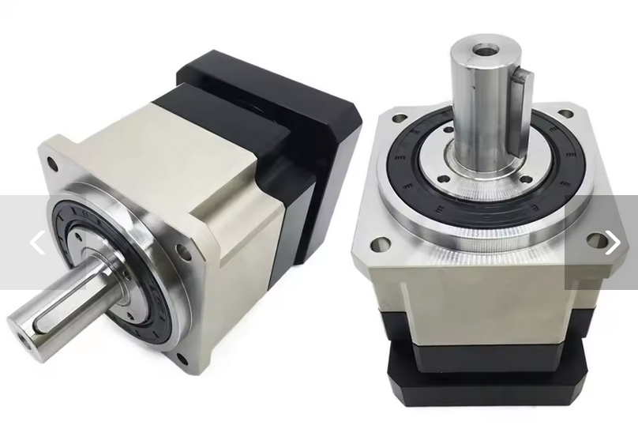

# DIY Tips and Tricks

This section shares useful advice and best practices for building your own force feedback devices using VPforce Rhino motors and components.

## Planetary Gearboxes for DIY Projects

{width="300"}

While timing pulleys are a popular and cheap option for DIY projects, servo planetary gearboxes offer a compact and very strong way to increase the force of your motor. A big plus is that these gearboxes come with a sturdy bearing assembly already built-in. This saves you the headache and cost of designing your own bearing and mounting systems, which you'd have to do with a pulley setup.

### Quality Matters: Why You Need Low Backlash

For the best force feedback experience, you need a high-precision, low-backlash gearbox (look for a rating of **<3 arcmin**). Backlash is the small amount of "slop" or free play you feel when the gearbox changes direction.

You might find cheap gearboxes with high backlash (25+ arcmin) that fit your motor, but they will make your controls feel mushy and create a noticeable deadzone in the center. The extra cost for a low-backlash gearbox is well worth it for the performance you'll get.

### Taming Gearbox Inertia

Planetary gearboxes have internal gears that create inertia, which can make your controls feel heavy or sluggish. You can easily cancel this out using the **Natural Damping Compensation** setting in the VPforce Configurator.

When you set this value correctly, it feels like the gearbox disappears, making your controls move freely and without any resistance when all other forces are turned off. This is key to making flight simulator controls, for example, feel light and responsive.

### Recommended Gearboxes

These gearboxes from two AliExpress stores have been used and recommended by other DIY builders. It's a good idea to check both stores to find the best price.

**Motor Input Sizes:**

-   For **57BLF** motors, you need an **8mm** input shaft.
-   For **86BLF** motors, you need a **12.7mm** input shaft.

#### Shaft Output Gearboxes

These have a simple rotating shaft, perfect for driving a pulley, a drum, or another rotating part.

**For 57BLF Motors:**

-   YUN DUAN: [https://www.aliexpress.us/item/3256801124644081.html](https://www.aliexpress.us/item/3256801124644081.html)
-   TOSEASTAR: [https://www.aliexpress.us/item/3256806043961557.html](https://www.aliexpress.us/item/3256806043961557.html)

**For 86BLF Motors:**

-   YUN DUAN: [https://www.aliexpress.us/item/3256801130161231.html](https://www.aliexpress.us/item/3256801130161231.html)
-   TOSEASTAR: [https://www.aliexpress.us/item/3256807826307043.html](https://www.aliexpress.us/item/3256807826307043.html)

#### Flange Output Gearboxes

These have a mounting flange with bolt holes, making it easy to attach parts directly to the gearbox. This is a very sturdy option, especially for direct-drive setups.

**Models:**

-   **57BLF:** PLX060 with 8mm input
-   **86BLF:** PLX090 with 12.7mm input

**TOSEASTAR (both sizes in one link):**

-   PLX060 & PLX090 Combo: [https://www.aliexpress.us/item/3256805002027480.html](https://www.aliexpress.us/item/3256805002027480.html)

**YUN DUAN:**

-   57BLF PLX060: [https://www.aliexpress.us/item/3256801140322252.html](https://www.aliexpress.us/item/3256801140322252.html)
-   86BLF PLX090: [https://www.aliexpress.us/item/2255801086131337.html](https://www.aliexpress.us/item/2255801086131337.html)

### Choosing the Right Gearbox Ratio

The Rhino motors use an absolute encoder, which knows the motor's exact position within one 360-degree turn (giving 4096 position points). However, it doesn't count full rotations across power cycles.

Because of this, you should design your controls so that their full range of motion uses *almost* one full rotation of the motor. This setup gives you:

-   **Maximum Force:** You get the most power from your motor.
-   **Less Power Use:** The motor doesn't have to work as hard.
-   **Highest Precision:** You use all 4096 position points for the best control resolution.

For most projects, a **10:1 ratio** is the sweet spot. This means the full movement of your controls will turn the motor about 36 degrees. For typical flight sticks or rudder pedals (+/- 15 degrees of movement), this ratio gives you plenty of room within the calibration range.

!!! important
    Higher gear ratios can be used in multi-turn motor setups, but the system must start with the mechanism positioned so that the encoder is near its electrical center (2048 counts). Otherwise, the absolute position will be ambiguous on power-up, since a single-turn encoder cannot distinguish which motor revolution it’s on.

Read more about this in the **[Multi-Turn Ambiguity Section][what-is-the-multi-turn-problem]**

### Assembly and Calibration

Getting the assembly right is key to making sure your controls are perfectly centered and the force feedback works correctly.

**Step-by-Step Guide:**

1.  **Set up the Software:** Open the VPforce Configurator, set the manual calibration range to **0-4096**, and turn the spring effect on to 100%.
2.  **Find Mechanical Center:** Hold your control stick, wheel, or pedals in the physical center position.
3.  **Tighten the Collar:** While holding the control centered, tighten the collar that connects the motor shaft to the gearbox. This locks in your mechanical center.
4.  **Recalibrate:** Run the auto-calibration in the VPforce Configurator. This tells the software where the new center is, making sure your physical center and the software's electronic center are perfectly aligned.

## The Multi-Turn Problem

### What is the Multi-Turn Problem?

The VPforce Rhino motor uses a **single-turn absolute encoder**. This sensor is very precise and reports the motor's position within one 360-degree rotation as a value from 0 to 4095.

**During Runtime:** The motor driver continuously tracks motor rotation and counts full turns beyond 360°. Once powered on and initialized, the system maintains accurate multi-turn position tracking throughout operation.

**The Startup Ambiguity:** The problem occurs **only at power-on**. When the system starts, the encoder reports a position value (0-4095), but the driver has no way of knowing which revolution the motor is in. This creates ambiguity in multi-turn configurations.

If your mechanical setup (using gears, belts, or linkages) requires the motor to spin more than once for full control travel, you face this **startup ambiguity problem**.

!!! warning "Single-Turn Setups Can Also Have This Issue"
    Even in single-turn configurations (where the motor rotates less than 360° for full control travel), this problem can occur if the mechanical alignment is poor. If your control's physical center position corresponds to an encoder value far from the electrical center (2048), the VPforce Configurator will display the **C: (center) value in red** as a warning.
    
    A badly aligned single-turn setup means the control's center point is near the encoder's 0/4095 wrap-around boundary. This creates ambiguity because the system cannot distinguish between encoder positions near 0 and those near 4095 at startup.
    
    **Solution:** Mechanically realign your build so the control's physical center corresponds to an encoder reading close to 2048 (the electrical center). This ensures the center position is clearly defined and far from the wrap-around boundary.

Let's visualize it. Imagine your setup requires 3 motor turns to move your joystick from one end to the other:

```text
[Joystick at Left]      [Joystick at Center]      [Joystick at Right]
      |-------------------------|-------------------------|

         [Motor Turn 1]  [Motor Turn 2]  [Motor Turn 3]
         <-------------> <-------------> <------------->  (Actual Motor Revolutions)
          \           /   \           /   \           /
           \_________/     \_________/     \_________/
             0...4095        0...4095        0...4095      (What the Encoder Reports at Startup)

```

**The Startup Problem:**

When you power on your device, the encoder might report a value of `2048`. However, the system has no way of knowing *which* of the three turns it's in. The true mechanical center of your joystick might be in the middle of "Motor Turn 2," but the encoder reading at startup is identical in every turn.

This startup ambiguity means the system cannot determine the true center position of your controls at power-on, which can lead to incorrect force feedback or unexpected behavior until manually corrected.

!!! note "Runtime vs. Startup"
    Once powered on and homed, the driver continuously tracks full rotations and maintains accurate multi-turn positioning throughout operation. The ambiguity exists **only** at startup before the reference position is established.

### The Solution: Manual Homing at Startup

Currently, the only way to solve this ambiguity is to **manually place your controls in a known reference position before powering on the system.**

This reference position must be the one that you have mechanically aligned to correspond with the encoder's center value of **2048**.

#### Required Startup Procedure

1.  **Identify Your Reference Position:** This is the physical position of your controls that you have designated as the center.
    *   For a joystick, this is the physical center.
    *   For a collective, this is typically the "down" position.

2.  **Move Controls to Reference Position:** Before applying power to the motor, physically move your controls to this exact position.

3.  **Power On:** With the controls held in the reference position, you can now power on the system.

By doing this, you are manually telling the system which of the possible motor revolutions is the correct one. The system will assume that the encoder reading of `2048` corresponds to the true mechanical center, and all force feedback effects will be correctly aligned.

!!! important "This is Not Optional"
    Failing to start the device in its known reference position will result in an incorrect center point and unpredictable FFB behavior. This step is required every time you power on the device.

!!! note "Future Firmware Update"
    A soft homing feature, which will automate this process, is planned for future firmware updates.
