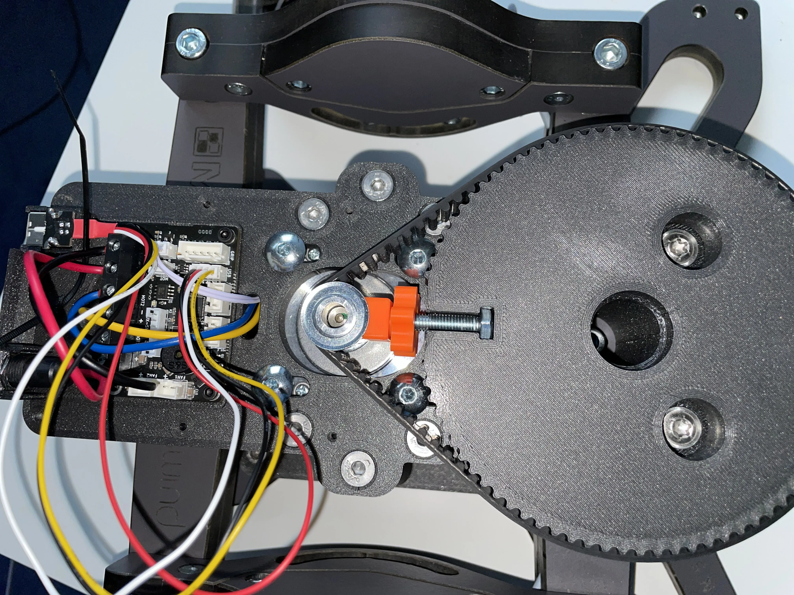
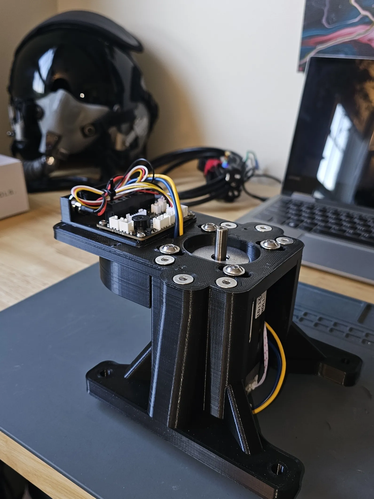
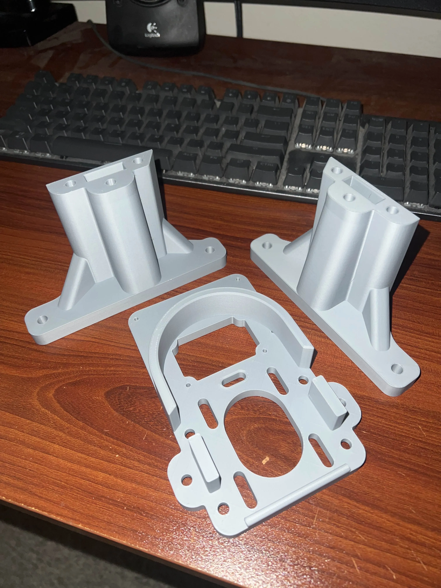
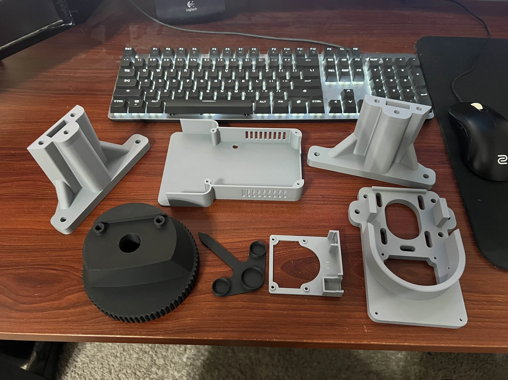
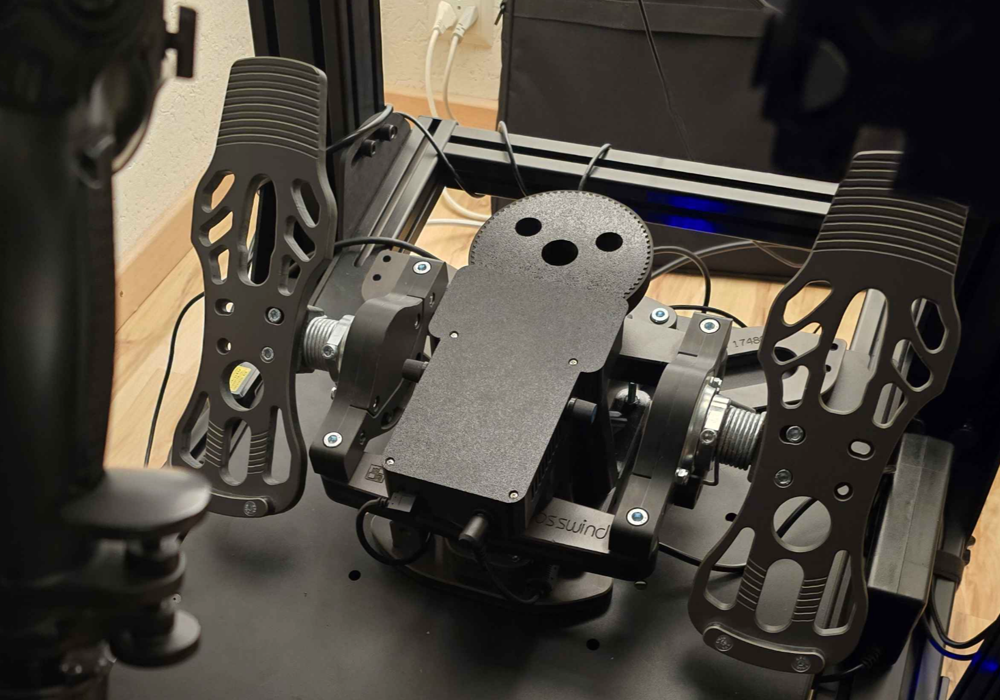

# MFG Crosswind Pedal FFB Mod by Hiob

## Introduction

Welcome to the documentation for the MFG Crosswind Force-Feedback (FFB) Mod, a DIY project designed by community member `_hiob`. This guide provides the information you need to convert your MFG Crosswind rudder pedals into a full force-feedback system using a VPforce motor kit and 3D-printed parts.

The mod is designed around a 74T main gear, providing the same gear reduction as the original VPforce Rhino for a proven and robust feel.

!!! important "MFG Crosswind V3 Compatibility"
    MFG has updated the design of the Crosswind pedals, changing the shape of the central cutout. This mod has been updated to support these newer "V3" pedals.

    When downloading the project files, ensure you are using the latest version labeled **"V3-Ready"** to guarantee compatibility with all versions of the MFG Crosswind pedals.

This is a hobby project that has been tested and works well, but your experience may vary. Please proceed with a DIY mindset.

!!! note
    This page is compiled from the original project documentation provided by `_hiob` on the VPforce Discord. All credit for the design and development of this mod goes to them.

### Key Features

- **High-Fidelity Force Feedback:** Adds dynamic effects like spring force, friction, damping, and vibrations to your pedals.
- **Powerful Performance:** The system can generate up to 9-10 kg of force, though 50-60% of maximum strength is recommended for an optimal and smooth experience.
- **Proven Gear Ratio:** Utilizes the same gear reduction as the VPforce Rhino, delivering familiar and reliable performance.
- **Fully 3D-Printable:** All custom parts can be created on a standard hobbyist 3D printer.

---

## Prerequisites

Before you begin, you will need the following:

- A set of MFG Crosswind rudder pedals.
- A VPforce FFB Motor Kit (57BLF03).
- A 3D printer with a build volume large enough for the main components.
- All required hardware as specified in the Bill of Materials.

---

## Parts List

### Printed Parts

It is recommended to print these parts from PLA or PETG. From experience, PLA is sufficient and can provide slightly better dimensional accuracy. The only part that may encounter significant wear is the `74T gear`, but PLA has proven to be adequate.

- **Motor Mount Left**
    - **Recommended Slicer Settings:**
        - 0.4mm Nozzle, 0.2mm Layer height
        - 5 Perimeters
        - 5 Top and Bottom Layers
        - 30-50% Infill ("Cubic" or "Grid")
        - No Supports
- **Motor Mount Right** (Same settings as above)
- **Motor Mount Top**
    - Same settings as above, but with **50% infill** recommended.
- **PCB Holder**
    - This part is not structural. You can use your slicer's default settings or the same settings as the motor mounts.
- **Dust Cover (Lid)**
    - Choose one of three variants based on your preference for potentiometers:
        1.  Two potentiometers mounted on the side.
        2.  Two potentiometers mounted on the top.
        3.  No potentiometers.
- **74T gear**
    - Same settings as the Motor Mounts (30% infill is sufficient).
    - **Supports are required for this part.**
- **(Optional) Position Indicator Arrow**
    - Print in a contrasting color for visibility.

### Mounting Hardware

- **6x** `M6 x 100 mm` countersunk bolts + **6x** `M6` nuts (for assembling the motor mount sides to the top)
- **4x** `M6 x 25 mm` (or 30 mm) button head bolts (for mounting the motor)
- **4x** `M3 x 8 mm` cap head bolts (for mounting the PCB)
- **4x** `M3 x 30 mm` cap head bolts (for mounting the lid)
- **2x** `M6 x 75 mm` flanged button head bolts (for mounting the `74T gear`)
- **1x** Cable tie

!!! note "Mounting to Your Rig"
    Depending on how you mount your Crosswinds, you can use long `M6` bolts to go through the motor mount, the Crosswind base, and your rig's base plate. If you do this, use wide washers and do not overtighten.

    If you only want to fix the motor mount directly to the Crosswinds, use **4x** `M6 x 35 mm` (or 40 mm) countersunk bolts with nuts and wide washers, mounting from the bottom.

---

## Additional Hardware

- **1x** VPforce Motor Kit (`57BLF03` + Logic Board)
- **1x** Timing Belt (`HTD5`, 420mm length, 15mm width)
- **1x** Motor Pulley (`HTD5`, 12-tooth, for 15mm wide belt)
- **1x** Power plug and socket
- **1x** Power Supply Unit (PSU) - 24V DC, 6-10A output.
- **(Optional) 2x** `10KOhm` potentiometers

---

## Assembly and Setup Guide

!!! note "Disassembly"
    You may want to first disassemble your Crosswinds to remove unnecessary parts like the original centering spring and lever. Make sure you keep the cam-piece, as it will be reused.

1.  Mount the motor to the `MotorMountTop` part. For now, place it in the middle position and only finger-tighten the screws. The motor's connectors should face the short end of the mount.
2.  Plug in the power and control wires (included with the motor kit) and route them through the small hole in the middle of the `MotorMountTop`.
3.  Insert the `M6` nuts into their slots on the `MotorMountSide` parts. Screw the sides to the `MotorMountTop` using the `M6 x 100 mm` bolts. Tighten them firmly, but be careful not to strip the plastic.
4.  Mount the power socket to the `PCBHolder`.
5.  Insert a cable tie through the small loop in the middle of the `PCBHolder`.
6.  Mount the VPforce PCB onto the `PCBHolder` using the four `M3 x 8 mm` bolts.
7.  Connect all the wiring to the PCB and use the cable tie to tidy up the wires.
8.  Mount the entire motor assembly to the MFG Crosswind base.
9.  Mount the `74T gear` to the front cross-arm of the pedals using the original cam piece and the two `M6 x 75 mm` flanged bolts. Tighten the screws firmly by hand.
10. Fix the 12T pulley to the motor shaft. Ensure it is aligned vertically with the `74T gear`. The 16mm width of the gear provides some tolerance. Use Loctite on the pulley's set screw to prevent it from coming loose.

    !!! important "Do Not Mount the Belt Yet"
        Wait until after the initial software calibration to install the belt.

11. Connect the pedals to your PC and run the VPforce Configurator software. Make sure the motor is recognized as the **X-axis**. Manually enter the following calibration values: `min: 0`, `max: 4096`. Set **Master Gain** to `100` and **Spring Gain** to `50` on both the main and effects pages. This will lock the motor shaft in its center position.
12. Loosen the four screws holding the motor so that you can slide it freely for belt tensioning.
13. Mount the `HTD5` belt over the two pulleys. Be careful not to turn the motor shaft.
14. Tension the belt by pushing the motor away from the large gear. The belt should be tight, but not stretched excessively. Fasten the two screws furthest from the gear first, then the two inner ones.
15. (Optional) Mount the potentiometers to the `Dust Cover (Lid)` and plug them into the PCB.
16. Fasten the `Dust Cover (Lid)` with the four `M3 x 30 mm` bolts.
17. (Optional) Press-fit the `Position Indicator Arrow` onto the `74T gear`.
18. **Final Calibration:** Perform a proper calibration in the VPforce software to set the endpoints for your pedals. You can now set up your final FFB profile. A good starting point is **50-60%** spring force (e.g., 100% Effects Gain x 100% Master Gain x 50-60% Spring Gain).

---

## FAQ

**Q: My 3D prints have a thin layer of plastic blocking the screw holes.**  
**A:** Those are supports generated by the 3D model to ensure the holes print cleanly. You can easily poke them out with a small screwdriver, knife, or a pair of pliers.

**Q: I printed the main parts with only 2 wall loops instead of the recommended 5.**  
**A:** Part strength comes primarily from the number of walls, not infill. While 5 walls are recommended, you can try using the parts with 2 walls. If they fail, you can always print replacements.

**Q: How long do the parts take to print?**  
**A:** This depends heavily on your printer and slicer settings. On an older Ender 3, the main gear can take over 18 hours. On a modern printer like a Prusa MK4 or Bambu Lab P1S, the same part can be printed in 7-10 hours.

**Q: Do I need to buy a separate USB port?**  
**A:** No, the required USB-B port and controller board are included with the VPforce motor kit. You will, however, need a standard USB-A to USB-B cable, which is commonly used for printers.

**Q: What kind of power supply (PSU) do I need?**  
**A:** For the pedals alone, a PSU with **24V DC output and 6-10A** is sufficient. You can use an enclosed "brick" style adapter or an open-frame unit like a Meanwell LRS-350. If using an open-frame PSU, you will need to wire a power cord and switch yourself.

**Q: Do I need to solder anything?**  
**A:** No, this project does not require any soldering. The VPforce motor kit is designed to be plug-and-play. You may need to crimp connectors onto the motor power cables if they don't come pre-installed.

**Q: Are the potentiometers shown in the pictures required?**  
**A:** No, the potentiometers are completely optional. They can be used to physically adjust FFB gains (like spring, friction, or master gain), but all of these settings can also be adjusted in real-time via the VPforce software.

**Q: I'm not feeling some effects like gun vibrations or stall buffet.**  
**A:** This is almost always a software configuration issue. Check the following:

1.  Ensure you have launched a **second instance of TelemFFB** for the pedals using the correct launch options.
2.  Verify in the **VPforce Configurator** that the unused axis (Y-axis) is disabled.
3.  Confirm the pedals have a unique device ID, different from your primary joystick.

**Q: How does pedal trim work with helicopters in DCS?**  
**A:** By default, TelemFFB disables the centering spring for helicopters, allowing the pedals to stay where you leave them (with friction). The behavior of force trim systems that also affect pedals (like in the Mi-24 or Apache) depends on how DCS exports that data and is not guaranteed to work out-of-the-box. For a consistent experience across all helicopters, many users prefer to fly with the centering spring disabled.

**Q: My pedals don't fit! The central cutout on my MFG Crosswinds is different.**  
**A:** You have a newer "V3" model of the pedals. Please ensure you have downloaded and printed the **"V3-Ready"** version of the project files, which are designed to be compatible with this change.

---

## Gallery & Community Builds

Here are some photos from the community, showcasing the completed mod.

