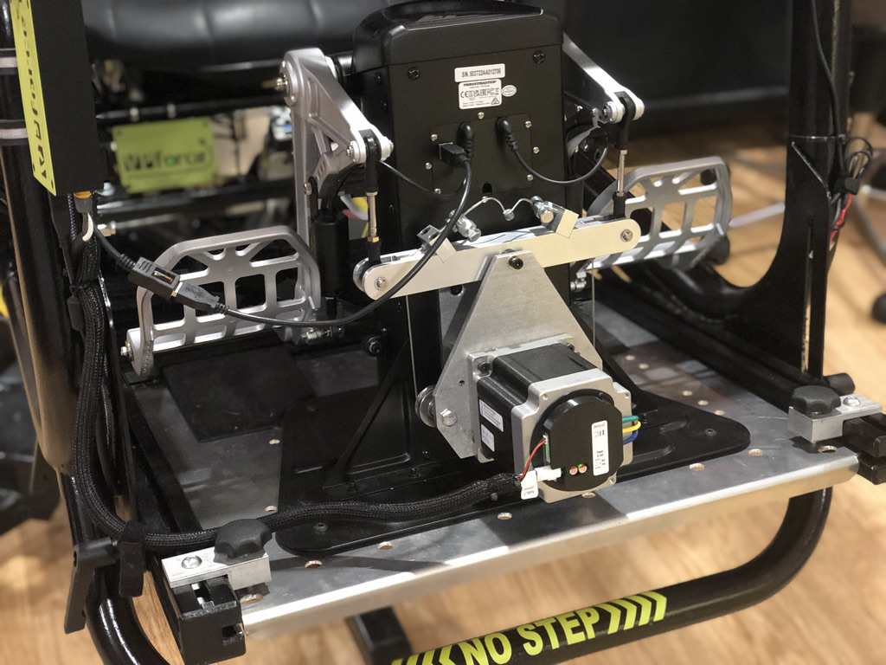

# TPR FFB Pedal Mod by Smitty

## Introduction

Welcome to the DIY guide for converting your Thrustmaster TPR rudder pedals into a full force-feedback (FFB) system. This project replaces the stock spring mechanism with a motor-driven cable system, bringing a new level of immersion and realism to your flight simulation experience.

The mod does not permanently change anything on the pedals. No cutting is required, and you can revert it back to the original stock configuration if desired.

### Project Overview

The core of this conversion is the **86BLF04 FFB motor kit** from VPforce. The custom-designed parts create a precise cable run geometry that ensures the system remains taut and does not go slack in any pedal position, delivering smooth and consistent force effects.

The 86BLF04 motor can push each foot with approximately **20 lbf (9 kgf)**, so it is essential to bolt the pedals down securely relative to your chair.

**Project Repository:** https://github.com/smitty97/Force-Feedback-TPR

### Manufacturing: Aluminum vs. 3D Printing

These parts were originally designed and fabricated from **aluminum** for maximum strength and durability. However, the design has been adapted so that the components can also be **3D printed**, making the project more accessible.

!!! important
    While a 3D-printed test version can work, **aluminum is the superior choice if available.** The motor pulley, in particular, should be made of metal.

### Important: This is a DIY Project

Please be aware that this conversion requires a good level of DIY skill. It is **"not print-and-be-done, but it's close."** You will need to be comfortable with mechanical assembly, sourcing parts, and troubleshooting.

The instructions and models are provided as-is. While some questions can be answered, you are expected to take on this project with a DIY mindset.

---

## Bill of Materials (BOM)

This is a partial list of components required for the project.

| Qty | Description                                                                                             | Link                                                                                               |
|-----|---------------------------------------------------------------------------------------------------------|----------------------------------------------------------------------------------------------------|
| 1   | 86BLF04 x1 DIY Kit                                                                                      | [VPforce Controls](https://vpforcecontrols.com)                                                    |
| 1   | 24V 350W Power Supply                                                                                   | [Amazon](https://www.amazon.com/gp/product/B013ETVO12)                                             |
| 2   | Pack of 2 Bearings                                                                                      | [Amazon](https://www.amazon.com/gp/product/B077K7KNX9)                                             |
| 2   | Pack of 2 Bearings                                                                                      | [Amazon](https://www.amazon.com/gp/product/B000COCQ06)                                             |
| 2   | McMaster-Carr Part                                                                                      | [McMaster-Carr](https://www.mcmaster.com/catalog/90220A130)                                         |
| 4   | McMaster-Carr Part                                                                                      | [McMaster-Carr](https://www.mcmaster.com/catalog/91920A710)                                         |
| 2   | McMaster-Carr Part                                                                                      | [McMaster-Carr](https://www.mcmaster.com/catalog/2705T132)                                         |
| 4   | McMaster-Carr Part                                                                                      | [McMaster-Carr](https://www.mcmaster.com/catalog/92510A765)                                         |
| 4   | McMaster-Carr Part                                                                                      | [McMaster-Carr](https://www.mcmaster.com/8920N36/)                                                 |
| 8   | Box of 100 Screws                                                                                       | [McMaster-Carr](https://www.mcmaster.com/91294A212/)                                                |
| 4   | Box of 50 Screws                                                                                        | [McMaster-Carr](https://www.mcmaster.com/91290A252/)                                                |
| 2   | Box of 50 Nuts                                                                                          | [McMaster-Carr](https://www.mcmaster.com/94105A534/)                                                |
| 2   | Box of 25 Screws                                                                                        | [McMaster-Carr](https://www.mcmaster.com/91294A253/)                                                |
| 2   | Box of 100 Washers                                                                                      | [McMaster-Carr](https://www.mcmaster.com/94645A205/)                                                |
| 1   | Stainless Steel Wire Rope Kit                                                                           | [Amazon](https://www.amazon.com/USAMILY-Stainless-Aluminum-Sleeves-Thimbles/dp/B0CKPHJG3F)          |

---

## Assembly Steps

1. **Remove the Spring System:**

    -   Unscrew the four M5 flathead screws holding the spring system to the back of the TPRs.  
    -   Remove the bottom end of the links from the original teeter arm (save the pins, plastic bushings, and e-clips).

2. **Disconnect Hall Sensor:**

    -   Open the electronics area on the back and remove the wire going to the teeter hall sensor.

3. **Disassemble Teeter Arm:**

    -   The original teeter has a hinge pin and a long bolt. Disassemble it from the spring assembly, as you will need these parts.

4. **Mark Motor Center:**

    -   Hook up the motor and use the VPforce Configurator to set endpoints at 0 to 4096.
    -   Turn on the spring effect and mark the shaft and base with a sharpie so you can align them when the motor is unpowered.

5. **Assemble the Motor Mount:**

    -   Assemble the motor to the plate and add the long spacers.  
    -   Put the back plate on loosely so you can slip the teeter hinge pin into its counterbores.  
    -   Add 2-3 spacer washers on each side of the teeter.  
    -   Press the new hinge bushings into the teeter.

6. **Mount the Teeter Arm:**

    -   With the teeter in place, fully clamp the long spacers together.
    -   Use the original long bolt through the teeter hinge tube.

7. **Add Pulleys:**

    -   Add the pulleys and spacers to each side.

8. **Prepare for Tensioning:**

    -   Screw the bolts with the vent hole all the way down into the teeter arm. These will be raised later to tension the cable.  
    -   If using a 3D-printed part, consider using thin 1/4-20 nuts to prevent the threads from stripping.

9. **Cable Wrapping (The Tricky Part):**

    -   The cable is thick and resistant to bending. This step may require multiple hands.  
    -   Clip off the ball on the end of the cable, being careful not to let it unravel.  
    -   Pass the cable through the hole in the motor pulley so half remains on each side.  
    -   With the pulley stationary (power it up or use an Allen key to hold it), wind two wraps toward the motor, then to a pulley, and up through the vented arm bolt. Secure it with a cable stop.  
    -   Repeat on the other side, but wind away from the motor.

    !!! tip "Easier Cable Option"
        The creator notes that **304 1/16 7x7 wire rope (Part B0CKPHJG3F)** is much easier to work with, as the original brake cable can shred over time.

10. **Center and Tension:**

    -   Center the motor using your sharpie marks.  
    -   Tighten/loosen the cable stops so the arm is level with the motor centered.  
    -   Alternate from side to side, making it tighter each time. Ensure the wrap on the pulley isn't crossing over itself.

11. **Final Tensioning:**

    -   Fully tighten the cable stops with a wrench.  
    -   Raise each vented bolt to apply final tension. The cable should be "guitar-string-tight."

12. **Mount the FFB Unit:**

    -   Mount the completed FFB unit to the back of the TPRs. A ball-end hex wrench is recommended to access some of the bolts through the holes in the front plate.

13. **Transfer Bushings:**

    -   Transfer the link bushings and pins from the original teeter arm.

14. **USB Board:**

    -   Print the USB Box & Lid, mount the kit's USB board inside, and wire it up.

15. **Software Installation:**

    -   Install the **VPforce Configurator** and the WIP version of **VPforce TelemFFB**.

---

## Frequently Asked Questions (FAQ)

This information is compiled from a guide and community discussion provided by the project's creator, Smitty, and other DIY builders.

### General

**Q: What is the Force-Feedback TPR Mod?**  
**A:** This is a DIY project that converts standard Thrustmaster TPR rudder pedals into a force-feedback system using an 86BLF04 motor kit from VPforce. The design ensures the cable system does not go slack in any pedal position, providing dynamic force effects controlled by software like TelemFFB.

**Q: Is the mod reversible?**  
**A:** Yes. The mod does not permanently change anything on the pedals. No cutting is required, and you can revert it back to the original stock configuration if desired.

**Q: What are the main benefits of this mod?**

**A:** Users report a much more stable and immersive flying experience. The mod provides dynamic resistance based on airflow calculations from the simulator, realistic forces during events like engine failures in multi-engine aircraft, and a more authentic feel for takeoff and landing, especially in tailwheel aircraft. It also eliminates the "clank" of the stock spring system.

**Q: What skills and tools are required?**

**A:** This is not a simple print-and-install project. It requires solid DIY skills, the ability to assemble mechanical parts, handle wiring, and potentially tap threads into metal. Access to a 3D printer or CNC machining service is necessary.

**Q: Where can I find the design files and official guides?**

**A:** The primary project files and a more detailed guide for a related load-cell brake mod are maintained on GitHub:

* **FFB Mod:** https://github.com/smitty97/Force-Feedback-TPR
* **Load Cell Brakes:** https://github.com/smitty97/Load-Cell-Brakes-TPR

### Hardware, Parts, and Manufacturing

**Q: Can I 3D print the parts instead of using CNC-machined aluminum?**  
**A:** Yes, but with caveats. The designer notes that aluminum is the ideal material for durability. While a 3D-printed test arm held up for weeks, there are concerns about long-term creep and flex under constant cable tension. If 3D printing, it is recommended to use a strong material like PETG or Nylon Carbon Fiber with a high number of walls (e.g., 10) and significant infill. The motor pulley should be metal.

**Q: Where can I get the custom parts made?**  
**A:** For CNC machining, community members have had success with online services. `JLCPCB` (based in China) was highly recommended for its affordability (around $100 for the main parts). Other options mentioned include `Xometry` and `Protolabs`, though they were quoted at a significantly higher price.

**Q: What motor do I need? Can I use a different one?**  
**A:** You must use a motor kit from VPforce (e.g., 86BLF04) to ensure compatibility with the required VPforce Configurator and TelemFFB software.

**Q: What kind of Power Supply Unit (PSU) is required?**
**A:** The motor requires a 20-24VDC power supply. A Meanwell 350W/24V PSU has been used successfully.

### Assembly and Build Process

**Q: What is the most difficult part of the assembly?**  
**A:** Community members consistently report that wrapping the thick, stiff steel cable around the motor pulley is the trickiest and most frustrating step. It may require multiple hands and patience. Using a zip tie to temporarily hold the cable in place during winding is a helpful tip.

**Q: Can I use Dyneema rope instead of steel cable?**  
**A:** Yes, some users have opted for Dyneema. It is more flexible and may be quieter, but it is also very slippery. This can make it difficult to clamp securely and may require special techniques to prevent it from slipping on the motor pulley, such as pinching it against the motor shaft's flat section. The creator now recommends a specific stainless steel wire rope that is easier to work with than the original brake cable.

**Q: I broke the tap for the set screw in the teeter arm. Is it still usable?**  
**A:** Possibly. One user reported that even without the set screw, the sharp kink in the cable as it passes through the pulley provides enough friction to hold it securely under tension.

### Software and Configuration

**Q: What software is required to use the FFB pedals?**  
**A:** The primary software is **TelemFFB**, which translates telemetry data from the simulator into force-feedback effects. You will also need the **VPforce FFB Configurator** utility to set up the motor.

**Q: How do I configure TelemFFB if I already have a Rhino FFB Joystick?**  
**A:** You need to run a second instance of TelemFFB specifically for the pedals. This is done by adding a launch option in the TelemFFB system settings: `-D FFFF:{your pedal device number} -t pedals`. Do not try to manually manage two separate instances.

**Q: My pedals are detected, but the axis is wrong (e.g., showing as Pitch instead of Roll/Rudder). How do I fix this?**  
**A:** In the VPforce Configurator, you need to ensure the correct axis is enabled for the rudder (typically X/Roll) and others are disabled. If this doesn't work, you may need a firmware utility from the VPforce team to change the motor's default axis identification.

**Q: Does this mod support pedal trimming in helicopters like the DCS Mi-24 Hind?**  
**A:** No. The developer of TelemFFB noted that due to the way DCS implements the autopilot's yaw channel and foot-switch logic for that specific helicopter, it is not currently possible to create a functional FFB trim system.

### Troubleshooting

**Q: My game freezes when the FFB pedals are connected. What's wrong?**  
**A:** This is almost always a USB issue. Users have solved it by:

1. Connecting the pedals to a high-quality, externally powered USB 3.0 hub.
2. Plugging the device directly into a USB port on the back of the motherboard, bypassing any front-panel ports or passive hubs.
3. Avoiding unpowered or older USB 2.0 hubs, which may not have sufficient bandwidth or power.

**Q: How do I connect the brakes? Do I still use the original TPR electronics?**  
**A:** Yes. The standard FFB mod only replaces the rudder axis. The toe brakes continue to function through the original Thrustmaster USB connection. This means you will have two separate joystick devices for your pedals: one for the FFB rudder axis (VPforce) and one for the brakes (Thrustmaster). A small internal USB hub can be used to combine these into a single external cable.

### Related Mod: Load Cell Brakes

**Q: What is the load cell brake mod?**  
**A:** This is a popular secondary modification that replaces the position-based stock toe brakes with pressure-sensitive load cells. This provides a more realistic braking feel, where the amount of braking force is determined by how hard you press, not how far the pedal travels.

**Q: How do the load cells connect to the PC?**  
**A:** You have two main options:

1. **Via VPforce Board:** Connect the load cells to an amplifier (like the Leo Bodnar Load Cell Amplifier), and wire the amplifier's output to the two free potentiometer inputs on the VPforce controller board.
2. **Via Separate USB Board:** Connect the load cells and amplifiers to a dedicated USB controller board (like the Leo Bodnar BU0836A), which will appear as a separate joystick device.