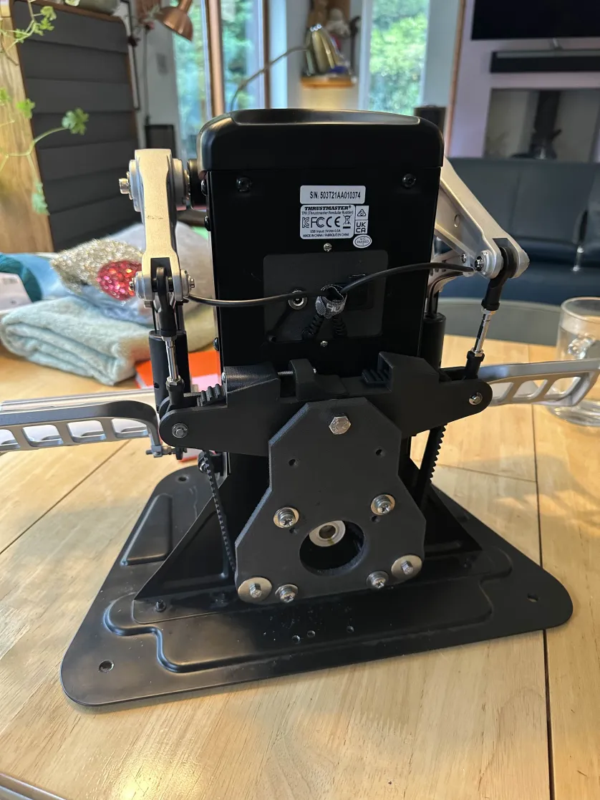
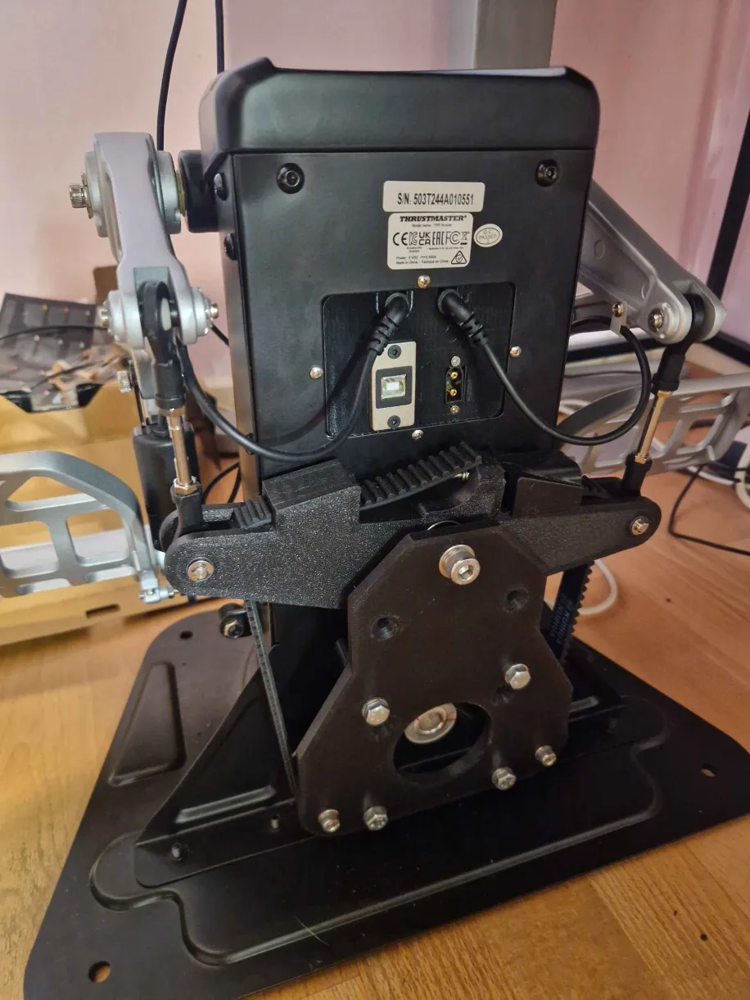

# Tiger TPR FFB Mod by FlyDoc53

The Tiger TPR FFB mod is a community-driven project to add force feedback to Thrustmaster Pendular Rudders (TPR). Inspired by the Rhino FFB Joystick, this guide provides instructions for a DIY force feedback modification for rudder pedals.

This project is intended for flight simulation enthusiasts. It can be built by individuals with access to a 3D printer, and no soldering is required.

!!! note "Disclaimer"
    This is a community project. The author offers no support for the build, no guarantees in any way, no promises of safety, or in any other way represent this build as meeting any regulatory requirements anywhere in the world. The build and use is at your risk entirely.

## Project Overview

The Tiger TPR FFB mod is a well-documented project that allows you to modify your existing Thrustmaster TPR pedals. If you're not satisfied with the results, the modification is easily reversible.

### Features

-   **Force Feedback:** Adds force feedback to rudder pedals.
-   **DIY Friendly:** The project is designed for home builders with 3D printers.
-   **No Soldering Required:** The assembly process is solder-free, making it accessible to a wider audience.
-   **Reversible:** You can revert your pedals to their original state if needed.
-   **Assembly Guide:** A detailed assembly guide provides step-by-step instructions.

## Project Resources

-   **Assembly Guide:** The complete assembly instructions are available in a PDF document.
    -   [Tiger TPR FFB Assembly Guide V1.pdf](https://github.com/FlyDoc53/Tiger-TPR-FFB/blob/807c5999f78605cdd7225e6b6b13af6f4af4bc5b/Tiger%20TPR%20FFB%20Assembly%20Guide%20V1.pdf)
-   **3D Printable Parts (STLs):** You will need to 3D print several parts. The assembly guide contains a list of required STL files. You can find the STL files on the author's GitHub repository.
    -   [Tiger TPR FFB STL Files on GitHub](https://github.com/FlyDoc53/Tiger-TPR-FFB)
-   **Bill of Materials (BOM):** The guide includes a detailed Bill of Materials with links to purchase components in the US and EU.

## FAQ

**Q: Do I need to drill holes in my Thrustmaster TPR pedals for this mod?**  
**A:** Yes, this modification requires drilling several holes in the metal base of the TPR pedals.

**Q: I'm experiencing issues with the device freezing or disconnecting in games. What should I do?**  
**A:** This is often related to the USB connection. Try the following:
- Connect the device directly to a USB port on your motherboard, bypassing any hubs.
- If you must use a hub, ensure it is a high-quality, powered USB 3.0 hub. Some users have reported issues with unpowered or USB 2.0 hubs.
- Make sure your motherboard's chipset and USB controller drivers are up to date.

**Q: I have both a Rhino joystick and the modded TPR pedals. How do I get them to work together?**  
**A:** To use two VPForce devices simultaneously, you need to ensure they have different USB Product IDs (PIDs). The assembly guide recommends changing the PID of the pedals to 2054. Additionally, for telemetry to work with both devices, you may need to configure the TelemFFB application to broadcast to all devices. Some users have found success by setting the telemetry IP address to a broadcast address like `127.255.255.255` in their telemetry source application (like SRS). You also need to launch a separate instance of TelemFFB for each device. Refer to the VPforce Rhino manual for detailed instructions on using multiple devices.

**Q: The motor feels "caggy" or has a "detent" feeling when moving it. Is this normal?**  
**A:** The 86BLF04 motor has more natural dampening and may feel different from the smaller 57BLF03 motor used in the Rhino joystick. However, it should be smooth when powered on. If you feel strong cogging or detents, it could indicate an issue with the motor itself. To troubleshoot, disconnect the belt and feel the motor shaft's movement by hand while it's powered on. If the cogging persists, the motor may be faulty.

**Q: What motor pulley should I use?**  
**A:** The guide provides options for different motors. For the larger 86BLF04 motor, a 15-tooth or 18-tooth pulley with a 1/2" bore has been used successfully. The 18-tooth pulley provides a good range of motion. A 20-tooth pulley might also work, but ensure it has the correct 1/2" bore. For the smaller 57BLF03 motor, a 12-tooth pulley with an 8mm bore is recommended.

**Q: The timing belt is skipping under high load. How can I fix this?**  
**A:** The belt needs to be very tight to prevent skipping. When installing, pull the belt as tight as you can by hand before locking it in the tensioner, then use the tensioner bolt to add more tension.

**Q: I have the 57BLF03 motor, but the 3D printed parts don't seem to fit.**  
**A:** The provided 3D printed parts are designed for the larger NEMA 34 size motor (86BLF04). To use the smaller 57BLF03 motor, you will need an adapter plate.

**Q: I'm having trouble finding the exact idler pulleys listed in the Bill of Materials.**  
**A:** Some users have had difficulty sourcing the exact 5M20T idler pulleys. The key specifications are the 5M pitch, for a 15mm wide belt, and a bore that matches your hardware (the guide uses M5 bolts). Some users have successfully 3D printed their own pulleys and pressed in standard `F625ZZ` bearings.

## Gallery

{ width="400" }

{ width="400" }

## Getting Started

1.  **Read the Assembly Guide:** Start by thoroughly reading the [Assembly Guide](/Tiger TPR FFB Assembly Guide V1.pdf) to understand the scope of the project.
2.  **Source the Parts:** Use the Bill of Materials in the guide to purchase all the necessary components.
3.  **3D Print the Parts:** Download the STL files from the [GitHub repository](https://github.com/FlyDoc53/Tiger-TPR-FFB) and print all the required parts. The guide provides recommendations on materials and print settings.
4.  **Assemble the Mod:** Follow the step-by-step assembly instructions in the guide.

