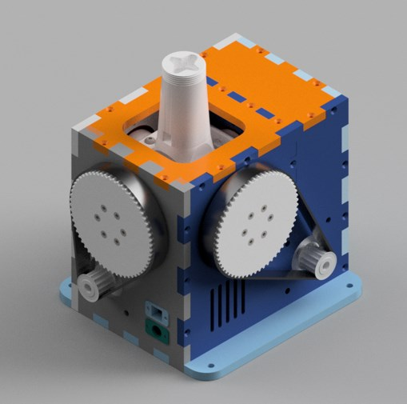
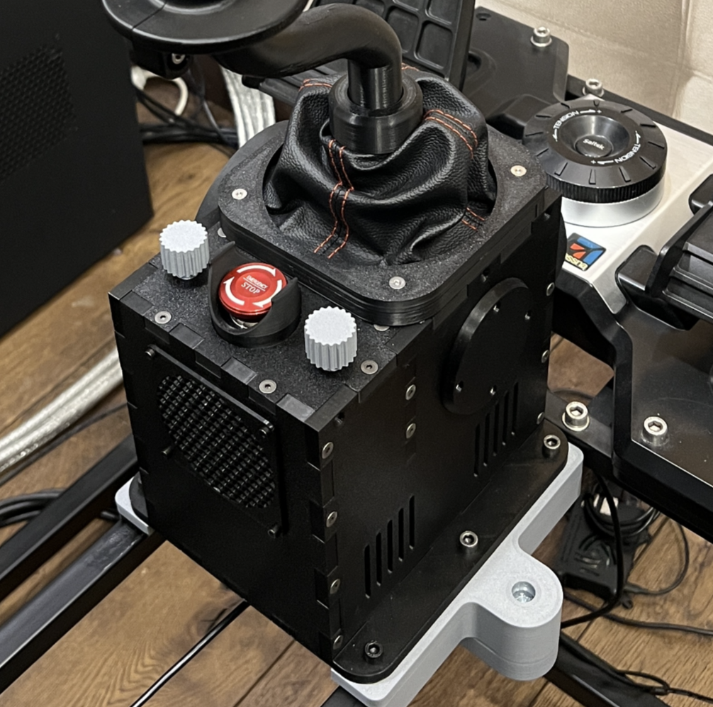

# Community Rhino Builds

This page documents a lineage of community-developed Rhino FFB joystick builds, starting with Mabo's original design and followed by adaptations from Protomaker and Gadroc.

---

## Mabo's FFB Joystick Base (The Original)

This project provides the CAD files for the mechanical assembly of a VPForce kit-based FFB (Force Feedback) joystick base.

**GitHub Repository:** [https://github.com/mabo1972/FFB-Joystick-Base-Plywood](https://github.com/mabo1972/FFB-Joystick-Base-Plywood)

### Project Details

#### Description
This repository contains the necessary files to build a prototype of a FFB joystick base using a VPForce kit. It includes 3D printable parts, DXF drawings for laser-cut case components, and a full STP assembly in CAD.

#### Bill of Materials
A bill of materials is provided in the repository, which lists:
*   VPForce kit components
*   3D printed parts
*   Laser-cut plywood parts
*   Bearings
*   Motor pulleys
*   Belts

---

## Protomaker's Rhino FFB Clone (Adaptation of Mabo's Design)

{ width="400" }

This project provides the necessary files and instructions to build a DIY version of the Rhino FFB Stick base. It is an adaptation of Mabo1972's original design, optimized for 3D printing.

**GitHub Repository:** https://github.com/protomaker964/Rhino-FFB-Clone-3D_Printed

### Project Details

#### Description

This project is a clone of the Rhino FFB Stick base, designed for 3D printing. It requires a VPforce 57BLF03x2 motor kit and includes 3D parts for various gimbal pulley sizes. The design is an adaptation of the original work by Mabo1972.

#### Requirements

*   VPforce 57BLF03x2 motor kit
*   3D printer
*   Various electronic components (see parts list in the repository)

#### Features

*   Optimized for 3D printing.
*   Includes different gimbal pulley sizes.
*   Detailed parts list and instructions are provided in the repository.

---

## Gadroc's FFB Joystick (Based on Mabo's and Protomaker's Designs)

This project is a 3D-printable Force Feedback (FFB) Joystick, based on Mabo's FFB Joystick and including improvements from protomaker's version. The design is optimized for 3D printing and uses heat-set threaded inserts.

**GitHub Repository:** [https://github.com/Gadroc/vpforce-ffb-joystick](https://github.com/Gadroc/vpforce-ffb-joystick)

### Project Details

#### Design Focus
*   Optimized gimbal for 3D printing to minimize support material and optimize mating surfaces.
*   Use of heat-set threaded inserts for robust connections.
*   Incorporates a single potentiometer similar to the Rhino.
*   Uses an XT60 connector for power.
*   A 72-tooth pulley for a 6:1 gear ratio.
*   Shell adjusted for 3D printing.

#### Open Items
*   Two-part stick adapter for adjustable stick length.
*   Throw limiters.
*   Testing of the boot clamp.
*   Optimizing screw types to reduce variety.
*   Complete the design for the base and electronics mounting.
*   Finalize the grip mount design.
*   Add hall sensor mounts.
*   Design a PCB for the controller and sensors.

#### Printed Parts
The following is a list of STL files, quantities, and support requirements:

| Part Name             | Quantity | Supports |
| --------------------- | -------- | -------- |
| Gimbal_Pitch_Inner    | 1        | Yes      |
| Gimbal_Pitch_Outer    | 1        | Yes      |
| Gimbal_Roll_Inner     | 1        | Yes      |
| Gimbal_Roll_Outer     | 1        | Yes      |
| Gimbal_Frame_Left     | 1        | No       |
| Gimbal_Frame_Right    | 1        | No       |
| Gimbal_Frame_Center   | 1        | No       |
| Motor_Mount_Pitch     | 1        | No       |
| Motor_Mount_Roll      | 1        | No       |

#### Bill of Materials (BOM)
A detailed Bill of Materials with McMaster Part numbers is available in the GitHub repository. Key components include:

*   **Bearings:** 6806-2RS (x4), 6803-2RS (x4)
*   **Threaded Inserts:** M3, M4
*   **Screws:** M3, M4
*   **Belts:** GT2, 6mm width
*   **Connectors:** XT60

#### Assembly
Assembly instructions are not yet available, but the design is closely derived from protomaker's version, so their assembly guide can be used as a reference.
