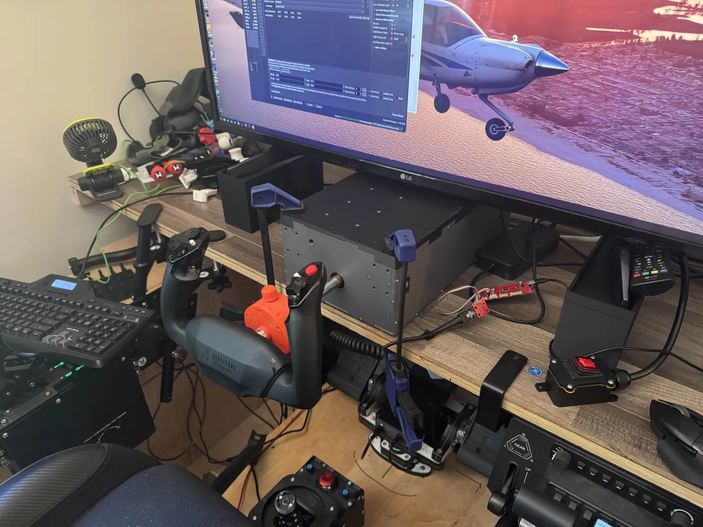
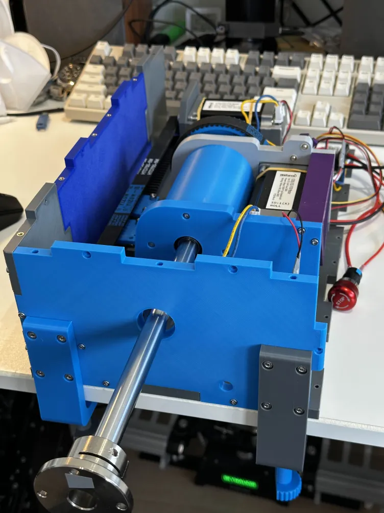
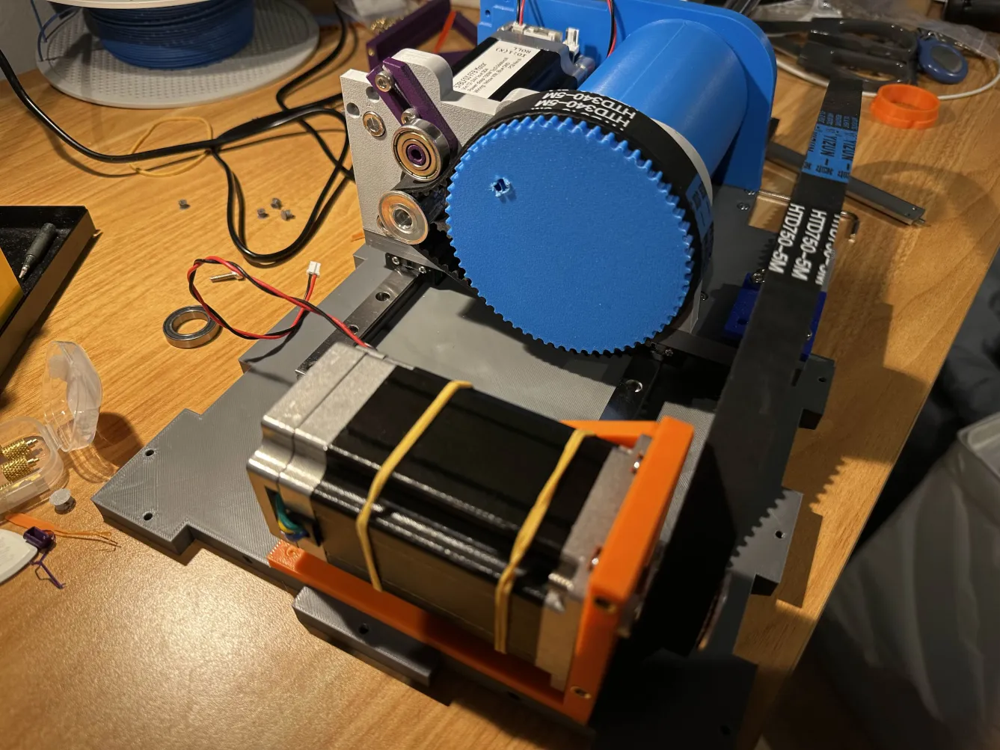
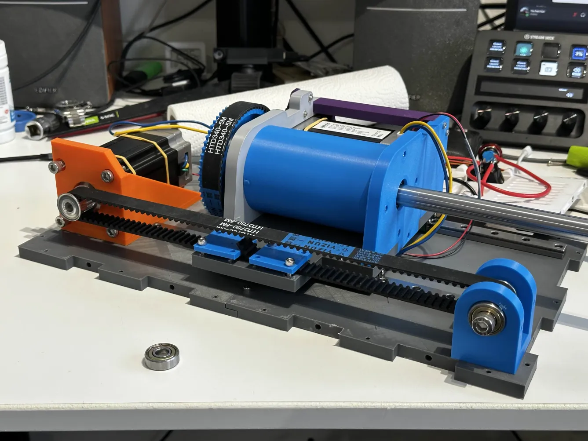

# FFB Yoke - 3D Printable Force Feedback Yoke by YuchenYan

Open-source 3D printable force feedback yoke design for flight simulators. Developed by YuchenYan with community contributions from AggressorBlue and others, compatible with VPforce Rhino electronics.

## Overview

DIY force feedback yoke design using VPforce 57BLF03 dual-motor system with linear rail mechanics for smooth dual-axis operation. Suitable for general aviation simulation in MSFS, X-Plane, and other compatible simulators.

**Key Features:**

- Dual-axis FFB using VPforce 57BLF03 motors (X and Y axes)
- Linear rail gantry system (smooth Y-axis travel)
- Belt-driven mechanics with adjustable tension
- 3D printable components (PETG/ABS recommended)
- Compatible with Honeycomb Alpha yoke handle (with adapter)
- Open-source design with active community development
- Reasonably priced DIY project for FFB yoke enthusiasts

## Project Status and Availability

**Development Status:** Active community project with ongoing refinements

**Build Options:**

1. **Full DIY:** Download STL files from GitHub, source components, self-build
2. **Fully Assembled Unit:** Available from designer (contact via VPforce Discord)
3. **Printed Parts + Components Kit:** Worldwide shipping available from designer
4. **Print Files + Components:** STL files provided, components shipped

!!! note "Purchasing Information"
    Contact YuchenYan (yuchenyan) via VPforce Discord for kit purchases or fully assembled units. European shipping confirmed, worldwide shipping possible for kits.

## Kit Contents and Requirements

### What's Included (Varies by Build Option)

**3D Printed Components:**

- Case plates (bottom, front, left side, back)
- X-axis assembly mounting plates
- Y-axis gantry components
- Motor mounts and belt tension adjustment parts
- Bearing housings and pulley mounts

**Mechanical Components (Required Separately):**

| Component | Specification | Quantity | Approx Cost (EUR) |
|-----------|--------------|----------|-------------------|
| Center shaft | Steel shaft D16mm × L350mm | 1 | 3 |
| Shaft connectors | STHWR 16 | 2 | 5 |
| Shaft clamp | 16mm | 1 | 3 |
| Bearings | 608 | 2 | 0.50 |
| Bearings | MR16287 | 1 | 3 |
| Bearings | 6808 | 1 | 2 |
| Linear rails | MGNR12 300mm | 2 | 5 |
| Linear bearings | MGN12 C | 4 | 3 |
| Pulleys | HTD 5M 12T (15mm width, 8mm bore) | 2 | 2 |
| Timing belt | HTD 5M 750mm | 1 | 2 |
| Timing belt | HTD 5M 335mm | 1 | 1 |
| Potentiometer | 10k ohm | 1 | 1 |
| Emergency stop buttons | 16mm | 2 | 2 |
| Wire | 16 AWG | As needed | 1 |
| Connectors | micro JST XH (2, 3, 5 pin) | As needed | 2 |
| Switches | ALPS 8-way | 2 | - |
| Screws | M3×10, M4×10, M8×50 | Various | - |
| Heat-set inserts | M4 OD6 L6, M3 OD5 L4 | Various | 2 |

**VPforce Electronics (Required):**

- VPforce 57BLF03 x2 + USB motor kit (299€ + VAT)
- Order from [VPforce Controls](https://vpforcecontrols.com/)
- Dual motor configuration for X/Y axes

**Yoke Handle Options:**

- Custom 3D printed handle (STLs provided)
- Honeycomb Alpha yoke handle (requires adapter - community designs available)
- Other custom handle designs (community adaptations)

!!! tip "Honeycomb Alpha Integration"
    Community member Skytation has developed quick-release system for Honeycomb Alpha handle integration with pogo pin electrical connections. AggressorBlue working on similar adapter using Thingiverse extension design as starting point.

### What's Not Included

- Power supply unit (19V / 10A, 5.5-2.5mm connector)
- USB cable (Type A to Type B)
- 3D printing filament (PETG or ABS recommended for structural parts)
- Tools for assembly (hex keys, screwdrivers, belt tensioning tools)

## Compatibility Notes

**Simulator Compatibility:**

- **MSFS:** Full TelemFFB support, trim following works with A2A aircraft (Comanche verified)
- **X-Plane:** TelemFFB support available
- **DCS World:** DirectInput FFB support (limited yoke relevance for military sims)
- **Advanced Airliner Add-ons:** TelemFFB trim/AP following not yet supported for PMDG, TFDI, and similar complex aircraft

!!! warning "TelemFFB Limitations"
    Trim following and autopilot following not currently supported for PMDG, TFDI, and other advanced aircraft add-ons in MSFS. Works well with simpler aircraft and A2A products.

**Motor Range Considerations:**

- Yoke travel range exceeds 360° motor rotation
- **Critical:** Yoke must be positioned near center when powered on
- Motor range mapping accounts for extended yoke travel angles
- Does not require exact centering, but should be approximately centered on startup

!!! important "Power-On Position"
    Position yoke approximately in center position before powering on system. Yoke travel range corresponds to more than 360° of motor rotation, requiring centered startup for proper calibration.

**VKB/Virpil/Thrustmaster Grips:**

- Not applicable (yoke-specific design, not joystick grip compatible)

## Technical Specifications

**Mechanical Design:**

- **Yoke Travel:** Extended range (>360° motor rotation equivalent)
- **Y-Axis:** Linear rail gantry system (MGNR12 300mm rails)
- **X-Axis:** Belt-driven with HTD 5M timing belts
- **Center Shaft:** 16mm steel shaft (350mm length)
- **Bearings:** Multiple types (608, MR16287, 6808) for smooth operation
- **Material:** 3D printed PETG or ABS (structural components)

**Electrical Configuration:**

- **Motors:** Dual VPforce 57BLF03 (X and Y axes)
- **Control:** VPforce USB board (included in motor kit)
- **Power:** 19V / 10A PSU (not included)
- **Data:** USB Type B connection
- **Controls:** Potentiometer, emergency stop buttons, ALPS 8-way switches

**Weight and Dimensions:**

- Dimensions vary based on handle selection
- Linear rail length: 300mm (Y-axis travel)
- Center shaft: 350mm length

## Assembly Process Overview

Assembly requires intermediate mechanical skills and 3D printing experience. Full assembly instructions available in GitHub repository.

**Major Assembly Stages:**

1. **Linear Rail Installation:**

    - Mount linear rails to bottom case plates (loosely)
    - Install MGN12 C bearing blocks on rails (use plastic guide rails)
    - Attach X-assembly bottom plate to bearing blocks
    - Slide gantry back/forth while gradually tightening screws (minimize stress)
    - Remove bearing blocks, complete X-assembly, reinstall on rails

2. **Y-Axis Belt Tensioning:**

    - Mount motor with M6 bolts (leave loose for position adjustment)
    - Install pulleys and timing belt (initially not fully tensioned)
    - Install case plates (front, left side, back)
    - Use M4 bolts to push motor backward, tension belt while testing gantry movement
    - Belt should be tight but not create excessive friction
    - Tighten M6 motor mounting bolts when optimal tension achieved

3. **X-Axis Assembly:**

    - Install center shaft with bearings and shaft clamps
    - Mount X-axis motor and pulley system
    - Route timing belt, adjust tension
    - Verify smooth rotation without binding

4. **Electrical Assembly:**

    - Install VPforce USB board
    - Connect motor power and data cables
    - Wire potentiometer, emergency stops, switches
    - Route cables cleanly to avoid interference with mechanics

5. **Handle Installation:**

    - Attach yoke handle to center shaft (custom or Honeycomb adapter)
    - Verify clearance and full range of motion
    - Connect handle controls to VPforce board or shift register

6. **Final Assembly:**

    - Install remaining case panels
    - Verify belt tensions and bearing smoothness
    - Check all electrical connections

**Critical Assembly Notes:**

- Linear rail installation requires careful alignment to prevent binding
- Belt tension critical: tight enough to prevent slipping, loose enough for smooth movement
- Pulley set screws must align with motor shaft flats (perpendicular to flat surface)
- Test gantry smoothness during rail tightening process

!!! warning "Belt Tension"
    Insufficient belt tension causes "clunk" feeling and pulley slippage. Ensure pulley set screws align with motor shaft flats and are properly tightened. Test gantry movement while tensioning.

## Software Setup Summary

**VPforce Configurator:**

1. Connect yoke via USB (VPforce board from motor kit)
2. Download VPforce FFB Configurator from [VPforce website](https://vpforcecontrols.com/)
3. Configure device settings:

    - USB Device Ident: "FFB_Yoke" (or custom name)
    - USB Product ID: Default (or unique ID for multi-device setups)
    - Dual-axis configuration (X and Y enabled)

4. **Damping Compensation Critical:**

    - Default motor state has significant damping (feels like "molasses")
    - Apply positive damping compensation: ~10% recommended starting point
    - Negative damping values can cause instability
    - With proper damping compensation, yoke is smooth and one-handable

5. Calibrate yoke range (center position at startup)
6. Set master gain, spring force, and effects per preference

!!! important "Damping Configuration"
    Yokes require different damping settings than joysticks. Default motor state feels very heavy. Start with ~10% positive damping compensation. Powered yoke with damping compensation is smoother than unpowered (which feels notchy).

**TelemFFB Integration:**

- Download VPforce-TelemFFB application
- Configure for game-specific FFB profiles (MSFS, X-Plane)
- Trim following works with A2A aircraft in MSFS
- Autopilot and trim following not yet supported for PMDG/TFDI

**Calibration:**

- Position yoke approximately centered before power-on
- Use VPforce configurator auto-calibration
- Verify full range of motion in both axes
- Test force feedback response in simulator

## Performance and User Feedback

**Positive Aspects:**

- Smooth Y and X axes mechanics (linear rails)
- Reasonably priced FFB yoke project
- Fun DIY build with active community support
- Works great with A2A Comanche and other GA aircraft (trim following)
- All standard Rhino features functional

**Known Limitations:**

- TelemFFB advanced aircraft support limited (PMDG, TFDI trim/AP following not available)
- Requires centered startup position (>360° motor range)
- Still in active development (wiring and detail refinements ongoing)
- Damping configuration requires experimentation (yokes differ from joysticks)

**Community Build Reports:**

- AggressorBlue: Smooth mechanical operation, damping compensation critical for proper feel
- Skytation: Quick-release system for handle swapping working well on bungee yokes, testing for FFB robustness
- Multiple community members adapting Honeycomb Alpha handles successfully

## Additional Resources

**Project Documentation:**

- [GitHub Repository](https://github.com/yuchenyan0107/FFB_Yoke) (STL files, parts list, assembly notes)
- [Parts List Spreadsheet](https://docs.google.com/spreadsheets/d/1nBpdCx0DOBi1BcTt7vbbc8EsOH5HXZhTVgTmGyhsMfY/edit?gid=0#gid=) (detailed BOM with sources)
- [Honeycomb Alpha Extension Adapter](https://www.thingiverse.com/thing:5195327) (Thingiverse, starting point for handle adaptation)
- [VPforce Discord FFB Yoke channel (active community discussion and troubleshooting)](https://discord.com/channels/965234441511383080/1389566530773061702)

**Community Modifications:**

- AggressorBlue: 8020 extrusion and gantry integration ([Makerworld model](https://makerworld.com/en/models/1763788-ffb-yoke-case-revised-for-2080-gantry#profileId-1876684))
- Skytation: Quick-release system with pogo pin electrical connections
- Various Honeycomb Alpha handle adapters in development

**Support Resources:**

- VPforce Discord: Primary support channel for assembly guidance and troubleshooting
- GitHub Issues: Report bugs or design issues
- Community builds: Shared experiences and modifications

## Gallery

{ width="500" }
{ width="500" }
{ width="500" }

---

**Project Credits:**  
Original design by YuchenYan | 8020 gantry integration by AggressorBlue | Quick-release systems by Skytation and community | VPforce motor electronics by Walmis | Active VPforce Discord community contributions

!!! warning "Licensing Restrictions"
    Designer prohibits commercial sale of any parts or kits without explicit agreement. Modifications welcomed, but public distribution of modified files must remain non-commercial and publicly available. Support the project by purchasing kits/units from original designer or contributing to development.

!!! tip "Coffee Support"
    If building fully DIY from GitHub files, consider supporting the designer via coffee donation (link in GitHub repository).
