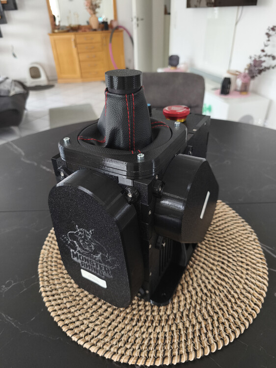

# Monster Rhino Kitbase by SR-F_Winger

{width="300"}

{ width="400" }

The "Monster" Rhino Kitbase is a third-party offering from SR-F_Winger, based on the work of @TheAmazingGreat. It utilizes the largest available VPForce DIY Motor Kit (86BLF04) to create the most powerful Rhino build possible.

This kit is for users who want the strongest Rhino money can currently buy, with more headroom before cooling is needed, but without the hassle of sourcing all the individual screws, cables, and other parts.

!!! note "Motor Kit Not Included"
    The VPForce Motor Kit (86BLF04) must be ordered separately from VPForce.

## Kit Variants

SR-F_Winger offers two versions of the Monster Rhino Kitbase:

### A) PREMIUM ISSUE

- **Price:** 800€ + VAT + shipping
- **Gimbal:** PA12
- **Recommended For:** Users who want to use extreme extensions, like helicopter goosenecks.
- **Availability:** This version requires pre-ordering and has a delivery time of around 3 weeks.

### B) STANDARD ISSUE

- **Price:** 550€ + VAT + shipping
- **Gimbal:** PETG (100% infill)
- **Recommended For:** Use with extensions up to 20cm.
- **Availability:** This version is stocked more often, with new stock announced frequently.

## Common Features

Both kit variants include the following:

- **Grip-Connector:** Made from PA12, compatible with the original VPForce CNC Aluminium Upgrade.
- **Housing:** Printed from 100% infill PETG on high-quality Bambu printers.
- **Power:** XT60 power connector, heavy-duty high-performance internal power cables.
- **Inserts:** Metal Ruthex threaded inserts.
- **Safety:** Includes an emergency stop button.

## Recent Updates

The latest iteration of the Monster Rhino now includes:

- Bolt-on belt covers (included at no extra charge).
- The USB and XT60 connectors have been moved to the front of the base.

## Ordering & Shipping

To inquire about pricing and place an order, you can contact:

- **SR-F_Winger** (Discord: `SR-F_Winger_[73]_David`)
- **Email:** david_1@gmx.de
- **Forum:** [DCS World Forum thread](https://forum.dcs.world/topic/357705-monster-ffb-rhino-diy-kitbase-95-preassembled-supplyservice-supplementary-to-kaltokriwinger-kits)

!!! tip "VPforce Motor Kit Discount"

    { width="200" }
    **10% Discount on VPforce 86BLF04 Motor Kit:**  
    When you purchase a Monster Rhino Kitbase from SR-F_Winger, you will receive an individual VPforce discount code for **10% off the "2x86BLF04+USB" DIY Kit** from VPforce.

    **Important details:**
    
    - Discount code is linked to your Monster Rhino Kitbase order
    - Provided after your Monster Rhino Kitbase order is fulfilled
    - Valid for one-time use only
    - Applies exclusively to the VPforce 2x86BLF04+USB motor kit

### Shipping Rates (Approximate)

| Region | Price | Notes |
| --- | --- | --- |
| USA | 47,99€ | Can be higher for express shipping. |
| Europe | ~20,-€ | |
| Germany | 6,9€ | |

!!! note "Shipping Note"
    Shipping fees may vary due to weight variances in available packaging materials.

!!! warning "Note on US Shipping"
    Due to a previous executive order, shipping to the USA may require express shipping at a higher cost (€95). Please confirm with the seller.

## Assembly Instructions

The base comes 95% pre-assembled. The following steps describe the final assembly process.

### Prepare the Housing

1.  Remove the bottom and front lids, which are held in place by only 2 or 3 screws each. They are labeled with stickers for identification.

### Install the Mainboard

1.  Locate the mainboard mount underneath the front lid area.
2.  Mount the mainboard onto the mount and fasten it using the four pre-installed screws.

    !!! tip "Need More Space?"
        If you need extra room to work, the lower part of the Emergency Stop switch can be temporarily detached by pressing its white plastic latch.

### Install Motors and Electronics

1.  **Prepare Motor Cables:** Before mounting the motors, attach and crimp the cables from the motor kit. It is impossible to reach the connectors after the motors are installed.

    !!! note
        The power cables for the motors are provided uncrimped so they can be cut to the correct length. It is strongly recommended to crimp wire-end ferrules onto the cables to ensure a secure connection. The other cables included in the kit are pre-crimped.

2.  **Mount the Motors:**
    - Mount the motors inside the case using the included M6 motor mount screws.
    - Ensure the motors are rotated correctly within the housing, as shown in the assembly diagrams.

    !!! important "Correct Motor Rotation"
        The rotation of the motors is critical. Incorrect rotation can cause the cables to hit the outer walls, preventing you from properly tensioning the belts later.

3.  **Connect Electronics:**
    - Connect all electronic components to the mainboard according to the wiring diagram (see FIG. 3 `(TODO: update fig)` from the original guide).

    !!! warning "Danger: Check Polarity"
        **Verify correct polarity when connecting power cables.** Reversing polarity can permanently destroy the mainboard and other electronic components. Plus (+) and minus (-) terminals are clearly labeled with stickers to prevent errors.

    - All cables are bespoke and keyed, except for the main power cables (from the XT60 connector and Emergency Stop switch) and the fan connectors.
    - The two fan connectors can be plugged into either fan header.

4.  **Pre-Closure Checks:**
    - Before closing the case, ensure that no cables are obstructing the fans.
    - Make sure the Emergency Stop button is in the un-pressed (released) position.

### Final Assembly

1.  **Test Electronics:** After completing the wiring, perform an initial test to confirm that all electronics function as expected. You can test the fans using the "Debug" tab in the VPForce software.
2.  **Cable Management:** Tidy up the internal wiring using the included zip ties.
3.  **Close the Housing:**
    - Re-install the vertical reinforcers (as shown in FIG. 4 `(TODO: update fig)` of the original guide).
    - Secure the front and bottom lids with all the included case screws.
    - When closing the front cover, double-check that no cables are rubbing against the front intake fan.

### Attach Motor Pulleys

1.  Attach the included 15T metal pulleys to the motor axles, following the reference diagram (FIG. 2) `(TODO: update fig)`.
2.  When placing the pulley onto the motor axle, ensure the grub screws will rest on one of the flattened portions of the axle when tightened. This prevents the pulley from slipping.
3.  Apply Loctite or a similar thread-locking fluid to the grub screws before tightening them to prevent them from loosening over time.

    !!! warning "Pulley Installation"
        If the pulley fits tightly, use a plastic or rubber mallet to gently tap it into place. **Do not slide it too far down the axle**, as this can cause belt alignment issues later.

### Calibration and Setup

1.  **Belt Installation and Calibration:** Attach the belts and perform a full system calibration. Please follow the official calibration guide included in the original Protomaker assembly guide (a QR code should be provided by the seller).
2.  **Software Configuration:**
    - In the VPForce configurator, select the grip you are using. Adapters are available for VKB grips (which require a separate Blackbox) and Winwing grips.
    - Configure the two potentiometers with your desired functions.
3.  **Mount and Fly:** Mount the base to your rig and enjoy!

!!! note "Important Check for Low Throw Limiters"
    In the rare case that you use extremely low throw limiters, ensure the grip cable that runs down the front into the gimbal does not rub against the limiter. If it does, you can raise the limiter a few millimeters using washers to create clearance.