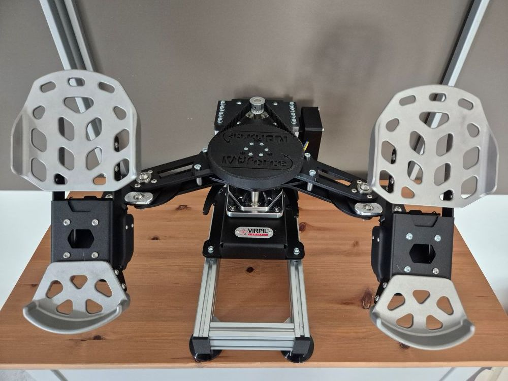

# RhinoACE - Virpil ACE Pedals FFB Conversion

## Overview

{width=400}

The RhinoACE is a high-torque conversion kit that adds VPforce FFB capability to Virpil ACE rudder pedals using the 86BLF03 motor. Based on Number481's design, this kit provides professional-grade force feedback using a pre-assembled aluminum frame for simplified installation.

**Key Features:**

- Solder-free assembly using pre-crimped wiring
- Compatible with Virpil ACE rudder pedals
- Uses 86BLF03 motor from VPforce DIY kit lineup (high torque)
- Pre-assembled aluminum frame for easy installation
- Requires dual USB connection (original ACE for brakes, VPforce board for rudder axis)
- Adjustable height: ~80mm with feet, ~50mm without feet, ~30mm with horizontal 2040 profile

## Kit Contents and Requirements

**Included:**

- Pre-assembled aluminum frame with mounting hardware (shortened version for sale)
- PETG-printed mechanical components (motor mount, enclosure, lid, spacers, pulley)
- Hardware (M3-M6 screws, nuts, washers, timing pulleys, timing belt)
- Pre-crimped power wiring and USB extension cable

**Required Components (not included):**

- Virpil ACE rudder pedals
- VPforce DIY FFB kit: 86BLF03 x1 + USB (order from VPforce: 229€ + VAT)
- Power supply unit
- USB type A to B cable

**Pricing:**

- Kit: 199€
- VPforce motor kit: 229€ + VAT
- Total project cost: ~428€ + VAT (excluding PSU and cables)

!!! note "Affiliate Links"
    Amazon links in this document may be affiliate links. Purchases through these links support documentation maintenance at no extra cost to buyers.

!!! warning "Modification Liability"
    All pedal modifications are performed at user's own risk. This kit provides mechanical components only - installation responsibility lies with the end user.

## Technical Specifications

**Mechanical Design:**

- Motor configuration: External frame-mounted 86BLF03 (high torque)
- Pre-assembled aluminum frame: Simplified installation with adjustable orientation
- Belt drive transmission: 15T motor pulley to ACE swing arm pulley
- Optional printed throw limiters to replace feather holders

**Electrical Configuration:**

- VPforce USB board: Rudder axis control
- Original ACE board: Brake axis control (dual USB operation)
- Custom enclosure: Houses VPforce board, power connections, and USB interface
- Pre-crimped wiring (solder-free assembly)
- External DC power supply

**Height Configurations:**

- With black feet: ~80mm from floor to ACE bottom edge
- Without feet: ~50mm added height
- Horizontal 2040 profile: ~30mm added height (wider underside)

!!! tip "Power Management"
    Connect PSU to switchable power strip. Only power on during active use to extend component lifespan and reduce unattended operation risks.

## Assembly Process Overview

The RhinoACE conversion uses a pre-assembled aluminum frame, simplifying installation significantly. Full assembly instructions with detailed photos available in original documentation.

**Assembly Stages:**

1. **ACE Preparation:** Remove four M6 screws from swing arm, remove spring (not needed)
2. **Enclosure Assembly:** Install DC power connector, VPforce board with M3×8mm screws, connect power block
3. **Motor Installation:** Attach 86BLF03 motor to aluminum frame with M6 screws, connect power and data cables
4. **Pulley Installation:** Mount 15T pulley to motor shaft (height-adjustable), attach pre-assembled pulley to swing arm with M6×20 screws
5. **Base Modification:** Remove original feet construction and bottom plate, install new M2×20 screws with spacers
6. **ACE Mounting:** Attach ACE to aluminum frame using modified mounting points (leave screws loose initially)
7. **Software Configuration:** Set up VPforce configurator with unique Device Ident and Product ID
8. **Belt Installation:** Tension belt between pulleys with ACE positioned correctly, use wooden block or two-person method
9. **Final Assembly:** Tighten frame mounting screws, install lid, perform calibration

**Critical Assembly Notes:**

- Original M6 swing arm screws and spring should be stored for potential kit removal
- Belt tensioning requires wooden block or two-person assistance (prevent cable damage)
- 15T pulley height must match ACE pulley before final tightening
- Bottom plate spacer sequence: M2×20 screw → washer → bottom plate → black spacer → original washer → M5 lock nut
- Motor labeled "Y" may require Swap checkbox activation or firmware reflash
- TelemFFB identifies pedals by single X-axis configuration (disable Y-axis in configurator)

!!! important "Belt Tensioning Safety"
    Use wooden block to push ACE forward during belt tensioning. Ensure cables are protected from damage during this process. Two-person method recommended.

## Software Setup Summary

**Initial Configuration:**

1. Connect VPforce board via USB (disconnect other VPforce devices)
2. Access firmware update via Edge or Chrome browser
3. Download and run VPforce FFB Configurator
4. Configure three critical settings:

    - USB Device Ident: "RhinoACE" (or unique name)
    - USB Product ID: 2054 (or unique ID)
    - Disable Y-axis (required for TelemFFB pedal detection)

5. Set Master Gain: 100%, Spring Gain: 100% for belt installation
6. Manual calibration values: min: 0, max: 4096 (centers motor axis)
7. Motor labeled "Y": Activate Swap checkbox or contact Walmis for firmware reflash
8. Perform auto-calibration after belt installation
9. Fine-tune gains, spring, and effects per user preference

**TelemFFB Integration:**

- Configure VPforce-TelemFFB application
- Multi-device setup: Configure Launch Options with RhinoACE ID for simultaneous joystick/pedal operation
- Auto-Launch and headless mode for seamless game integration
- Simulator compatibility: DCS World, IL-2 Great Battles, MSFS, X-Plane

**Configuration Resources:**

- [Hiob's starting configuration](https://discord.com/channels/965234441511383080/1255151401542357055/1350412811343233094) (VPforce Discord)

!!! warning "Input Configuration Backup"
    Backup existing simulator input configurations before connecting RhinoACE. Device ID changes may require input remapping in games.

## Optional Modifications

**Original Feet Restoration:**

- Remove printed feet and reinstall original Virpil ACE feet if preferred

**Throw Limiters:**

- Replace feather holders with printed throw limiters for customized pedal travel limits

## Performance Demonstration

**Demo Videos:**

- [Spring force varying with speed](https://drive.google.com/file/d/1NZt3mOSLmp1jtxvrNdaE3mDCGeoVGOCD/view?usp=sharing) (RhinoMFG with 57 motors)
- [Pre-stall buffet effects](https://drive.google.com/file/d/1pVY_yHfMUIJincFG-UX7ShViL5YinNr8/view?usp=sharing) (RhinoMFG with 57 motors)
- [Virpil ACE FFB demonstration](https://www.youtube.com/watch?v=AWd7LjSCXhk)

## Additional Resources

**Assembly Documentation:**

- [Detailed Assembly Guide](https://docs.google.com/document/d/e/2PACX-1vTArIixAKSQ9Wju5q6YjoCOnsVkVFMXAehZfbanY6uJZuQmvtW2jdOKz_iTWskhKnQfRUis-wxBDE_c/pub) (step-by-step instructions with photos)

**General FAQ:**

- [FAQ - RhinoACE DIY Kit](https://docs.google.com/document/d/e/2PACX-1vTArIixAKSQ9Wju5q6YjoCOnsVkVFMXAehZfbanY6uJZuQmvtW2jdOKz_iTWskhKnQfRUis-wxBDE_c/pub)
- [FAQ - General DIY Kits](https://docs.google.com/document/d/e/2PACX-1vSdihp7D6lCn4pFD1OYZG2I01n0HLStOqDDRj8S59Rdf3vuTUAT_3qEQ1S692cR6h-oYT7xuc-joXlm/pub) (PSU requirements, shipping, payment, warranty)

**Community Support:**

- VPForce Discord: Real-time assembly guidance, troubleshooting, and configuration sharing
- Multi-device configuration support (running RhinoACE with Rhino joystick/collective)
- User settings database and community configurations

---

**Project Credits:**  
Original design by Number481 | Kit assembly and documentation by Kaltokri | VPforce motor electronics by Walmis
