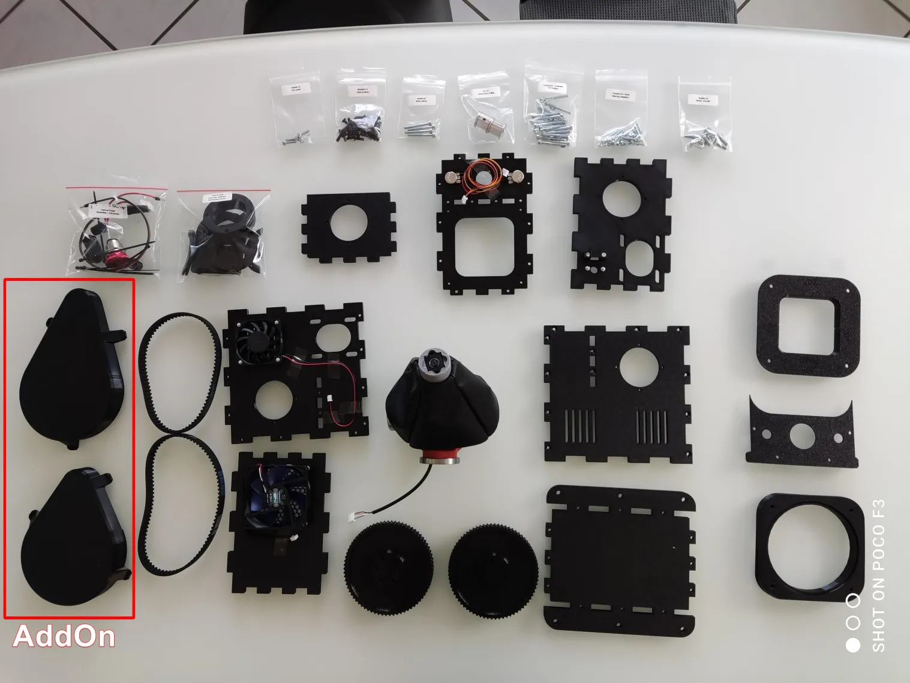

# RhinoJoystick - DIY FFB Joystick Kit

DIY conversion kit for building a complete VPforce Rhino force feedback joystick base. Based on open-source community designs with pre-assembled components for simplified construction.

## Overview

Complete DIY kit for constructing a dual-axis force feedback joystick base compatible with Virpil, Thrustmaster, WinWing, and VKB grips (adapters required for some models).

**Key Features:**

- Dual-axis FFB with VPforce 57BLF03 motors (X2)
- Two-part gimbal design (original Rhino architecture)
- Pre-assembled complex components (solder-free assembly)
- Carbon-reinforced PETG lower gimbal (100% infill)
- Laser-sintered PA12 grip connector (professional-grade material)
- Official VPforce 3D models (compatible with aluminum upgrades)
- PETG housing (5 walls, 35% infill, robust construction)

## Kit Contents and Requirements

!!! note "Pricing"
    **Kit Price:** 349€ (excludes motor kit and shipping). See [General FAQ - Pricing](general-faq.md#kit-pricing-overview) for complete project costs including VPforce motor kit and shipping.

### What's Included

**Mechanical Components:**

- Pre-printed gimbal assembly (two-part design)
- Lower gimbal: Carbon-reinforced PETG-CF (100% infill)
- Upper stick connector: Laser-sintered PA12 (VPforce official model)
- 20×20mm aluminum profile (connects lower/upper gimbal)
- PETG housing (5-wall construction, sturdy)
- All required screws (labeled bags: 46× M4×16 for housing, M3 hardware for gimbal)

**Electrical Components:**

- Pre-crimped internal power wiring (solder-free)
- DIN connector block and cable (original VPforce parts)
- USB cable with socket (black/white/yellow/red wires)

**Documentation:**

- Assembly reference (protomaker guide-based)
- Troubleshooting appendix

### What's Not Included (Order Separately)

**VPforce Motor Kit (Required):**

- **Motor Kit:** VPforce 57BLF03 x2 + USB (299€ + VAT)
- **Order from:** [VPforce Controls Website](https://vpforcecontrols.com/) → "Order FFB Kits" section
- **Critical:** Kit works only with 57BLF03 dual motor configuration

**Joystick Grip (Required):**

- **Compatible (direct mount):** Virpil grips, Thrustmaster grips
- **Adapter required:** WinWing, VKB (order adapters from VPforce with motor kit)

**Additional Hardware:**

- Power supply unit (19V / 10A, 5.5-2.5mm connector - see [General FAQ](general-faq.md))
- USB cable (Type A to Type B)

### Optional Add-Ons

**Belt Covers:** 30€  
- Aesthetic protection for drive belts

**Aluminum Grip Mount Upgrade:** 65€ (VAT included)  
- Same as VPforce CNC aluminum connector (49€ + VAT from VPforce store)
- Pre-mounted on gimbal by Kaltokri
- Recommended for frequent grip changes (more durable than PA12)
- Official VPforce compatibility maintained

!!! tip "Grip Mount Upgrade"
    Aluminum upgrade provides superior durability for users who frequently swap joystick grips. Kaltokri mounts it directly to gimbal during kit assembly.

## Compatibility Notes

**Grip Compatibility:**

- **Virpil grips:** Direct mount, no adapter required
- **Thrustmaster grips:** Direct mount, no adapter required (see DIN5 orientation note)
- **WinWing grips:** Adapter required (order from VPforce)
- **VKB grips:** Adapter required (order from VPforce)

**Grip Connector Compatibility:**

- PA12 stick connector is official VPforce 3D model
- Compatible with VPforce CNC machined aluminum connector upgrade
- Aluminum upgrade can be purchased from VPforce store (49€ + VAT) or pre-installed by Kaltokri (65€ VAT included)

!!! important "Thrustmaster Grip Orientation"
    For Thrustmaster grips without extension: Consider Rhino mounting orientation. If mounting with potentiometers/emergency stop facing away (more comfortable), invert axis in VPforce configurator (not in-game) to prevent TelemFFB confusion. For potentiometers facing forward, rotate DIN5 connector plate 180°.

## Technical Specifications

**Mechanical Design:**

- **Gimbal:** Two-part design (lower carbon-PETG, upper PA12 laser-sintered)
- **Center Spine:** 20×20mm aluminum profile
- **Housing:** PETG (5 walls, 35% infill)
- **Lower Gimbal:** 100% infill carbon-reinforced PETG-CF (high strength)
- **Grip Connector:** Laser-sintered PA12 (not prone to breakage)

**Electrical Configuration:**

- **Motors:** Dual 57BLF03 (X and Y axes)
- **Control:** VPforce USB board (included in motor kit)
- **Power:** 19V / 10A PSU (not included)
- **Data:** USB Type B connection
- **Wiring:** Pre-crimped, solder-free assembly

**Dimensions and Weight:**

- Standard Rhino FFB base footprint
- Compatible with VPforce grip mount specifications

## Assembly Process Overview

Assembly follows protomaker's open-source guide with Kaltokri-specific modifications:

**Assembly Stages:**

1. **Gimbal Assembly:** Install lower gimbal with bearings and retainers
2. **Aluminum Spine Installation:** Connect lower gimbal to upper stick connector
3. **Housing Preparation:** Install gimbal assembly into PETG housing
4. **Motor Installation:** Mount 57BLF03 motors to left/right panels
5. **Power Wiring:** Connect pre-crimped power cables (solder-free)
6. **Belt Installation:** Tension drive belts between motors and gimbal pulleys
7. **VPforce Board Installation:** Mount USB controller board, connect motor data cables
8. **Housing Closure:** Secure housing with M4×16 screws (46 total)
9. **Grip Mount:** Attach joystick grip via DIN5 connector
10. **Final Configuration:** VPforce configurator setup, TelemFFB integration

**Required Tools:**

- Metric allen key set
- Small TORX driver (for VPforce board)
- Slotted screwdrivers
- 3mm drill bit (optional, for bearing retainer hole enlargement)
- 5mm drill bit (optional, for grip connector hole adjustment if needed)
- Crimping pliers and wire ferrules (for VPforce motor kit assembly)

**Assembly Time:** One evening (3-4 hours typical for builders with basic mechanical skills)

!!! warning "Pre-Assembly Checks"
    Complex gimbal components are pre-assembled by Kaltokri. Do not disassemble pre-assembled sections unless troubleshooting specific issues.

## Software Setup Summary

**VPforce Configurator:**

1. Connect Rhino via USB (VPforce board from motor kit)
2. Download VPforce FFB Configurator from [VPforce website](https://vpforcecontrols.com/)
3. Configure device settings:

    - USB Device Ident: "Rhino" (or custom name)
    - USB Product ID: Default (or unique ID for multi-device setups)
    - Dual-axis configuration (X and Y enabled)

4. **Axis Inversion:** If mounting with potentiometers facing away, invert axis in configurator (not in-game)
5. Perform auto-calibration after assembly
6. Set master gain, spring force, and effects per preference

**TelemFFB Integration:**

- Download VPforce-TelemFFB application
- Configure for game-specific FFB profiles (DCS World, IL-2 Great Battles, MSFS, X-Plane)
- Multi-device setup: Configure separate device IDs for simultaneous joystick/pedal/collective operation
- Auto-launch and headless mode for seamless integration

**Grip-Specific Configuration:**

- Thrustmaster grips: Map buttons via Windows joystick calibration
- Virpil grips: Use Virpil software for button/axis configuration
- WinWing/VKB grips: Configure via manufacturer software (with VPforce adapter)

## Troubleshooting

**Common Issues and Solutions:**

**Q: Missing M4×16 housing screws?**  
**A:** Kit should include 46× M4×16 screws. Early kits shipped with 40 screws (insufficient). Contact Kaltokri if count is incorrect.

**Q: Cannot fasten all four screws on grip connector?**  
**A:** 20×20mm aluminum profile holes may have slight positional variance (not professionally machined). Gimbal holes are 4.8mm (forgiving), but grip connector holes are 4.3mm (tight tolerance). If screws don't fit, enlarge grip connector holes to 5mm with drill bit. Screws hold securely despite enlargement.

**Q: Wrong DIN5 connector orientation for Thrustmaster grip?**  
**A:** If mounting Rhino with potentiometers/emergency stop facing away (more comfortable), invert axis in VPforce configurator. If potentiometers should face forward, rotate DIN5 connector plate 180° before final assembly.

**Q: Missing screws for DIN5 connector plate?**  
**A:** Kaltokri leaves these screws out intentionally for better Thrustmaster Warthog grip fitment. Currently testing suitable M3 countersunk screws for future kit inclusion. Contact Kaltokri if needed for your grip model.

**Q: M3 screws don't go through InnerBearingRetainer holes?**  
**A:** Holes are intentionally undersized. Screws can be threaded through (some builders prefer this), or enlarge holes to 3mm with drill bit for easier assembly. Future kits may include modified retainer version.

**Q: Connection cable too short to reach VPforce board?**  
**A:** Mount gimbal with cable opening pointing toward mid panel (circuit board location). Incorrect orientation causes insufficient cable length. Gimbal nuts are glued only on back and right sides.

**Q: Motor power connections interfere with belt tensioning?**  
**A:** Orient backward motor during installation so power connections don't point toward bottom plate. Backward motor should have power connections accessible but not obstructing belt tension adjustment. Right panel motor moves horizontally for tensioning (no power connection interference).

!!! tip "Assembly Assistance"
    If problems arise during assembly, contact Kaltokri via email (see [General FAQ](general-faq.md)) or VPforce Discord. Parts fit tightly but should not require excessive force.

## Additional Resources

**Assembly Documentation:**

- [Protomaker Assembly Guide](https://github.com/protomaker964/Rhino-FFB-Clone-3D_Printed/tree/main) (see "Assembly ReferenceXX.pdf")
- [Kaltokri Assembly Guide (In Progress)](https://docs.google.com/document/d/e/2PACX-1vQ8r9Rr2K9ATGruANPtV7CGIvKOD9_Xe-TGLAvPaW30laOoMvfdZIOwPafR2InhjUHd4b10H8oZYmXc/pub)
- [Detailed FAQ - RhinoJoystick DIY Kit](https://docs.google.com/document/d/1jxXOLMCzxb13Vy2UVa6aHmTfpU_UmTUOMkBZk8BARys/pub)

**General Information:**

- [General FAQ for all DIY kits](general-faq.md) (PSU requirements, shipping, payment, warranty)

**Community Support:**

- VPforce Discord: Real-time assembly guidance, troubleshooting, and configuration
- GitHub repositories: Open-source designs and modifications
- User community: Shared settings, grip compatibility reports, and best practices

---

**Project Credits:**  
Original Rhino design by Walmis | Open-source 3D models by Protomaker, Mabo, Gadroc | Kit assembly and documentation by Kaltokri and Winger | VPforce motor electronics by Walmis

!!! note "Power Supply Safety"
    Connect PSU to switchable socket. Power off when not in use - do not leave FFB devices powered 24/7 unattended.
