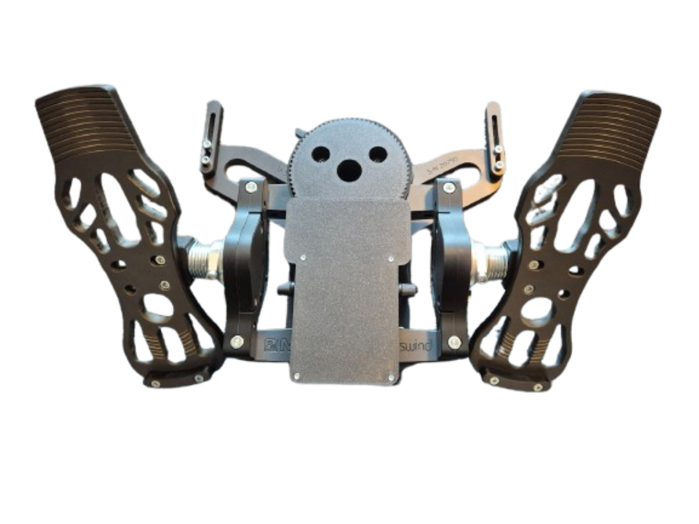

# RhinoMFG - MFG Crosswind FFB Conversion

## Overview

{ width=400 }

The RhinoMFG is a conversion kit that adds VPforce FFB capability to MFG Crosswind rudder pedals. Based on Hiob's design, the kit provides mechanical components and hardware while using VPforce motor electronics for force feedback control.

**Key Features:**

- Solder-free assembly using pre-crimped wiring
- Compatible with MFG Crosswind V1, V2, and V3 versions
- Uses single 57BLF03 motor from VPforce DIY kit lineup
- Requires dual USB connection (original MFG for brakes, VPforce board for rudder axis)

## Kit Contents and Requirements

**Included:**

- PETG-printed mechanical components (motor mount, pulley housing, PCB holder, lid)
- Hardware (screws, nuts, washers, 74T pulley, timing belt)
- Pre-crimped power wiring

**Required Components (not included):**

- MFG Crosswind rudder pedals (V1, V2, or V3)
- VPforce DIY FFB kit: 57BLF03 x1 + USB (order from VPforce: 179€ + VAT)
- Power supply unit (angled DC connector recommended)
- USB type A to B cable (angled connector recommended)

**Pricing:**

- Kit: 139€
- VPforce motor kit: 179€ + VAT
- Total project cost: ~318€ + VAT (excluding PSU and cables)

!!! note "Affiliate Links"
    Amazon links in this document may be affiliate links. Purchases through these links support documentation maintenance at no extra cost to buyers.

## Compatibility Notes

The kit fits MFG Crosswind V1, V2, and V3 pedals, with design verification on V3 hardware. Variations between production batches may require minor modifications:

**M6 Mounting Holes:**

- Some early versions use wood screw holes instead of M6 threads
- May require drilling to 6 mm diameter for proper M6 fitment

**74T Pulley Pin Clearance:**

- Pulley pins require 10.5 mm countersink depth
- Early versions with 10.0 mm countersinks need one of the following:

    - Sand pin diameter until clearance achieved
    - Drill countersinks to 10.5 mm (risk of material flaking)
    - Remove pins entirely (compatibility unverified)

!!! warning "Modification Liability"
    All pedal modifications are performed at user's own risk. This kit provides mechanical components only - installation responsibility lies with the end user.

## Technical Specifications

**Mechanical Design:**

- Motor mount and housing: PETG printed components
- Belt drive transmission: 74T pulley to crossarm
- Motor positioning: Top-mounted configuration
- Force output: Per 57BLF03 motor specifications

**Electrical Configuration:**

- VPforce USB board: Rudder axis control
- Original MFG board: Brake axis control (dual USB operation)
- Pre-crimped wiring (solder-free assembly)
- External DC power supply

!!! tip "Connector Recommendations"
    Angled DC power and USB connectors reduce mechanical stress and minimize cable damage risk during operation.

## Assembly Process Overview

The RhinoMFG kit requires mechanical assembly of provided components onto MFG Crosswind pedals, followed by electrical configuration through VPforce software.

**Mechanical Installation:**

1. Remove spring from crosswind pedals (lever removal optional)
2. Mount motor to printed motor mount assembly
3. Route pre-crimped wiring through motor mount
4. Assemble motor mount sides and secure with provided hardware
5. Install power socket and PCB to holder components
6. Mount complete assembly to crosswind base
7. Install 74T pulley to crossarm using cam piece and countersunk screws
8. Position motor pulley aligned with 74T gear (16mm width reference)
9. Tension belt by adjusting motor position (tight but not hard)
10. Install potentiometers to lid and secure with remaining hardware

**Software Configuration:**

1. Connect VPforce board via USB (disconnect other VPforce devices during initial setup)
2. Access firmware through Edge browser for verification
3. Configure VPforce FFB Configurator:

    - Disable Y axis
    - Set USB Device Ident to "RhinoMFG"
    - Set USB Product ID to 2052 (or unique identifier)
    - Master gain: 100
    - Spring gain: 50 (both main and effects pages)

4. Apply and store settings
5. Reconnect USB and connect power supply
6. Set manual calibration values: min: 0, max: 4096 (centers motor axis)
7. Final calibration and profile setup (recommended: 50-60% spring force)
8. Configure TelemFFB auto-launch for pedals in headless mode (if using telemetry)

!!! important "Belt Installation Sequence"
    Install belt after initial software configuration. Motor must be in centered position (via calibration values 0-4096) before belt mounting to ensure correct alignment.

## Additional Resources

**Assembly Documentation:**

- [Detailed Assembly Guide](https://docs.google.com/document/d/e/2PACX-1vRqbUWTxlUd09m2rdLoUV7u_ZEdTDFg0Q1TZOR1rLTqXAowPfY8BeuTKLsWwPUjfVNpjtz_EQVaaoVT/pub) (step-by-step instructions with photos)

**General FAQ:**

- [FAQ - RhinoMFG DIY Kit](https://docs.google.com/document/d/e/2PACX-1vRqbUWTxlUd09m2rdLoUV7u_ZEdTDFg0Q1TZOR1rLTqXAowPfY8BeuTKLsWwPUjfVNpjtz_EQVaaoVT/pub)
- [FAQ - General DIY Kits](https://docs.google.com/document/d/e/2PACX-1vSdihp7D6lCn4pFD1OYZG2I01n0HLStOqDDRj8S59Rdf3vuTUAT_3qEQ1S692cR6h-oYT7xuc-joXlm/pub) (PSU requirements, shipping, payment, warranty)
- Contact information

**Community Support:**

- VPForce Discord: Real-time assembly guidance and troubleshooting
- Detailed step-by-step documentation available from vendor
- Community-contributed assembly tips and modifications

---

**Project Credits:**  
Design by Hiob | Kit assembly and documentation by Kaltokri | VPforce motor electronics by Walmis
