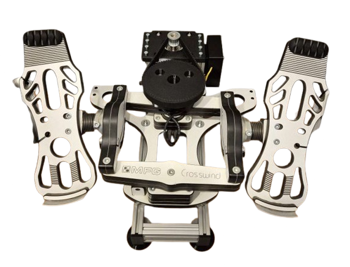

# RhinoMFG86 - MFG Crosswind FFB Conversion (High-Torque)

## Overview

The RhinoMFG86 is a high-torque conversion kit that adds VPforce FFB capability to MFG Crosswind rudder pedals using the more powerful 86BLF03 motor family. Based on Hiob's RhinoMFG design and Number481's Virpil ACE design, this hybrid kit provides enhanced force output compared to the standard 57-motor version.

**Key Features:**

- Solder-free assembly using pre-crimped wiring
- Compatible with MFG Crosswind V1, V2, and V3 versions
- Uses 86BLF03 motor from VPforce DIY kit lineup (higher torque than 57BLF03)
- Pre-assembled aluminum frame for simplified installation
- Requires dual USB connection (original MFG for brakes, VPforce board for rudder axis)
- Optional feet add ~75mm height; without feet adds ~45mm

## Kit Contents and Requirements

**Included:**

- Pre-assembled aluminum frame with mounting hardware
- PETG-printed mechanical components (motor mount, enclosure, lid, spacers)
- Hardware (M3-M6 screws, nuts, washers, 74T pulley, 15T pulley, timing belt)
- Pre-crimped power wiring and USB extension cable

**Required Components (not included):**

- MFG Crosswind rudder pedals (V1, V2, or V3)
- VPforce DIY FFB kit: 86BLF03 x1 + USB (order from VPforce: 229€ + VAT)
- Power supply unit
- USB type A to B cable

**Pricing:**

- Kit: 199€
- VPforce motor kit: 229€ + VAT
- Total project cost: ~428€ + VAT (excluding PSU and cables)

!!! note "Affiliate Links"
    Amazon links in this document may be affiliate links. Purchases through these links support documentation maintenance at no extra cost to buyers.

## Compatibility Notes

The kit fits MFG Crosswind V1, V2, and V3 pedals, with design verification on V1 hardware. Variations between production batches may require minor modifications:

**M6 Mounting Holes:**

- Some early versions use wood screw holes instead of M6 threads
- May require drilling to 5 mm diameter for proper M5 fitment to aluminum frame

**74T Pulley Pin Clearance:**

- Pulley pins require 10.5 mm countersink depth
- Early versions with 10.0 mm countersinks need one of the following:

    - Sand pin diameter until clearance achieved
    - Drill countersinks to 10.5 mm (risk of material flaking)
    - Remove pins entirely (compatibility unverified)

!!! warning "Modification Liability"
    All pedal modifications are performed at user's own risk. This kit provides mechanical components only - installation responsibility lies with the end user.

!!! tip "Power Management"
    Connect PSU to switchable power strip. Only power on during active use to extend component lifespan and reduce unattended operation risks.

## Technical Specifications

**Mechanical Design:**

- Motor configuration: External frame-mounted 86BLF03 (higher torque than standard RhinoMFG)
- Pre-assembled aluminum frame: Simplifies installation and improves rigidity
- Belt drive transmission: 15T motor pulley to 74T crossarm pulley
- Force output: Enhanced compared to 57-motor version (per 86BLF03 specifications)

**Electrical Configuration:**

- VPforce USB board: Rudder axis control
- Original MFG board: Brake axis control (dual USB operation)
- Custom enclosure: Houses VPforce board, power connections, and USB interface
- Pre-crimped wiring (solder-free assembly)
- External DC power supply

**Height Specifications:**

- With black feet: ~75mm from floor to MFG bottom edge
- Without feet: ~45mm from floor to MFG bottom edge

!!! tip "Mounting Options"
    Feet can be removed for direct mounting to wooden plate or aluminum sim rig profile.

## Assembly Process Overview

The RhinoMFG86 conversion uses a pre-assembled aluminum frame, simplifying installation compared to fully DIY builds. Full assembly instructions with detailed photos available in original documentation.

**Assembly Stages:**

1. **Pedal Preparation:** Remove spring from MFG Crosswinds (lever removal optional)
2. **74T Pulley Installation:** Mount 74T pulley to crossarm using cam piece and flanged countersunk screws
3. **Enclosure Assembly:** Install DC power connector, VPforce board with M3×8mm screws, connect power block
4. **Motor Installation:** Attach 86BLF03 motor to aluminum frame with M6 screws, connect power and data cables
5. **Pulley Attachment:** Mount 15T pulley to motor shaft (height-adjustable for 74T alignment)
6. **MFG Mounting:** Attach MFG pedals to pre-assembled frame using spacers and M5×25mm screws
7. **Software Configuration:** Set up VPforce configurator with unique Device Ident and Product ID
8. **Belt Installation:** Tension belt between pulleys with MFG positioned correctly, use clamp for proper tension
9. **Final Assembly:** Install lid, perform calibration, configure TelemFFB

**Critical Assembly Notes:**

- Pre-assembled frame reduces assembly complexity significantly
- Spacers with asymmetrical lugs fit precisely on aluminum profile nuts
- Leave M5 screws loose initially to allow MFG positioning during belt installation
- Belt tensioning requires clamp or two-person assistance for adequate tension (prevents slipping)
- 15T pulley height must match 74T pulley before final tightening
- TelemFFB identifies pedals by single X-axis configuration (disable Y-axis in configurator)

!!! important "Belt Tensioning"
    Proper belt tension critical to prevent slipping under load. Use large clamp to pull MFG forward while tightening M5 mounting screws. Insufficient tension causes loss of FFB accuracy.

## Software Setup Summary

**Initial Configuration:**

1. Connect VPforce board via USB (disconnect other VPforce devices)
2. Access firmware update via Edge or Chrome browser
3. Download and run VPforce FFB Configurator
4. Configure three critical settings:

    - USB Device Ident: "RhinoMFG86" (or unique name)
    - USB Product ID: 2052 (or unique ID)
    - Disable Y-axis (required for TelemFFB pedal detection)

5. Set Master Gain: 100%, Spring Gain: 100% for belt installation
6. Manual calibration values: min: 0, max: 4096 (centers motor axis)
7. Perform auto-calibration after belt installation
8. Fine-tune gains, spring, and effects per user preference

**TelemFFB Integration:**

- Configure VPforce-TelemFFB application
- Multi-device setup: Configure Launch Options with RhinoMFG86 ID for simultaneous joystick/pedal operation
- Auto-Launch and headless mode for seamless game integration
- Simulator compatibility: DCS World, IL-2 Great Battles, MSFS, X-Plane

!!! warning "Input Configuration Backup"
    Backup existing simulator input configurations before connecting RhinoMFG86. Device ID changes may require input remapping in games.

## Performance Comparison

**86BLF03 Motor Advantages:**

- Higher torque output compared to standard RhinoMFG (57BLF03)
- Enhanced force feedback strength and range
- Better handling of high-force effects (stall buffet, ground resistance)
- Improved linearity across force range

**Demo Videos (from standard RhinoMFG):**

- [Spring force varying with speed](https://drive.google.com/file/d/1NZt3mOSLmp1jtxvrNdaE3mDCGeoVGOCD/view?usp=sharing)
- [Pre-stall buffet effects](https://drive.google.com/file/d/1pVY_yHfMUIJincFG-UX7ShViL5YinNr8/view?usp=sharing)

## Additional Resources

**Assembly Documentation:**

- [Detailed Assembly Guide](https://docs.google.com/document/d/e/2PACX-1vS3I-asGbEH4-NuYSdFUx5mXrafYcRT2yKj_al8CcWsAZeAhBRezzsLA-U-HoHltFAsdFmexDz0S7uo/pub) (step-by-step instructions with photos)

**General FAQ:**

- [FAQ - RhinoMFG86 DIY Kit](https://docs.google.com/document/d/e/2PACX-1vS3I-asGbEH4-NuYSdFUx5mXrafYcRT2yKj_al8CcWsAZeAhBRezzsLA-U-HoHltFAsdFmexDz0S7uo/pub)
- [FAQ - General DIY Kits](https://docs.google.com/document/d/e/2PACX-1vSdihp7D6lCn4pFD1OYZG2I01n0HLStOqDDRj8S59Rdf3vuTUAT_3qEQ1S692cR6h-oYT7xuc-joXlm/pub) (PSU requirements, shipping, payment, warranty)

**Community Support:**

- VPForce Discord: Real-time assembly guidance, troubleshooting, and configuration sharing
- Multi-device configuration support (running RhinoMFG86 with Rhino joystick/collective)
- User settings database and best practices

---

**Project Credits:**  
Design inspired by Hiob (RhinoMFG) and Number481 (Virpil ACE design) | Kit assembly and documentation by Kaltokri | VPforce motor electronics by Walmis
