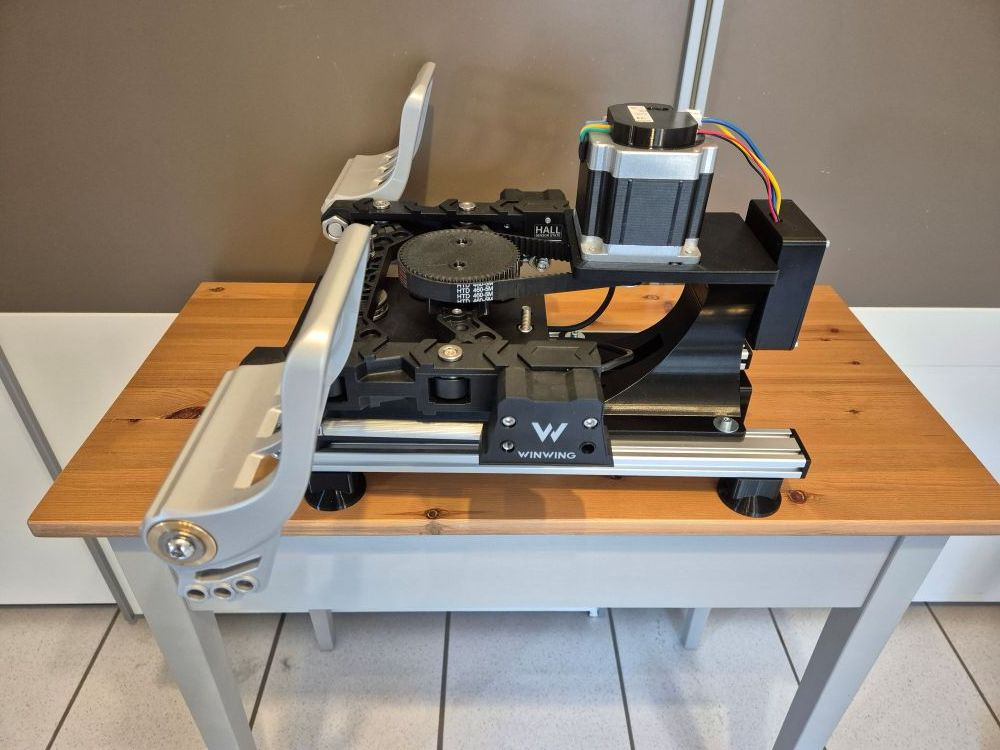

# RhinoOrion - WinWing Orion Pedals FFB Conversion

## Overview

The RhinoOrion is a conversion kit that adds VPforce FFB capability to WinWing Orion rudder pedals using the 86BLF03 motor. Based on Mike T's design, this kit provides enhanced force feedback using a pre-assembled aluminum frame with integrated belt tensioner for precise adjustment.

**Key Features:**

- Solder-free assembly using pre-crimped wiring
- Compatible with WinWing Orion rudder pedals
- Uses 86BLF03 motor from VPforce DIY kit lineup (high torque)
- Pre-assembled aluminum frame with adjustable motor mount
- Built-in belt tensioner for precise tension adjustment
- Requires dual USB connection (original Orion for brakes, VPforce board for rudder axis)
- Height addition: ~50mm with feet, ~20mm without feet

## Kit Contents and Requirements

**Included:**

- Pre-assembled aluminum frame with adjustable motor mount
- PETG-printed mechanical components (motor mount, enclosure, lid, 60T pulley, belt tensioner, plugs)
- Hardware (M3-M6 screws, nuts, washers, 15T timing pulley, 60T timing pulley, timing belt)
- Pre-crimped power wiring and USB extension cable

**Required Components (not included):**

- WinWing Orion rudder pedals
- VPforce DIY FFB kit: 86BLF03 x1 + USB (order from VPforce: 229€ + VAT)
- Power supply unit
- USB type A to B cable

**Pricing:**

- Kit: 159€
- VPforce motor kit: 229€ + VAT
- Total project cost: ~388€ + VAT (excluding PSU and cables)

!!! note "Affiliate Links"
    Amazon links in this document may be affiliate links. Purchases through these links support documentation maintenance at no extra cost to buyers.

!!! warning "Modification Liability"
    All pedal modifications are performed at user's own risk. This kit provides mechanical components only - installation responsibility lies with the end user.

## Technical Specifications

**Mechanical Design:**

- Motor configuration: Frame-mounted 86BLF03 with adjustable motor mount
- Pre-assembled aluminum frame: Simplified installation with precise motor positioning
- Belt drive transmission: 15T motor pulley to 60T swing arm pulley
- Integrated belt tensioner: Allows fine-tuning of belt tension without repositioning components

**Electrical Configuration:**

- VPforce USB board: Rudder axis control
- Original Orion board: Brake axis control (dual USB operation)
- Custom enclosure: Houses VPforce board, power connections, and USB interface
- Pre-crimped wiring (solder-free assembly)
- External DC power supply

**Height Specifications:**

- With black feet: ~50mm added from floor to Orion bottom edge
- Without feet: ~20mm added height

!!! tip "Power Management"
    Connect PSU to switchable power strip. Only power on during active use to extend component lifespan and reduce unattended operation risks.

## Assembly Process Overview

The RhinoOrion conversion uses a pre-assembled aluminum frame with adjustable motor mount and belt tensioner, enabling precise force feedback tuning. Full assembly instructions with detailed photos available in original documentation.

**Assembly Stages:**

1. **Orion Preparation:** Remove spring, cam piece (two M5 screws), and spring holding arms (requires bottom plate removal)
2. **Swing Arm Modification:** Mount 60T pulley to swing arm using two M5×35mm screws, plug resulting holes with kit plugs
3. **Frame Mounting:** Attach Orion to aluminum frame using four M5×20mm screws
4. **Enclosure Assembly:** Install DC power connector, VPforce board with M3×8mm screws, connect power block
5. **Motor Installation:** Attach 86BLF03 motor to motor mount with M6 screws, add 15T pulley (height-adjustable)
6. **Motor Mount Installation:** Attach motor mount to aluminum frame using four M5×16mm screws with 5.3×20mm washers (leave loose initially)
7. **Software Configuration:** Set up VPforce configurator with unique Device Ident and Product ID
8. **Belt Installation:** Tension belt using built-in tensioner mechanism, adjust 15T pulley height to match 60T pulley
9. **Final Assembly:** Tighten motor mount screws, install lid, perform calibration

**Critical Assembly Notes:**

- Bottom plate removal required to access spring holding arm mounts (board cables can remain connected)
- 60T pulley replaces original cam piece on swing arm
- Belt tensioner provides fine-tuning capability - tighten with sensitivity to avoid motor damage or slipping
- Motor connections point to rear (different from other kits)
- Motor mount uses 5.3×20mm large washers with M5×16mm screws
- Motor labeled "Y" may require Swap checkbox activation or firmware reflash
- Leave motor mount screws loose until belt is installed and tensioned
- TelemFFB identifies pedals by single X-axis configuration (disable Y-axis in configurator)

!!! important "Belt Tensioning Precision"
    Built-in tensioner allows precise adjustment. Too tight: motor performance degradation or component damage. Too loose: belt slipping. Tighten with sensitivity and verify smooth operation across full pedal range.

## Software Setup Summary

**Initial Configuration:**

1. Connect VPforce board via USB (disconnect other VPforce devices)
2. Access firmware update via Edge or Chrome browser
3. Download and run VPforce FFB Configurator
4. Configure three critical settings:

    - USB Device Ident: "RhinoOrion" (or unique name)
    - USB Product ID: 2054 (or unique ID)
    - Disable Y-axis (required for TelemFFB pedal detection)

5. Set Master Gain: 100%, Spring Gain: 100% for belt installation
6. Manual calibration values: min: 0, max: 4096 (centers motor axis)
7. Motor labeled "Y": Activate Swap checkbox or contact Walmis for firmware reflash
8. Perform auto-calibration after belt installation
9. Fine-tune gains, spring, and effects per user preference

**TelemFFB Integration:**

- Configure VPforce-TelemFFB application
- Multi-device setup: Configure Launch Options with RhinoOrion ID for simultaneous joystick/pedal operation
- Auto-Launch and headless mode for seamless game integration
- Simulator compatibility: DCS World, IL-2 Great Battles, MSFS, X-Plane

**Configuration Resources:**

- [Hiob's starting configuration](https://discord.com/channels/965234441511383080/1255151401542357055/1350412811343233094) (VPforce Discord)

!!! warning "Input Configuration Backup"
    Backup existing simulator input configurations before connecting RhinoOrion. Device ID changes may require input remapping in games.

## Performance Demonstration

**Demo Videos:**

- [Spring force varying with speed](https://drive.google.com/file/d/1NZt3mOSLmp1jtxvrNdaE3mDCGeoVGOCD/view?usp=sharing) (RhinoMFG with 57 motors)
- [Pre-stall buffet effects](https://drive.google.com/file/d/1pVY_yHfMUIJincFG-UX7ShViL5YinNr8/view?usp=sharing) (RhinoMFG with 57 motors)
- [Virpil ACE FFB demonstration](https://www.youtube.com/watch?v=AWd7LjSCXhk)

## Additional Resources

**Assembly Documentation:**

- [Detailed Assembly Guide](https://docs.google.com/document/d/e/2PACX-1vSqg5z7IwCEvO7kp_7aN6nuZ5UhiMT_u1BInB1sxV7iZH9Nfqi1VOfpibHZyeEb1vdAsGP9yn6JOIgE/pub) (step-by-step instructions with photos)

**General FAQ:**

- [FAQ - RhinoOrion DIY Kit](https://docs.google.com/document/d/e/2PACX-1vSqg5z7IwCEvO7kp_7aN6nuZ5UhiMT_u1BInB1sxV7iZH9Nfqi1VOfpibHZyeEb1vdAsGP9yn6JOIgE/pub)
- [FAQ - General DIY Kits](https://docs.google.com/document/d/e/2PACX-1vSdihp7D6lCn4pFD1OYZG2I01n0HLStOqDDRj8S59Rdf3vuTUAT_3qEQ1S692cR6h-oYT7xuc-joXlm/pub) (PSU requirements, shipping, payment, warranty)

**Community Support:**

- VPForce Discord: Real-time assembly guidance, troubleshooting, and configuration sharing
- Multi-device configuration support (running RhinoOrion with Rhino joystick/collective)
- User settings database and community configurations

---

**Project Credits:**  
Original design by Mike T | Kit assembly and documentation by Kaltokri | VPforce motor electronics by Walmis
