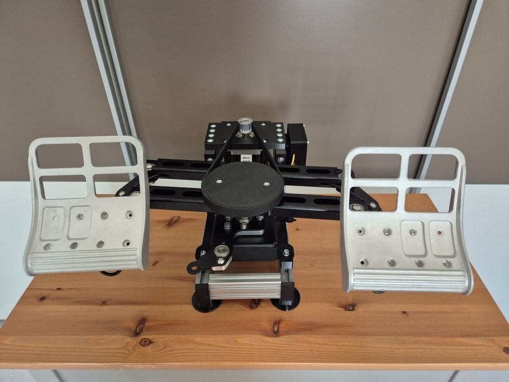

# RhinoR1 - Virpil R1 Pedals FFB Conversion

## Overview

The RhinoR1 is a conversion kit that adds VPforce FFB capability to Virpil R1 rudder pedals using the 86BLF03 motor. Based on Number481's design, this kit provides enhanced force feedback using a pre-assembled aluminum frame with custom spacers for precise pedal alignment.

**Key Features:**

- Solder-free assembly using pre-crimped wiring
- Compatible with Virpil R1 rudder pedals
- Uses 86BLF03 motor from VPforce DIY kit lineup (high torque)
- Pre-assembled aluminum frame with custom spacers
- Requires dual USB connection (original R1 for brakes, VPforce board for rudder axis)
- Height addition: ~85mm with feet, ~55mm without feet
- Includes foam/felt pads for throw limiter contact points

## Kit Contents and Requirements

**Included:**

- Pre-assembled aluminum frame with spacer components
- PETG-printed mechanical components (motor mount, enclosure with spacer, lid, pulley, spacers)
- Hardware (M3-M6 screws, nuts, washers, 15T timing pulley, timing pulley for swing arm, timing belt)
- Pre-crimped power wiring and USB extension cable
- Self-adhesive foam/felt pads for throw limiter protection

**Required Components (not included):**

- Virpil R1 rudder pedals
- VPforce DIY FFB kit: 86BLF03 x1 + USB (order from VPforce: 229€ + VAT)
- Power supply unit
- USB type A to B cable

**Pricing:**

- Kit: 199€
- VPforce motor kit: 229€ + VAT
- Total project cost: ~428€ + VAT (excluding PSU and cables)

!!! note "Affiliate Links"
    Amazon links in this document may be affiliate links. Purchases through these links support documentation maintenance at no extra cost to buyers.

!!! warning "Modification Liability"
    All pedal modifications are performed at user's own risk. This kit provides mechanical components only - installation responsibility lies with the end user.

## Technical Specifications

**Mechanical Design:**

- Motor configuration: Frame-mounted 86BLF03 (high torque)
- Pre-assembled aluminum frame: Simplified installation with precision spacers
- Belt drive transmission: 15T motor pulley to R1 swing arm pulley
- Throw limiter protection: Foam/felt pads prevent direct contact damage

**Electrical Configuration:**

- VPforce USB board: Rudder axis control
- Original R1 board: Brake axis control (dual USB operation)
- Enclosure with spacer: Houses VPforce board, power connections, and USB interface
- Pre-crimped wiring (solder-free assembly)
- External DC power supply

**Height Specifications:**

- With black feet: ~85mm added from floor to R1 bottom edge
- Without feet: ~55mm added height

!!! tip "Power Management"
    Connect PSU to switchable power strip. Only power on during active use to extend component lifespan and reduce unattended operation risks.

## Assembly Process Overview

The RhinoR1 conversion uses a pre-assembled aluminum frame with custom spacers for precise R1 alignment. Full assembly instructions with detailed photos available in original documentation.

**Assembly Stages:**

1. **R1 Preparation:** Remove spring, cam with M6 screws, cam arm with ball bearing, and base plate (see Virpil manual)
2. **Enclosure Assembly:** Attach enclosure with spacer to frame, install DC power connector, VPforce board with M3×8mm screws, connect power block
3. **Motor Installation:** Attach 86BLF03 motor to frame with M6 screws (connections point forward), add 15T pulley (height-adjustable)
4. **Pulley Installation:** Attach timing pulley to R1 swing arm using M6 screws
5. **Spacer Positioning:** Place spacers on aluminum frame aligned with nuts, position R1 on spacers
6. **Frame Mounting:** Install R1 using M5 screws (leave loose initially for positioning)
7. **Software Configuration:** Set up VPforce configurator with unique Device Ident and Product ID
8. **Belt Installation:** Tension belt using wooden block or two-person method, adjust 15T pulley height to match R1 pulley
9. **Final Assembly:** Tighten M5 screws, install lid, apply foam/felt pads to throw limiter contact points

**Critical Assembly Notes:**

- Base plate removal required (follow Virpil R1 manual instructions)
- Original components (spring, cam, arm) should be stored for potential kit removal
- Spacer holes must align with frame nuts for proper R1 positioning
- Belt tensioning requires wooden block or two-person assistance (protect cables from damage)
- 15T pulley height must match R1 pulley before final tightening
- Foam/felt pads prevent throw limiter contact damage during operation
- Motor connections point forward (different from some other kits)
- Motor labeled "Y" may require Swap checkbox activation or firmware reflash
- Leave M5 mounting screws loose until belt is installed and tensioned
- TelemFFB identifies pedals by single X-axis configuration (disable Y-axis in configurator)

!!! important "Throw Limiter Protection"
    Apply included foam/felt pads at contact points where swing arm meets throw limiters. Prevents wear and noise during operation.

## Software Setup Summary

**Initial Configuration:**

1. Connect VPforce board via USB (disconnect other VPforce devices)
2. Access firmware update via Edge or Chrome browser
3. Download and run VPforce FFB Configurator
4. Configure three critical settings:

    - USB Device Ident: "RhinoR1" (or unique name)
    - USB Product ID: 2054 (or unique ID)
    - Disable Y-axis (required for TelemFFB pedal detection)

5. Set Master Gain: 100%, Spring Gain: 100% for belt installation
6. Manual calibration values: min: 0, max: 4096 (centers motor axis)
7. Motor labeled "Y": Activate Swap checkbox or contact Walmis for firmware reflash
8. Perform auto-calibration after belt installation
9. Fine-tune gains, spring, and effects per user preference

**TelemFFB Integration:**

- Configure VPforce-TelemFFB application
- Multi-device setup: Configure Launch Options with RhinoR1 ID for simultaneous joystick/pedal operation
- Auto-Launch and headless mode for seamless game integration
- Simulator compatibility: DCS World, IL-2 Great Battles, MSFS, X-Plane

**Configuration Resources:**

- [Hiob's starting configuration](https://discord.com/channels/965234441511383080/1255151401542357055/1350412811343233094) (VPforce Discord)

!!! warning "Input Configuration Backup"
    Backup existing simulator input configurations before connecting RhinoR1. Device ID changes may require input remapping in games.

## Performance Demonstration

**Demo Videos:**

- [Spring force varying with speed](https://drive.google.com/file/d/1NZt3mOSLmp1jtxvrNdaE3mDCGeoVGOCD/view?usp=sharing) (RhinoMFG with 57 motors)
- [Pre-stall buffet effects](https://drive.google.com/file/d/1pVY_yHfMUIJincFG-UX7ShViL5YinNr8/view?usp=sharing) (RhinoMFG with 57 motors)
- [Virpil ACE FFB demonstration](https://www.youtube.com/watch?v=AWd7LjSCXhk)

## Additional Resources

**Assembly Documentation:**

- [Detailed Assembly Guide](https://docs.google.com/document/d/e/2PACX-1vQ3tvgD31EIt7kQSD8KvgcYBugTITHakSkwtBqtsFm1ZlgKGq5Sn_bbNeiE9Y8kPxN2uBw1eQzItccT/pub) (step-by-step instructions with photos)

**General FAQ:**

- [FAQ - RhinoR1 DIY Kit](https://docs.google.com/document/d/e/2PACX-1vQ3tvgD31EIt7kQSD8KvgcYBugTITHakSkwtBqtsFm1ZlgKGq5Sn_bbNeiE9Y8kPxN2uBw1eQzItccT/pub)
- [FAQ - General DIY Kits](https://docs.google.com/document/d/e/2PACX-1vSdihp7D6lCn4pFD1OYZG2I01n0HLStOqDDRj8S59Rdf3vuTUAT_3qEQ1S692cR6h-oYT7xuc-joXlm/pub) (PSU requirements, shipping, payment, warranty)

**Community Support:**

- VPForce Discord: Real-time assembly guidance, troubleshooting, and configuration sharing
- Multi-device configuration support (running RhinoR1 with Rhino joystick/collective)
- User settings database and community configurations

---

**Project Credits:**  
Original design by Number481 | Kit assembly and documentation by Kaltokri | VPforce motor electronics by Walmis
