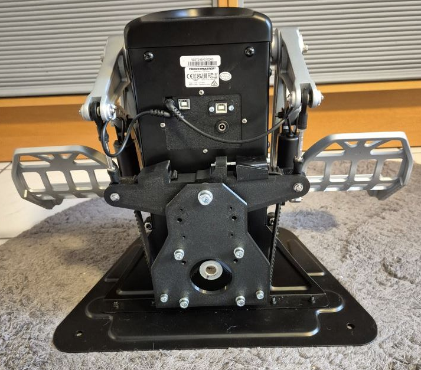

# RhinoTPR Inside - Thrustmaster TPR FFB Conversion (Motor Inside)

## Overview

The RhinoTPR is a conversion kit that adds VPforce FFB capability to Thrustmaster TPR rudder pedals. Based on FlyDoc's Tiger TPR FFB design, this motor-inside version integrates the FFB system within the existing TPR housing using custom mechanical mounts and VPforce electronics.

**Key Features:**

- Solder-free assembly using pre-crimped wiring
- Motor-inside configuration for compact integration
- Uses 86BLF04 motor from VPforce DIY kit lineup
- USB control via VPforce board (replaces TPR spring mechanism)
- Requires permanent modification to TPR housing (drilled holes)

## Kit Contents and Requirements

**Included:**

- PETG-printed mechanical components (motor mount plates, swing arm, tension slider, PCB holder)
- Hardware (M3-M8 screws, nuts, washers, timing gear, smooth pulleys, bearings, timing belt)
- Pre-crimped power wiring and USB extension cable
- Drill guide for precision hole placement

**Required Components (not included):**

- Thrustmaster TPR rudder pedals
- VPforce DIY FFB kit: 86BLF04 x1 + USB (order from VPforce: 249€ + VAT)
- Power supply unit
- USB type A to B cable
- 30mm step drill bit for center hole
- 5mm and 6.5mm drill bits for mounting holes

**Pricing:**

- Kit: 159€
- VPforce motor kit: 249€ + VAT
- Total project cost: ~408€ + VAT (excluding PSU, cables, and tools)

!!! note "Affiliate Links"
    Amazon links in this document may be affiliate links. Purchases through these links support documentation maintenance at no extra cost to buyers.

## Compatibility and Modifications

The RhinoTPR kit requires permanent modifications to Thrustmaster TPR pedals. These modifications cannot be reversed without visible evidence (drilled holes in housing).

**Required Modifications:**

- Drill seven holes in TPR housing back plate:

    - 4x 6.5mm motor mount holes
    - 2x 5mm outer support holes
    - 1x 30mm center hole for pulley access

- Disassemble swing arm mechanism
- Remove original hall sensor
- Modify internal electronics bay for VPforce board placement

**Alternative Version:**

- Motor-outside version available (no drilling required, maintains warranty)
- Separate documentation available from vendor

!!! warning "Permanent Modification"
    Drilling holes in the TPR housing voids manufacturer warranty and cannot be reversed. Ensure commitment to project before proceeding. All modifications performed at user's own risk.

!!! tip "Power Management"
    Connect PSU to switchable power strip. Only power on during active use to extend component lifespan and reduce unattended operation risks.

## Technical Specifications

**Mechanical Design:**

- Motor configuration: Internal mount using dual-plate sandwich structure
- Belt drive transmission: Timing gear to swing arm via smooth idler pulleys
- Tension adjustment: Adjustable tension slider with M4 bolt
- Force output: Per 86BLF04 motor specifications (higher torque than 57BLF03)

**Electrical Configuration:**

- VPforce USB board: Single-axis rudder control
- Original TPR electronics: Removed/replaced by VPforce system
- Pre-crimped wiring (solder-free assembly)
- External DC power supply

!!! tip "Connector Recommendations"
    Angled DC power and USB connectors reduce mechanical stress and minimize cable damage risk during operation.

## Assembly Process Overview

The RhinoTPR conversion requires complete disassembly of TPR pedals, precision drilling, mechanical component installation, and VPforce software configuration. Full assembly instructions with detailed photos and measurements available in original documentation.

**Assembly Stages:**

1. **Disassembly:** Remove TPR housing, swing arm, electronics, and hall sensor
2. **Drilling:** Use drill guide to mark and drill seven holes in back plate
3. **Reassembly (Upper):** Install USB/DC port holder, reconnect TPR board
4. **Mechanical Installation:** Assemble motor mount plates, swing arm, pulleys, and tensioning system
5. **Wiring:** Connect VPforce board, motor power, and control cables
6. **Belt Installation:** Configure motor center position via software, tension belt correctly
7. **Software Configuration:** Set up VPforce configurator, TelemFFB integration, and calibration

**Critical Assembly Notes:**

- Use drill guide for precise hole placement (critical alignment for motor mount)
- 30mm center hole allows external pulley preparation (easier than motor-shaft-only access)
- Motor must be centered via software before belt installation
- Belt tension: "tight but not hard" - allows smooth swing arm movement
- TelemFFB identifies pedals by single X-axis configuration (disable Y-axis in configurator)

!!! important "Software Configuration Sequence"
    Configure VPforce board (unique USB Device Ident and Product ID, Y-axis disabled) before belt installation. Motor centering via software enables proper belt alignment and prevents binding.

## Software Setup Summary

**Initial Configuration:**

1. Connect VPforce board via USB (disconnect other VPforce devices)
2. Access firmware update via Edge or Chrome browser
3. Download and run VPforce FFB Configurator
4. Configure three critical settings:

    - USB Device Ident: "RhinoTPR" (or unique name)
    - USB Product ID: 2052 (or unique ID)
    - Disable Y-axis (required for TelemFFB pedal detection)

5. Set Master Gain: 100%, Spring Gain: 100% for belt installation
6. Perform auto-calibration after belt installation
7. Fine-tune gains, spring, and effects per user preference

**TelemFFB Integration:**

- Download and configure VPforce-TelemFFB application
- Multi-device setup: Configure Launch Options with RhinoTPR ID for simultaneous joystick/pedal operation
- Auto-Launch and headless mode for seamless game integration
- Simulator compatibility: DCS World, IL-2 Great Battles, MSFS, X-Plane

!!! warning "Input Configuration Backup"
    Backup existing simulator input configurations before connecting RhinoTPR. Device ID changes may require input remapping in games.

## Additional Resources

**Assembly Documentation:**

- [Detailed Assembly Guide](https://docs.google.com/document/d/e/2PACX-1vRrOdQ23029ggH8EUtSqW9K3EvMdtpO94YH5-OLHhP5elaSq4L3T5QJkiccV1Su9IRlUZmfP_HX31E6/pub) (step-by-step instructions with photos)
- [Tiger TPR FFB Assembly Guide V1.pdf](https://github.com/FlyDoc53/Tiger-TPR-FFB) (FlyDoc original documentation)
- [DIY Force Feedback Thrustmaster TPR Video](https://www.youtube.com/watch?v=ka_EaIrZvGk) (assembly overview)

**General FAQ:**

- [FAQ - RhinoTPR Inside DIY Kit](https://docs.google.com/document/d/e/2PACX-1vRrOdQ23029ggH8EUtSqW9K3EvMdtpO94YH5-OLHhP5elaSq4L3T5QJkiccV1Su9IRlUZmfP_HX31E6/pub)
- [FAQ - General DIY Kits](https://docs.google.com/document/d/e/2PACX-1vSdihp7D6lCn4pFD1OYZG2I01n0HLStOqDDRj8S59Rdf3vuTUAT_3qEQ1S692cR6h-oYT7xuc-joXlm/pub) (PSU requirements, shipping, payment, warranty)

- PSU requirements and recommendations
- Shipping costs and methods
- Payment options
- Assembly timeline and dispatch
- Warranty and return policies
- Contact information

**Community Support:**

- VPForce Discord: Real-time assembly guidance, troubleshooting, and configuration sharing
- Multi-device configuration support (running RhinoTPR with Rhino joystick/collective)
- User settings database and best practices

---

**Project Credits:**  
Original design by FlyDoc | Kit assembly and documentation by Kaltokri | VPforce motor electronics by Walmis
