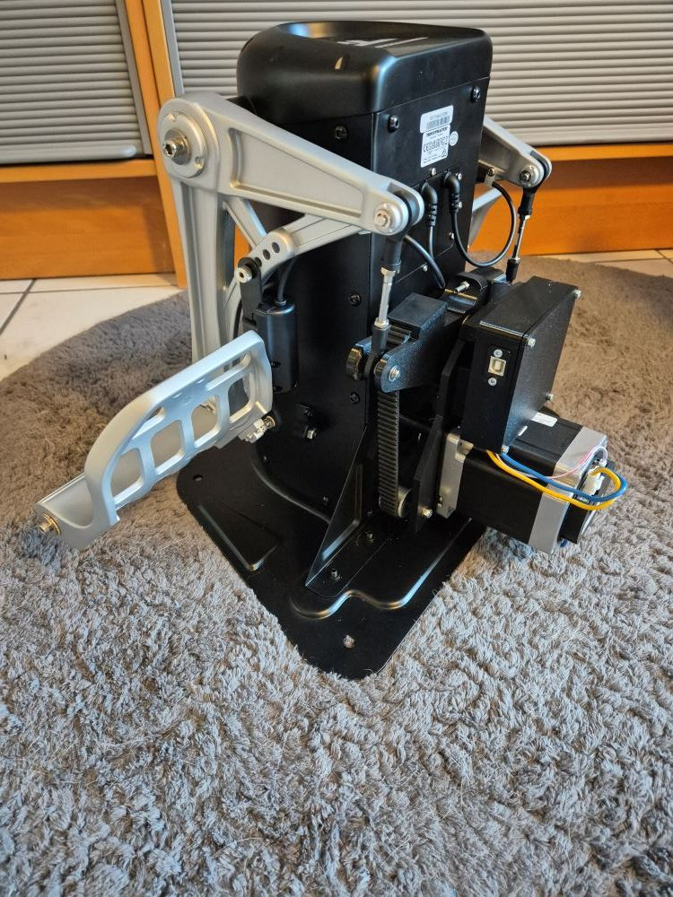

# RhinoTPR Outside - Thrustmaster TPR FFB Conversion (Motor Outside)

## Overview

{ width=400 }

The RhinoTPR Motor-Outside version is an alternative conversion kit that adds VPforce FFB capability to Thrustmaster TPR rudder pedals without requiring permanent modifications to the TPR housing. Based on FlyDoc and Smitty's design, this variant places the motor externally, eliminating the need for drilling holes.

**Key Features:**

- Solder-free assembly using pre-crimped wiring
- Motor-outside configuration (no drilling required, maintains warranty)
- Uses 86BLF04 motor from VPforce DIY kit lineup
- USB control via VPforce board
- No permanent TPR modifications (fully reversible)
- Requires additional space behind pedals in sim pit

## Kit Contents and Requirements

**Included:**

- PETG-printed mechanical components (motor mount plates, swing arm, enclosure, tension slider, PCB holder)
- Hardware (M3-M8 screws, nuts, washers, timing gear, smooth pulleys, bearings, timing belt)
- Pre-crimped power wiring and USB extension cable
- Motor spacers and pulley components

**Required Components (not included):**

- Thrustmaster TPR rudder pedals
- VPforce DIY FFB kit: 86BLF04 x1 + USB (order from VPforce: 249€ + VAT)
- Power supply unit
- USB type A to B cable

**Pricing:**

- Kit: 179€
- VPforce motor kit: 249€ + VAT
- Total project cost: ~428€ + VAT (excluding PSU and cables)

!!! note "Affiliate Links"
    Amazon links in this document may be affiliate links. Purchases through these links support documentation maintenance at no extra cost to buyers.

## Compatibility and Modifications

The Motor-Outside version provides a non-destructive alternative to the Motor-Inside configuration. No drilling or permanent modifications required.

**Advantages:**

- Preserves TPR warranty (no drilling required)
- Fully reversible installation
- Easier access to motor for maintenance
- Simpler assembly process (no precision drilling)

**Disadvantages:**

- Motor mounted externally (less aesthetic appearance)
- Requires additional space behind pedals (~10cm depth)
- Visible electronics housing on rear of TPR base

**Alternative Version:**

- Motor-inside version available (requires drilling, more compact)
- Separate documentation available

!!! tip "Power Management"
    Connect PSU to switchable power strip. Only power on during active use to extend component lifespan and reduce unattended operation risks.

## Technical Specifications

**Mechanical Design:**

- Motor configuration: External rear mount using dual-plate sandwich structure
- Belt drive transmission: Timing gear to swing arm via smooth idler pulleys
- Tension adjustment: Adjustable tension slider with M4 bolt
- Force output: Per 86BLF04 motor specifications

**Electrical Configuration:**

- VPforce USB board: Single-axis rudder control
- Integrated enclosure: Houses VPforce board, power connections, and USB interface
- Pre-crimped wiring (solder-free assembly)
- External DC power supply

!!! tip "Connector Recommendations"
    Angled DC power and USB connectors reduce mechanical stress and minimize cable damage risk during operation.

## Assembly Process Overview

The RhinoTPR Motor-Outside conversion requires TPR swing arm disassembly, external motor mount assembly, and VPforce software configuration. Full assembly instructions with detailed photos available in original documentation.

**Assembly Stages:**

1. **Disassembly:** Remove TPR swing arm, hall sensor (hardware preserved for reinstallation)
2. **Mechanical Assembly:** Build motor mount with plates, spacers, pulleys, and swing arm
3. **Motor Attachment:** Mount motor to plate assembly with proper spacer alignment
4. **TPR Mounting:** Attach complete assembly to original TPR swing arm mounting points
5. **Enclosure Assembly:** Install VPforce board in custom enclosure with power/USB connections
6. **Wiring:** Connect motor power, control cables, and USB interface
7. **Belt Installation:** Configure motor center position via software, tension belt correctly
8. **Final Assembly:** Close enclosure and perform calibration

**Critical Assembly Notes:**

- Original TPR swing arm mounting holes used (no new holes required)
- Motor connections must face upward (toward M8 screw) for proper cable routing
- Lower mounting screws require slim hex key and finger-start due to motor placement
- Belt tension: "tight but not hard" - allows smooth swing arm movement
- TelemFFB identifies pedals by single X-axis configuration (disable Y-axis in configurator)

!!! important "Mounting Sequence"
    Install upper mounting screws partially first to prevent panel tilting. Lower screws require finger-start due to motor obstruction - most time-consuming assembly step.

## Software Setup Summary

**Initial Configuration:**

1. Connect VPforce board via USB (disconnect other VPforce devices)
2. Access firmware update via Edge or Chrome browser
3. Download and run VPforce FFB Configurator
4. Configure three critical settings:

    - USB Device Ident: "RhinoTPR" (or unique name)
    - USB Product ID: 2052 (or unique ID)
    - Disable Y-axis (required for TelemFFB pedal detection)

5. Set Master Gain: 100%, Spring Gain: 100% for belt installation
6. Perform auto-calibration after belt installation
7. Fine-tune gains, spring, and effects per user preference

**TelemFFB Integration:**

- Download and configure VPforce-TelemFFB application
- Multi-device setup: Configure Launch Options with RhinoTPR ID for simultaneous joystick/pedal operation
- Auto-Launch and headless mode for seamless game integration
- Simulator compatibility: DCS World, IL-2 Great Battles, MSFS, X-Plane

!!! warning "Input Configuration Backup"
    Backup existing simulator input configurations before connecting RhinoTPR. Device ID changes may require input remapping in games.

!!! warning "Power Connection Safety"
    Never connect/disconnect DC power while system is powered. Short circuit risk can damage VPforce board. Always disconnect PSU from AC power before plugging/unplugging DC connector.

## Additional Resources

**Assembly Documentation:**

- [Detailed Assembly Guide](https://docs.google.com/document/d/e/2PACX-1vQGw7rBOy1WjD0AqWxdOsljShJdAMalistkVeZOOz-hPjyQjss-MKctNyxOOEe6MYPBHIzYI--uYfiM/pub) (step-by-step instructions with photos)
- [Tiger TPR FFB Assembly Guide V1.pdf](https://github.com/FlyDoc53/Tiger-TPR-FFB) (FlyDoc original documentation)

**General FAQ:**

- [FAQ - RhinoTPR Outside DIY Kit](https://docs.google.com/document/d/e/2PACX-1vQGw7rBOy1WjD0AqWxdOsljShJdAMalistkVeZOOz-hPjyQjss-MKctNyxOOEe6MYPBHIzYI--uYfiM/pub)
- [FAQ - General DIY Kits](https://docs.google.com/document/d/e/2PACX-1vSdihp7D6lCn4pFD1OYZG2I01n0HLStOqDDRj8S59Rdf3vuTUAT_3qEQ1S692cR6h-oYT7xuc-joXlm/pub) (PSU requirements, shipping, payment, warranty)

- PSU requirements and recommendations
- Shipping costs and methods
- Payment options
- Assembly timeline and dispatch
- Warranty and return policies
- Contact information

**Community Support:**

- VPForce Discord: Real-time assembly guidance, troubleshooting, and configuration sharing
- Multi-device configuration support (running RhinoTPR with Rhino joystick/collective)
- User settings database and best practices

---

**Project Credits:**  
Original design by FlyDoc and Smitty | Kit assembly and documentation by Kaltokri | VPforce motor electronics by Walmis
