# Force-Enabled Collective by Number481

## Introduction

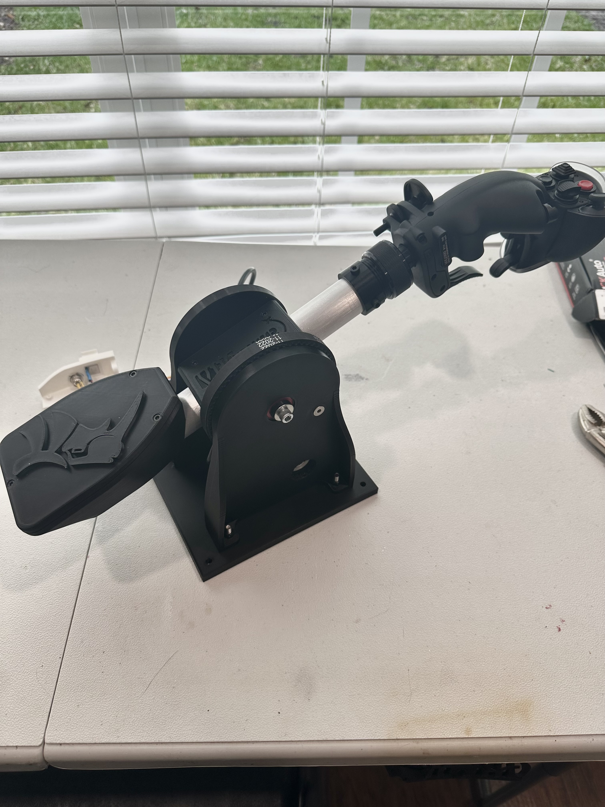

Welcome to the documentation for Number481's Force-Enabled Collective, a DIY helicopter collective stick project featuring VPforce Rhino force feedback. This page is compiled from the project thread on the VPforce Discord.

The project is intentionally called **"Force Enabled"** rather than "FFB" because, as of the project's inception, no flight simulators implement game-driven force feedback for the collective axis. The force feedback here is entirely about tactile quality — precise, smooth, damping-rich control — rather than receiving in-game signals through the stick.

!!! note
    This page is compiled from the original project thread by `Number481` on the VPforce Discord. All credit for the design and development goes to them.  
    For the original discussion, see the [Force Enabled Collective thread](https://discord.com/channels/965234441511383080/1114276706061123725) on the VPforce Discord.

### Why Force-Enable a Collective?

Number481 summarised the two primary motivations:

1. **Precision and feel** — Friction-based collectives suffer from stiction (static friction spike before movement begins). Force feedback eliminates this entirely, replacing it with smooth, programmable damping and spring feel that mimics the hydraulic resistance of a real collective.
2. **Grip flexibility** — The Rhino USB board supports commercial grips from VPforce-supported manufacturers, allowing any compatible helicopter grip to be fitted to the collective arm.

As a bonus, MSFS autopilot integration works well. On the HPG Airbus helicopters in MSFS, the "collective lock" (which holds the collective stationary until you press the trim release) operates correctly at 100% spring force.

---

## Design History

The design went through multiple revisions before reaching its current form.

### Rev-1 — Belt-and-Pulley (Original)

- **Motor:** 57BLF03
- **Drive:** Belt and pulley, **6:1 gear ratio**
- **Structure:** 3D-printed, adapted from an earlier non-FFB collective design
- **Outcome:** Functional, but suffered from slop and backlash in the printed structure. Gearing felt grainy through the handle.

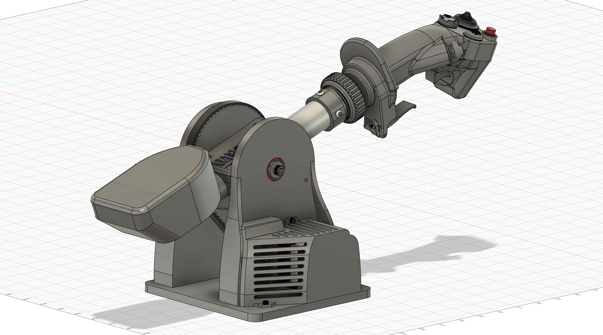

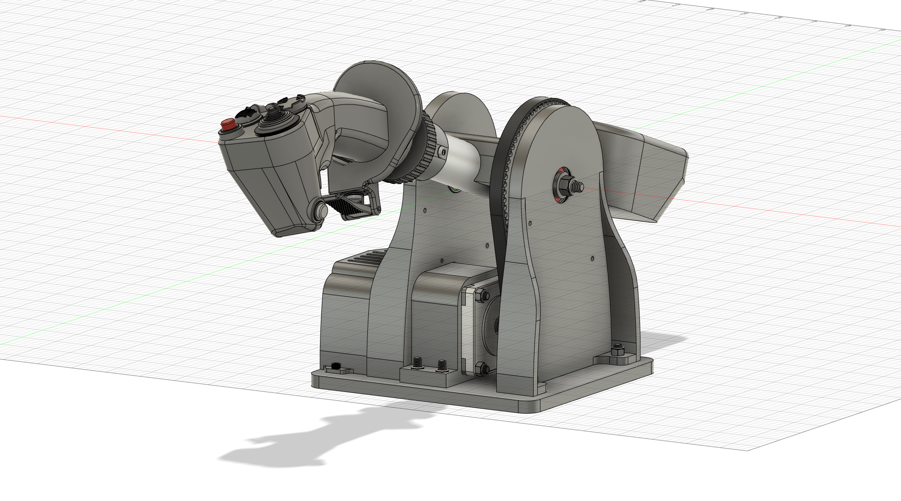

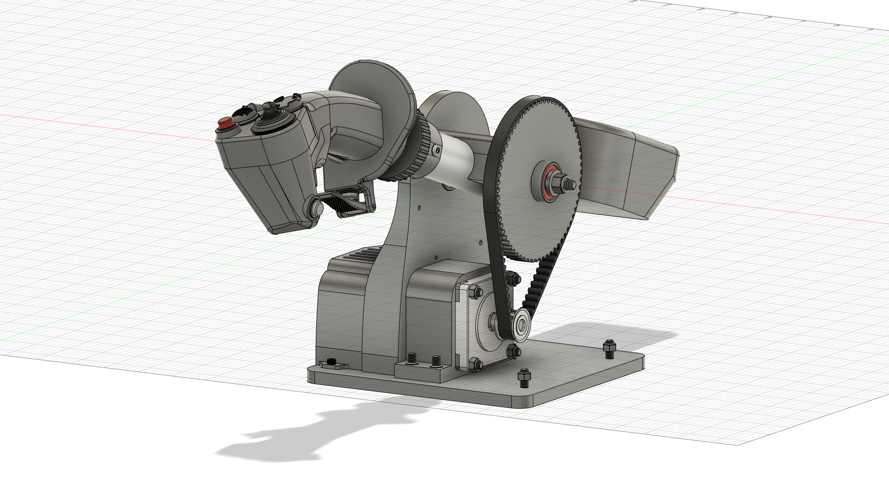

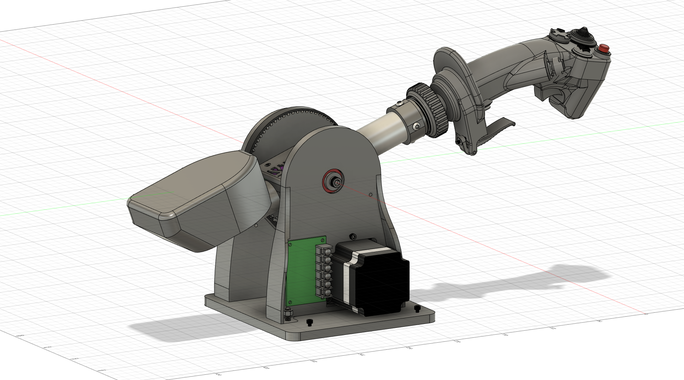

### Rev-2 and Rev-3

Iterative improvements incorporating community feedback. Both designs were shared in the VPforce Discord showcase channel before being superseded.

### Current Design — Planetary Gearbox (Recommended)

After discovering low-cost, high-quality planetary gearboxes, Number481 redesigned the collective around a direct-drive planetary reduction. This revision eliminated the backlash and simplified the overall structure.

- **Motor:** 57BLF03
- **Drive:** Direct drive through a **10:1 planetary gearbox**
- **Frame:** 2080 aluminium extrusion profile
- **Mounting:** Chair-mounted (deskpit integration via ring clamps and the extrusion frame)
- **Grip:** Virpil Alpha left-handed grip (works well); modular arm design allows swapping to other grips such as the Apache collective grip

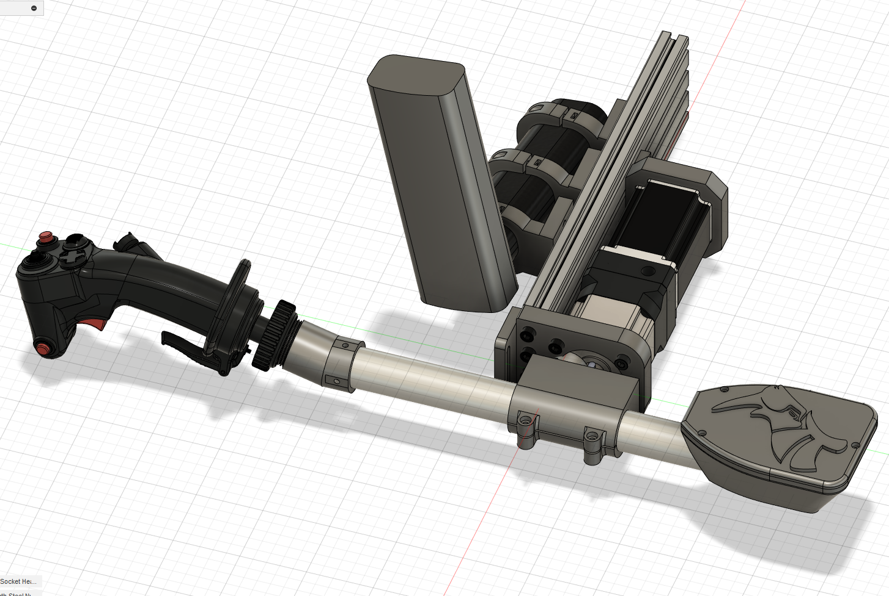

---

## Key Specifications

| Parameter | Value |
|---|---|
| Motor | 57BLF03 (single motor kit) |
| Gearbox ratio | 10:1 planetary |
| Gearbox input shaft | 8 mm (matches 57xxx series motors) |
| Gearbox output shaft | 16 mm |
| Recommended gearbox backlash | ≤ 3 arcmin |
| Frame profile | 2080 aluminium extrusion |
| Counterbalance method | Printed box filled with stick-on wheel weights |
| Grip connection | 5-pin connector to Rhino USB board (pigtail for easy swap) |

!!! warning "Backlash matters"
    A gearbox with 12 arcmin of backlash will translate to approximately **½ inch (13 mm) of handle slop** at a 24-inch arm length. Community members strongly recommend staying at **≤ 3 arcmin** for a quality result. The cheaper boxes on AliExpress typically spec 7–15 arcmin — avoid these.

---

## Bill of Materials

### Core Components

| Component | Notes |
|---|---|
| VPforce 57BLF03 single motor kit | Includes Rhino USB board |
| 10:1 planetary gearbox | 8 mm input shaft, ≤ 3 arcmin backlash — see link below |
| Flanged shaft collar | 16 mm bore (to match gearbox output shaft) |
| 2080 aluminium extrusion | Length to suit your mounting arrangement |
| T-slot nuts and bolts | For frame assembly |
| Stick-on wheel weights | For counterbalance box |

!!! tip "Recommended gearbox"
    Number481 recommends this AliExpress listing (choose **8 mm input**, **ratio 10**, confirm ≤ 3 arcmin backlash spec):  
    [Planetary Gearbox on AliExpress](https://www.aliexpress.us/item/3256801124644081.html)  
    This unit is considerably cheaper than equivalent Western-brand gearboxes (~$80 vs $800+) while maintaining sufficient precision.

### 3D-Printed Parts

All custom parts are 3D printed. The STEP assembly file is available via the Discord thread (see [Project Resources](#project-resources) below). Key printed components include:

- **Arm mount** — carries the flanged collar and connects the arm to the gearbox output shaft
- **Counterbalance weight box** — attaches to the rear of the arm; fill with stick-on wheel weights until the arm is neutrally balanced at its pivot
- **Ring clamps** — mount the extrusion frame to the chair (note: these are specific to Number481's office chair and will require adaptation)

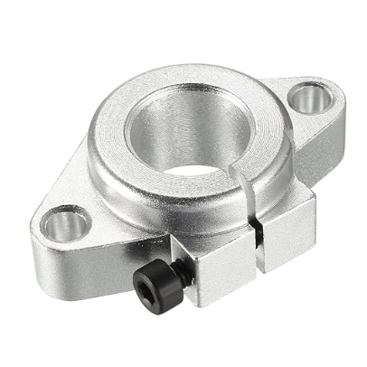

!!! note "Counterbalance tuning"
    No special calculation is needed. Print a box, add weights incrementally until the arm rests where you place it with the motor off. Stick-on wheel balancing weights work well as filler.

---

## Assembly Overview

1. **Assemble the frame** — Build the motor/gearbox subassembly onto a length of 2080 extrusion using the printed motor mount and T-slot hardware.
2. **Mount the gearbox** — Secure the planetary gearbox to the extrusion. The motor mounts directly to the gearbox input.
3. **Fit the arm** — Attach the printed arm mount to the 16 mm output shaft of the gearbox using the flanged collar. Tighten the clamp.
4. **Balance the collective** — Attach the counterbalance box to the rear of the arm and add stick-on wheel weights until the arm is neutrally balanced.
5. **Install the grip** — Connect your chosen grip to the arm. Wire the grip buttons to the Rhino USB board using a 5-pin connector. Use a pigtail termination if you want to swap grips later.
6. **Mount to your rig** — Use ring clamps or appropriate hardware to secure the extrusion to your seat/rig. The clamp geometry will depend on your specific mounting surface.
7. **Connect to the PC** — Plug in the Rhino USB board and configure using the VPforce Configurator. Collectives typically require minimal spring force — the damping effect is the primary benefit.

---

## Project Resources

Design files were shared directly in the Discord thread. There is no public GitHub repository.

- **[Discord thread: Force Enabled Collective Project](https://discord.com/channels/965234441511383080/1114276706061123725)** — the primary source for build photos, discussion, and file sharing
- **STEP assembly** — shared as a Discord attachment in [this message](https://discord.com/channels/965234441511383080/1114276706061123725/1229392831769214977) (April 2024). The ring clamps are chair-specific; the remaining parts are reusable as a starting reference.

---

## Community Builds and Variations

Several community members have built collectives based on or inspired by this project:

### Andre
Built a version with a counterbalance box similar to Number481's. Chose to solder a 5-pin connector directly to the Rhino USB board, eliminating the need for a separate USB device for the grip electronics.

### Mike T
Building a collective with an **AW109SP** (X-Trident) collective head as the centrepiece, focused on the AW109 in X-Plane. Using a belt/pulley drive and a sliding counterweight rod for easier balance adjustment. Printed counterweight box to be filled with lead shot.

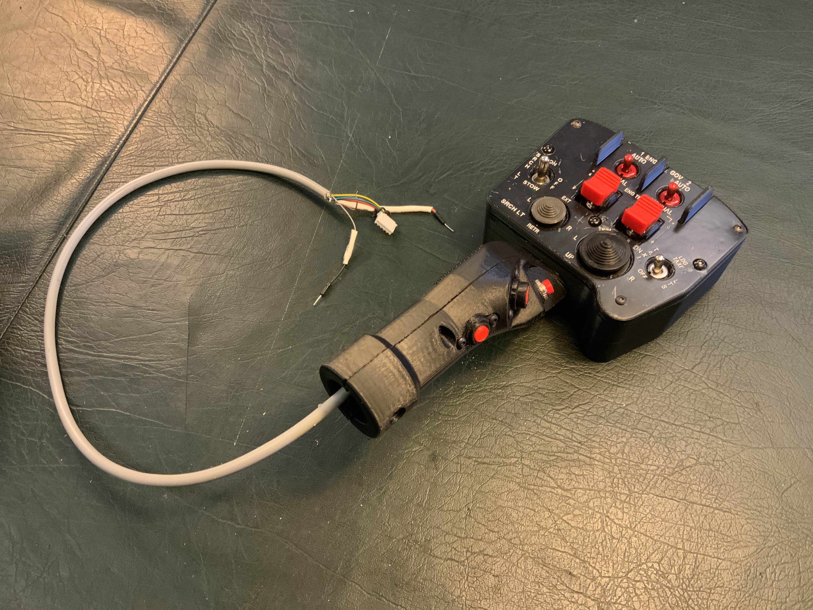

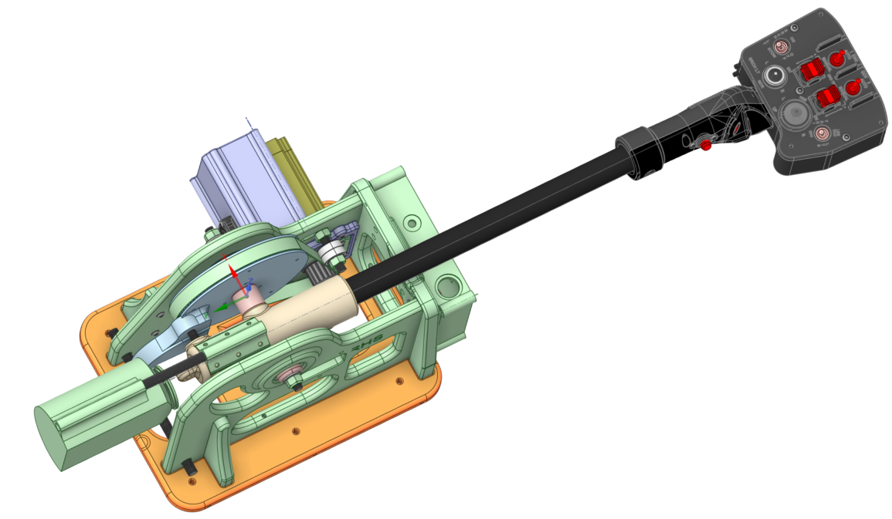

### H145Rotor-Sims
Adapted the design for the **86 series motors**, which have a 22 mm output shaft (vs 16 mm for 57 series gearboxes). Required sourcing an SHF25 collar with a bore reducer to bridge the size difference.

### Smitty
Showed an alternative lightweight approach: a $25 gearbox as the collective pivot, Teflon washer friction pack for damping, and a potentiometer jammed into the motor-side of the gearbox for position sensing. Noted that a 57 series motor could be added to this design to make it force-enabled.

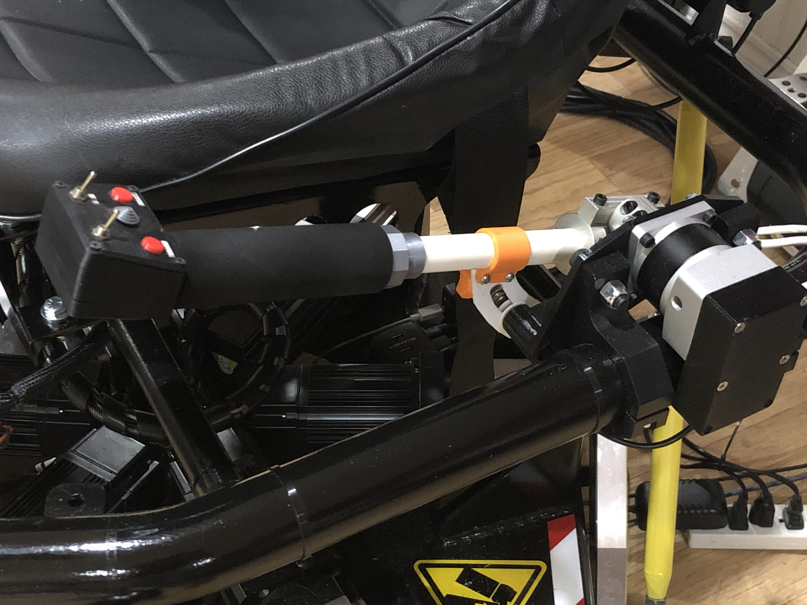

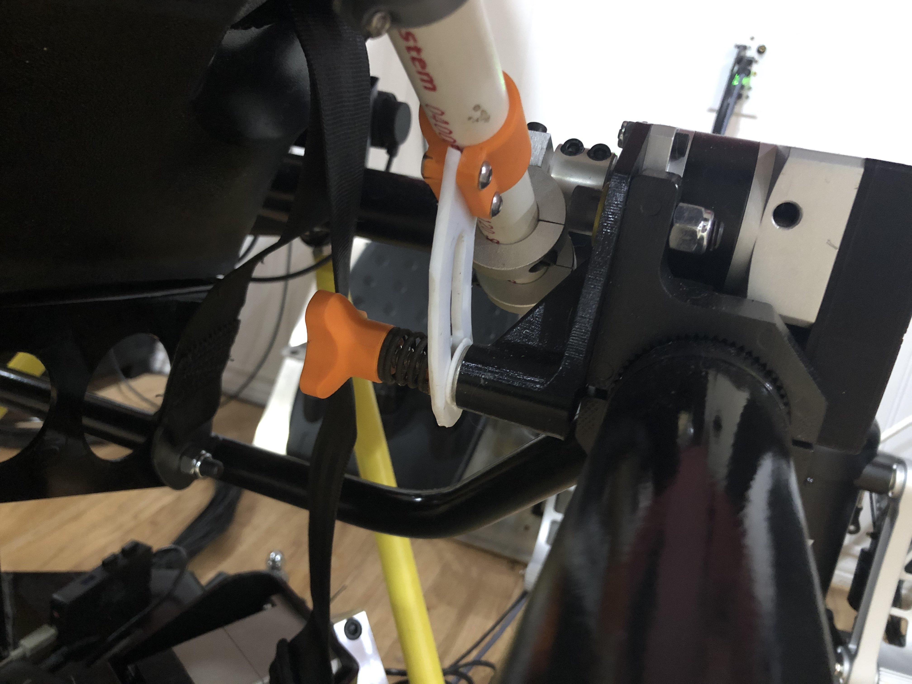

---

## FAQ

**Q: Why not just use friction and a spring like a regular collective?**  
**A:** Friction-based designs suffer from stiction — a noticeable spike in resistance when movement begins. Force feedback eliminates stiction entirely, giving a smooth, hydraulic-like feel that is more pleasant and precise. Damping strength is fully programmable.

**Q: Do any simulators actually send force feedback signals to the collective axis?**  
**A:** Not as of the project's creation. That is why the project is called "force enabled" rather than "FFB." The feedback is entirely user-configured (spring, damping, friction effects), not driven by in-sim physics.

**Q: Does autopilot collective movement work in MSFS?**  
**A:** Yes. On HPG Airbus helicopters in MSFS, the collective lock (which holds the collective until the trim release is pressed) functions correctly at 100% spring force.

**Q: How much motor force is needed for a collective?**  
**A:** Much less than for a cyclic. The 57BLF03 at 6:1 or 10:1 is more than adequate. Collectives do not need large spring forces — the primary benefit is smooth, consistent damping.

**Q: Can I use a cheaper gearbox to save money?**  
**A:** Not recommended. Cheaper planetary gearboxes typically have 7–15 arcmin of backlash. At a 24-inch arm, 12 arcmin translates to roughly half an inch of handle slop, which is very noticeable. The recommended AliExpress unit (~$80) offers ≤ 3 arcmin precision for a fraction of the cost of a comparable European or US-made unit.

**Q: Can I use the 86-series motor instead of the 57-series?**  
**A:** Yes, but the gearbox output shaft will differ in size (the 86 series motor with a 10:1 gearbox outputs a 22 mm shaft vs 16 mm for the 57 series). Shaft collars are available in both sizes, but you may need a bore reducer for some collar options.

---

## Gallery

Build photos from Number481's completed collective.

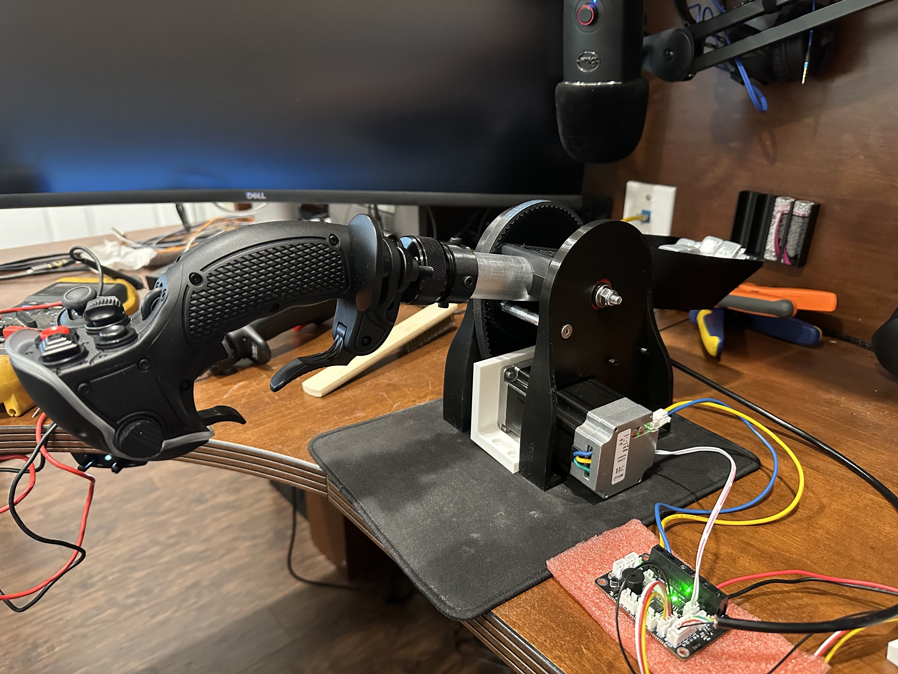

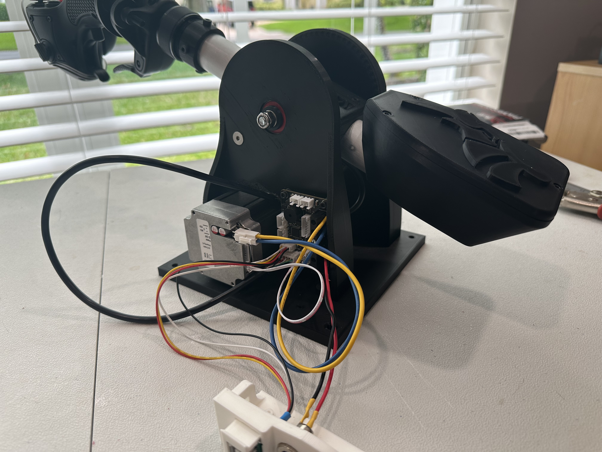

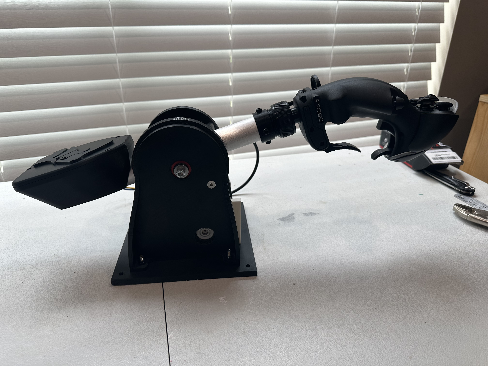

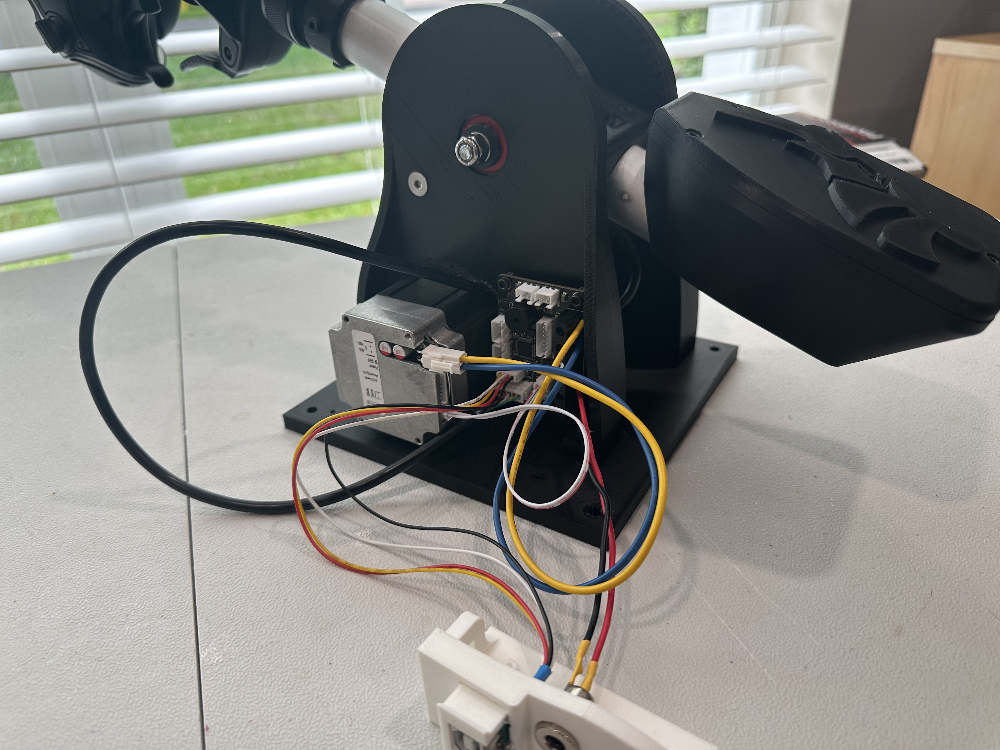

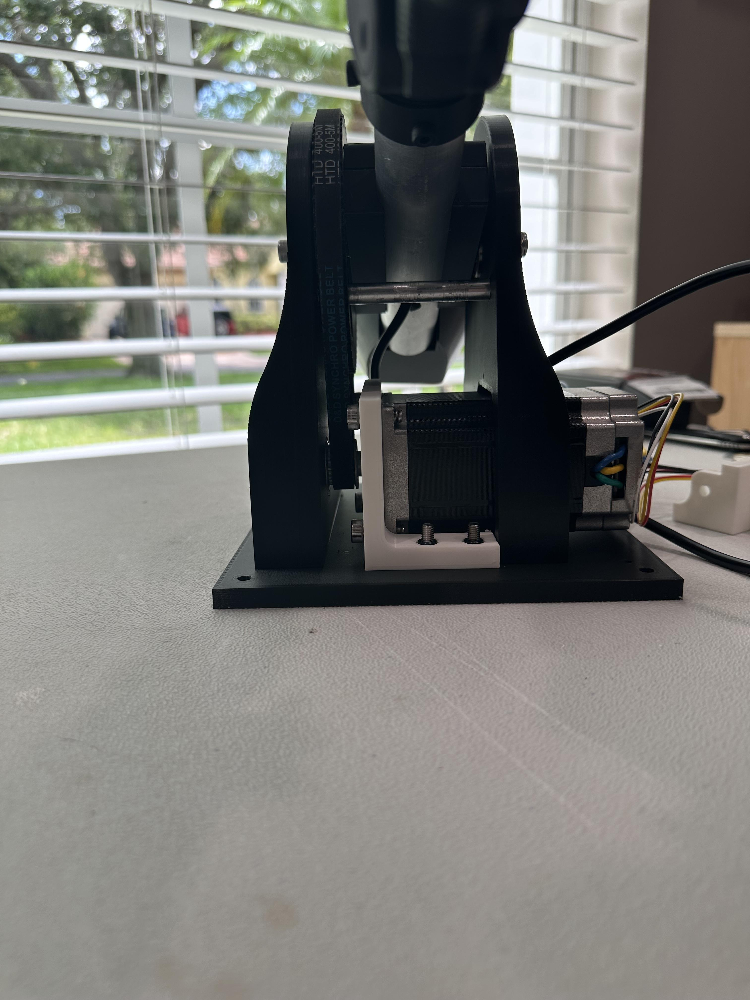

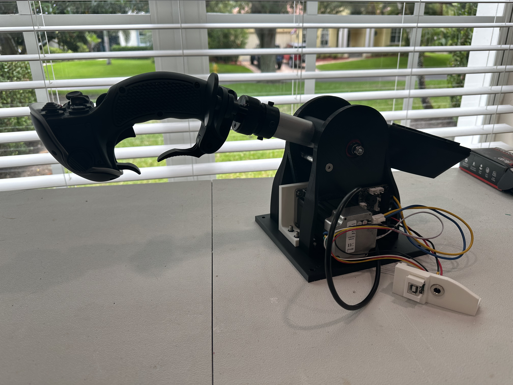

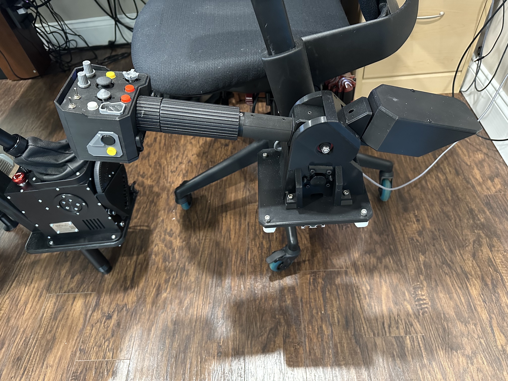
