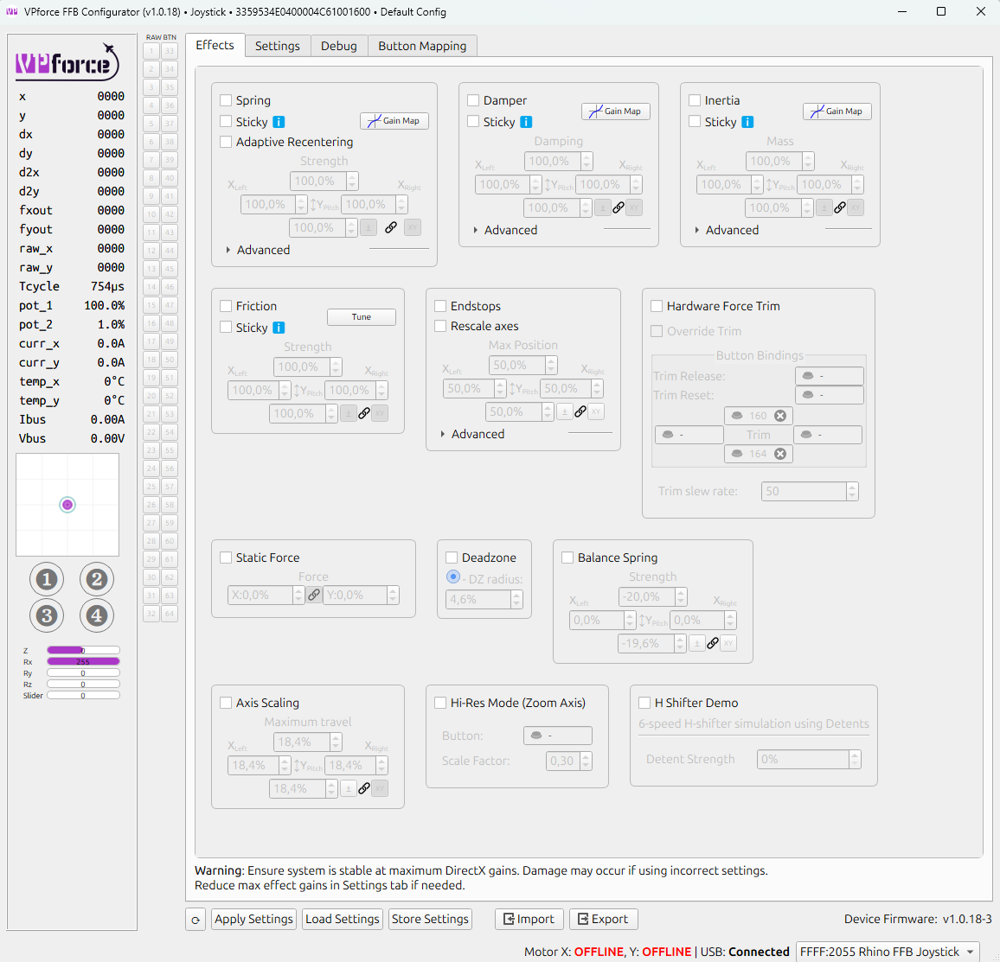
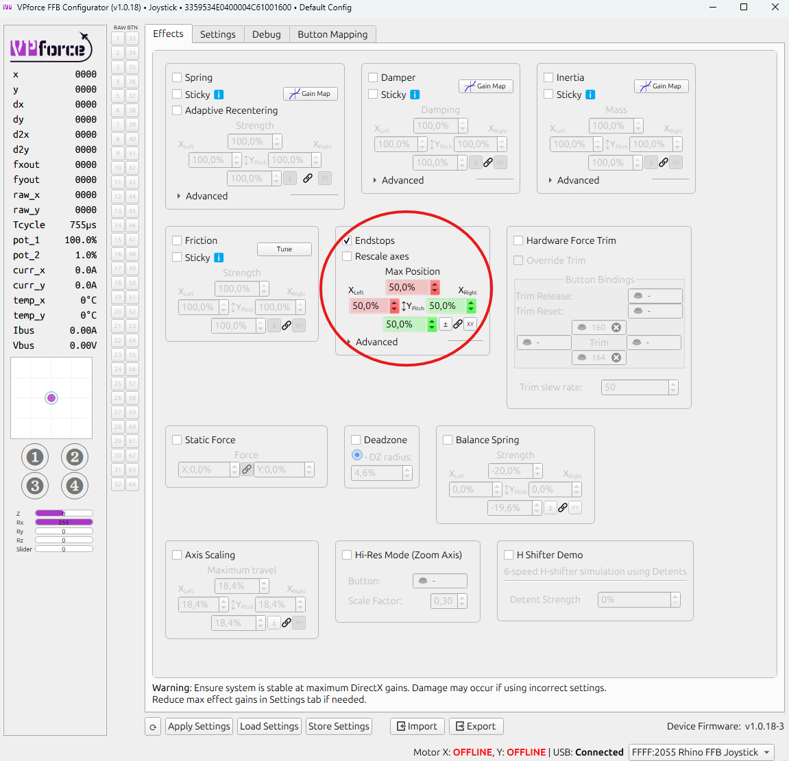
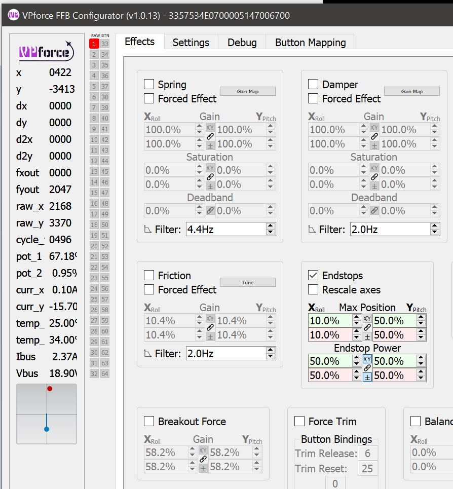
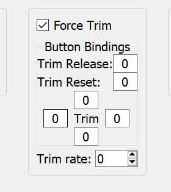
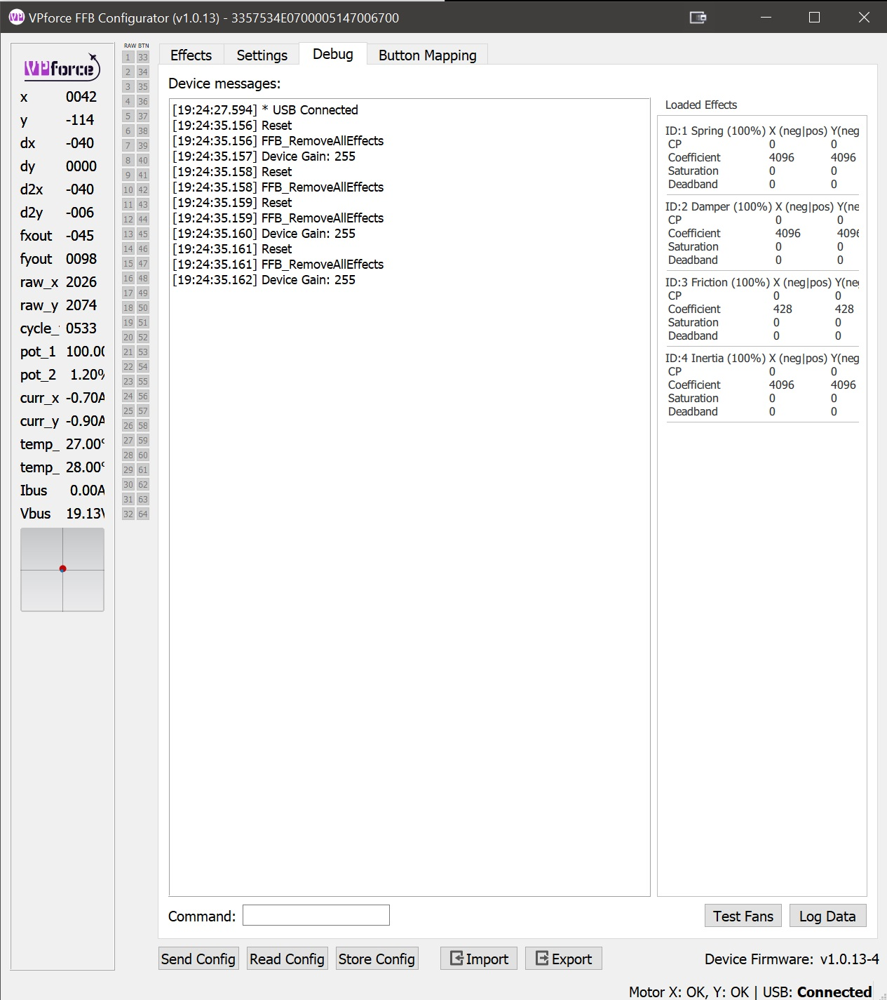
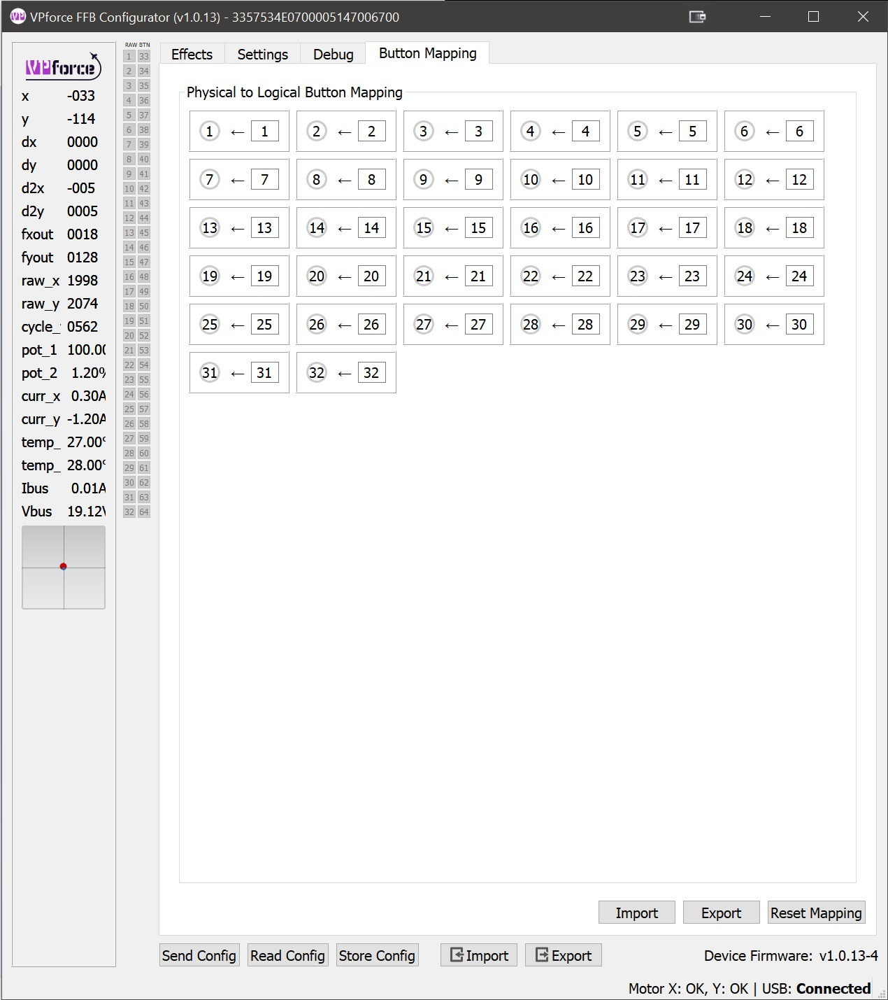
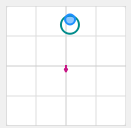

# Using the RHINO

The **VPforce RHINO** is a powerful piece of equipment - and as with most things that pack this much punch, it brings along a certain amount of complexity. RHINO doesn't try to hide that fact. Between the many different ways simulators handle force feedback, the third-party software some of them demand, and VPforce's own *telemFFB* project, things can look a little... lively. But don't worry - it's all perfectly manageable once you know which knobs to turn and which ones to leave alone. That's exactly what this document is here for.

Right out of the box, the RHINO works surprisingly well. Sure, you'll be tempted to open the configurator, slide everything to maximum, and see what happens - but take a minute to fly first. Get a feel for how force feedback behaves in your favorite sim before diving head-first into the settings. If you're new to FFB (and most pilots today are), that first flight will teach you more than a dozen sliders ever could. Plus, a little fun in the air will keep you from drowning in the ocean of options later.

This manual walks you through the **FFB Configurator**, the **RHINO Loopback** app, and the basics of **TelemFFB**, which brings advanced FFB effects to *DCS World*. You'll also find tips on using RHINO across various simulators, explanations of what the different settings actually do, and a plain-language overview of how force feedback works behind the scenes.

By the end, you'll not only have your RHINO dialed in - you'll also know *why* it feels the way it does. And that's when the real fun begins.

## Overview and Force Feedback Terminology

###  FFB Overview

Force Feedback - also known as *control loading* - is the technology that turns an ordinary joystick into something that feels convincingly alive. It applies physical resistance and motion to your controls, simulating the forces you'd feel in a real aircraft, car, or machine.

In practice, it means your stick can "push back" when you pull too hard, your pedals can feel like they're fighting air pressure, and your yoke can suddenly go light when you stall - all thanks to small but surprisingly determined motors.

Force Feedback can mimic a wide range of mechanical sensations: the stiffness of aircraft control surfaces, the suspension of a car, or even the sluggish momentum of a heavy robot arm. By linking these physical cues to what's happening in the simulation, FFB doesn't just make things more immersive - it also teaches your muscles what realism feels like.

Combined with other technologies like motion tracking or telemetry-based effects, Force Feedback helps create training tools and games that don't just look real - they *behave* real. It's equal parts engineering and magic, with a touch of physics mischief.

###  FFB Effect types

**Periodic Effects** Generate repeating waveforms that can be sinusoidal, triangular, or square. By adjusting their amplitude (strength), frequency (speed), and phase (timing), they simulate vibrations, oscillations, or pulses - from engine rumble to weapon recoil.

**Spring** Provides a centering force that increases with displacement, like stretching a spring. Used to simulate the natural pull toward neutral position - for example, the resistance you feel when deflecting aircraft controls.

**Damper** Applies resistance proportional to how fast the control is moving, similar to pushing through oil or honey. The faster you move, the stronger the resistance.

**Inertia** Simulates momentum - the tendency of a heavy object to keep moving once it starts. The control feels like it has mass and resists quick direction changes.

**Friction** Applies a steady resistance regardless of speed, like dragging the control across sandpaper (or butter, if set lightly). Useful for simulating surface contact or mechanical stiffness.

**Constant** Produces a continuous force in a fixed direction. Despite the name, it can be dynamically updated by software, allowing it to simulate everything from sustained aerodynamic pressure to the subtle pull of trim or wind.

## The VPforce Configurator Software

The **VPforce FFB Configurator** is the primary tool for configuring your Rhino's force feedback behavior. This application allows you to fine-tune everything from spring force and damping to button mappings and advanced effects.

!!! note
    Some sections below may not fully reflect the latest software version. Always refer to the in-app tooltips and latest release notes for the most up-to-date information.

### Interface Overview

The Configurator window is divided into two main areas:

**Left Pane - Real-Time Telemetry:**
Displays live data from your Rhino, including axis positions, force outputs, button states, and other diagnostic information. This real-time feedback is invaluable when tuning effects and troubleshooting issues.

**Right Pane - Configuration Tabs:**
Contains four main tabs where you can modify the Rhino's behavior:
- **Effects** - Configure individual force feedback effects
- **Settings** - Adjust global gain multipliers for all effects
- **Debug** - Access diagnostic tools and advanced settings
- **Button Mapping** - Configure button assignments and functions

###  Effects Tab

{ width="671px" height="647px" }

The **Effects Tab** is where you configure the individual force feedback effects that the Rhino generates locally. Each effect can be independently enabled or disabled using its checkbox. When enabled, the effect becomes part of the force feedback you feel during use.

!!! important "Effects Tab vs Simulator Control"
    Effects configured here are active when no simulator is running or when a simulator doesn't override them. When a game or simulator sends its own FFB commands, it can selectively override specific effect types while leaving others active.

#### Available Effects

- **Spring Effect** - Generates a centering force that behaves like a physical spring, pulling the joystick back toward its center position. The further you move from center, the stronger the pull becomes. This is the foundation of most force feedback experiences.
    - **Common Parameters:**

        - **Gain:** Overall strength multiplier for the effect (0-100%)
        - **Saturation:** Maximum output level as a percentage of total available force
        - **Deadband:** Range near the center where no force is applied, useful for creating a "dead zone"

- **Damper Effect** - Simulates resistance similar to moving the joystick through a viscous fluid like oil or honey. The faster you move the stick, the stronger the opposing force becomes. This effect adds a sense of weight and prevents overly twitchy movements.

- **Inertia Effect** - Simulates momentum and mass, making the joystick resist changes in motion. When you start moving the stick, it feels like it wants to continue moving in that direction. This creates a sense of physical mass and realistic control inertia.

- **Friction Effect** - Simulates a constant, static resistance to movement, similar to dragging the joystick through a mechanical friction joint or over a rough surface. Unlike damper, friction force is constant regardless of speed.

- **Endstops** - Generates a firm resistance when the joystick reaches a defined boundary, preventing further movement. The endstop parameters can be adjusted in the green and red boxes under the **End Stops** section of the page.

{ width="671px" height="648px" }

In the example above, the endstops are configured at **50% of Y-axis travel** in both directions, with **50% of the maximum available force** applied at each endstop. Each direction is represented by a different colored box: **green** for pushing the stick *toward* you, and **red** for pulling it *away from* you.

With this setup, the stick moves freely for about half of its travel in either direction - offering no resistance at all. It feels completely limp until it reaches the halfway point. Once there, a firm resistance begins to build.

In the small graph at the lower left of the picture, the **red dot** represents stick displacement, while the **blue circle** shows the force vector generated by the motors. In this case, the red dot sits halfway forward (where resistance starts), and the blue dot remains centered, indicating that the motors are just beginning to push back.

If you continue to push the stick further into the resistance zone, the red dot advances toward the end of its range. The motors respond by applying up to **half of their maximum force**, pushing firmly against your input - just as the graph below illustrates.

{ width="572px" height="617px" }

If the rescale axes box is checked, then the joystick will tell the computer it has reached full excursion when it reaches an endstop. Below you can see this as the red dot has moved to the limit of the little box. However, the blue dot is still centered because the motors are not doing anything.

{ width="624px" height="671px" }

**Constant Force**

Produces a continuous force in a fixed direction. While the name suggests it's unchanging, this effect can be dynamically updated by software to simulate sustained forces like aerodynamic pressure, G-forces, or control surface loading.

**Breakout Force**

Simulates the initial resistance or "stiction" that must be overcome before a control begins to move. This mimics mechanical systems where static friction is higher than dynamic friction - like breaking free from a tight bearing or hydraulic valve.

**Hardware Force Trim**

{ width="280px" height="315px" }

This setting enables hardware-based force trim functionality, particularly useful for helicopter simulation. When enabled:

- The four fields surrounding the word 'Trim' are button assignments for **pitch** and **roll** trim adjustment
- A **trim release** button can be configured to temporarily disable the trim and return control to manual input
- The trim system works by dynamically adjusting the spring center point, allowing you to "hold" a position without constant input

This is essential for realistic helicopter flight where force trim is a standard feature that allows pilots to reduce control forces during sustained maneuvers.

**Balance Spring**

The Balance Spring feature compensates for grip weight and extension length to prevent the stick from sagging or drifting when trimmed at an angle. This is covered in detail in **Section 3.4 - Balancing the Grip**.

###  Settings Tab

{ width="624px" height="702px" }

The **Settings Tab** provides global gain multipliers (master volume controls) for each force feedback effect type. These sliders act as maximum force limiters that apply to **all** effects - whether they come from the Configurator, a game, or TelemFFB.

#### How Settings Work

Each slider controls the maximum output percentage for its corresponding effect type. The actual force you feel is calculated as:

**Final Force = (Effect Gain) × (Settings Multiplier)**

**Example:**
- Spring effect set to 50% in Effects tab
- Spring slider set to 50% in Settings tab
- **Result:** You'll feel 25% of maximum spring force (0.50 × 0.50 = 0.25)

#### Key Differences from Effects Tab

- **Effects Tab:** Configures local effects and their individual parameters
- **Settings Tab:** Sets universal maximum limits that **always** apply, regardless of source

Think of the Effects tab as setting "what effects are available and how they behave," while the Settings tab sets "how strong they're allowed to be overall."

!!! tip "Quick Adjustment Strategy"
    Use the Settings tab for quick, global adjustments to overall force levels without losing your carefully tuned effect configurations in the Effects tab. This is particularly useful when switching between different aircraft or flight styles.

#### Grip Type Selection and Calibration

Inside the Settings tab, you'll find a **Grip Type** dropdown menu. This allows you to select the type of grip connected to your Rhino (e.g., VKB, Virpil, Loopback, or other supported grips).

!!! tip
    Clicking the colored box allows yout to set the LED color for the grip if supported.

**Accessing Calibration Settings:**

Once you've selected a grip type, click on the **"Grip"** label or expander to reveal the calibration interface for that specific grip. This section allows you to calibrate and configure individual axes on your grip.

**Axis Calibration Widget:**

Each axis (brake, rudder, etc.) has its own calibration row with the following components:

- **Axis Name:** Identifies which axis is being calibrated (e.g., "Thumb X Axis", "Thumb Y Axis", "Brake")

- **Raw Value:** Displays the current raw sensor reading from the axis in real-time. This value updates as you move the control, showing the unprocessed input from the sensor.

- **Min:** Sets the minimum calibration value for the axis range. Adjust this to define where 0% begins.

- **Max:** Sets the maximum calibration value for the axis range. Adjust this to define where 100% ends.

- **Calibrate Button:** Activates the automatic calibration mode:

    - Click to enable calibration mode
    - Move the axis through its full range of motion (from one extreme to the other)
    - The min/max values will automatically update to capture the full travel range
    - Click again to deactivate the button and exit calibration mode
    - Click **Store Config** when finished to apply and store the new calibration

- **Center Button (C):** Readjusts the calibration values so that the current stick position becomes the new center point. Useful for correcting center offset without recalibrating the entire range.

**Calibration Workflow:**

1. **Select your grip type** from the dropdown
2. **Expand the Grip section** to access calibration controls
3. **Click "Calibrate"** for the axis you want to calibrate
4. **Move the axis** through its complete range of motion (full deflection in all directions)
5. **Verify** that the min/max values have been captured correctly
6. **Click "Send Config"** to save the calibration to the device
7. **Test** the axis movement to ensure proper range and centering

!!! tip "When to Calibrate"
    - After installing a new grip
    - If you notice reduced axis range or dead zones
    - When the center position has drifted
    - After swapping between different grips

!!! note "Multiple Axes"
    Some grips may have additional axes like brake or twist axis. Each axis can be calibrated independently using the same process.

#### Understanding the Relationship: Effects Tab vs Settings Tab

The interaction between these two tabs is crucial to understanding how your Rhino behaves:

**Effects Tab - Local Effect Configuration:**
- Enables and tunes effects generated by the Configurator itself
- Active when no simulator is running
- Individual effects can be selectively overridden by simulators
- Example: If a game creates its own spring effect, only the spring from the Effects tab is disabled - other effects (damper, friction, etc.) remain active

**Settings Tab - Global Force Limiters:**
- Sets maximum force output for each effect type as percentage multipliers
- Acts as a global cap on **all** effects, regardless of source
- Always applies, whether effects come from Configurator, simulator, or TelemFFB
- Example: If "Spring" slider is set to 80%, any spring force from any source is limited to 80% of potential strength

**TelemFFB Integration:**

TelemFFB can also override individual effects in the same way a simulator does, replacing only the specific effect types it controls while leaving others active.

**Quick Reference:**

| Aspect | Effects Tab | Settings Tab |
|--------|-------------|--------------|
| **Purpose** | Configure local effects | Set maximum force limits |
| **Scope** | Only Configurator-generated effects | All effects from any source |
| **Override Behavior** | Can be overridden by simulator | Always applies as final limiter |
| **Use Case** | Fine-tune effect behavior | Quick global adjustments |

!!! example "Practical Example"
    You've configured a perfect spring effect at 70% gain in the Effects tab, and set damper at 40%. In the Settings tab, you have Spring at 100% and Damper at 80%.
    
    - **No simulator running:** You feel 70% spring and 40% damper
    - **DCS running with native FFB:** DCS controls the spring (your 70% is ignored), but your 40% damper remains active, limited by the 80% Settings multiplier (= 32% final damper)
    - **Settings adjustment:** Lower Spring slider to 50% in Settings - now any spring force (DCS or local) is halved

###  Debug Tab

{ width="514px" height="579px" }

The **Debug Tab** is your window into the Rhino's internal operations, providing real-time monitoring, diagnostic tools, and troubleshooting capabilities. This tab is essential for understanding what's happening under the hood and resolving issues.

#### Main Features

**1. Device Log Output**

A real-time console displaying messages, warnings, and errors from the Rhino's firmware. This log is invaluable for:

* Tracking system events and state changes
* Identifying error conditions and faults
* Monitoring USB communication status
* Debugging configuration issues

**2. Effect Monitor**

The Effect Monitor provides a live view of all currently loaded FFB effects, showing:

- **Effect Status:** Active or Inactive state for each effect
- **Parameter Values:** Real-time display of current gain, saturation, direction, and other parameters
- **Source Indicators:** Badge showing the origin of each effect:
    - **Configurator:** Effects generated by the VPforce FFB Configurator
    - **Game:** Effects sent by the simulator or game
    - **telemFFB:** Effects generated by the TelemFFB application

This monitor helps you understand which effects are active at any moment and where they're coming from - crucial for troubleshooting FFB behavior and conflicts.

**3. Diagnostic Tools**

The Debug tab includes several utility functions:

- **Fan Test:** Manually activate cooling fans to verify operation
- **Data Logging:** Capture detailed telemetry and diagnostic data for support tickets
- **Motor Reset:** Reset motor controllers to clear fault states or recover from errors
- **Command Pane:** Direct access to low-level device commands for advanced diagnostics and configuration

#### Use Cases

- **Troubleshooting FFB Issues:** Check which effects are active and their source when behavior seems wrong
- **Performance Monitoring:** Watch effect parameters change in real-time during gameplay
- **Support Requests:** Capture logs and diagnostic data to help support teams identify issues
- **Effect Conflicts:** Identify when multiple sources (game, telemFFB, Configurator) are trying to control the same effect type

!!! warning "Advanced Features"
    The Command Pane and some diagnostic functions are intended for advanced users or support-guided troubleshooting. Incorrect commands can temporarily affect device behavior until reset.

### Button Mapping Tab

{ width="624px" height="702px" }

The **Button Mapping Tab** allows you to configure how buttons on your grip are recognized and mapped by the system. This is where you can:

- **Assign Button Functions:** Map physical buttons to specific button numbers recognized by games
- **Test Inputs:** Verify that button presses are being detected correctly

## The RhinoLoopback Application

### Purpose and Overview

**RhinoLoopback** is a utility application that bridges button inputs from external controllers to the VPforce FFB Configurator. This is particularly useful when using grips that connect via passthrough cables (such as VKB grips) or when you want to use a separate controller to operate Rhino-specific features like *Hardware Force Trim*.

### Common Use Cases

- **VKB Grips:** Using VKB grips connected via passthrough cable with the Configurator's hardware force trim feature
- **External Controllers:** Mapping buttons from gamepads or other devices to control Rhino functions
- **Flexible Configurations:** Allowing button assignments without rewiring or changing physical connections

### Setup Instructions

**Step 1: Launch the Application**

1. Navigate to the folder where you extracted **VPforce_FFB_Configurator_vx.x.xx.zip**
2. Run **RhinoLoopback.exe** - a configuration window will appear

**Step 2: Configure Devices**

1. **Input Device:** Select the controller whose buttons you want to use (e.g., *VKBsim Gunfighter MCG Ultimate*, gamepad, or any other HID device)
2. **Output Device:** Select your Rhino (usually the only device listed)

**Step 3: Enable Loopback Mode**

1. Keep the RhinoLoopback application **running** - it must stay open for loopback to function
2. In the VPforce FFB Configurator, go to the **Settings** tab
3. Set **Grip Type** to **Loopback**

**Step 4: Configure Button Mappings**

Once loopback is active, the FFB Configurator will recognize and allow you to map buttons from your selected input device. You can now assign these buttons to functions like hardware force trim, mode switches, or other Configurator features.

!!! tip "Tip: Keep It Running"
    RhinoLoopback must remain running in the background for button inputs to be passed through to the Configurator. You can minimize it, but don't close it.

!!! note "Note: Multiple Devices"
    If you have multiple Rhino devices or controllers, ensure you select the correct pairing in the dropdowns to avoid confusion.

### Command Line Options

*RhinoLoopback* supports several command line options for advanced users:

- `--profile <name>` : Load a specific configuration profile eg. one could setup different device configurations for joystick and for collective. The default profile is named `default`.

## Balancing the Grip

### Understanding the Problem

When using heavier grips or extension pieces, you may notice the joystick sagging or drifting when trimmed at an angle. This happens because gravity creates additional torque that must be counteracted to hold the stick in position.

**The Physics:**
- Standard spring force is proportional to displacement from center
- A heavy grip at an angle creates constant downward torque
- The stick "falls" slightly until spring force balances the weight
- This drift is most noticeable with weaker spring settings

###  Balance Spring Feature

The **Balance Spring** feature, found in the VPforce Configurator, compensates for grip weight and orientation by applying directional bias forces. This allows you to achieve perfect trim performance regardless of grip weight or extension length.

{ width="131px" height="128px" }

{ width="138px" height="129px" }

!!! note
    Before adjusting the *"Balance Spring"* settings, it's crucial to disable Spring/Damper/Friction/Inertia effects. This ensures that adjustments made to the balance spring force settings are accurately reflected without interference from the other effects.

###  Adjusting Balance Spring Settings

**Preparation:**

Before adjusting the Balance Spring, it's crucial to temporarily disable other force effects to get accurate results:

1. In the VPforce Configurator **Effects** tab, disable:

   - Spring
   - Damper
   - Friction
   - Inertia

2. This ensures your Balance Spring adjustments aren't masked by other forces

**Configuration Steps:**

Locate the "Balance Spring" section in the Effects tab. You'll see four directional strength controls:

{ width="242px" height="149px" }

**Directional Adjustments:**

- **Left/Right:** Compensates for side-to-side imbalance
    - Increase if the stick sags to one side when released at angle
    - Typical causes: Offset grip mounting, heavy side panels, or asymmetric extensions

- **Forward:** Compensates for front-heavy configurations
    - Increase if the stick tilts forward when released
    - Common with grips that have heavy front modules or long forward extensions

- **Backward:** Compensates for rear-heavy configurations
    - Increase if the stick tilts backward when released
    - Typical with grips that extend behind the base mounting point

**Tuning Process:**

1. **Test at Multiple Angles:** Move the stick to various positions (forward, back, left, right, and diagonals)
2. **Release and Observe:** Let go of the stick and watch which direction it drifts
3. **Adjust Incrementally:** Make small adjustments to the appropriate directional value
4. **Re-test:** Repeat steps 1-3 until the stick holds position reliably at all angles
5. **Re-enable Effects:** Once satisfied, turn your Spring/Damper/Friction/Inertia effects back on

!!! tip "Finding the Sweet Spot"
    Start with small adjustments (5-10% changes) and work your way up. It's easier to add more compensation than to undo excessive correction. The goal is for the stick to stay exactly where you leave it when released at any angle.

### Adaptive Recentering

{ width="265px" height="201px" }

**Adaptive Recentering** is an intelligent system that works alongside Balance Spring to achieve even more precise trim positions. While Balance Spring provides static compensation, Adaptive Recentering dynamically adjusts forces to minimize positioning errors.

#### How It Works

The system continuously monitors the difference between:
- The **commanded position** (where the trim or spring center is set)
- The **actual stick position** (where the stick physically is)

When it detects a discrepancy, it slowly applies corrective force to bring the stick exactly to the commanded position. This correction happens gradually to avoid sudden jerks or oscillations.

#### Compatibility

Adaptive Recentering works with any **Spring-class effects** from:
- DirectX games with native FFB support
- TelemFFB-generated spring effects
- Configurator local spring effects

#### Limitations and Considerations

**Authority Limits:**
- The system's corrective force is limited by current spring strength
- At low spring settings (below ~30%), it may lack sufficient authority to fully correct positioning errors
- In these cases, proper Balance Spring configuration is essential

**Best Practice:**
- Configure Balance Spring first to handle the majority of static weight compensation
- Enable Adaptive Recentering to handle fine adjustments and dynamic corrections
- Use moderate to high spring strengths for optimal Adaptive Recentering performance

!!! note "Note: Complementary Features"
    Think of Balance Spring as your coarse adjustment and Adaptive Recentering as your fine tuner. Balance Spring handles the predictable weight-based forces, while Adaptive Recentering corrects for minor errors and dynamic factors.

### Static Force

{ width="268px" height="117px" }

**Static Force** applies a constant directional force, similar to attaching a rubber band that continuously pulls in one direction. This setting is particularly useful for extreme weight imbalances or specialized applications.

#### When to Use Static Force

**Heavy Weight Imbalance:**

- Stick is significantly front-heavy or rear-heavy
- Balance Spring alone isn't providing enough compensation
- You need a constant pull to counteract persistent drift

**Specialized Applications:**

- Simulating counterbalance springs in custom FFB collectives
- Creating intentional force bias for specific aircraft types
- Compensating for unusual mounting angles or configurations

#### Configuration

Static Force can be set to positive or negative values:
- **Positive values:** Apply force in the defined direction
- **Negative values:** Apply force in the opposite direction
- **Magnitude:** Determines the strength of the constant force

!!! tip "Tip: Collective Builders"
    When building a custom FFB collective, Static Force is invaluable for simulating the counterbalance springs found in real helicopter collectives. These springs help the collective "float" at a set position rather than falling to the bottom under its own weight.

!!! warning "Warning: Use Sparingly"
    Static Force applies continuously, which means it's always consuming motor authority and generating heat. Use only as much as needed and prefer Balance Spring adjustments when possible.

## Thermal Management

The Rhino's two servo motors generate significant thermal energy during continuous operation, particularly under sustained high forces or extended flight sessions. Understanding how thermal buildup occurs and how to manage it will help you get the most out of your device.

### How the Motors Heat Up

The Rhino's motors operate at stall speed, holding torque against your input rather than spinning freely. 
In this mode, nearly all the electrical power supplied to the motors is converted directly into heat through winding resistance. 
Specifically, the heat generated by the motors follows the formula $P = I^2R$, meaning the power dissipated as heat increases with the square of the current (and therefore the torque). This squared relationship means that even small increases in force demand can lead to much higher heat buildup.
With a typical power draw of 150W from the supply, much of this becomes thermal energy in the motor windings rather than mechanical motion.

Each motor in the Rhino converts electrical energy into mechanical force. 
However, the power budget works differently than in motion-based systems - most input power becomes winding heat due to the stall-speed operating mode. 
Under high force demands or continuous operation, this heat accumulates faster than it naturally dissipates, causing the motor temperature to rise.

When you apply strong force feedback effects - such as sustained aerodynamic pressure on the stick or prolonged dogfights - the motors draw more current and generate more heat. Similarly, extended flight sessions where the motors are constantly engaged will cause gradual thermal buildup. 

As motor temperature increases, the device automatically manages thermal stress by gradually reducing available torque output to maintain a sustainable power dissipation equilibrium. This allows the system to continue operating without risk of damage, though you will notice reduced force feedback intensity as the motors approach their thermal limits. Once the motors cool sufficiently, full torque output returns.

### Built-in Cooling System

The Rhino includes an active cooling system with two fans that automatically engage when the motor temperature reaches 50°C. These fans draw air through the base to dissipate heat from the motors and internal components. As long as the fans have adequate airflow, they will effectively manage thermal buildup during normal use.

### Optimizing Cooling Performance

To ensure the cooling system works at its best:

-   **Maintain clearance around the base:** Position the Rhino so there is adequate space around it, particularly around the sides and bottom where air enters and exits. Avoid placing it flush against walls or enclosures that restrict airflow.
-   **Keep vents clear:** Periodically check that dust and debris are not blocking the fan vents on the base. A gentle clean with compressed air or a soft brush can help maintain airflow efficiency.
-   **Ensure proper ventilation:** If you use the Rhino in an enclosed cockpit or sim rig, make sure the area has reasonable ambient air circulation. Placing it in a hot or poorly ventilated space will make thermal management more difficult.
-   **Consider ambient temperature:** On warm days or in hot rooms, the motors will reach their operating temperature more quickly. This is normal and not a cause for concern, but be aware that sustained heavy use in a warm environment may result in the fans running continuously.

### Managing Thermal Load During Use

If you find the Rhino is throttling heavily or the fans are running constantly, consider these strategies:

-   **Reduce Master Gain:** Lowering the overall output gain reduces the work the motors must do and generates less heat. You can still achieve realistic force feedback at lower gain settings.
-   **Take breaks:** Extended sessions with high forces naturally accumulate heat. Short breaks allow the system to cool down and perform optimally when you resume.
-   **Balance effect strengths:** Rather than maxing out all force effects, tune them individually to realistic levels. Lighter, more refined effects often feel better than brute force and are easier on the hardware.

The fans are designed to handle normal operation, and you will rarely need to worry about thermal management during typical use. The built-in protection system ensures the device will never damage itself through overheating - but understanding how cooling works helps you get the best performance and longevity from your Rhino.