# VPforce TelemFFB Application

TelemFFB is an open source community-driven Python/Qt based application which takes telemetry from a simulator and uses that telemetry to produce various effects.

The latest version can always be downloaded from the repository release page here:
[*https://github.com/walmis/VPforce-TelemFFB/releases*](https://github.com/walmis/VPforce-TelemFFB/releases)

Supported simulators:

-   DCS World
-   Microsoft Flight Simulator
-   IL-2 Sturmovik
-   X-Plane 11/12
-   Beta support for Falcon BMS (4.38+)

For **DCS** and **IL-2**, which support native FFB, the TelemFFB app is primarily leveraged to implement certain effects like gunfire, engine rumble and helicopter ETL shaking (among many others). However, there are some additional 'FFB type' effects which are implemented such as deceleration force and g-loading effect.

For **MSFS** and **X-Plane**, which ***do not*** have native FFB support, TelemFFB also implements dynamic axis FFB in addition to most of the effects previously mentioned for DCS.

**Falcon BMS** sits somewhere in between. While the game does support native FFB with limited native effects, the primary F-16 aircraft is fly-by-wire and as such does not have any traditional "force feedback" on its flight stick. TelemFFB implements several haptic style effects (gunfire, buffeting, etc) to augment immersion.

### TelemFFB 2.0 - New Features and functionality

Version 2.0 of TelemFFB, released in October 2025, is a major upgrade from the previous versions. Updated/New features include, but are not limited to:

-   New UI framework supporting dark/light mode themes

-   Completely new offline/class/sim default editor interface

-   Multiple aircraft profile support for the same sim/aircraft combination

-   Aircraft profile import/export

-   Advanced spring-curve mapping for custom dynamic spring force configuration

-   New effects

-   Beta support for Falcon BMS

    -   Basic effects are functional. Little testing has been performed given this developer's lack of experience with BMS.

    -   There are likely many effect settings which are not properly plumbed or the effect does not work as expected due to limited/non-existent telemetry data

    -   The more people use it and report feedback, the better it will become

### Upgrading from previous TelemFFB Versions

When you load TelemFFB 2.0 for the first time, your existing TelemFFB settings file (userconfig.xml) will be upgraded to the new v2 format. The following conversions will take place:

-   All existing user aircraft settings will be converted into user profiles. The auto-created user profiles are called "Auto User". You may rename the profiles after the conversion process via the Profiles-\>Profile Manager interface.

-   Any user defined aircraft that do not have a default profile will become "User Default" aircraft. While you can create further custom profiles based on these User Default entries, you can not rename User Default.

-   Configurations that previously had multiple toggle flags to configure different versions of the same thing have been converted into pulldown options to enable a specific setting and show the appropriate sub settings. An example of this is the spring mode for MSFS. Previously you could enable "FBW" or "Spring Centered (non FBW)" but these were two separate toggles that needed to be manually enabled/disabled. The new pull-down options allow you to select the appropriate top level setting which will then only show the corresponding sub settings.

There is no further action required to upgrade to version 2.0.

## TelemFFB and Antivirus Software

### Why Antivirus Software May Flag This Application

This application is packaged using[ ](https://pyinstaller.org/)[***PyInstaller***](https://pyinstaller.org/), a tool that bundles Python applications into standalone Windows executables. Occasionally, Windows Defender or other antivirus software may flag the generated .exe file as potentially malicious. This is a common issue across many open-source and independent software projects and **does not mean the application is unsafe**.

**4.1.2 What Causes False Positives?**

There are a few key reasons why antivirus software might misidentify
the executable:

1.  **Heuristic Scanning** Security suites often use heuristic analysis to flag behaviors typical of malware (e.g., dynamic imports, compressed binaries, network or file system access). PyInstaller-packaged apps often exhibit similar patterns due to how Python and its libraries are bundled.

2.  **Bundled Dependencies** This app includes numerous open-source Python libraries, which are all extracted and compiled into a single executable. This results in a large and complex binary - sometimes resembling known malware in structure - especially when compression or UPX is used.

3.  **Lack of Widespread Use or Code Signing** Applications that are new or not widely installed are more likely to be flagged. Additionally, because this application is not signed with a commercial code signing certificate, Windows may mark it as "unrecognized" or "unknown publisher," increasing suspicion.

4.  **Frequent Builds** Every build generates a slightly different binary (even without code changes), which antivirus vendors haven't yet seen. As a result, they may temporarily flag it until it's verified as safe by more users.

**How We Ensure Safety**

-   All source code is openly available and auditable.
-   Dependencies are widely used Python packages from the [](https://pypi.org/)[*Python Package Index (PyPI)*](https://pypi.org/).
-   Builds are produced in a clean environment to prevent contamination.

**What You Can Do**

-   **Allow the app manually** if it's flagged and you trust the source.
-   **Submit the executable to Microsoft or your antivirus vendor** for review. This helps improve detection accuracy over time.
-   **Check with **[](https://www.virustotal.com/)[**VirusTotal**](https://www.virustotal.com/) to independently verify whether the file is flagged across multiple engines.

## The TelemFFB Configuration

There are two locations where user configuration settings are stored for TelemFFB.

**System Settings:**

The system settings are stored in the registry at:

-    **HKEY_CURRENT_USER\\Software\\VPforce\\TelemFFB**

**User Aircraft Settings:**

The user aircraft/profile settings are stored in the user appdata folder located at:

-   **%LOCALAPPDATA%\\VPForce-TelemFFB**

More detail on the system settings and user configuration are given below.

**System Settings**

It is not advisable to manually edit the registry, however it is useful to know where the settings are stored. All of the settings configured in the System-\>System Settings menu are stored in this location.

**User Aircraft Profiles/Configurations**

TelemFFB uses an xml based configuration model. There is a default configuration file bundled with the application that defines all of the available configuration settings for all simulators and aircrafts as well as the default values for any given sim/aircraft class combination. There are also a large number of default aircraft profiles available across all of the supported simulators.

The user configuration is a "delta" based configuration file. Only those settings that have been modified from the default values for the sim/class/aircraft are added to the user configuration. If a particular setting has not been modified in the user profile, the values from the default configuration file are used.

## How it works

TelemFFB started out its life as not much more than a haptic effect generator driven by telemetry, originally only for DCS. It started out by adding supplemental effects such as engine rumble and gunfire on top of the native force feedback effects supported directly by the simulator.

It has grown since then into a highly configurable, feature rich application supporting not only supplemental haptic effects but also full dynamic FFB modeling for simulators such as Microsoft Flight Simulator (20/24) and X-Plane that do not have **any **native FFB support.

In general, TelemFFB leverages telemetry that is available from a given simulator and uses that telemetry to create various types of effects based on real-time analysis of said telemetry.

In practice, it is more complicated and depends largely on the simulator. However, it can be mostly broken down into two categories: Simulators ***with ***native FFB support and those ***without***.

**Sims with native FFB**

-   This includes **DCS**, **IL-2** and, to some extent, **BMS**. For these simulators, TelemFFB is primarily a haptics and supplemental effects generator. While there are overrides that a user can implement to use TelemFFB to manage the dynamic spring effect, the native game-supplied spring effect is typically used most of the time. This means that the game is managing the spring effect, while TelemFFB would be adding additional effects on top.

-   For these simulators, by default, the spring effect, including trim/autopilot following is managed wholly by the game itself.

**Sims without native FFB**

-   This includes both **Microsoft Flight Simulator** as well as **X-Plane**. Fortunately both of these titles have much more rich telemetry than the others and have sufficient data to implement not just simple speed based dynamic spring, but spring loading that is based on calculated dynamic pressure throughout the aircraft speed envelope as defined by the telemetry data.
-   For these simulators, the **entire** FFB implementation is handled by the TelemFFB application

### Understanding Native DCS FFB, TelemFFB, and VPforce Configurator

To effectively use TelemFFB, it is important to understand how native simulator FFB effects, TelemFFB effects, and VPforce Configurator device settings interact with one another.

#### Native DCS FFB Effects

DCS sends native force feedback effects directly to your FFB device without any involvement from TelemFFB. These effects vary by aircraft module and typically include:

- **Aerodynamic buffeting** - Stall buffet, AoA buffeting, and other aerodynamic shaking
- **Dynamic stick forces** - Changes in control resistance based on airspeed and flight conditions (Typically warbirds, Mig-21, etc.)
- **Overspeed buffeting** - Shaking when aircraft exceeds safe speeds (Su-25T)

!!! important
    DCS native FFB effects will work even if TelemFFB is not running, provided your device driver and VPforce Configurator are properly installed.

Module-specific FFB implementation varies. Eagle Dynamics does not publish a comprehensive list of native FFB effects per-module, so discovery typically requires testing in the aircraft itself or consulting module-specific community resources and forums.

#### TelemFFB Effects: Supplemental vs. Override

TelemFFB operates in one of two ways relative to native DCS FFB:

**Supplemental Mode (Default)**

- TelemFFB adds additional effects on top of native DCS FFB effects
- Native DCS effects (spring, buffeting, etc.) continue unmodified from the simulator
- TelemFFB contributes new effects like engine rumble customization, gunfire enhancement, helicopter ETL shaking, and other telemetry-driven effects
- Both the simulator and TelemFFB are generating forces simultaneously on the device

**Override Mode (Optional)**

- TelemFFB can be configured to take control of certain effects, particularly spring management
- When override is enabled for an effect, TelemFFB's implementation replaces the native DCS effect
- This is useful when you want to customize how forces feel beyond what DCS provides by default
- Overrides are configured on a per-aircraft basis in TelemFFB's settings

#### VPforce Configurator Device Settings

VPforce Configurator controls how your physical device responds to **all** incoming FFB commands, whether they originate from DCS or TelemFFB. These device-level settings include:

- **Spring Gain** - Overall strength of spring/centering forces
- **Damper** - Resistance and smoothing of stick movement
- **Inertia** - Rotational inertia of the stick
- **Friction** - Static friction when the stick is moving
- **Master Gain** - Overall FFB intensity multiplier

!!! important "Critical Point"
    Adjusting VPforce Configurator gains affects **all** FFB effects equally. If you increase spring gain in Configurator, both native DCS spring forces and any TelemFFB-generated spring forces become proportionally stronger or weaker.

#### Signal Flow: From Simulator to Device

```
DCS Simulator
    ↓ (native FFB effects)
    +─→ FFB Device (via OS/driver)
        └─→ VPforce Configurator settings applied
                ↓
                Physical motor output

TelemFFB (if running)
    ↓ (supplemental/override effects)
    +─→ FFB Device (via OS/driver)
        └─→ VPforce Configurator settings applied
                ↓
                Physical motor output (combines with DCS effects)
```

Both DCS and TelemFFB send their force commands to the same device. The device receives all commands and applies VPforce Configurator settings (gains, damping, etc.) to determine the final motor behavior.

#### Testing Without TelemFFB

To experience and evaluate native DCS FFB effects without any TelemFFB customization:

1. Close TelemFFB entirely
2. Verify your VPforce Configurator device settings are configured appropriately
3. Start DCS and load the aircraft/module you want to test
4. Reproduce flight conditions (stall, high-G turns, gunfire, landing, etc.)
5. Observe and evaluate the native FFB behavior
6. Adjust VPforce Configurator gains and apply (not store) to see how device settings affect the feel

This baseline understanding of native DCS behavior will help you make informed decisions about which TelemFFB customizations are useful for your preferences.

#### When TelemFFB is Running

When TelemFFB is running and connected to a loaded aircraft:

- Native DCS FFB effects continue to be sent to the device
- TelemFFB simultaneously adds or (if configured) overrides specific effects
- VPforce Configurator settings shape how all incoming FFB commands are rendered on the device
- Changing a TelemFFB setting takes effect nearly immediately (slight delay while the application processes the adjustment)

TelemFFB can also dynamically push VPforce Configurator profiles or individual gain overrides to your device. These changes affect how subsequent FFB commands from both DCS and TelemFFB are rendered.

#### Monitoring DCS vs TelemFFB Effects Using the Configurator Debug Tab

VPforce Configurator includes a debug tab that displays all FFB effects being sent to your device in real-time. Each effect is labeled with an effect ID and includes a source badge that identifies where the effect originates.

**Effect Source Badges:**

The debug tab displays source badges for each effect:

- **configurator** - Effects generated by VPforce Configurator device firmware (reserved effects with ID ≤ 4)
- **game** - Effects generated by DCS (native FFB effects with ID > 4)
- **telemFFB** - Effects generated by the TelemFFB application

These badges make it easy to quickly identify which system is responsible for each effect without needing to manually reference effect IDs.

**Testing Procedure:**

To isolate and observe native DCS FFB effects without TelemFFB interference:

1. Close TelemFFB completely
2. Open VPforce Configurator and navigate to the debug tab
3. Start DCS and load the aircraft/module you want to test
4. In the debug tab, you will see effects appearing in real-time as you fly
5. Look for effects with the **game** badge—these are native DCS effects that demonstrate what the simulator provides by default
6. Reproduce specific flight conditions (stall, high-G maneuvers, gunfire, landing) to observe corresponding effects
7. Note which DCS effects are active and their behavior with your current VPforce Configurator settings

**With TelemFFB Running:**

When you restart TelemFFB after completing your DCS-only testing:

- The debug tab will show effects with all three source badges: **configurator**, **game**, and **telemFFB**
- Effects with the **telemFFB** badge are supplemental effects added by TelemFFB
- You can compare the effect list before and after TelemFFB is running to understand what supplemental effects TelemFFB adds
- This helps you make informed decisions about which TelemFFB customizations enhance your experience

!!! tip
    Save a screenshot or note of the effect IDs you see in the debug tab while running DCS alone. This baseline reference makes it easier to identify TelemFFB-specific effects when you enable TelemFFB later.

## First-Time Setup

**New Installations:**

TelemFFB does not have an installer. It is distributed as a zip file package. Simply download the latest version from the [*GitHub Releases*](https://github.com/walmis/VPforce-TelemFFB/releases) page and extract it where you want the application to reside.

The first time you install and launch TelemFFB, you will be greeted by the system settings window. Follow the guidelines in the ***systems setting section*** for setting up TelemFFB.

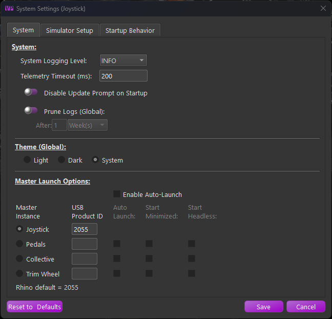{ width="587px" height="563px" }

## General Application Overview

TelemFFB is laid out with a menu bar, the application status area, device status/selection area and the various tabs at the bottom. Refer to the sections below for details on each.

{ width="565px" height="600px" }

## The Menus

### System Menu

-   **System Settings** - covered ***here***

-   **Open Config/Log directory** - opens the folder in your user local appdata where logs and settings are stored

-   **Reset Window Size/Position** - resets the window sizes to default. TelemFFB will remember and store the window size and position across executions of the application.

-   **Quit TelemFFB** - closes the application and stops all effects.

### Profiles Menu

-   **Profile Manager**

    -   Launches the aircraft profile manager. From here you can add, clone, rename, export, import, edit or delete user created aircraft profiles

    -   See ***Profile Manager*** documentation

-   **Offline Profile\\Sim Default\\Class Default editor**

    -   Puts the application into offline editing mode. While in offline editing mode, telemetry is paused.

    -   See ***Offline Manager*** documentation


### Utilities Menu

-   **Reset all Effects** - Reset the VPforce device and clean up any lingering effects. **Note: Is destructive to any active effects being generated by a simulator.**

-   **Install Latest TelemFFB** - Start the auto-update process. Only active if an update is available and the update prompt is disabled or was dismissed on startup.

-   **Download Other Versions** - opens a webpage where you can select legacy versions to download.

-   **Reset User Config** - Removes all user configured settings from TelemFFB and reverts to 'factory defaults' for all effects settings. Note that when this is executed, a date-time stamped backup of the existing user configuration is saved in the TelemFFB folder in AppData/Local

-   **Launch VPForce Configurator** - Cross launches the VPforce
    configurator app to set up your device

### Window Menu

The window menu only shows if the TelemFFB instance is acting as the master instance for other VPforce devices (pedals, collective, etc)

-   **Show Child Instance Windows**

    -   Forces the child instance device windows to become visible if they are hidden/minimized

-   **Hide Child Instance Windows**

    -   Re-hides the child instance device windows.

### Log Menu

-   **Open Console Log**

    -   Open the log window for the instance of TelemFFB

-   **Open Child Console** (if more than one VPforce device is in use)

    -   Opens the log window for the selected child device instance of TelemFFB

### Help Menu

-   **Release Notes** - shows any release notes for this version of TelemFFB

-   **Documentation** - opens this manual

-   **Create Support Bundle** - Opens a file dialog and creates a zip file containing your TelemFFB system settings, any user settings you have stored, and your Log folder..

## System Settings

In the System Menu, choose System Settings:
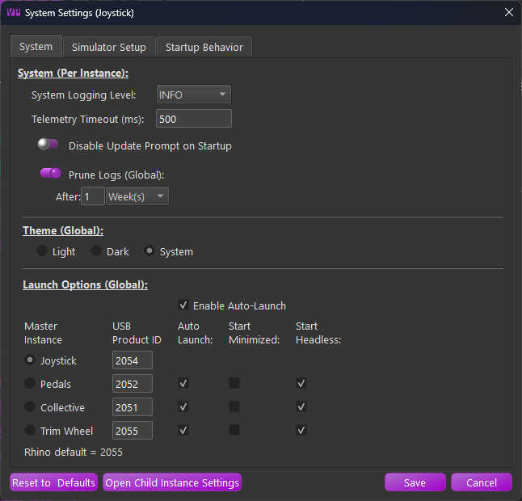{ width="549px" height="527px" }

### System Page

### System

These settings are unique per device instance of TelemFFB

-   **System Logging Level**

    -   Control the logging level for an instance of TelemFFB

-   **Telemetry Timeout**

    -   Control the telemetry timeout value for an instance of TelemFFB

-   **Update Prompt Control**

    -   Enable/Disable the new-update prompt for an instance of TelemFFB when starting up.

-   **Prune Logs**

    -   Enable log pruning. Archived log zip files that are older than the configured threshold will be automatically deleted upon TelemFFB startup.

### Theme Options

!!! note
    The Theme Options are global and are only visible in the Master instance of TelemFFB

-   **Light** - Use the light color palette theme
-   **Dark**- Use the dark color palette theme
-   **System** (default) - Use the Windows system defined app theme dark/light mode

### Launch Options

!!! note
The Launch Options are global and are only visible in the Master instance of TelemFFB

These settings are global for any instance of TelemFFB and affect how the application starts up and communicates with one or more FFB devices.

-   **Enable Auto-Launch**

    -   Tick this checkbox to enable the auto-launch feature which will start multiple instances of TelemFFB to communicate with multiple FFB devices. See the section on ***running with multiple FFB*** devices for details.

-   **Master Instance Radio Buttons**

    -   Independently of the auto-launch feature, the selected radio button defines the device that TelemFFB will connect to when it is launched.

    -   When combined with the auto-launch feature, the selected device will act as the master instance for any additional spawned instances of TelemFFB.

-   **USB Product ID**

    -   Enter the USB Product ID that is configured for a given device (as configured in VPforce FFB Configurator)

-   **Instance Auto Launch Options**

    -   Auto Launch

        -   Enable or disable auto-launching of an instance when the master instance loads.

    -   Start Minimized

        -   Start the selected instance with its window minimized

    -   Start Headless

        -   Start the selected instance with its window hidden (can be revealed from the master instance **window** menu)

### Simulator Setup Page

These settings are global for any instance of TelemFFB.

#### DCS

-   **Enable**
    -   Enable/disable support for DCS

-   **Auto DCS Setup**

    -   When enabled, TelemFFB will automatically add entries into the DCS export script in the users save games folder structure. It will also copy the export script DLL package into the DCS save games folder

#### Microsoft Flight Simulator (20/24)

-   **Enable**

    -   Enable/disable support for MSFS.

    -   No further configuration is required

#### X-Plane (11/12)

-   **Enable**

    -   Enable/disable support for X-Plane

-   **Auto X-Plane setup**

    -   When enabled, TelemFFB will automatically install the custom telemetry plugin to the configured X-Plane installation path

-   **X-Plane Install Path**

    -   As there is no registry entry to discover the installed path for X-Plane, browse for and select the root X-Plane install path. This is required for the auto setup script to succeed

#### IL-2 Sturmovik

-   **Enable**

    -   Enable/disable support for IL-2

-   **Pause IL2 Effects on Focus Loss**

    -   When enabled, TelemFFB will enter a pause state when focus is lost on the IL2 game window. (Enabled by default)

!!! note
    While disabling can aid in adjusting effects in real time, when the IL2 window loses focus, it also loses all inputs. **This may result in odd behavior and stuck effects while the window is out of focus**

-   **Auto IL-2 Telemetry Setup**

    -   If enabled, TelemFFB will automatically set up the required configuration in IL2 to support telemetry export

-   **IL-2 Install Path**

    -   As there is no registry entry to discover the installed path for IL-2, browse for and select the root IL-2 install path. This is required for the auto setup script to succeed

#### BMS (Beta support)

-   **Enable**

    -   Enable/disable support for BMS.

    -   No further configuration is required

### Startup Behavior Page

#### Startup Behavior

-   **Start with Windows (Global, Master Only)**

    -   When enabled, an entry will be added to the Windows registry
        that will start TelemFFB automatically when Windows starts

    -   **Note: **Only available with the EXE distribution of TelemFFB.
        This option will be disabled when running from source

-   **Start in System Tray (Global, Master Only)**

    -   When enabled, TelemFFB will start up minimized to the system
        tray. The main window can be recalled by double-clicking the
        system tray icon or from the right-click context menu on the
        system tray icon.

    -   Note: This is mutually exclusive with the Start Minimized
        option. Only one or the other may be enabled

-   **Start Minimized (Global, Master Only)**

    -   When enabled, TelemFFB will start with its main window visible,
        but minimized to the taskbar.

    -   Note: This is mutually exclusive with the Start in System Tray
        option. Only one or the other may be enabled

-   **Closing App Sends to Tray (Global, Master Only)**

    -   When enabled, pressing the window close button will simply
        minimize the application to the system tray.

    -   You can fully exit TelemFFB from the System menu or from the
        right-click context menu on the system tray icon.

These settings are unique per instance of TelemFFB

-   **Restore Window Position**

    -   When enabled, TelemFFB will remember where the window was positioned the last time it was run and restore the window to that same position

-   **Restore Last Tab View**

    -   When enabled, TelemFFB will remember the window size for each tab the last time it was run. It will also restore these sizes and remember the last tab that was viewed the last time it was run.

#### Configurator Profile Options

-   **VPForce Configurator Profiles**

    -   Define a profile to load on TelemFFB startup and/or exit

    -   See the section on ***Dynamic Configurator Profiles*** for more details

## Application Main Window

### Active Devices Area

{ width="371px" height="137px" }

The active devices area is both a way to switch the master instance configuration scope between devices as well as a device/instance status tracker for the primary and child devices and their TelemFFB instances.

###  Switching Between Devices:

To switch between devices for configuration, simply click on the appropriate device icon. When clicked, the configuration elements in the settings page below will update to reflect the settings for that device.

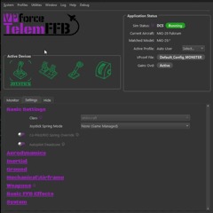{ width="329px" height="329px" }

### Device/Instance Status Indications

The device icons serve the dual purpose of displaying the status of both the device connection as well as the individual TelemFFB instances which are ultimately controlling the multiple devices.

**Green Status Icon:**

{ width="55px" height="55px" }

A green status icon indicates that the device is properly connected to its instance of TelemFFB and the child instance of TelemFFB is healthy

**Yellow Status Icon:**

{ width="47px" height="53px" }

A yellow status icon indicates that the device is no longer connected to its instance of TelemFFB

**Red Status Icon:**

{ width="54px" height="54px" }

A red status icon indicates that the child instance of TelemFFB has crashed, or there is an error condition present for that instance.

### Application Status Area

{ width="304px" height="264px" }

-   **Sim Status**

    -   Shows the currently connected simulator and the active status

    -   Possible Status'

        -   **Waiting **- No telemetry has been received from any enabled simulator

        -   **Running **- Sim is connected and Telemetry is flowing

        -   **Paused **- Telemetry is no longer being received from the connected simulator and/or the simulator is in a paused state

        -   **Error **- A configuration error condition is present.
            Generally, there will be an error status message displayed indicating what the error is and how to resolve it.

-   **Current Aircraft**

    -   Displays the name of the aircraft as received in the telemetry and the profile

-   **Matched Model**

    -   Displays the match string that correlates to the aircraft profile that has been loaded for the detected aircraft

-   **Active Profile**

    -   Displays the actively selected user profile name

-   **VPconf File (if dynamic VPconf files are in use):**

    -   Displays the name of the last vpconf file that was pushed to the device

-   **Gains Ovd:**

    -   Shows active status if the Configurator Gains Override setting is in use and active.

### Hide Tab

The Hide tab is the simplest and reduces information shown to the bare minimum:

{ width="525px" height="291px" }

### Monitor Tab

The Monitor tab shows received telemetry data and effects that are
currently active:

{ width="516px" height="548px" }

>You can also detach the monitor tab from the main window and display it separately along side the main TelemFFB window. This can be useful for monitoring the active effects while you are making adjustments on the settings tab.


### Settings Tab

The Settings tab allows you to edit all possible forces and effects for the current aircraft loaded in the simulator. This section describes the interface, details about each setting are in other parts of the manual. Changing any setting has an immediate effect.

{ width="606px" height="644px" }

The effects setting page has multiple sections with settings grouped together by logical effect type. The categories are defined as follows:

-   **Basic**

    -   Basic effects primarily consist of spring related configurations. This is where you will find settings like the joystick spring mode and various in-game spring override settings

-   **Aerodynamics**

    -   These effects are typically related to aerodynamic conditions such as AoA, stall buffeting, elevator droop, ETL, VRS, overspeed, etc.

-   **Inertial**

    -   Inertial effects are those that are related to acceleration vector data such as the g-force effect, and deceleration effect

-   **Ground**

    -   Ground effect types will be related to the aircraft interaction with the surface. Effects such as ground rumble and the touchdown effect can be found here

-   **Mechanical\\Airframe**

    -   These effects typically are related to mechanical aspects of the aircraft such as gear, flaps, canopy motion.

-   **Weapons**

    -   Here you will find the settings for weapon based effects for combat simulators

-   **Basic FFB Effects**

    -   These effects are not telemetry driven. In this section you can enable and configure basic FFB effects such as dampening, friction and inertia

-   **System**

    -   The system section has non-effect based configurations such as configurator gain overrides, dynamic vpconf profile selection and other settings that can be configured per-aircraft.

### Modifying settings in real time

Effect sliders have a toggle to enable or disable that effect. You can quickly toggle on/off an effect. When the setting is off, your intensity setting is retained. **The handle will also turn green when that effect is active**.

Example

{ width="594px" height="45px" }

Some settings have additional parameters. You will see an expander button next to them and a clickable hyperlink for the effect name. **Click the expander** **or the hyperlink** to see additional settings, and again to collapse:

{ width="628px" height="106px" }

Any setting you have modified will show a 'x' icon on the right side. You can **click this icon** to return the setting to the default:

{ width="629px" height="115px" }

If you have a setting that you would like to apply to all aircraft of the same class, or for the entire sim, you can right-click on the delete button and choose to move the setting up to the class default or the sim default level. Once you have done so, an information icon will be visible where the delete button was, indicating that the setting has an override from defaults at the sim or class level. Hovering over the information icon will display the override level.

{ width="680px" height="75px" }

For settings where a unit is used, there is a dropdown of acceptable units:

{ width="566px" height="106px" }

Some settings require a grip button assignment before use. **Click the button** on the screen and then press the desired grip button before the timer expires:

{ width="638px" height="105px" }

Once the button is set, you can right-click on the X to apply to class or sim as shown above if you use the same grip and button for other aircraft.

## System Tray

When TelemFFB starts, a system tray icon with a context menu is added to the windows taskbar. By default, the icon will be accessible from the expander button in the system tray. You may choose to drag the icon into the pinned icon areas of your task bar so that it is always visible.

{ width="247px" height="166px" }

You can force the TelemFFB window to show by double-clicking the icon or from the context menu.

When you start a simulator, the system tray icon will change colors to indicate the current status of the sim, very similar to the status indicator icons in the main TelemFFB window.

*{ width="20px" height="20px" }*

*{ width="20px" height="20px" }*

*{ width="20px" height="20px" }*

<center>There will also be a system
    tray notification with the error information and the error message
    will be visible on the TelemFFB main window.</center>

### System Tray Context Menu

Right-clicking on the system tray icon will open the context window. There are several items.

{ width="163px" height="131px" }

-   **Show Window**

    -   Forces the TelemFFB window to show itself if it is hidden and also come to the front if it is minimized or hidden by other windows.

-   **Options**

    -   Provides options for toggling the Start to / Close to tray options. These toggles are identical to the checkboxes in the system settings page. If you change the options here, they will take effect immediately and you will see the change reflected in the system settings.

-   **Instances**

    -   If you are running with multiple VPforce devices, this menu will have options to explicitly show the window for each of the additional instances of TelemFFB

-   **Quit TelemFFB**

    -   Exits the application

## Adding New Aircraft Support

While TelemFFB has default profiles for many aircraft already, there are many hundreds of possible aircraft between all of the simulators that are supported. So, inevitably you will run into an aircraft that does not already have a built-in profile.

There are two ways to add support for new or unknown aircraft to TelemFFB:

- Dynamically when a new aircraft is loaded in a simulator
- Via the Profile Manager, independent of any running sim

### Accessing the New Aircraft Dialog

#### Dynamically from Main Window (Recommended)

If you are actively using a simulator and you load into an aircraft that does not have a default settings profile, you will see a reduced set of effects and a large "create new aircraft" button will appear. This method is preferred over the offline editor since TelemFFB will already know the proper name string for the aircraft.

Simply click on the "Create/clone config for new aircraft" button to launch the new aircraft wizard.

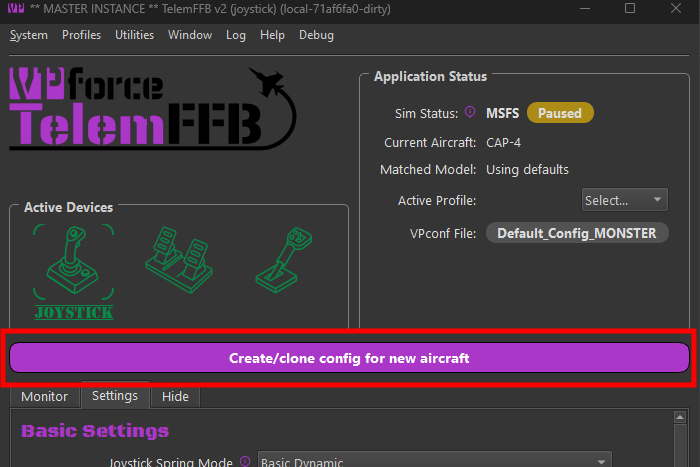{ width="396px" height="264px" }

#### Adding new Aircraft via Profile Manager (not recommended)

Open the Profile Manager.

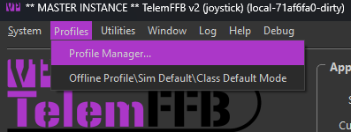{ width="335px" height="126px" }

In the resulting Profile Manager window, select the "New Aircraft Wizard" button. Again, this method of adding new aircraft is **NOT** recommended as it is difficult to know the exact string that TelemFFB will ultimately receive via the telemetry from a given simulator.

{ width="415px" height="353px" }

### The Add New Aircraft Wizard

After accessing the wizard via one of the two methods above, simply follow the steps in the wizard to add the new aircraft.

**Page 1:**

1. **If manually adding a new aircraft**, select the simulator on the first page.

**Page 2:**

1. Select the appropriate aircraft class for the aircraft you are adding.
    - Note that for MSFS, the aircraft type will be auto-detected based on telemetry data. However, you should validate that the selection is correct.
    - This is particularly important for aircraft types with special treatment in MSFS, such as those from **HPG**, **FlyInside**, **CowanSim**, and others. These will be auto-detected as their base aircraft type, but the TelemFFB aircraft class needs to be configured properly to achieve full functionality for these aircraft.

**Page 3:**

1. **If manually adding a new aircraft**, enter the full aircraft name that will be sent via telemetry from the simulator.
    - If auto-detected, this will already be filled out for you.
2. Enter a regex match string for the aircraft. TelemFFB uses regex to match the aircraft string and apply the matching profile. Many aircraft, particularly in MSFS, have a base string followed by per-livery or variant text. To use the same profile for multiple variations or liveries, the match string must encompass all possible variations of the name.
    - You may manually enter a match string, or choose from one of the recommended pre-built match strings.
3. Optional: Clone from existing aircraft.
    - You may choose to clone the new aircraft from an existing aircraft already known by TelemFFB.
    - Note: For some aircraft with special treatment in TelemFFB (such as HPG helicopters), it is mandatory to clone the configuration from one of the default profiles.

## Offline/Global Sim/Class Configuration

TelemFFB 2.0 offers a vastly improved offline and sim/class override configuration system. Rather than the clunky old offline manager, configuration is done in the main window just like the real-time per-aircraft configurations. To access the offline mode, choose the **Offline/Class Default/Sim Default** option from the **Profiles** menu.

{ width="467px" height="581px" }

Use the selection boxes in the Offline Editor Setup area to select a sim, class, aircraft or user profile to modify.

- To modify the default settings for the entire simulator, only select the desired Sim from the pulldown.
- To modify the class defaults for a given sim, select both the simulator and the class.
- Further, you can choose a specific aircraft and profile to modify offline as well.

## Profile Manager

TelemFFB 2.0 adds the ability to create multiple settings profiles for any given aircraft and centrally manage all of your profiles through the Profile Manager.

In the main window of the profile manager is a tree list of all of the built-in default, user created default and individual profiles. Built-in profiles are fixed and can not be deleted, exported or modified. They can be cloned into new profiles, but the original built-in settings will be retained in the built-in profile.

Only aircraft for simulators that are enabled in the ***system settings*** will be shown in the list.

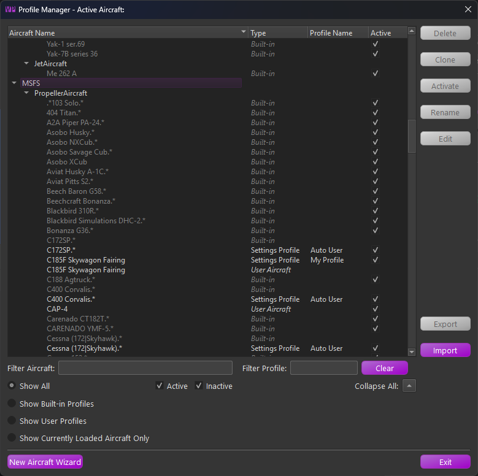{ width="568px" height="565px" }

There is a series of radio buttons that will change the scope of the displayed profiles.

{ width="390px" height="120px" }

- **Active\\Inactive checkboxes**
    - Filter the list of profiles to show Active, Inactive or both. The active profile is the profile that will be used when the aircraft is loaded in a simulator
- **Show All**
    - Displays all built-in and user default profiles
- **Show Built-in**
    - Displays only the built-in profiles
- **Show User**
    - Displays only user created aircraft and user profiles
- **Show Currently Loaded Aircraft**
    - If an aircraft is currently loaded in TelemFFB, this shows only profiles related to that specific aircraft

The profile types are as follows:

- **Built-in**
    - Built-in profiles are those included by default with TelemFFB. When an aircraft is loaded, the default profile will be used if there is no user defined profile
- **User Aircraft**
    - User Aircraft are the base profile for user created aircraft entries. When you use the new aircraft wizard, either dynamically when a new aircraft is loaded or via the button on the profile manager page, a new "User Aircraft" entry will be created.
    - These behave just like profiles and can be modified, deleted, exported and cloned
- **Settings Profile**
    - Settings Profiles are unique sets of settings for a given aircraft. You can create multiple settings profiles and easily switch between them either by setting them active from the profile manager, or by selecting them from the profile drop down on the main page in the application status area

### Managing Profiles
There are various buttons along the right side of the window that are used for managing the profiles. It is possible to multi-select profiles either by click-dragging or by ctrl+click on individual profiles. The action buttons on the right will enable or disable depending on what is available based on the combination of profiles that are selected.

When multiple profiles are selected:

- If any built-in profiles are part of the selection, only the export action is available. However, any selected built-in profiles will be excluded from the resulting export wizard.
- If there are no built-in profiles selected, only the Delete and Export actions are available.
- All other actions are only available when a single profile is selected.

#### Deleting Profile(s)

To delete one or more profiles, select the profile(s) that you would like to delete and then press the delete action button. If any of the profiles being deleted are the active profile, you will be prompted to select a new active profile for that aircraft.

#### Cloning a Profile

To clone a profile, select the single source profile and press the clone action button. Enter a new name for the profile. Optionally, set the "make active" flag in the window to make the newly created profile active for that aircraft.

#### Activating a Profile

To make a profile active, select the desired profile and press the Activate action button.

#### Renaming a Profile

To rename a profile, select the desired settings profile and press the Rename action button. Note that Built-in and User Aircraft profile types cannot be renamed.

#### Editing a Profile

To edit a profile, select the desired profile entry and press the Edit action button. This will put TelemFFB into offline editing mode and load that aircraft profile in the editor window.

### Exporting Profile(s)

To export one or more profiles, first select the profiles that you would like to export and then choose the Export action button. This will load the export wizard dialog:

{ width="334px" height="474px" }

The resulting window will display the profiles to be exported along with the export options:

- **Override Options**
    - **Include Sim Overrides**  
      Enable this option to include any sim level default overrides that would apply to the selected aircraft profiles. This will ensure that the profile, once imported, will match exactly with how the settings work in your configured setup.
    - **Include Class Overrides**  
      Enable this option to include any class level default overrides that would apply to the selected aircraft profiles. This will ensure that the profile, once imported, will match exactly with how the settings work in your configured setup.
- **Export Mode**
    - **Single File**  
      All settings will be exported into a single XML file containing all of the aircraft and settings. You will be given the opportunity to name the exported file.
    - **Multiple Files**  
      Each aircraft will export into a single file. In this mode, you will select the export location. The files will be auto-named, including the sim and aircraft IDs for each aircraft.
- **Included Devices**  
  These options will include or exclude settings for specific devices. If you have multiple devices but only want to export your Joystick settings, disable the checkboxes for the other devices.


### Importing Profile(s)

The import wizard provides a comprehensive set of options and information for the incoming settings in the selected export file.

{ width="680px" height="568px" }

Any line highlighted in **red** indicates a conflict that must be resolved before importing.

There are three main sections:

- **Detected Models**  
    This section lists all aircraft models and profiles found in the imported file.

    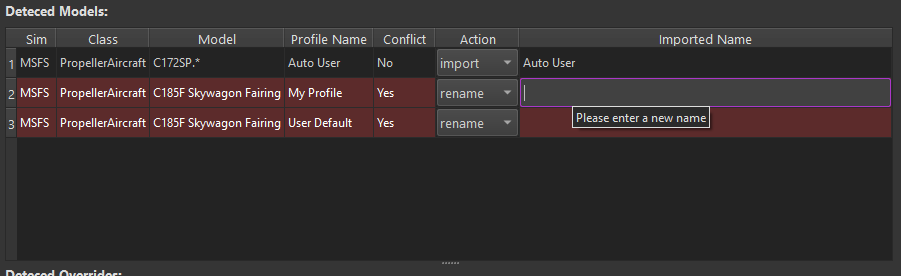{ width="629px" height="192px" }

    - The **Action** column pulldown lets you change the import behavior. You can **import** as is, **rename**, **skip**, or, if there is a profile name conflict, **overwrite** your existing profile of the same name.
    - To resolve a conflict, either set the action to **rename** and enter a new name in the "**imported name**" field, or choose to skip or overwrite.

- **Detected Overrides**  
    This section displays any simulator or class-level overrides included in the incoming settings file.

    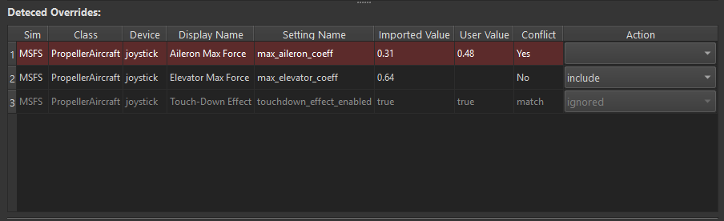{ width="618px" height="189px" }

    - Conflicting settings are highlighted in **red**. These are settings where a matching override already exists in your configuration. The current user value and the incoming value are shown in their respective columns. You can choose to **overwrite** or **exclude** the setting using the **actions** dropdown.
    - Settings marked as "**match**" in the conflict column are identical to your existing override and will be ignored.
    - For all other incoming settings, you can choose to **include** or **exclude** each entry via the **action** setting.

- **Device Options**  
    This section allows you to filter out settings for specific device types. If a device type is not present in the incoming file, its toggle will be disabled.

    If a device type is disabled, any override settings or profiles that only contain settings for that device will be excluded from the import.

    { width="367px" height="165px" }

## Running TelemFFB with multiple VPforce FFB devices

With the availability of the VPforce DIY kits, people are developing their own FFB devices such as rudder pedals, and even collectives. While DCS does not support FFB on the rudder or collective axes (nor MSFS or IL2), it is still possible to play all of the effects that TelemFFB offers through any VPforce device.

By default, TelemFFB attempts to connect to the VID:PID address that is specific to the Rhino Joystick Base. The VID for all VPforce control boards is 'FFFF'. The default PID for the Rhino Joystick Base is '2055'. The PID can be viewed (and modified) in the VPforce FFB Configurator utility.

In the system settings Launch Options section, you can configure the PID values for each of your FFB devices.

{ width="527px" height="231px" }

You can also choose which additional devices you would like to automatically launch when the master instance of TelemFFB is started. These additional child instances can be started in normal, minimized or headless modes.

After starting TelemFFB using the auto-launch mode, you will see all of the device icons listed in the Device Status area. See the ***Active Device Area*** documentation for details on monitoring and switching between devices for configuration.

## Dynamic VPforce Configurator Profile Assignment

Often it is desirable to have different VPforce Configurator settings in place for different aircraft, types of aircraft or simulators.

While this can be accomplished manually by simply loading a profile in Configurator and then applying it, that is a tedious process.

Fortunately, this process can be automated using TelemFFB. There are a variety of ways that VPforce Configurator profiles (hereafter called vpconf/configurator profiles) can be automatically loaded onto your device via TelemFFB.

****Note** -** It is important to understand the hierarchical effect of defining configurator profiles and various levels of specificity.

The startup/exit profiles will *always* load on startup/exit.

The "global default" will always load if a prior aircraft/class/sim loaded a specific profile and a newly loaded aircraft does not have any other more specific definition.

The more specific the definition, the higher the precedence. A configurator profile defined for a specific aircraft will supersede all other profiles when that aircraft is loaded.

Similarly, "aircraft class" (helicopter/prop/jet, etc) will supersede "sim" (DCS, MSFS, etc).

### Startup/Exit configurator profiles

In the system settings options there are fields where you can select discrete profiles that TelemFFB will always push to the device when it starts, or when it exits. This can be useful for keeping a low force profile on your device while not in use, but loading a profile with higher effect settings gains when you start TelemFFB.

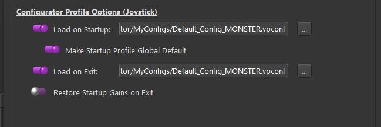{ width="584px" height="195px" }

### Global Default configurator profile

Also in the system settings, you can set the TelemFFB startup profile to be used as a global default for any aircraft or sim. This is useful if you only have one or two specific aircraft that you wish to apply custom profiles to. When an aircraft with a custom profile is loaded, TelemFFB will push the profile defined for that aircraft to the device. At some point later, if another aircraft is loaded and it does not have a profile defined at either the Aircraft, Class or Simulator level, TelemFFB will automatically revert the configuration on the device to the global default value.

### Assigning a configurator profile to a specific aircraft

When loaded into an aircraft, or with the sim, class, or specific aircraft/profile selected in offline mode, simply select the Configurator File selection button in the TelemFFB settings tab System section and browse to the configurator profile. This will be stored in your user configuration and every time that aircraft is loaded, TelemFFB will push the profile to your device.

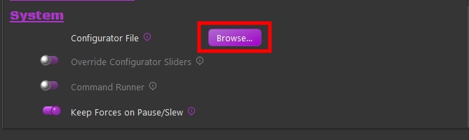{ width="411px" height="123px" }

## Dynamic Configurator Gain Overrides

In addition to (or in lieu of) pushing a whole VPforce Configurator ("vpconf") profile to the device, you can also configure dynamic adjustments to the individual effect type gains as if you were adjusting them directly from the configurator app.

As with any other setting in TelemFFB, this can be done at the Sim, Aircraft Class or specific aircraft level.

For Sim/Aircraft Class, these must be accessed from the
***Offline/Global Sim/Class Editor***.

For individual aircraft, it is easiest done straight from the settings page on the main window.

### How it works

First, it is important to understand how this works.

-   There is always a baseline set of gains stored in TelemFFB while
    running:

    -   The current gain values on the device are captured when TelemFFB is started.

    -   Any time a VPforce Configurator ("vpconf") profile is pushed to the device by TelemFFB, the new gains on the device are read and remembered by TelemFFB for later use.

        -   This includes VPforce Configurator profiles that are pushed as the "TelemFFB startup Profile", and any that are pushed as part of a Sim/Class/Aircraft configuration

-   If an aircraft that has a Configurator Gain Override configured is loaded

    -   The gain values will be set ***after*** any "vpconf" profile is pushed. This means that the gain overrides will supersede the "vpconf" profile gain settings.

-   Subsequently, if an aircraft that ***does not have*** a Configurator
    Gain Override configured is loaded into the sim

    -   TelemFFB will revert the gain settings on the device to the last baseline value. This will either be the gains that were read at startup, or the gains that were read after the last time a configurator profile was loaded.

-   When exiting, TelemFFB will re-push the gain values that were initially read on startup so as to leave the device in the same condition it was found.

simplest example:

### Example Configurations

Several examples follow in an attempt to describe the behavior of the Configurator Gain Overrides and its interaction with the ***Dynamic VPForce Configurator Profile*** feature. Each example walks through the behavior from startup of TelemFFB, through 2 different aircrafts loading with different settings and finally exiting TelemFFB.

**Example 1**

Simplified using a single effect type in the example. Synopsis below:

-   TelemFFB not running
-   Current Spring Gain on device - %50
-   No "startup vpconf" configured.
-   No "vpconf" specified for example loaded aircraft
-   First example aircraft has spring gain override configured at %100

-   Start TelemFFB
    -   Spring effect gain read at %50 and value stored for later use
-   Load aircraft with override configured with spring at %100
    -   Spring gain of %100 gets set to device
-   Load aircraft with *no* override configured
    -   TelemFFB pushes original %50 that was read on startup
-   Exit TelemFFB
    -   TelemFFB pushes original %50 that was read on startup as final
        measure to ensure same state as startup.

**Example 2**

Simplified using a single effect type. Synopsis below

-   TelemFFB not running
-   Current Spring Gain on device - %50
-   "startup vpconf" configured with spring gain = %75
-   No "vpconf" specified for example loaded aircraft
-   First example aircraft has spring gain override configured at %100
-   Start TelemFFB
    -   Spring effect gain read at %50 and value stored for later use
-   Startup VPconf Profile pushed
    -   Spring effect gain read at %75 and value stored for later use
-   Load aircraft with override configured with spring at %100
    -   Spring gain of %100 gets set to device
-   Load aircraft with *no* override configured
    -   TelemFFB pushes spring gain %75 that was read after the startup
        vpconf was pushed
-   Exit TelemFFB
    -   TelemFFB pushes original %50 that was read on startup as final
        measure to ensure same state as startup.

**Example 3**

Simplified using a single effect type. Synopsis below

-   TelemFFB not running
-   Current Spring Gain on device - %50
-   "startup vpconf" configured with spring gain at %75
-   First example aircraft has "vpconf" configured with spring gain %80 **and** a spring gain override set at %40
-   Start TelemFFB
    -   Spring effect gain read at %50 and value stored for later use
-   Startup VPconf Profile pushed
    -   Spring effect gain read at %75 and value stored for later use
-   Load aircraft with vpconf set at %80 and spring gain override configured at %40
    -   TelemFFB pushes new vpconf
        -   new gains are read and stored for later use
    -   TelemFFB pushes gains from the override config
    -   The net result is that the gains on the device will be whatever is in the override config since it happens last

-   Load aircraft with **no** gain override and *no* vpconf configured

    -   The following behavior depends on the state of the "***Global
        Default***" setting for the "vpconf startup"
        profile.

    -   If Global Default is enabled:

        -   Since no vpconf profile is configured for new aircraft, the
            Global Default ("startup") profile is pushed to the
            device.

            -   Since the startup vpconf was pushed with spring gain =
                %75, we read and update our stored gain settings from
                the device

    -   If Global Default is disabled

        -   Since no vpconf profile is configured for the new aircraft
            and Global Default is disabled, the vpconf settings and
            stored gain values (spring = %80) from the previous
            aircraft will persist.

    -   TelemFFB pushes spring gain %75 if Global Default is enabled or
        %80 if Global Default is disabled. Both of these pushes are
        redundant since those gain values are already on the device,
        but this is the way the logic works to account for cases when
        there are gain overrides but no vpconf overrides.

-   Exit TelemFFB

    -   TelemFFB pushes original %50 that was read on startup as final measure to ensure same state as startup.


|          |                                       |     |           |
|----------|---------------------------------------|-----|-----------|
| Configurator | Master Gain                        |    |  100%     |
| Configurator | Spring Gain                        |    |  <del>50%</del>    |
| TelemFFB | Startup vpconf spring gain            |     | <del>75%</del>   |
| TelemFFB | Configurator Spring Gain Override     |     | 80%       |
| TelemFFB | Aircraft spring gain                  | x   | 40%       |
|          | ==Final Force==                           |     | 75%       |


### Configuring The Gains

Configuring the Gain Overrides is very simple and similar to configuring the equivalent sliders in VPforce Configurator with one major difference. That is, adjusting the slider takes effect (very nearly) immediately. There is a small delay where the slider must be stationary in order for the command to be sent to avoid spamming the device with hundreds of commands.

To access the override dialog

1.  Enable the "Override Configurator Sliders" toggle (1)

2.  Press the "Configurator Gains Override" button (2)

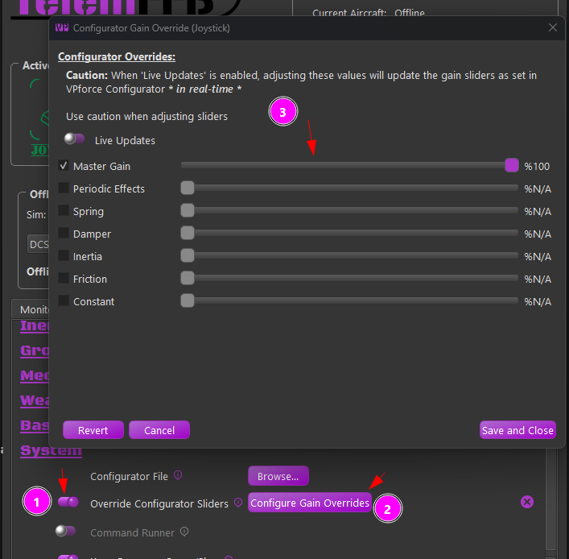{ width="487px" height="478px" }

To override a given effect gain slider, simply tick the checkbox and adjust the slider to your liking. If you enable the Live Updates option, You will feel the effects of the change immediately.

The button behavior is as follows

-   **Revert Button**

    -   The revert button will disable all of the override checkboxes and set the gains back to their stored baseline values. This will be either the gains read on startup or when the last "vpconf" profile was pushed

-   **Cancel Button**

    -   The cancel button will undo any changes that were made since the override window as opened. It will the close the window

-   **Save and Close Button**

    -   The save button will write the settings as they are currently configured to the user configuration file for the currently loaded aircraft.

## Advanced Dynamic Spring Curve Dialog

The advanced spring setting is new in TelemFFB 2.0 and supported across all simulators in some form or fashion. It allows users to define the spring gain mapping via visual curve/slope across a custom airspeed envelope.

To enable the Advance Spring mode, change the **Joystick Spring Mode** for the desired aircraft to the "**Advanced Dynamic**" mode. Then choose the **Edit Settings** button to open the configuration dialog.

{ width="401px" height="105px" }
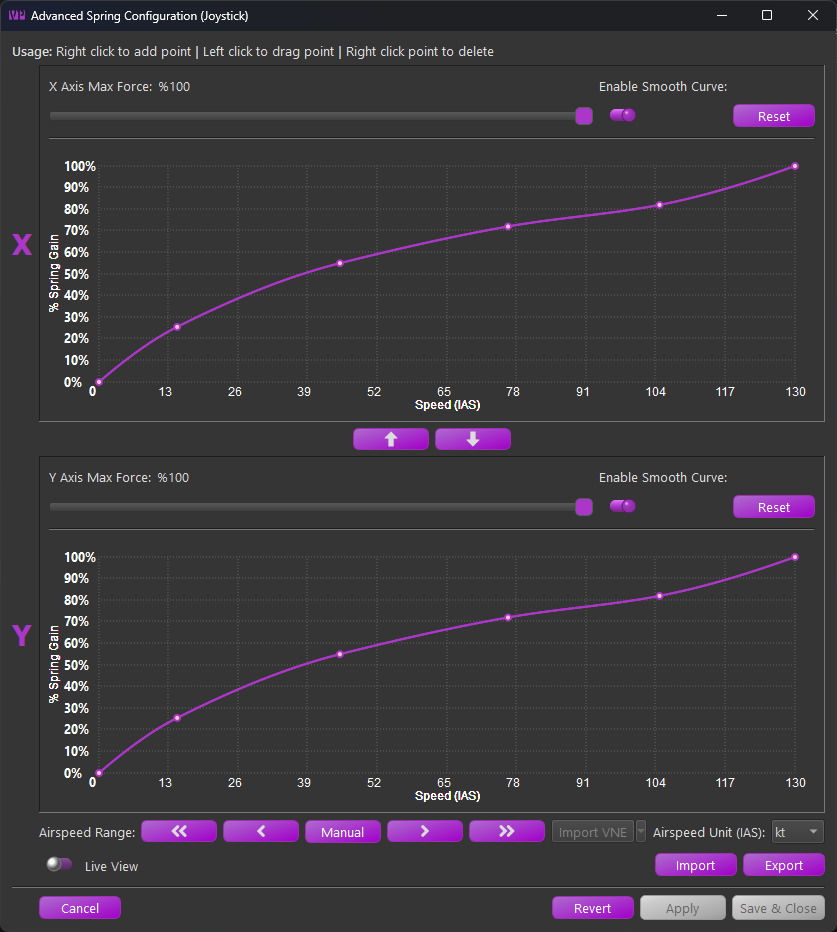{ width="413px" height="462px" }

The form is separated into the X and Y axis configurations. Each axis may be configured separately, although the airspeed scale will be the same for each axis.
Within each axis configuration the following controls are available:

-   **Max Force:**

    -   The maximum applied spring gain where the configured curve meets %100 on the Y scale.

-   **Enable Smooth Curve:**

    -   Switch between linear segmented and smooth-curved configurations.

    -   **Note:** that at least 4 points are required to enable smooth curve
        mode

-   **Reset**
    -   Resets the curve back to a simple 2 point linear curve

Between the two curve configurations, use the ⬆️and ⬇️buttons to copy the X or Y axis curve up or down to the other axis.

Along the bottom there are several additional controls

-   **Airspeed Range**

    -   **⏪- **Decrease 100 "units"
    -   **◀️- **Decrease 10 "units"
    -   **Manual **- Enter the airspeed range manually
    -   **▶️- **Increase 10 "units"
    -   **⏩- **Increase 100 "units
    -   **Import VNE (MSFS/XPlane Only)**
        -   Import the published (or calculated) VNE from the aircraft telemetry.
        -   The sim must be active and telemetry must be flowing to enable the button.

-   **Airspeed Unit**

    -   Set the airspeed units used by the curves. Regardless of the configured unit, the settings will be scaled to work properly with the live airspeed of the aircraft (usually in m/s as received from the sim)

-   **Import**

    -   Import a curve setting that was previously exported from TelemFFB

-   **Export**

    -   Export a curve setting that can be shared or imported into another aircraft

-   **Live View**

    -   When Live View is enabled, an additional crosshair will appear on the graph when the sim is loaded and telemetry is flowing from the aircraft. The crosshairs will indicate the calculated spring gain at the current airspeed based on the saved curve.

!!! note
    Note that curve modifications are not instant. If the curve has been modified, it must be applied or saved for the modifications to take effect

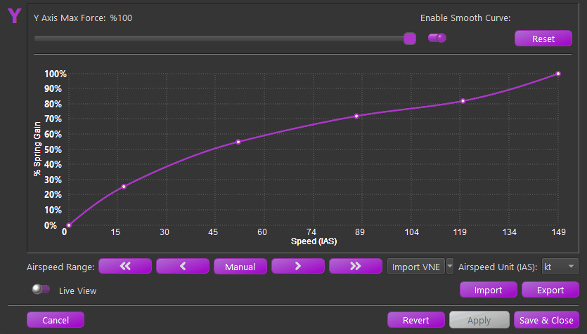{ width="564px" height="322px" }

### Working with the Curves

The actual curve editor is a custom widget written entirely in python. The curve uses the Akami algorithm as opposed to other traditional spline methods for its tighter control on overshoot interpolation wildly affecting portions of the curve outside of the segment being edited.

Its use is fairly straight forward with some conditions:

-   A minimum of 4 points are required to enable curve smoothing

-   The curve must not exceed 0% or %100 spring gain. The widget will prohibit further movement of a point if it will cause **any** point of the curve to exceed the limits

-   The widget prohibit smooth curve if the resulting curve would exceed limits

-   The widget will not let you add a point that will result in the curve exceeding the limits

The curve controls are as follows:

-   **Add Point**

    -   To add a point, **right-click** on the graph where you would like the point to be added

-   **Move/Drag Point**

    -   To move a point, left-click on the point and drag the point where you would like

-   **Delete Point**

    -   To delete a point, right-click on the desired point and select delete from the popup menu.

{ width="523px" height="243px" }

## Advanced Custom Curve G-Force Effect Dialog

Also new in TelemFFB 2.0 is a new way of configuring the G-Force effect. Many aircraft do not have a linear, or even similar g-loading response and as such, the legacy exponential curve g-force effect produces lackluster or erratic behavior.

To enable, select "Custom Curve" as the G-Force Effect and select the Edit Settings button

{ width="456px" height="76px" }

Using the same new curve widget as the Advanced Spring Curve feature, a new custom curve G-Effect was created.

{ width="382px" height="512px" }

The form is separated into Positive and Negative G scale
configurations.

-   **Maximum Force Slider:**

    -   Adjust the overall intensity of the effect. Depending on the selected "Force Mode" configuration, it will either adjust the maximum constant force effect application or how much spring center offset is applied to produce the effect.

-   **Enable Smooth Curve:**

    -   Switch between linear segmented and smooth-curved configurations.

    -   Note: that at least 4 points are required to enable smooth curve
        mode

-   **Reset**

    -   Resets the curve back to a simple 2 point linear curve

In between the positive and negative configurations:

-   **Effect Force Mode:**

    -   **Constant Force**

        -   In this mode, a dynamically changing constant force effect is applied based on the curve point at a given G-loading.

    -   **Spring Offset**

        -   In this mode, when the G-Effect is playing, a temporary spring center point offset is applied, shifting the center point in the direction required to induce a strengthening of the spring.

### Working with the Curves

See the ***Advanced Custom Spring*** section for guidance on using the curve editor

## Notable Sim Specific Info

This section expands upon some of the more complex or commonly adjusted settings in TelemFFB. A full list of all settings is available in the ***Effects Documentation*** Section

### MSFS and X-Plane

Both Microsoft Flight Simulator and X-Plane lack native force feedback support, but TelemFFB bridges this gap by leveraging their robust telemetry export capabilities. This section covers the advanced features and configuration options specific to these simulators, including trim and autopilot following, dynamic spring curves, and helicopter force trim emulation. The settings and workflows described here enable you to achieve sophisticated force feedback behavior that closely simulates real aircraft dynamics and control characteristics.

#### Trim and Autopilot Following

TelemFFB supports trim and autopilot following in MSFS and X-planes, with special caveats for MSFS. In order for TelemFFB to emulate movement of the joystick/pedals in response to trim or autopilot inputs, it needs to be able to control the axis position that MSFS is seeing from the joystick device. This is required since these simulators have no concept of FFB or axis offsets and will interpret any intentional deflection of an axis as ***deflection of the control surface*** and not just a response to the trim input. This is counteracted in software by limiting the amount of physical movement of the joystick that is actually communicated to MSFS.

**For MSFS:**

!!! note
    Trim and Autopilot following in MSFS is an ***experimental feature*** and may not work correctly with all aircraft. Some aircraft may require custom tuning of the gain settings to achieve the desired effect.

!!! important
    Since MSFS does not have a specific override toggle for external axis control, this means that in order to use this feature of TelemFFB, ***you must unbind your joystick or pedal axes inside of MSFS***. Otherwise, the internal joystick position will conflict with what is being sent by TelemFFB.

**For X-Plane:**

It is **not required to unbind your axes for X-Plane** since there are override toggles as part of the SDK. When the feature is enabled in TelemFFB, the axis is overridden.

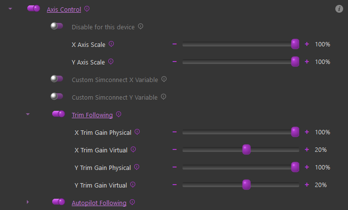{ width="680px" height="410px" }

To enable Trim and/or Autopilot following, simply enable the "Axis Control" feature and then in the sub-settings, enable Trim or Autopilot following accordingly.

-   **Axis Scale:**

    -   These sliders can be used to adjust the scale of the axis as sent to MSFS. A value of %50 will result in %50 control deflection in the sim with %100 physical deflection

-   **Custom Axis Variables:**

    -   Some aircraft do not use the standard simconnect events for their axes, or use custom LVAR variables. You can use these checkboxes to override the default variable that is sent or input a custom LVAR. Use "VARNAME" for simvars or "L:VARNAME" for LVARS

-   **Trim Following Gains**:

    -   X/Y Gain Physical

        -   These gain settings affect how much the physical axis will move in response to the trim value. A gain of %100 will result in full travel of the physical axis with full travel of the trim

    -   X/Y Gain Virtual

        -   These gain settings define how much of the physical movement is translated to the simulator over the simconnect session. A value of %50 means that only %50 of the physical movement of the axis will be sent to the simulator, resulting in the virtual axis moving %50 as much as the physical axis.

**How it works at a high level:**

-   **Trim Following**

    -   Trim position is read from the sim

    -   Physical stick center point is calculated using the 'physical'
        position gain

    -   Physical stick center is sent to the joystick/pedals

    -   Virtual stick position is calculated using the 'virtual'
        position gain

    -   Virtual stick position is sent to MSFS

-   **AP Following**

    -   Elevator AP following is reliant on the trim value, as APs use the elevator trim

    -   Aileron/Rudder

        -   Control surface deflection is read from the sim (as induced by AP control)

        -   Control surface deflection is used to calculate physical axis position

        -   Physical position is sent to joystick/rudder

    -   The AP induced physical control inputs are dampened to prevent out of control oscillations in turbulence or in aircraft with extra sensitive controls.

**Tips on configuring the trim settings**

Physical & Virtual configuration should be done for each plane.

Suggested starting points:

* X Gain Physical = 50%
* X Gain Virtual = 20%
* Y Gain Physical = 100%
* Y Gain Virtual = 20%
* Rudder Gain Physical = 50%
* Rudder Gain Virtual = 20%

Joystick..X and Rudder..X can typically be left as default, since many planes do not even have in-cockpit trims on those axes, and if they do they are set and forget. The elevator trim however is interacted with a great deal and joystick..Y must be tuned per plane for realistic results.

Fly the plane, and trim for level flight at cruise speed.

In VPForce configurator (or knob if you have it set to control spring or master gain), temporarily set spring to 0% and set friction to a value high enough that your stick stays in place when you let go of it. Apply (do not store) the setting.

Without moving the Rhino joystick, use your trim buttons/keys/axis to nose down the plane.

If the nose goes up, adjust **Y Gain Virtual** 10% higher.

If the nose goes down, adjust **Y Gain Virtual** 10% lower. It may be required to go negative.

Adjust the trim and observe the reaction again. It will take a few iterations. The goal is to have the trim adjustment have no effect with the stick not moving. You can adjust by 5%, 1% when you are close. Enjoy your new realistic trim!

Under Autopilot Following, there are settings for deadzone and gain. You must move the controls further than the deadzone setting for the values to be sent to the sim. Gain adjusts the ratio between in-sim movement to physical stick movement.

!!! note "Note" 
    Some planes may require use of the axis position instead of reported trim position. You can try toggling the switch if it behaves erratically.

{ width="629px" height="192px" }

#### Aileron/Elevator/Rudder Gain Settings

There are multiple ways the axis spring gains can be configured for
aircraft in MSFS/X-Plane.

**Basic Dynamic** - Spring gain changes based on increasing/decreasing dynamic pressure as airspeed changes, includes additional dynamic forces related to slip, AoA and g-forces.

**Basic Dynamic + Spring Centered** - Adds a fixed gain centering force to the Dynamic spring effects. Where the standard Dynamic effect can reach 0 spring and 0 airspeed, the addition of the base centering force will set the lower boundary of the spring effect to the configured value

**Fly By Wire (FBW)** - Static spring force is configured per axis based on the settings.

**Advanced Dynamic** - See the **Advanced Spring** configuration section of the manual

{ width="520px" height="144px" }

#### Dynamic

There are settings which directly affect the max force per axis as well as an "exponent" setting which affects the curve at which the gain will be applied over the speed envelope of the aircraft.

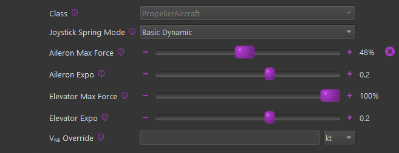{ width="482px" height="186px" }

**Max Force Settings**

The "Max Force" settings will effectively set the spring gain that will be achieved at the V~NE~ (never exceed) speed of the aircraft, although the calculation is more sophisticated than a basic linear gain-to-speed mapping. It uses the known aircraft info to determine the dynamic pressure (Q) that should be achieved at V~NE~ for the aircraft and then feeds that information into the dynamic forces calculation to determine the final spring gain at any given point in time.

100% of the configured **Max Force** is achieved at the aircraft's V~NE~ speed as read from telemetry. In the event that the V speeds defined in the aircraft's configuration files are incorrect, or if you want to override the value, it can be changed with the **V**~**NE**~** Override **setting.

The Max Force adjustment slider handle will fade from gray to green as Max Force is reached, and the handle will show a percentage of dynamic force applied.

**Expo Settings**

Since Rhino cannot produce the actual real-life forces that could be reached, Expo amplifies those forces at lower speeds, where the feeling of control authority is quickly lost at stall speeds for example. An Expo value of 0.5 doubles stick forces at 25% of V~NE~. For some jets, you might want diminished forces until closer to V~NE~, so you can set a negative Expo value.

{ width="513px" height="320px" }

#### Dynamic + Spring Centered

The "Spring Centered" option will still leverage the Dynamic
adjustments mentioned above, however there will be a minimum spring
gain set on a given axis based on the sliders.

With this configured, the dynamic spring gain will range from a
low-point of the "Spring Centered" gain value to a high-point of the
Max Force setting in the dynamic adjustment settings.

{ width="576px" height="102px" }

#### Fly By Wire (FBW)

Enabling the FBW option will override any configurations in the
Dynamic and/or Spring Centered settings and apply a fixed gain value
on a given axis. When this mode is active, the spring gain is static
and will not vary based on airspeed or any other aerodynamic
conditions.

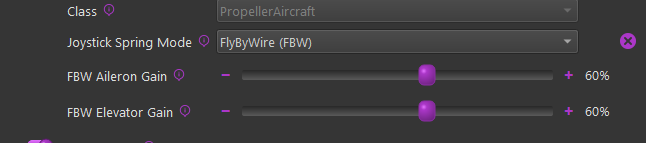{ width="573px" height="127px" }

#### Turbulence Effect

The turbulence effect simulates the small, rapid wind disturbances that aircraft experience in turbulent air.

This effect adds dynamic, randomized force feedback pulses that vary in strength and direction based on changing airflow, creating a more realistic "gusty" flight feel.

**How it works**

When turbulence is enabled, the simulator's relative wind data is constantly analyzed for short-term fluctuations.

These micro-changes are processed through a high-pass filter to isolate rapid wind shifts (gusts) and then converted into corresponding force impulses on your control stick or yoke.

The result is a tactile simulation of air buffeting and gust response.

**Adjustable Parameters:**

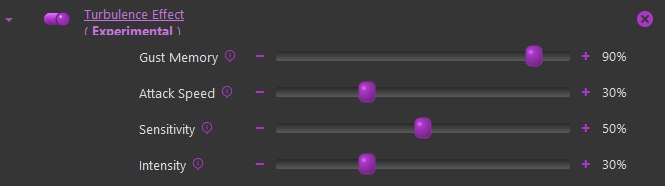{ width="597px" height="167px" }

**Gust Memory:**
Controls how long each wind gust continues to influence the controls.

-   **Low values** → Gusts fade quickly, producing short, choppy bumps.

-   **High values** → Gusts linger longer, giving a rolling, "bumpy air" feel.
    *(Internally adjusts the high-pass filter's decay rate.)*

**Attack Speed:**
Determines how quickly new gusts take effect when wind changes occur.

-   **Lower values** → Forces build up gradually (softer turbulence).
-   **Higher values** → Immediate, sharper responses to gusts. *(Adjusts how fast the filtered wind deltas are integrated into the effect.)*

**Sensitivity:**
Sets how easily the system reacts to small wind variations.

-   **Lower values** → More sensitive; small wind shifts create noticeable feedback.
-   **Higher values** → Less sensitive; ignores small fluctuations and reacts only to larger gusts. *(Affects the maximum delta threshold used to normalize gust strength.)*

**Intensity:**
Controls the maximum strength of the turbulence force.

-   **Lower values** → Light, subtle vibrations.
-   **Higher values** → Strong, distinct buffeting forces. *(Acts as a global amplitude multiplier for the generated forces.)*

!!! tip
    *   Try starting with moderate values:\ Gust Memory: 70%, Attack Speed: 40%, Sensitivity: 50%, Intensity: 30%.
    *   Increasing **Intensity** without balancing **Sensitivity** can make turbulence feel overly harsh or "random."
    *   Because this feature relies on simulator wind telemetry, the effect will be minimal in calm-weather conditions.

#### Helicopter Force Trim

Helicopter force trim emulation is supported for both MSFS and X-Plane. To enable this feature of TelemFFB, enable the Force Trim checkbox and then in the sub-settings, configure a button on your joystick to serve as the trim release button.

!!! note "Note"
    If you enable force trim, but do not set a button, you will see an error indication for the simulator. The Trim Release button is **mandatory**, the Trim Reset button is **optional**.

{ width="539px" height="166px" }

-   **Cyclic Spring Gain**

    -   Sets the spring gain force when FT is engaged

-   **Force Trim Release Button**

    -   Configures the button to be used as trim release

-   **Force Trim Reset Button**

    -   (Optional) - Configure a button to reset the trim to center

-   **Trim Release Damper**

    -   Enables a dampening effect when the FT button is pressed and held.

    -   This is slightly different than a "dampening" effect. It uses a
        constant center-updating spring effect to apply the dampening
        force

-   **Force Trim Switch Simvar**

    -   When enabled, TelemFFB will watch the configured L:Var and
        enable/disable the hardware force trim based on the 0/1 state
        of said variable.

    -   Some aircraft (like the Taug UH-1) have a switch in the cockpit.
        The default profile for this aircraft already has the correct
        L:Var mapped.

    -   You can use 3rd party software such as SPAD.neXt to use a
        hardware switch to toggle `L:TelemFFBHeliFT` for any
        aircraft. This will simulate having a FT enable/disable switch

#### Low Hydraulic Pressure Effect

This effect allows the configuration of damper, inertia, and friction forces above and beyond those which are set by the base damper/inertia/friction settings in TelemFFB.

!!! note
    In order for this effect to work, the Damper/Inertia/Friction effects must also be enabled.

!!! note
    Care must be taken when increasing these forces. Particularly with Inertia and Friction. Adding too much of these forces can quickly lead to motor instability ssues, resulting in motor fault protection shutdown.

!!! note
    It is important to understand that all of these slider settings are limited by what is configured in the active VPForce Configurator profile. If your basic damper/inertia/friction forces are enabled at %100 in TelemFFB, there will be no room for the low pressure effect to increase them further.

TelemFFB monitors the data in the "**HydSys**" telemetry and will linearly apply these effect values in place of the standard values between the threshold setting value and a 'HydSys' value of 0. If the HydSys value is a list, the effect uses the max value to determine whether or not the pressure is below the threshold.

{ width="561px" height="235px" }

When setting the Hydraulic System Threshold setting for a new aircraft, you must first determine what "normal" is, by inspecting the **HydSys** telemetry value under normal conditions. Then set the Hydraulic System Threshold slider to a value *less than* the normal operational value. If the HydSys value drops below the threshold, the effects force settings will begin taking effect.

#### (MSFS Only) - Special FFB Implementation for Hype Performance Group Airbus Helicopters

In collaboration with HPG, this implementation in TelemFFB was developed as a true-to-life representation of piloting the Airbus H145 and H160 aircraft.

The VPforce Rhino will work with the AFCS and act as the auto trim motor does, slowly moving the joystick as required to keep the SEMAs within their range of travel. The Rhino is also integrated with the force trim release system and the "hands on" spring override detection system. Force trim for hand-flying is also supported.

Both the Cyclic and Collective axes (if you have a VPforce powered collective) are integrated with the AFCS. The Tail Rotor axis is also supported.

Excerpt from the [*HPG H145 user guide*](https://davux.com/docs/h145/AFCS.html#afcs-autoflight-system):

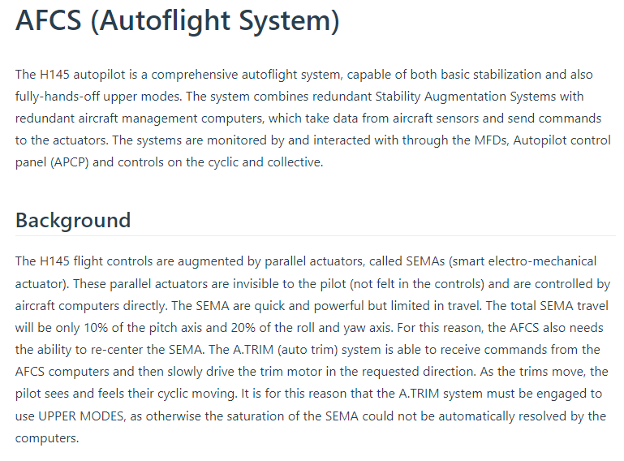{ width="624px" height="461px" }

As part of this implementation, there are certain requirements and recommended settings in the MSFS control bindings, the HPG Helicopter settings (iPad) and in TelemFFB.

!!! note
    Because of the unique aspects of this implementation, when either the H145 or H160 profiles are loaded, a series of aircraft specific `L:Vars` are subscribed to. These `L:Vars` are part of the default profiles for the H145 and H160 aircraft. As such, it is important that if you load a livery that does not match the default profiles, that you **clone** from the existing default profile. If you simply create a new entry of type "HPGHelicopter", it will not work properly.

**VPForce Configurator Settings:**

1.   You must ensure that there is enough spring force enabled in the profile to properly center the joystick
2.   Joystick:
    -   If the joystick sags away from center due to grip weight or low spring force:
        -   use the 'balance springs' feature to counteract the grip weight
        -   use the 'adaptive centering' feature to assist bringing the stick to center position when you are not holding it.
3.   Collective & Pedals:
    -   In order to properly emulate AFCS control, spring force MUST be enabled on both the collective and the pedals

**TelemFFB Settings:**

-   **Axis Control** must be enabled.
    -   This is required for both the Cyclic axes and the Collective axis (if you are using a VPforce powered Collective)
    -   You must UNBIND the axes in MSFS

-   **Force Trim** must be enabled
    -   you must also set your force trim binding in the force trim sub-configuration in TelemFFB

-   **Cyclic**
    -   **Hands-On Deadzone**
    -   **Hands-Off Deadzone**
-   **Collective**
    -   **Collective AP Spring Gain**
    -   **Collective Dampening Gain**

**MSFS Settings**:

-   You must **UNBIND **your Cyclic axes in MSFS to prevent conflicts with TelemFFB sending the axis position
-   If using a VPforce powered Collective,
    -   You must **UNBIND **your Collective axis in MSFS to prevent conflicts with TelemFFB sending the axis position
    -   You must **BIND** a button on your collective to act as collective trim release. Pressing the trim release is required to manipulate the real helicopters collective and that is modeled in TelemFFB. The binding in MSFS is `AUTOTHROTTLE DISCONNECT`

**HPG H160/H145 Settings:**

Depending on the version of the helicopter you have installed, the tablet options may differ. Use the tablet settings below depending on what your tablet options look like.

Older Versions:

In the tablet settings inside the aircraft, the following must be configured for proper behavior:

-   Cyclic:

    -   Cyclic Control set to **'No Springs'**
    -   Follow-Up trim set to **'OFF' **(you may need to temporarily
        enable Centering Springs to set this)
    -   SAS Stability level
        -   For the **H160**: between -80 and -60
        -   For the **H145**: between -50 and -20
-   Collective
    -   SAS Stability level -100

Newer Versions:

Newer versions of the HPG helicopters have more options that assist with FFB implementations. You will want to set:

-   Hands on Detection: **'None'**
-   Cyclic Trim System: **'Hardware'**
-   Cyclic Followup Trim: **'Both'**

{ width="494px" height="635px" }

#### Force Mode (Experimental)

New in version 2.0, along with the latest v1.0.18 Rhino firmware is an experimental version of the hands on/off detection that is used in the HPG Class aircraft.
{ width="488px" height="263px" }

The latest firmware allows us to track the force output for the axis in % of max, which can give a much more granular indication of user hands-on controls as compared to a pure deflection based calculation.

Because the configurator Adaptive Recentering feature "forces" the stick as close to the exact center as possible, having it enabled typically results in a higher "standing force" reading. Because of this, it is recommended to **disable **the **Adaptive Recentering** figure in configurator when flying the HPG helicopters in Force Mode

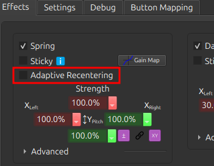{ width="232px" height="180px" }

Rather than a hard hands-off threshold, it uses a time based hysteresis. This prevents flapping of hands on/off when passing through the center point.

-   **Hands On Force Threshold:**

    -   Recommended value of %3 or less
    -   This value is indicative of the total force that would be achieved with full deflection of the stick.

-   **Hands Off Hysteresis Time:**

    -   Recommended value - 500ms
    -   The time, in milliseconds that, after hands-on has been triggered, that the force must be ***below***** **the force threshold in order to trigger hands-off

-   **Debug Logging:**

    -   Logs the hands on/off state on every simulation frame. Useful when fine tuning the threshold value

#### (MSFS Only) - Special FFB Implementation for FlyInside Helicopters

In collaboration with FlyInside, TelemFFB uses vibration variables from the flight model. ETL, VRS, and other buffeting and engine vibrations are not used. Instead there is a Vibration control under Mechanical/Airframe:

{ width="652px" height="67px" }

### DCS

#### Joystick Spring Mode

Several different spring modes are available. Different options will be available depending on the selection

-   **None (Game Managed)** - (Default)

    -   No Spring effect is supplied by TelemFFB. The game is left to manage its own spring

-   **Static Override w/ Hardware Trim**

    -   A static spring with configurable gain is started and will override the game spring effect.
    -   Hardware force trim settings are available

{ width="469px" height="260px" }

-   **Advanced Dynamic**

    -   See the ***Advanced Dynamic Spring** documentation

#### Pedal Spring Mode

DCS does not natively support FFB pedals. TelemFFB has implemented basic FFB capabilities.

The following modes are supported

-   **None (Game Managed) - NOT RECOMMENDED as the game does not support pedal FFB**

-   **No Spring - (Helicopter default)**

    -   A "zero gain" spring effect will be started to override the game spring effect

-   **Static Spring (Jet default)**

    -   A configurable static gain spring effect will be started.

-   **Dynamic Spring (Prop/Turboprop default)**

    -   A spring effect will be started that stiffens as airspeed increases. The speed range at which the spring stiffens is pre-defined based on published aircraft speed envelope data

-   **Dynamic w/ Custom Speeds**

    -   Same as Dynamic but with configurable speed ranges

-   **Advanced Dynamic**
    -   See the ***Advanced Dynamic*** Spring section

#### Low Hydraulic Pressure Effect

See the documentation for this effect in the ***MSFS Low Hydraulic Pressure Effect Section*** above. The effect works largely the same way for DCS.

Support is currently limited to:

-   UH-1, SA342, Mi-8, Mi-24, KA-50

-   A-10C, AV-8B, F-14, F15ESE

The primary difference is that for each DCS aircraft, the telemetry must be individually sourced in a unique way per aircraft. As such, the supported aircraft are limited at this time. See the TelemFFB release notes for the supported aircraft.

For DCS Aircraft, the Hydraulic System Threshold setting has already been coarsely configured for each of the supported aircraft, depending on how the data is being read and what the normal values are.

### IL-2

#### Duplicate 'Shake' effects

IL2 implements FFB for dynamic stick forces and some very basic shake effects. TelemFFB implements duplicate (but far more configurable) effects which overlap with those that are implemented by IL2. To enable these specific settings, enable the "IL-2 Shake Master" setting in TelemFFB.

!!! note
    It is recommended to set the "Shaking" intensity in the IL-2 FFB control settings to 0 if you enable these settings in TelemFFB.

This can be found in Settings-\>Input Devices within the IL2 configuration

{ width="445px" height="126px" }

The IL2 Shake Master settings

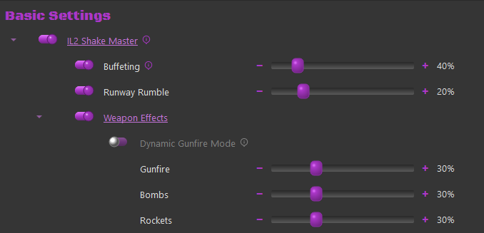{ width="423px" height="204px" }

Each setting individually controls the intensity of that effect type:

-   **Buffeting** - Controls the intensity of AoA Stall Buffeting

-   **Runway Rumble** - Controls the intensity of bumping induced while taxiing

-   **Weapons Effects (Master Toggle)**

    -   **Dynamic Gunfire Mode**

        -   When Enabled, the shell size and weight are used to calculate a dynamic effect frequency. In general, smaller lighter rounds will produce a higher frequency effect than larger, slower rounds.

            -   Direct "rounds per second" telemetry is not available from the sim

    -   **Gunfire** - Controls the intensity of the gunfire/canon effect
    -   **Bombs** - Controls the intensity of the bomb-drop effect
    -   **Rockets** - Controls the intensity of the rocket firing effect


## Effects Documentation

This section attempts to document and explain each of the effects and their settings. It is a work in progress. A majority of the effects will apply to all simulators. Where applicable, each effect setting has a comment in-line with the default setting to indicate which simulator(s) it applies to.

Dictionary of All Settings, in alphabetical order:

###  Afterburner Rumble

-   DCS, MSFS, XPLANE Fixed Wing

-   Afterburner rumble effect. Slider controls max intensity

###  Aileron Expo

-   MSFS, XPLANE Fixed Wing

-   Exponential value for use in dynamic airflow forces calculations. 100% of the set **Aileron Max Force** is achieved at the aircraft's V~NE~ speed read from telemetry, which may be changed with the **V**~**NE**~** Override **setting. Since Rhino cannot produce the actual real-life forces that could be reached, Expo amplifies those forces at lower speeds, where the feeling of control authority is quickly lost at stall speeds for example. An Expo value of 0.5 doubles stick forces at 25% of V~NE~. For some jets, you might want diminished forces until closer to V~NE~, so you can set a negative Expo value.

{ width="513px" height="320px" }

### Aileron Max Force

-   MSFS, XPLANE Fixed Wing

-   Aileron maximum scalar for use in dynamic airflow force calculations. The handle will fade from gray to green as Max force is reached, and the handle will show a percentage of dynamic force applied. Max Force is a percentage of the spring force value in VPforce Configurator, so your total stick force multiplier at any time is Configurator Spring % x Max Force (slider position) x Dynamic Force (% shown in handle)

### AoA Effect

-   DCS, MSFS, XPLANE Fixed Wing

-   Enable or disable the dynamic Angle of Attack (AoA) based force effect

    -   **AoA Effect Gain** Amount of calculated AOA effect to apply

    -   **AoA Effect Max Force** Maximum constant force to apply for the
        AoA effect

### AoA Reduction

-   DCS, MSFS, XPLANE Fixed Wing

-   Simulates the increased forward stick pressure that is applied on some fighter aircraft when a critical angle of attack is exceeded. The effect will monitor the AoA and apply a linear force, up to the maximum defined value starting at the 'start' AoA and maxing out at the 'max' AoA. This is a percentage of the constant force value in VPforce Configurator

    -   **Critical AoA Max Speed** AoA at which applied force maxes out

    -   **Critical AoA Start Speed** AoA at which to begin applying
        force

### AoA/Stall Buffeting

-   DCS, MSFS, XPLANE Fixed Wing

-   Peak AoA buffeting intensity

### Autopilot Following

-   MSFS, XPLANE Fixed Wing

-   Requires **Axis Control** and **Trim Following** - Enable physical stick following of autopilot movements. 

!!! note
    Autopilot following is only available for fixed-wing aircraft and HPGHelicopters at this time

**How it works**:

-   Elevator AP following is reliant on the trim value, as APs use the elevator trim

-   Aileron/Rudder
    -   Control surface deflection is read from the sim (as induced by AP control)
    -   Control surface deflection is used to calculate physical axis position
    -   Physical position is sent to joystick/rudder

-   The AP induced physical control inputs are dampened to prevent out of control oscillations in turbulence or in aircraft with extra sensitive controls.

>**Invert Aileron Autopilot Axis**: If aircraft becomes unstable with AP Following and wants to flip inverted, try this option

### Axis Control

-   MSFS, XPLANE

-   The trim/autopilot following features requires that TelemFFB be the source of the axis position for MSFS. As such, the following settings will enable and configure the sending of the axis positions via simconnect.

!!! warning
    You must un-bind your axes in MSFS or SPAD.next for this feature to work

The input range used by MSFS is -16383 to +16384. Axis curves are not supported in this implementation, however you can utilize the scaling settings to adjust the sensitivity of the physical axis. A (unreasonable) scale value of %50 would send a range of -/+8192 over the full range of the physical axis, resulting in less sensitive control inputs at the expense of range of movement.

**X Axis Scale** Scaling of axis position sent to game, 0-100%.
**Y Axis Scale** Scaling of axis position sent to game, 0-100%.
**Rudder (X) Axis Scale** Scaling of axis position sent to game, 0-100%.

The following simconnect events are used to send the axis position data:

Fixed Wing (or with **Use Legacy Bindings** in Helicopter Classes):
`AXIS_AILERONS_SET`
`AXIS_ELEVATOR_SET`
`AXIS_RUDDER_SET`

Helicopter:
`AXIS_CYCLIC_LATERAL_SET`
`AXIS_CYCLIC_LONGITUDINAL_SET`
`ROTOR_AXIS_TAIL_ROTOR_SET`

###  Buffet Onset AoA
-    DCS
-   AoA when buffeting starts

### Canopy Motion

-    DCS

-   Peak vibration intensity when canopy is moving

### Center on Pause/Slew

-   MSFS, XPLANE

-   Force spring centering when in pause/slew mode When disabled, you will need to bring the axis close to center to re-establish axis control

### Class

-   Aircraft Type, can be one of PropellerAircraft, TurbojetAircraft, GliderAircraft, JetAircraft, Helicopter, or HPGHelicopter. Choices based on sim availability.

### Collective AP Spring Gain

-   MSFS, XPLANE Heli
-   Defines the strength of the spring force to use when the collective trim release button is NOT pressed. See **Special HPG Helicopter Implementation ** section

### Collective Dampening Gain

-   MSFS, XPLANE Heli - Defines the strength of the dampening effect to apply to the collective axis when the collective trim release is pressed See ***Special HPG Helicopter Implementation *** section

### Command Runner

-   Execute a shell command when the aircraft loads. Can be used to kick off another process, execute a batch script or any other action executable as a shell command.

### Configurator File

-   Load a specific .vpconf file (created with VPForce Configurator) When using this function, it will remain active until set again by another sim, class, or model setting.

### Co-Pilot/RIO Spring Override

-   DCS

-   With this feature you can temporarily override the spring when moving away from the pilot seat. Optionally, you can confine the functionality to a button that must be held.

### Countermeasure Release

-   DCS

-   Peak intensity for countermeasure release effect

### Damage Effect

-   DCS, IL2

-   Plays a short random direction, random intensity bump each time damage is detected on the aircraft. 
!!! note
    Note that with the randomized nature of the intensity, some hits will be lower and some higher than the defined value

### Deceleration Effect

-   DCS, IL2
-   Monitors the deceleration G-forces on the aircraft and, if the aircraft is on the ground will apply a forward force (away from pilot) equal to the deceleration G-force up to, but not exceeding **Deceleration Max Force**. Deceleration effect pulls the stick forward when on the ground and decelerating

### Elevator Droop Moment

-   MSFS - Strength of elevator droop at rest (pushes stick forward)

### Elevator Expo

-   MSFS, XPLANE Fixed Wing

-   Elevator expo value, See **Aileron Expo**

### Elevator Max Force

-   MSFS, XPLANE Fixed Wing

-   Elevator maximum value, see **Aileron Max Force**

### Elevator Prop Flow

-   MSFS, XPLANE Fixed Wing

-   Scaling of dynamic airflow effects on elevator

### ETL Effect

-   DCS, MSFS, XPLANE Heli
-   Enable Effective Translational Lift Shimmy
    -   **ETL Start Speed** speed at which the ETL effect will start - m/s
    -   **ETL Stop Speed** speed at which the ETL effect will stop - m/s

### Flaps Motion

-   Peak vibration intensity when flaps are moving

### FlyByWire (FBW)

-   MSFS, XPLANE

-    Identifies aircraft as Fly-By-Wire. No airflow forces will be felt. ***Do not use together with Spring Center (not FBW)*** Gains are a percentage of the spring force value in VPforce Configurator
    -   **FBW Aileron Gain** Fixed spring gain for FBW aircraft.
    -   **FBW Elevator Gain** Fixed spring gain for FBW aircraft.
    -   **FBW Rudder Gain** Fixed spring gain for FBW aircraft.

### Force Trim

- MSFS, XPLANE Gliders & Helis
- Many gliders have a lever actuated trim positioning system that recenters the elevator trim to hold the control stick where the lever is released. Some helicopters have a similar function. Configure the buttons to use for Trim Release and optionally Reset. The implementation is identical to how hardware trim works when configured inside VPforce Configurator, however the benefit of doing it inside TelemFFB is that it is dynamically enabled when loading a glider or helicopter.

    -   **Cyclic Spring Gain** - (Helicopters) - Percent of VPforce Configurator spring value (0-100%)
    -   **Aileron Force Trim**- (Gliders) - Enable force trim on aileron axis
    -   **Elevator Force Trim** - (Gliders) - Enable force trim on elevator axis
    -   **Force Trim Release Button** - Button \# to hold to release spring while moving axis. For HPG Helicopters, see section **Special HPG Helicopter Implementation**
    -   **Force Trim Reset Button** Button \# to recenter spring trims (optional)

### G Force Effect *New*

-   DCS/IL2/XPLANE/MSFS Fixed Wing
-   Unlike the ***"legacy" g-force effect***, this new version of the effect does not use an expo curve to calculate the output force. Rather, a force is calculated based on the current g loading as it exists between the min and max G settings. The physical stick deflection is then used to determine how much of this calculated force to apply at any given point in time.
-   For example, if the current G loading is half way between min and max, that would result in %50 calculated force. If the stick is pulled back %50, this is factored with the original force value to determine the final output force (0.5 * 0.5 = %25). This happens in real time on every simulation frame. As you pull "harder", the g loading will increase, but the amount of the G loading which gets applied to the effect will also increase as the stick is pulled farther aft.

    -   Maximum Intensity - This is the maximum force (as a percent of the configurator CONSTANT force slider) that will be applied
    -   Start Gs - The G loading where the effect will start playing
    -   Maximum Gs - The G loading where the strength will reach maximum value
    -   Y Axis Max Point - Percentage of stick deflection that will result in %100 of the calculated force to be applied to the effect.
    -   Enable Negative Gs - Enable the effect for negative G (\<1.0)
        -   Sub settings for this option are identical except the values will be negative


### G Force Effect ("Legacy")

-   The G-Force loading effect simulates the increasing force that is required to pull back on the stick as the G forces increase during a dive pull-out or hard turn. Slider value is a percentage of the constant force value in VPforce Configurator.

    -   **Minimum Gs -** The G loading where the effect will start
        playing
    -   **Maximum Gs -** G loading where the strength will reach maximum
        value
    -   **G Force Curvature** - affects the onset characteristics of the force effect. A value of 1.0 is a linear increase in force across the defined g range. Increasing the curvature value will result in a flatter increase at the beginning of the range followed by an ever increasing force as the effect approaches the top of the range.

Example values (default is 2.2):

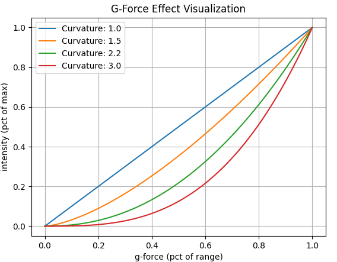{ width="411px" height="320px" }

### Gear Buffet

-   DCS, MSFS, XPLANE

-   Peak intensity for gear drag buffeting effect

### Gear Motion

-   Peak vibration intensity when gear is moving, and clunks at end of
    travel.

### Gun Vibration

-   DCS

-   Peak intensity for gunfire effect

### Hands Off Deadzone

-   MSFS HPG Helis

-   Distance at which hands-off resumes (MUST be lower than hands-on)
    See ***Special HPG Helicopter Implementation ***
    section

### Hands On Deadzone

-   MSFS HPG Helis

-   Distance required to trigger a hands-on condition See ***Special HPG
    Helicopter Implementation *** section

### Heli Engine/Rotor Rumble

-   DCS, MSFS

-   Rumble intensity for helicopter engine/rotor effect

### IL2 Shake Master

Sims Supported: **IL2**

-   While the majority of the settings for use in IL-2 are similar or
    identical to those that are used in DCS and MSFS, there are
    several that differ.

-   IL-2 has several native FFB effects that can overlap with what
    TelemFFB is capable of generating. Specifically weapons release,
    runway rumble and buffeting. The benefit of implementing these in
    TelemFFB is that each effect is individually configurable both
    from an enable/disable perspective as well as the intensity.

    - **Buffeting -** Common setting for all buffeting (stall, gear, etc) - (IL2 limitation)
    - **Runway Rumble**
    - **Weapon Effects**

These three effects are generated by IL-2 by default. If you wish to use the effects generated by TelemFFB in lieu of those generated by IL-2, you can enable the master setting in the TelemFFB config and then disable the 'shaking' effects in the IL-2 FFB settings as follows. Navigate to Settings-\>Input Devices and move the 'Shaking' slider to 0.

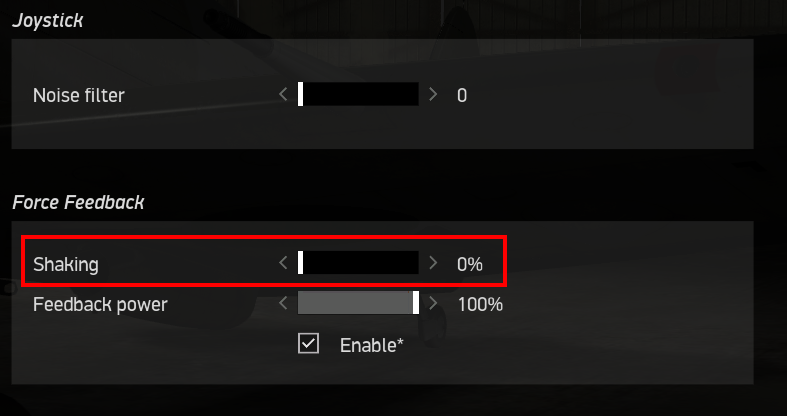{ width="531px" height="280px" }

### Jet Engine Rumble

-   Set intensity of jet engine rumble effect.

    -   **Jet Engine Rumble Freq** Vibration Frequency

### Nosewheel Shimmy

-   Sets intensity of the nosewheel shimmy effect

    -   **Nosewheel Shimmy min brakes**

    -   **Nosewheel Shimmy min speed**

### Overspeed Shake

-   Sets the shake intensity when overspeed occurs

    -   **Overspeed Shake Start Speed**

### Override Configurator Sliders

This feature allows you to override the gain sliders that are currently set via VPforce Configurator when loading into an aircraft. See the dedicated section ***Dynamic Configurator Gains*** for details.

### Override DCS Spring

Sims Supported:

-   **DCS**

Allows to override the spring forces set by DCS and apply a static spring force. Useful for 3rd party mods that do not support FFB.

### Pedal Spring Mode

Sims Supported: **DCS**, **IL2**

In addition to pedal trimming, TelemFFB now implements dynamic switching between 3 different modes for Helicopters (No Spring), Jets (Static Spring) and Prop aircraft (Dynamic Spring). The modes may be overridden on a per aircraft basis by adding the applicable mode setting to that aircraft section in the configuration. In Dynamic Spring mode, force is based on Pedal Spring Gain, between 0 and Vs speed (%25 of force) and Vs and Vne speeds (remaining %75)

All of the DCS warbirds have default values built into the application for the V speeds. It is possible to override the default internal V~S~ and V~NE~ speeds as well as the spring gains.

- **Pedal Spring Gain** - Percent of spring setting in VPForce Configurator
- **Pedal Dampening Gain** - Percent of damper setting in VPForce Configurator

To change the V speeds or add V speeds to a non-warbird type aircraft, or adjust the gain values, you can edit the following settings in **Advanced Pedal Mode Settings**:

-   Stall Speed V~S~
-   V~S~ Gain
-   Never Exceed Speed V~NE~
-   V~NE~ Gain

### Pedal Trimming

Sims Supported: **DCS**

DCS does not properly support FFB pedals. As such, the following implementation has been added to TelemFFB to enable both correctly behaving spring forces as well as trimming for fixed wing aircraft that have rudder trimmers. Helicopter trimming is not currently supported as there are currently no viable methods to deal with the "double input" effect that is generated by the "instant trim" option for those helicopters which support pedal trimming. Additionally, helicopters like the Mi-24 implement an approximation of the real helicopter's "foot microswitch" logic which detects when the pilot\'s feet are on the pedals. None of the modes for this simulation of that switch logic are conducive to integrating with FFB trim following. The shining light is that with the auto-switching to springless mode for helicopters, pedal trimming is not really necessary. Default is ON for Propeller and Jet aircraft.

### Prop Diameter

Sims Supported: **MSFS**, **XPLANE**

-   Aircraft Prop Diameter, used in dynamic airflow calculations

### Propeller Rumble

-   Enable Propeller Rumble
-   The two RPM and intensity settings work together to define how the effect behaves. At the **Low RPM** value, the rumble effect will be played at **Low Intensity**. As the RPM increases, the intensity will **decrease **proportionally all the way up to the **High RPM** value, where the intensity will reach **High Intensity**. Note that these are not floor values. If the RPM drops below **Low RPM**, the intensity will increase above **Low Intensity**.
-   Generally speaking, high frequency vibrations will feel stronger at equal intensities. The "High RPM" intensity should be **lower** than the "Low RPM" intensity
    -   **Engine Rumble High RPM** - high RPM threshold
    -   **Engine Rumble High Intensity** peak intensity of engine rumble
        at high RPM
    -   **Engine Rumble Low RPM** low RPM threshold
    -   **Engine Rumble Low Intensity** peak intensity of engine rumble
        at low RPM

### Rotor Blade Count

-   Count of helicopter rotor blades, used in ETL and Heli Rumble.

### Rudder Expo

Sims Supported: **MSFS**, **XPLANE** Fixed Wing

-   Rudder expo value. See [Aileron Expo](#aileron-expo)

### Rudder Max Force

Sims Supported: **MSFS**, **XPLANE** Fixed Wing

-   Rudder maximum value. See [Aileron Max Force](#aileron-max-force)

### Rudder Prop Flow

Sims Supported: **MSFS**, **XPLANE** Fixed Wing

-   Scaling of dynamic effects on rudder

### Runway Rumble

-   Peak runway rumble intensity

### Speedbrake Buffet

-   Peak intensity for speed brake buffeting effect

### Speedbrake Motion

-   Peak intensity for speed brake motion effect

### Spoiler Buffet

-   Peak buffeting intensity when spoilers deployed

### Spoiler Motion

-   DCS F14 Only

-   Peak vibration intensity when spoilers are moving

### Spring Centering (not FBW)

Sims Supported: **MSFS**, **XPLANE**

-   Enable spring centering for aircraft while maintaining dynamic
    forces. ****Do not use together with FBW**.** Gains are a
    percentage of the spring force value in VPforce Configurator

**Aileron Spring Gain** - Aileron spring gain

**Elevator Spring Gain** Elevator spring gain

**Rudder Spring Gain **- Rudder spring gain

### Stall AoA

-   **DCS, IL2**

-   Stall Angle of Attack

### Trim Following

-   MSFS, XPLANE
-   Requires **Axis Control** - Enable physical stick movement with in-game trims.
-   How it works:
    -   Trim position is read from the sim
    -   Physical stick center point is calculated using the 'physical' position gain
    -   Physical stick center is sent to the joystick/pedals
    -   Virtual stick position is calculated using the 'virtual' position gain
    -   Virtual stick position is sent to MSFS

- **X Trim Gain Physical** - Aileron/Cyclic Lateral physical movement scalar (100%)
- **X Trim Gain Virtual** - Aileron trim movement of virtual (in-game) controls
- **Y Trim Gain Physical** - Elevator/Cyclic Lon. physical movement scalar (100%)
- **Y Trim Gain Virtual** - Elevator trim movement of virtual in-game controls. 
>Out of these six settings, this is perhaps the most important one, since elevator trim is so commonly used

    Adjust Y Trim Gain Virtual so that moving the elevator trim in-game does not pitch aircraft when the stick is not physically moved. It helps to set spring force to 0 in Configurator (just Apply, do not Store) to find the best value for this parameter, because you don't want any motion of the stick while trimming. To configure, fly aircraft straight and level at cruise speed. Keep the stick in one position and slowly apply nose-down trim. If the nose goes up, raise the virtual % - if the nose goes down, lower the virtual % - the value might be negative. 
    You are aiming for no nose-up or nose-down with trim input. Adjust the trim and observe the reaction again. It will take a few iterations. The goal is to have the trim adjustment have no effect with the stick not moving. You can adjust by 5%, 1% when you are close. 
    Enjoy your new realistic trim!

- **Rudder Trim Gain (physical)** - Rudder physical trim movement scalar (100%)
- **Rudder Trim Gain (virtual)** - Rudder trim movement of virtual (in-game) controls

### Trim Workaround

-   DCS
-   Some DCS modules do not properly implement joystick following for trim inputs. This feature mimics the trim movement by moving the physical joystick with the trim

### Uncoordinated Turn Effect

-   MSFS
-   Simulate body acceleration effect on stick in uncoordinated turns

### Use Legacy Bindings

-   MSFS Only
-   For helicopters that still use aileron/elevator or rudder bindings
-   Requires **Axis Control**

### VNE Override

-   MSFS, XPLANE Fixed Wing

-   Overrides V~NE~ read from telemetry for dynamic force calculations

### VRS Effect

-   MSFS, XPLANE Helis
-   Vortex Ring State effect

### Weapon Effect Direction

-   DCS
-   Direction of applied force for weapons effects \| range 0-359 or set to -1 for random

### Weapon Release

-   DCS
-   Peak intensity for weapons release effect, 0 to disable

### Wind Effect

-   DCS

-   Adjust the maximum intensity the wind effect can attain


## Troubleshooting

### Digital Combat Simulator (DCS)

#### No telemetry received from DCS

If you are not receiving telemetry from DCS, please ensure the following:

- Check the DCS export.lua script
    - Verify the TelemFFB export line exists in your DCS export.lua (the script TelemFFB installs).
    - Edit the export.lua ordering: move the TelemFFB entry up or down (sometimes a script loaded before/after can interfere). Try TelemFFB at the top, then try it at the bottom.
    - Temporarily disable or remove other custom export scripts to see if one of them conflicts.

- Restart services after edits
    - After changing export.lua you must restart DCS (and restart TelemFFB). Try both sequences: start TelemFFB first then DCS, and vice‑versa.

- Confirm TelemFFB settings and instance
    - In TelemFFB System → Simulator Setup, ensure DCS support is enabled.
    - If running multiple instances, confirm the master/child instance selection and that the instance handling DCS is active.

- Check logs
    - Open TelemFFB logs (System → Open Config/Log directory) and look for export/connect errors
        - Check the DCS log for the exact string `telemFFB installed` — this should print when the TelemFFB export module loads.
        - Inspect the TelemFFB log for any errors or exceptions (stack traces, import errors, or repeated warnings). Include these logs when requesting support.
        - Inspect any DCS export/script logs for errors related to loading `export.lua` (syntax errors, load failures, or runtime exceptions).

    - Permissions / antivirus / file corruption
        - Ensure DCS and TelemFFB can read `export.lua` (no permission or UAC issues).
        - Temporarily disable or whitelist TelemFFB and the export script in antivirus/firewall if you suspect blocking.
        - If `export.lua` appears corrupted, restore from backup or reinstall the export script (use TelemFFB Auto DCS Setup).

    - Version / installation sanity checks
        - Confirm you have the correct TelemFFB build for your DCS version.
        - Re-run TelemFFB’s Auto DCS Setup to reinstall the export scripts and DLLs.
        - Backup your user config (`userconfig.xml`), then try reinstalling TelemFFB as a last resort.

    - Quick debug steps
        - Start DCS to the main menu, verify TelemFFB shows “Sim enabled” (or similar), then enter a mission and watch for telemetry.
        - Test in a minimal environment: temporarily remove other custom export scripts/mods, install only TelemFFB’s `export.lua`, restart DCS and TelemFFB.
        - If it still fails, capture and attach:
            - TelemFFB log file(s)
            - DCS log(s) showing whether `telemFFB installed` appears
            - A copy of your `export.lua` (or the snippet that references TelemFFB)

    - Use the built‑in support bundle
        - TelemFFB can create a support bundle (Help → Create Support Bundle). This produces a timestamped zip containing logs, system settings and user config.
        - Generate the bundle and attach it when requesting help — it accelerates diagnosis and usually contains the needed logs/configs.

    If these steps don’t resolve the issue, provide the TelemFFB log(s), the generated support bundle (or raw logs), and your `export.lua` contents — ordering/conflicts in `export.lua` are a very common cause and typically reveal the root cause quickly.


### Microsoft Flight Simulator (FS2020/FS2024)

#### Elevator Axis Flutter or Sudden Reversal in MSFS

If you experience a situation in Microsoft Flight Simulator (MSFS/FS2024) where the yoke or stick responds normally in pitch and roll, but the elevator axis (pitch) is fluttering strongly, or with the Rhino pulled fully back it suddenly reverses—even when stationary on the ground—while the axes appear perfectly smooth and proportional in Windows Devices and Printers, this is almost always caused by a control binding conflict in the simulator.

**Root Cause:**

MSFS does not natively support force feedback, so TelemFFB takes exclusive control of the axes to provide dynamic FFB and effects. If the same axis (e.g., elevator/pitch, aileron/roll, or rudder) is also bound in the MSFS controls menu, the simulator will attempt to read both the physical device input and the virtual position set by TelemFFB. This results in a feedback loop or conflict, causing strong fluttering, jitter, or unpredictable behavior—especially at the extremes of travel.

In contrast, Windows Devices and Printers simply shows the raw hardware input, which is why the axis appears smooth and normal there.

**Solution:**

You must ensure that all axes controlled by TelemFFB are **unbound** in the MSFS controls menu. This includes elevator (pitch), aileron (roll), and rudder axes. If these axes remain bound in MSFS, the simulator will conflict with the values TelemFFB is sending, resulting in erratic movement.

**Steps to resolve:**

1. Open MSFS and go to the Controls Options menu.
2. Select your Rhino device from the list of controllers.
3. For each axis that TelemFFB is controlling (typically elevator, aileron, and rudder), remove or clear any in-game axis bindings. The axis should not be assigned to any in-game control.
4. Save your changes and restart the simulator if needed.

!!! note
    For X-Plane, this is not an issue because there is an override toggle in the sim that allows TelemFFB to take exclusive control of the axes. In MSFS, you must manually unbind the axes to avoid conflicts.

If you continue to experience issues after unbinding the axes, double-check that no duplicate or hidden bindings remain, and ensure that only TelemFFB is controlling the device axes during flight.
