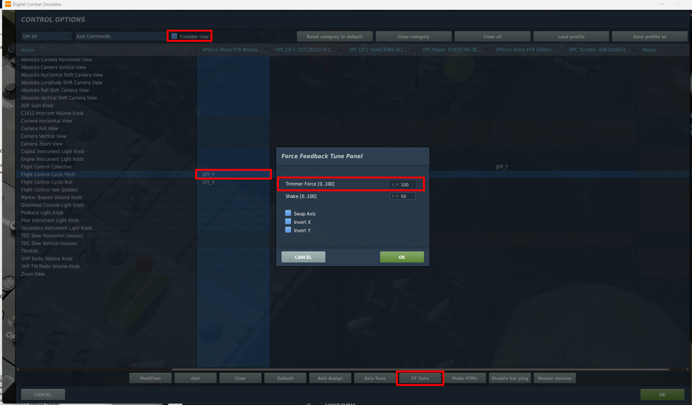
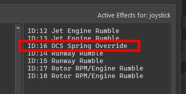
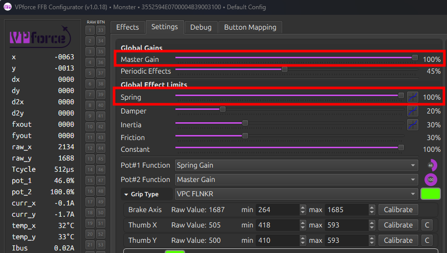
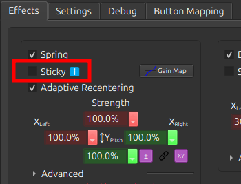
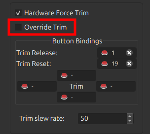

# Troubleshooting

### WinUSB / WebUSB Firmware Update Issues

**Issue:**
On **Windows 10/11** with **firmware 1.0.16 and older**, the Rhino may appear correctly in Windows, but **WinUSB fails to operate**, preventing firmware updates through WebUSB. Users may see `network error`s in the WebUSB tool. This problem is fixed in newer firmwares.

You can apply a simple registry fix to restore WebUSB functionality. This requires administrative privileges.

**Steps:**

- Press **Start**, type PowerShell, right-click **Windows PowerShell**, and select **Run as administrator**.
- Paste the following command and press **Enter**:
    `HKLM:\\SYSTEM\\CurrentControlSet\\Enum\\USB\\VID_FFFF&PID_2055&MI_03\\\*\\DeviceParameters\" -Name \"DeviceInterfaceGUID\" -Value`
- **Unplug** the Rhino from the USB port and **plug it back in**.
- Test the connection in the WebUSB tool - firmware updates should now work as expected.

!!! note
    - This workaround only applies to **firmware 1.0.16 and older**. Updating the latest firmware will remove the need for this registry modification.
    - Only run the command exactly as provided; editing the registry incorrectly can cause system issues.

### - Game Specific Troubleshooting

Various items can cause issues with FFB depending on the sim in question. This section will cover common issues and basic troubleshooting steps that can be used to identify and fix the problem. This section is a living list that will be updated as new issues/causes/solutions are identified.

#### - DCS

By default, the Spring effect, which is the primary 'FFB' effect type, is owned and managed by DCS. The TelemFFB application does not alter the spring effect unless one of the several override options are enabled.

If FFB is not working, follow the below procedure:

##### Ensure FFB is enabled in the DCS Misc. settings

1.  Even with FFB disabled, DCS will create a disabled FFB effect (which renders the joystick limp). However, it will never 'start' the effect, so it remains limp even after loading into an aircraft.

    { width="330px" height="193px" }

2.  Ensure the 'FF Tune' settings for the axes are non zero and at the value you intend (default is %100 and recommended to keep it at %100)

    1. This involves going into a modules' axis settings, ensuring '**Foldable View**' is disabled, **selecting the axis binding** and then choosing the **'FF Tune'** button at the bottom.

    { width="563px" height="330px" }

    2. This is the 'strength' of the spring effect that DCS will use for that axis for that aircraft. Recommended to leave it at %100

##### Test without TelemFFB running

1.  **If the issue persists, TelemFFB is not at fault. Proceed to next step**

2.  If the issue goes away, likely some configuration inside TelemFFB is causing it.

    1. Check the '**Active Effects**' panel on the TelemFFB **Monitor **page. Look for any spring override type effects and disable any which are active.

    { width="251px" height="127px" }

    2. If the cause is one of the effects, please read the documentation for the effect and ensure you understand its use and purpose. All of the TelemFFB override type effects have very specific use cases.

    3. If no active effects are causing the issue, check to see if you are pushing a VPforce Configurator profile or are using the Configurator Gains override feature.
    { width="361px" height="227px" }
        - Both of these options could make it seem like FFB is not working. If you are setting the **master gain** or **spring gain** to 0 with configurator overrides, or you are pushing a configurator profile with 'sticky spring' or the spring gain slider turned down, it will seem as if "FFB is not working"

    4. If TelemFFB has been determined to be the cause, but the above steps did not reveal the issue, reach out to the **#TelemFFB-User** channel on the VPforce discord

##### Check your configurator settings

1.  Make sure that your master-gain and spring gain sliders are nonzero and are high enough that you feel the spring force you are expecting. These sliders define the maximum force that the Rhino can generate and if they are low/zero, it does not matter what the game sets the spring effect at, it will be no stronger than the combination of those sliders.

{ width="319px" height="181px" }

2. Make sure you do not have **'Sticky' **enabled in the spring effect on the VPforce configurator **'Effects' **tab.
    -  This option tells the Rhino to ignore the spring effect from the game and use the one that is configured there in the Effects tab.
    { width="242px" height="184px" }

3.  If the issue is with in-game trimming, ensure you do not have '**Override Trim'** enabled in the hardware force trim section of the VPforce Configurator **Effects **tab
    -  This option tells the Rhino to ignore the spring center information from the game and control the spring center using the hardware trim bindings in the Effects tab

    { width="239px" height="214px" }

4.  Check your **potentiometer settings**.

    -  Make sure the Pot#1 (and 2, if applicable) are configured as you intend and that the current values are what you expect. If your Pot is configured for Master Gain or Spring Gain and turned all the way down, FFB will seem to *not work*.

{ width="493px" height="383px" }

##### Check for 3rd party app issues

1. **vJoy**

    1. vJoy is known to cause issues with FFB, particularly ef the FFB options are enabled, which they typically are by default when vJoy is installed.
    { width="299px" height="191px" }

    2. **SimHaptics** by rKApps

        - SimHaptics has an '**Auto Start**' feature that is known to break FFB for DCS. The app tries to start at the same time the aircraft in DCS is loading and this somehow interferes with DCS starting the FFB Spring effect.

6.  **The Nuclear Test**

    If all of the above fails to reveal the issue, try with a fresh Saved Games folder. This will remove any active mods, or any 3rd party app that makes use of the DCS export environment as a potential cause of the issue

    1.  Close DCS and rename your 'DCS' (or whatever is active) saved games folder to something like 'DCS.backup'

    2.  Start DCS. It will create a completely clean 'DCS' folder with no mods, export scripts or even bindings.

    - Here you can choose to copy your bindings from the `config/input` folder in your real DCS.backup folder over to the new test folder. Restart DCS after doing so

If the issue still persists, then you either did not complete all of the steps above, or there is something unknown occurring. As you will have already determined TelemFFB not to be the issue, reach out to the #Support channel on the VPforce Discord.