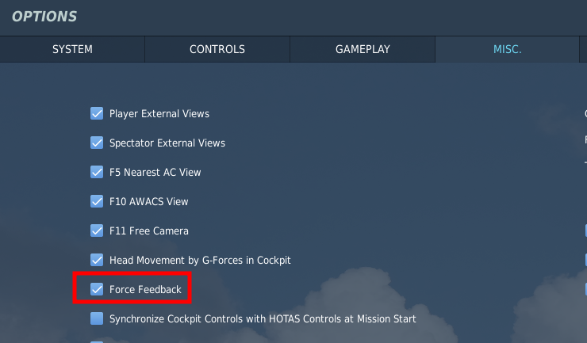
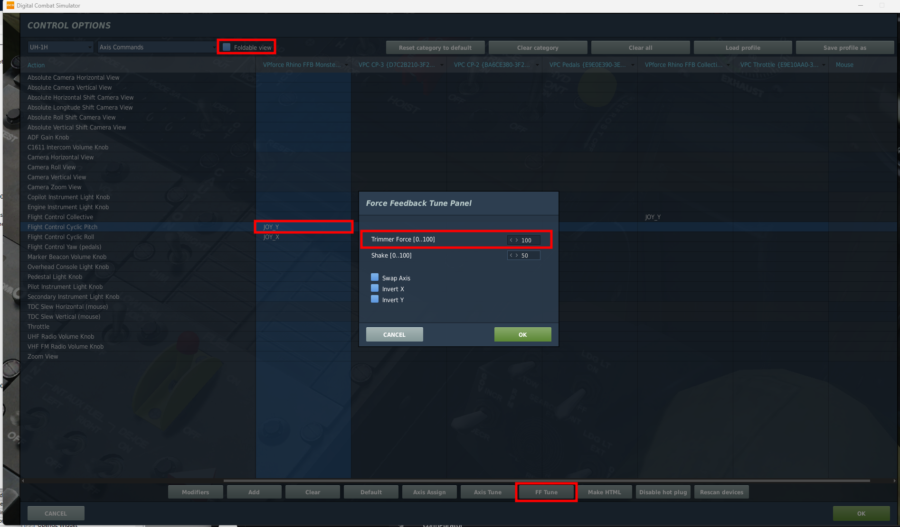
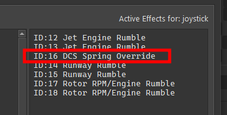
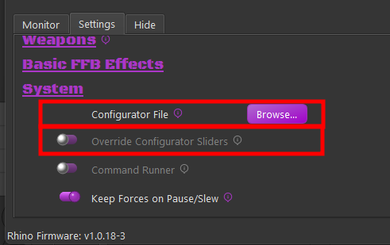
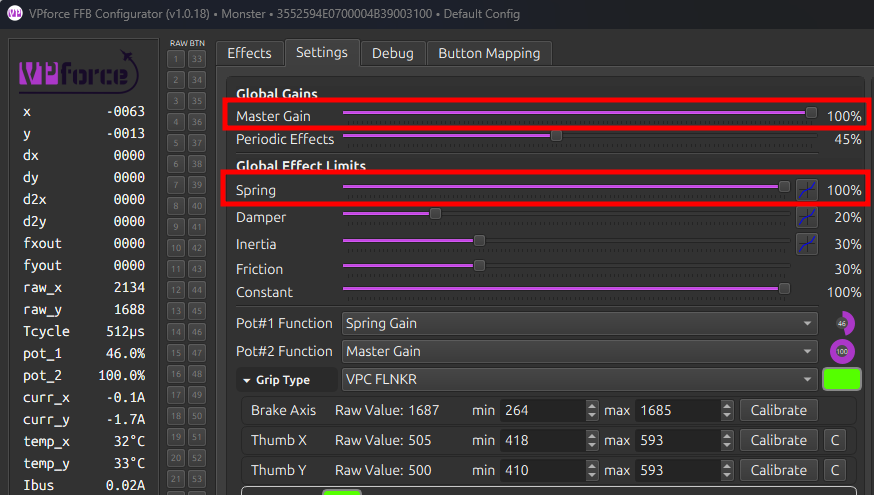
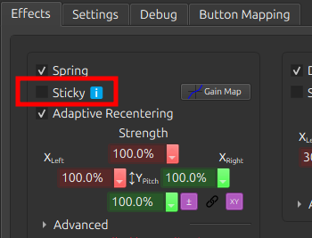
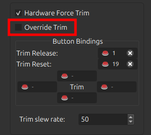
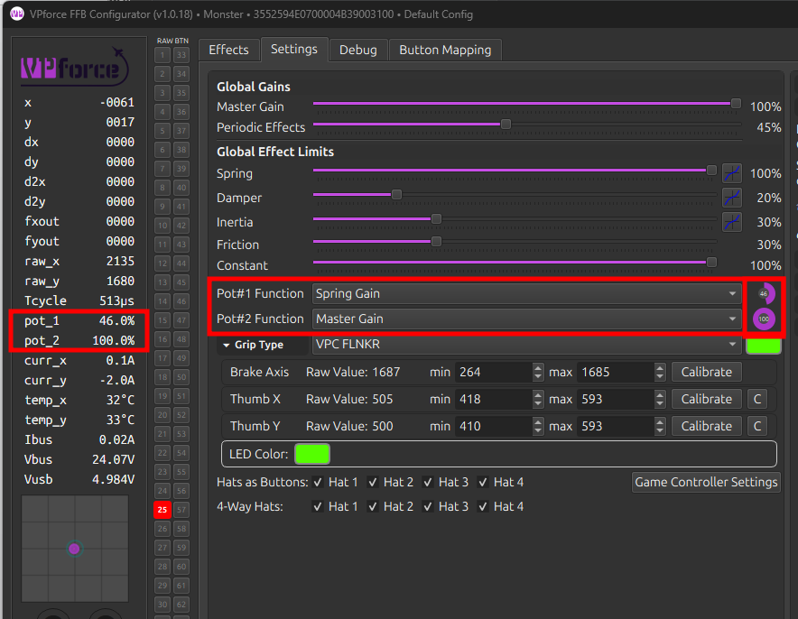
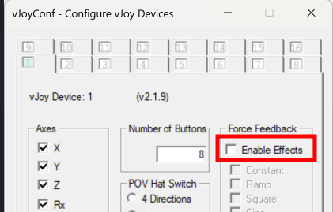

# Game Specific Troubleshooting

Various items can cause issues with FFB depending on the sim in question. This section covers common issues and troubleshooting steps for each supported simulator. This is a living list that will be updated as new issues, causes, and solutions are identified.

---

### DCS World

#### FFB Not Working

By default, the Spring effect — the primary FFB effect type — is owned and managed by DCS. The TelemFFB application does not alter the spring effect unless one of the several override options are enabled.

If FFB is not working, follow the procedure below:

!!! note
    This procedure assumes you have already confirmed that your Rhino is connected and working properly with VPforce Configurator and that you can feel FFB effects when using the Configurator's test effects.

!!! important
    DCS does not generate any active FFB effects until you are loaded into an aircraft. Simply being in the main menu or mission editor will deactivate any *Spring* effect set in the *VP Configurator* — therefore the joystick will remain limp.

##### Ensure FFB is enabled in the DCS Misc. settings

1. Even with FFB disabled, DCS will create a disabled FFB effect (which renders the joystick limp). However, it will never 'start' the effect, so it remains limp even after loading into an aircraft.

    { width="330px" height="193px" }

2. Ensure the 'FF Tune' settings for the axes are non-zero and at the value you intend (default is 100% and recommended to keep it at 100%).

    1. This involves going into a module's axis settings, ensuring '**Foldable View**' is disabled, **selecting the axis binding**, and then choosing the **'FF Tune'** button at the bottom.

    { width="563px" height="330px" }

    2. This is the 'strength' of the spring effect that DCS will use for that axis for that aircraft. Recommended to leave it at 100%.

##### Test without TelemFFB running

1. **If the issue persists, TelemFFB is not at fault. Proceed to the next step.**

2. If the issue goes away, a TelemFFB configuration is likely the cause.

    1. Check the '**Active Effects**' panel on the TelemFFB **Monitor** page. Look for any spring override type effects and disable any which are active.

    { width="251px" height="127px" }

    2. If the cause is one of the effects, please read the documentation for the effect and ensure you understand its use and purpose. All of the TelemFFB override type effects have very specific use cases.

    3. If no active effects are causing the issue, check to see if you are pushing a VPforce Configurator profile or are using the Configurator Gains override feature.
    { width="361px" height="227px" }
        - Both of these options could make it seem like FFB is not working. If you are setting the **master gain** or **spring gain** to 0 with configurator overrides, or you are pushing a configurator profile with 'sticky spring' or the spring gain slider turned down, it will seem as if "FFB is not working".

    4. If TelemFFB has been determined to be the cause but the above steps did not reveal the issue, reach out to the **#TelemFFB-User** channel on the VPforce Discord.

##### Check your configurator settings

1. Make sure that your master gain and spring gain sliders are non-zero and high enough that you feel the spring force you are expecting. These sliders define the maximum force the Rhino can generate — if they are low or zero, it does not matter what the game sets the spring effect at, it will be no stronger than the combination of those sliders.

{ width="319px" height="181px" }

2. Make sure you do not have **'Sticky'** enabled in the spring effect on the VPforce Configurator **'Effects'** tab.
    - This option tells the Rhino to ignore the spring effect from the game and use the one configured in the Effects tab.
    { width="242px" height="184px" }

3. If the issue is with in-game trimming, ensure you do not have **'Override Trim'** enabled in the hardware force trim section of the VPforce Configurator **Effects** tab.
    - This option tells the Rhino to ignore the spring center information from the game and control the spring center using the hardware trim bindings in the Effects tab.

    { width="239px" height="214px" }

4. Check your **potentiometer settings**.

    - Make sure Pot#1 (and Pot#2, if applicable) are configured as you intend and that the current values are what you expect. If your Pot is configured for Master Gain or Spring Gain and turned all the way down, FFB will seem to *not work*.

{ width="493px" height="383px" }

##### Check for 3rd party app issues

**vJoy**

vJoy is known to cause issues with FFB, particularly if the FFB options are enabled — which they typically are by default when vJoy is installed.

{ width="299px" height="191px" }

For resolution steps, see **[Known Issues — vJoy / DCS World](appendix-a-known-issues.md#dcs-world)**.

**SimHaptics by rKApps**

SimHaptics has an '**Auto Start**' feature that is known to break FFB for DCS. The app tries to start at the same time the aircraft in DCS is loading and this somehow interferes with DCS starting the FFB Spring effect.

**DCS Force Feedback Fix — dinput8 wrapper**

A community-developed, open-source DirectInput wrapper DLL that solves two persistent DCS FFB problems:

- **FFB sent to wrong devices** — DCS can route force feedback commands to unintended devices such as vJoy, pedals, a collective axis, or a steering wheel. The wrapper lets you block FFB for specific devices by name, so only your actual FFB joystick receives forces.
- **FFB dies after USB reconnect** — If the FFB joystick disconnects mid-mission (USB replug, firmware update, etc.), DCS re-creates the device but does not restart the force effects. Spring centering and trim forces go dead until the mission is restarted. The wrapper tracks active effects and automatically restores them after reconnect.

Setup:

1. Download `dinput8.dll` and `dinput8.ini` from the [releases page](https://github.com/walmis/dcs-force-feedback-fix/releases).
2. Drop both files into your DCS `bin-mt` folder (next to `DCS.exe`).
3. Edit `dinput8.ini` to block unwanted devices.
4. Launch DCS — check `dinput8_wrapper.log` for detected device names and details.

Example `dinput8.ini` configuration:

```ini
[FFBDevices]
vJoy=block          ; Block all FFB for any device with "vJoy" in the name
Pedals=block        ; Block FFB for any device with "Pedals" in the name
Collective=block    ; Block collective FFB for helicopters
```

Source code and releases: [github.com/walmis/dcs-force-feedback-fix](https://github.com/walmis/dcs-force-feedback-fix)

**The Nuclear Test**

If all of the above fails to reveal the issue, try with a fresh `Saved Games/DCS` folder. This will remove any active mods or 3rd party apps that make use of the DCS export environment as a potential cause.

1. Close DCS and rename your `Saved Games/DCS` folder to something like `Saved Games/DCS.backup`.

2. Start DCS. It will create a completely clean `Saved Games/DCS` folder with no mods, export scripts, or even bindings.

You can choose to copy your bindings from the `config/input` folder in your real `Saved Games/DCS.backup` folder over to the new test folder. Restart DCS after doing so.

---

#### Not Receiving Telemetry

TelemFFB receives telemetry data from DCS via a native DLL loaded through the DCS export system. If TelemFFB shows as connected but no telemetry data is being received — effects are absent, the telemetry window shows no data, or the status indicator remains idle — the DLL export hook is typically the cause.

##### Verify the Export.lua entries

TelemFFB requires two specific lines to be present in your DCS export script:

```
Saved Games\DCS\Scripts\Export.lua
```

The file must contain the following entries:

```lua
package.cpath = package.cpath .. ";"..require('lfs').writedir().."\\Scripts\\?.dll"
require("telemffb")
```

If either line is missing or malformed, DCS will not load the TelemFFB DLL and no telemetry data will be received.

!!! note
    If you already have an `Export.lua` from another application (such as Helios, SRS, or VoiceAttack), the TelemFFB entries must be added to the existing file — not used as a replacement. See the [TelemFFB installation documentation](../telemffb/installation.md) for instructions.

##### Check the DCS log for successful DLL load

The most reliable way to confirm TelemFFB is loading correctly is to check the DCS log file after launching a mission:

```
Saved Games\DCS\Logs\dcs.log
```

Search the log for the string:

```
telemffb installed
```

If this entry is present, the DLL has been successfully loaded by DCS and the export hook is active. If it is absent, DCS did not load the TelemFFB DLL — proceed to the remediation steps below.

##### Check for errors from other export modules

While reviewing `dcs.log`, also look for any errors related to other export scripts that are loaded alongside TelemFFB in `Export.lua` (such as Helios, SRS, or VAICOM). An error in another module that runs before the TelemFFB entries can halt execution of the export script entirely, preventing TelemFFB from loading even if its own entries are correct.

##### Remediation — adjust load order in Export.lua

A common cause of the DLL failing to load is a conflict with the load order of other entries in `Export.lua`. If `telemffb installed` does not appear in the DCS log:

1. Open `Saved Games\DCS\Scripts\Export.lua` in a text editor.
2. Move the TelemFFB lines to the **very top** of the file, before all other entries.
3. Save the file, restart DCS, and load into a mission.
4. Check `dcs.log` again for `telemffb installed`.
5. If it still does not appear, try moving the TelemFFB lines to the **very bottom** of the file instead and repeat.

Changing the load order resolves the majority of cases where the DLL fails to initialize due to interactions with other export modules.

If the above steps do not resolve the issue, reach out to the **#TelemFFB-User** channel on the VPforce Discord.

---

#### Autopilot Misbehaving or Disengaging Unexpectedly

**Issue:**

Autopilot systems (altitude hold, heading hold, or other AP modes) behave erratically, continuously pitch/roll in one direction, or disengage unexpectedly shortly after engagement. This problem occurs frequently but may occasionally work correctly, making diagnosis difficult. Common in the F-14 Tomcat, but can affect any aircraft with autopilot.

**Root Cause:**

Many aircraft autopilot systems interpret a mismatch between the in-game trim point and the physical stick position as a **hands-on override** — the pilot intentionally taking control. When the physical stick position doesn't match the trimmed neutral point, the autopilot computer detects this as pilot input and either fights the stick position or disengages entirely.

Aircraft with offset control mechanics (like the F-14 Tomcat, which has forward-offset by design) are particularly susceptible. When autopilot engages or commands trim adjustments, any offset between trim point and stick position causes the autopilot to treat it as active pilot input, leading to erratic behavior or immediate disengagement.

**Diagnostic Steps:**

1. Enable the **Input Overlay** in DCS:

    - Press `RCtrl + Enter` (Right Control + Enter)
    - This displays stick position and trim offset in real-time
    - The overlay shows the physical stick position and the current trim point

2. Observe stick position vs. trim point:

    - Watch the input overlay while the issue occurs
    - Check if the stick closely follows the trimmed point offset
    - If the stick lags behind the trim point → autopilot interprets the mismatch as pilot override
    - The autopilot sees this offset as intentional pilot input and either fights it or disengages

**Solutions:**

1. **Enable Adaptive Recentering** (Recommended)

    - Open **VPforce Configurator**
    - Locate **Adaptive Recentering** in the Effects tab
    - This automatically balances the stick to the current trim point, eliminating offset mismatch
    - Prevents autopilot from detecting false pilot override
    - Provides smoother stick behavior overall

2. **Manual Stick Adjustment**

    - Before activating autopilot, manually adjust stick position to match the trimmed point (use Input Overlay to verify alignment)
    - Once synchronized, activate autopilot
    - Less convenient but demonstrates the root cause

3. **Configure Input Deadzone**

    - Open **VPforce Configurator** → **Axes** tab
    - Add a small circular deadzone (e.g., 1–3%)
    - VPforce uses a circular deadzone that affects both axes simultaneously
    - Creates a tolerance zone where minor stick position variations won't register as pilot input
    - Allows autopilot to maintain control despite small trim offset differences
    - Trade-off: Reduces precision for manual control

4. **Disable DCS Input Curves**

    - Open DCS axis settings for the affected aircraft
    - Check if curves are enabled for pitch/roll axes
    - Curves cause the physical stick position and in-game trim position to mismatch increasingly as you move away from center
    - Disable curves by setting the curve to a straight line (linear response)
    - Linear response ensures physical stick position always matches in-game trim position

5. **TelemFFB Dynamic Deadzone** (Aircraft-Specific)

    - TelemFFB supports automatic dynamic deadzone activation when autopilot is engaged for certain aircraft
    - When AP engages, TelemFFB automatically adds deadzone to prevent false override detection
    - Deadzone is removed when AP disengages, restoring full control precision
    - Check TelemFFB documentation for aircraft-specific AP deadzone support

!!! note "Related Issue"
    The F-14 also exhibits a **forward stick drift at 50% position** when loading into the aircraft (same as the A-10). This is intentional module design. The forward offset is part of the FFB implementation and is why trim synchronization is important for autopilot functionality.

If the issue still persists, reach out to the **[#support](https://discord.com/channels/965234441511383080/968208779084701716)** channel on the VPforce Discord.

---

#### Joystick Y Axis Is Very Far Forward

**Issue:**

After loading into certain aircraft — most notably the **F-14 Tomcat** and **A-10 Warthog** — the joystick sits significantly forward of center, even though the aircraft considers that position its neutral/trimmed point.

**This is not a bug.** These aircraft model the real-world asymmetric stick geometry of the actual airframe. In the real F-14 and A-10, the control stick has substantially more forward throw than aft throw, and the neutral/trim point sits forward of the physical midpoint of the stick's travel. DCS faithfully reproduces this in its native FFB implementation.

On a legacy desktop FFB joystick like the Microsoft Sidewinder, which has a short throw and sits on a desk, this forward offset is barely noticeable. On a modern FFB base with a long extension, the same offset translates to a pronounced and uncomfortable forward lean that makes the stick difficult to use.

**Resolution — Axis Rescaling in VPforce Configurator:**

The only way to compensate for this is to use the **Rescale Axes** feature in VPforce Configurator to shift the effective neutral point closer to the physical center of the stick's travel.

{ width="260" }

The screenshot above shows a starting point configuration for the A-10. The **X Left Max Position** is reduced to approximately **35%**, which moves the forward neutral point back toward the center of physical stick travel.

To configure this:

1. Open **VPforce Configurator** and navigate to the **Axes** tab.
2. Enable **Rescale Axes**.
3. Reduce the **forward (X Left) Max Position** value until the stick sits comfortably near center when the aircraft considers it neutral. The A-10 is around 35% as a starting point — adjust to taste.
4. Click **Apply Config** to test, and **Store Config** when satisfied.

!!! note
    With this configuration the stick's physical travel is no longer symmetric — you will have less forward throw available than aft. This reflects the actual aircraft geometry and is expected. The goal is simply to place the neutral point at a comfortable physical position rather than eliminating the asymmetry entirely.

!!! tip "Automate per-aircraft axis scaling with TelemFFB"
    Once you have dialed in a rescaled axis profile for a specific aircraft, you can save it as a VPforce Configurator profile and have TelemFFB automatically push it to the device every time that aircraft loads. See **[Dynamic VPforce Configurator Profile Assignment](../telemffb/vpconf-profiles.md#assigning-a-configurator-profile-to-a-specific-aircraft)** for instructions.

---

### Microsoft Flight Simulator (MSFS / FS2024)

#### A Feature Doesn't Work With a Specific Aircraft

TelemFFB interacts with MSFS using standard published **SimConnect** variables to retrieve the telemetry data that drives FFB effects — things like airspeed, G-load, angle of attack, surface deflections, trim position, autopilot state, and so on.

Many high-fidelity third-party aircraft implement their own internal flight models and systems without writing data back to the standard SimConnect variables that MSFS exposes. In these cases, TelemFFB may receive missing, zero, or incorrect values for certain parameters, causing specific effects to behave incorrectly or not at all for that aircraft.

**Possible workaround — aircraft L:Vars:**

Many third-party developers expose their internal data via **L:Vars** (local variables), which are aircraft-specific SimConnect variables that can be read by external applications. If an L:Var exists that provides the affected data, it can generally be used in a custom TelemFFB aircraft profile to substitute for the missing standard variable.

!!! warning "Not Yet User-Accessible"
    The interface for mapping custom L:Vars to TelemFFB effects is not yet fully documented or easily accessible to end users. If you encounter an aircraft where a specific effect is not working correctly, reach out on the **[#TelemFFB-User](https://discord.com/channels/965234441511383080/968208779084701716)** channel on the VPforce Discord — the community or developers may be able to assist with a custom profile.

**Known limitation — PMDG and SDK-only aircraft:**

Some aircraft, such as those by **PMDG**, do not expose their internal data through L:Vars and instead rely on a proprietary SDK for third-party integrations. TelemFFB does not currently have the capability to incorporate these aircraft-specific SDKs. For these aircraft, effects that depend on data the aircraft does not expose through standard channels will not function correctly, and there is no available workaround at this time.

---

#### HPG H145 Helicopter (FS2024)

The HPG H145 helicopter in Microsoft Flight Simulator 2024 uses the AFCS (Automatic Flight Control System) which requires precise hands-on/hands-off detection for proper operation. Improper configuration can cause the AFCS to oscillate or behave erratically.

**Prerequisites:**

- Use **build 500 or newer** of the H145 (patch available in pinned messages in the HPG Discord)
- Ensure TelemFFB is configured and running properly with the Rhino

**Required Configuration Steps:**

1. **Configure Tablet Settings for Cyclic**

    - Set tablet cyclic sensitivity according to the recommended configuration
    - In FS2024, reduced cyclic sensitivity is necessary to prevent AFCS overshoot and oscillation

2. **Configure Hands-On Detection**

    You have two options for hands-on detection:

    **Option A: Deadzone-Based Detection (Default)**

    With deadzone-based hands-on detection, the joystick must center properly, regardless of where that center point is:

    - Enable **"Adaptive Recentering"** in VPforce Configurator (required for reliable operation)
    - Adaptive Recentering ensures the stick tracks the trim point, providing proper centering behavior
    - Adjust hands-on/hands-off deadzone values in TelemFFB until you get reliable detection results
    - Test the detection by engaging AFCS and verifying it doesn't disengage unexpectedly

    **Option B: Force-Based Detection (Recommended)**

    Force-based detection is more reliable than deadzone-based detection:

    - Enable **"Axis Control → Force Mode"** setting in TelemFFB
    - **Disable** Adaptive Recentering when using Force Mode
    - Adjust the **Force Threshold** setting in TelemFFB (rather than standard deadzone settings) to configure when hands-on is detected
    - This mode detects pilot input based on force applied to the stick rather than position offset

**Troubleshooting:**

- If AFCS oscillates or overshoots: Reduce cyclic sensitivity in tablet settings
- If hands-on detection is unreliable: Adjust deadzone (Option A) or Force Threshold (Option B) values
- If stick doesn't center properly: Verify Adaptive Recentering is enabled (only for Option A)

---

### IL-2 Sturmovik

#### Not Receiving Telemetry

TelemFFB receives telemetry data from IL-2 Sturmovik over a local UDP connection between the sim and TelemFFB running on the same machine.

**Check 1 — Disable any active VPN connection**

An active VPN connection is one of the most common causes of telemetry not reaching TelemFFB. VPN software can intercept, reroute, or block local loopback and LAN UDP traffic even when communicating within the same machine. If you have a VPN running, disconnect it and test again before proceeding with any other troubleshooting steps.

**Check 2 — Verify TelemFFB auto-setup and IL-2 telemetry configuration**

TelemFFB includes an auto-setup feature that configures IL-2's built-in telemetry output and points it at the correct local port. Verify the following:

1. In TelemFFB, confirm that **Auto IL-2 Telemetry Setup** is enabled and that the **IL-2 Install Path** is set correctly. See **[IL-2 Sturmovik configuration](../telemffb/configuration.md#il-2-sturmovik)** for details on these settings.
2. If auto-setup is enabled and the path is correct, allow TelemFFB to perform the setup and restart IL-2.
3. If you have manually edited your IL-2 telemetry configuration, verify that the settings match what TelemFFB expects. Incorrect port numbers or IP addresses are a common cause of failure.

If telemetry is still not received after these checks, reach out on the **[#TelemFFB-User](https://discord.com/channels/965234441511383080/968208779084701716)** channel on the VPforce Discord.

---

### X-Plane

#### Not Receiving Telemetry

TelemFFB receives telemetry data from X-Plane via a plugin that sends data over a local UDP connection between the sim and TelemFFB running on the same machine.

**Check 1 — Disable any active VPN connection**

An active VPN connection is one of the most common causes of telemetry not reaching TelemFFB. VPN software can intercept, reroute, or block local loopback and LAN UDP traffic even when communicating within the same machine. If you have a VPN running, disconnect it and test again before proceeding with any other troubleshooting steps.

**Check 2 — Verify TelemFFB auto-setup and X-Plane plugin installation**

TelemFFB includes an auto-setup feature that installs the required X-Plane plugin and configures it to send telemetry to the correct local port. Verify the following:

1. In TelemFFB, confirm that **auto-setup for X-Plane** is enabled in the TelemFFB system settings.
2. If it is enabled, allow TelemFFB to perform the setup and restart X-Plane.
3. Verify the TelemFFB plugin is present and enabled in X-Plane's plugin manager. If it is listed but disabled, enable it and restart X-Plane.

If telemetry is still not received after these checks, reach out on the **[#TelemFFB-User](https://discord.com/channels/965234441511383080/968208779084701716)** channel on the VPforce Discord.

---

#### A Feature Doesn't Work With a Specific Aircraft

TelemFFB interacts with X-Plane using standard published **datarefs** to retrieve the telemetry data that drives FFB effects — things like airspeed, G-load, angle of attack, surface deflections, trim position, and autopilot state.

Some third-party aircraft for X-Plane implement custom systems without writing data back to the standard datarefs that X-Plane exposes. In these cases, TelemFFB may receive missing, zero, or incorrect values for certain parameters, causing specific effects to behave incorrectly or not at all for that aircraft. This is less commonly reported in X-Plane than in MSFS given the smaller user base, but the same underlying issue applies.

**Possible workaround — custom datarefs:**

Many third-party X-Plane developers expose internal data through custom datarefs. If a custom dataref exists that provides the affected data, it may be possible to use it in a custom TelemFFB aircraft profile as a substitute.

!!! warning "Not Yet User-Accessible"
    The interface for mapping custom datarefs to TelemFFB effects is not yet fully documented or easily accessible to end users. If you encounter an aircraft where a specific effect is not working correctly, reach out on the **[#TelemFFB-User](https://discord.com/channels/965234441511383080/968208779084701716)** channel on the VPforce Discord — the community or developers may be able to assist with a custom profile.

---

### Falcon BMS

!!! warning "Beta Support"
    Falcon BMS support in TelemFFB is currently in beta with limited usage and testing by the development team. Some effects may not work correctly or at all. If you encounter broken functionality or effects that don't behave as expected, please reach out on the **[#TelemFFB-User](https://discord.com/channels/965234441511383080/968208779084701716)** channel on the VPforce Discord so the development team can track and investigate issues.
