# Aircraft Profiles

## Adding New Aircraft Support

While TelemFFB has default profiles for many aircraft already, there are many hundreds of possible aircraft between all of the simulators that are supported. So, inevitably you will run into an aircraft that does not already have a built-in profile.

There are two ways to add support for new or unknown aircraft to TelemFFB:

- Dynamically when a new aircraft is loaded in a simulator
- Via the Profile Manager, independent of any running sim

### Accessing the New Aircraft Dialog

#### Dynamically from Main Window (Recommended)

If you are actively using a simulator and you load into an aircraft that does not have a default settings profile, you will see a reduced set of effects and a large "create new aircraft" button will appear. This method is preferred over the offline editor since TelemFFB will already know the proper name string for the aircraft.

Simply click on the "Create/clone config for new aircraft" button to launch the new aircraft wizard.

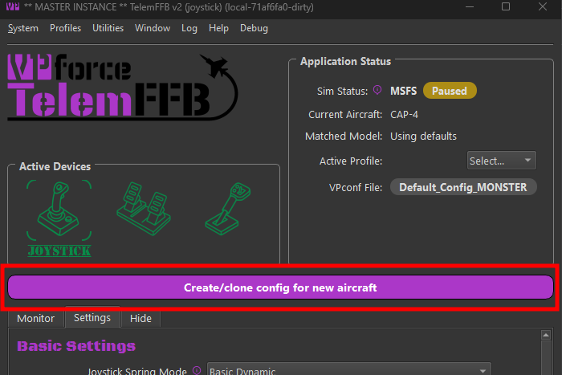{ width="396px" height="264px" }

#### Adding new Aircraft via Profile Manager (not recommended)

Open the Profile Manager.

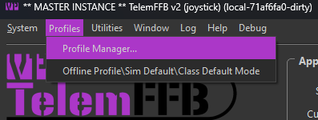{ width="335px" height="126px" }

In the resulting Profile Manager window, select the "New Aircraft Wizard" button. Again, this method of adding new aircraft is **NOT** recommended as it is difficult to know the exact string that TelemFFB will ultimately receive via the telemetry from a given simulator.

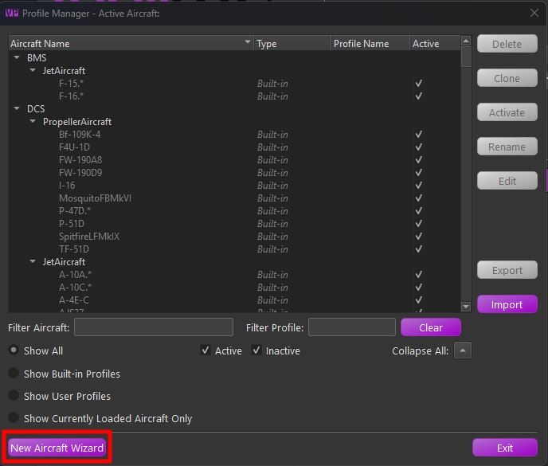{ width="415px" height="353px" }

### The Add New Aircraft Wizard

After accessing the wizard via one of the two methods above, simply follow the steps in the wizard to add the new aircraft.

**Page 1:**

1. **If manually adding a new aircraft**, select the simulator on the first page.

**Page 2:**

1. Select the appropriate aircraft class for the aircraft you are adding.

    - Note that for MSFS, the aircraft type will be auto-detected based on telemetry data. However, you should validate that the selection is correct.
    - This is particularly important for aircraft types with special treatment in MSFS, such as those from **HPG**, **FlyInside**, **CowanSim**, and others. These will be auto-detected as their base aircraft type, but the TelemFFB aircraft class needs to be configured properly to achieve full functionality for these aircraft.

**Page 3:**

1. **If manually adding a new aircraft**, enter the full aircraft name that will be sent via telemetry from the simulator.

    - If auto-detected, this will already be filled out for you.
2. Enter a regex match string for the aircraft. TelemFFB uses regex to match the aircraft string and apply the matching profile. Many aircraft, particularly in MSFS, have a base string followed by per-livery or variant text. To use the same profile for multiple variations or liveries, the match string must encompass all possible variations of the name.

    - You may manually enter a match string, or choose from one of the recommended pre-built match strings.
3. Optional: Clone from existing aircraft.

    - You may choose to clone the new aircraft from an existing aircraft already known by TelemFFB.
    !!! note
        For some aircraft with special treatment in TelemFFB (such as HPG helicopters), it is mandatory to clone the configuration from one of the default profiles.

## Offline/Global Sim/Class Configuration

TelemFFB 2.0 offers a vastly improved offline and sim/class override configuration system. Rather than the clunky old offline manager, configuration is done in the main window just like the real-time per-aircraft configurations. To access the offline mode, choose the **Offline/Class Default/Sim Default** option from the **Profiles** menu.

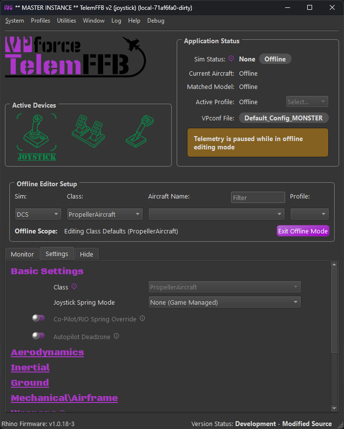{ width="467px" height="581px" }

Use the selection boxes in the Offline Editor Setup area to select a sim, class, aircraft or user profile to modify.

- To modify the default settings for the entire simulator, only select the desired Sim from the pulldown.
- To modify the class defaults for a given sim, select both the simulator and the class.
- Further, you can choose a specific aircraft and profile to modify offline as well.

## Profile Manager

TelemFFB 2.0 adds the ability to create multiple settings profiles for any given aircraft and centrally manage all of your profiles through the Profile Manager.

In the main window of the profile manager is a tree list of all of the built-in default, user created default and individual profiles. Built-in profiles are fixed and can not be deleted, exported or modified. They can be cloned into new profiles, but the original built-in settings will be retained in the built-in profile.

Only aircraft for simulators that are enabled in the ***system settings*** will be shown in the list.

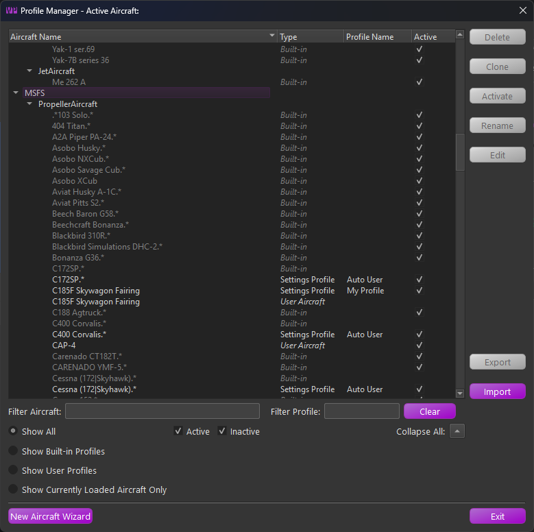{ width="568px" height="565px" }

There is a series of radio buttons that will change the scope of the displayed profiles.

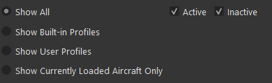{ width="390px" height="120px" }

- **Active\\Inactive checkboxes**

    - Filter the list of profiles to show Active, Inactive or both. The active profile is the profile that will be used when the aircraft is loaded in a simulator

- **Show All**
    - Displays all built-in and user default profiles
- **Show Built-in**
    - Displays only the built-in profiles
- **Show User**
    - Displays only user created aircraft and user profiles
- **Show Currently Loaded Aircraft**
    - If an aircraft is currently loaded in TelemFFB, this shows only profiles related to that specific aircraft

The profile types are as follows:

- **Built-in**

    - Built-in profiles are those included by default with TelemFFB. When an aircraft is loaded, the default profile will be used if there is no user defined profile

- **User Aircraft**

    - User Aircraft are the base profile for user created aircraft entries. When you use the new aircraft wizard, either dynamically when a new aircraft is loaded or via the button on the profile manager page, a new "User Aircraft" entry will be created.
    - These behave just like profiles and can be modified, deleted, exported and cloned

- **Settings Profile**

    - Settings Profiles are unique sets of settings for a given aircraft. You can create multiple settings profiles and easily switch between them either by setting them active from the profile manager, or by selecting them from the profile drop down on the main page in the application status area

### Managing Profiles
There are various buttons along the right side of the window that are used for managing the profiles. It is possible to multi-select profiles either by click-dragging or by ctrl+click on individual profiles. The action buttons on the right will enable or disable depending on what is available based on the combination of profiles that are selected.

When multiple profiles are selected:

- If any built-in profiles are part of the selection, only the export action is available. However, any selected built-in profiles will be excluded from the resulting export wizard.
- If there are no built-in profiles selected, only the Delete and Export actions are available.
- All other actions are only available when a single profile is selected.

#### Deleting Profile(s)

To delete one or more profiles, select the profile(s) that you would like to delete and then press the delete action button. If any of the profiles being deleted are the active profile, you will be prompted to select a new active profile for that aircraft.

#### Cloning a Profile

To clone a profile, select the single source profile and press the clone action button. Enter a new name for the profile. Optionally, set the "make active" flag in the window to make the newly created profile active for that aircraft.

#### Activating a Profile

To make a profile active, select the desired profile and press the Activate action button.

#### Renaming a Profile

To rename a profile, select the desired settings profile and press the Rename action button. Note that Built-in and User Aircraft profile types cannot be renamed.

#### Editing a Profile

To edit a profile, select the desired profile entry and press the Edit action button. This will put TelemFFB into offline editing mode and load that aircraft profile in the editor window.

### Exporting Profile(s)

To export one or more profiles, first select the profiles that you would like to export and then choose the Export action button. This will load the export wizard dialog:

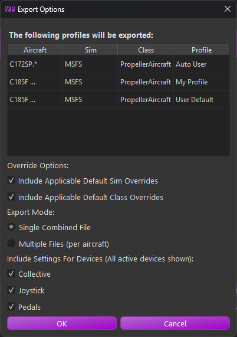{ width="334px" height="474px" }

The resulting window will display the profiles to be exported along with the export options:

- **Override Options**

    - **Include Sim Overrides**  
      Enable this option to include any sim level default overrides that would apply to the selected aircraft profiles. This will ensure that the profile, once imported, will match exactly with how the settings work in your configured setup.

    - **Include Class Overrides**  
      Enable this option to include any class level default overrides that would apply to the selected aircraft profiles. This will ensure that the profile, once imported, will match exactly with how the settings work in your configured setup.

- **Export Mode**

    - **Single File**  
      All settings will be exported into a single XML file containing all of the aircraft and settings. You will be given the opportunity to name the exported file.

    - **Multiple Files**  
      Each aircraft will export into a single file. In this mode, you will select the export location. The files will be auto-named, including the sim and aircraft IDs for each aircraft.

- **Included Devices**  
  These options will include or exclude settings for specific devices. If you have multiple devices but only want to export your Joystick settings, disable the checkboxes for the other devices.

### Importing Profile(s)

The import wizard provides a comprehensive set of options and information for the incoming settings in the selected export file.

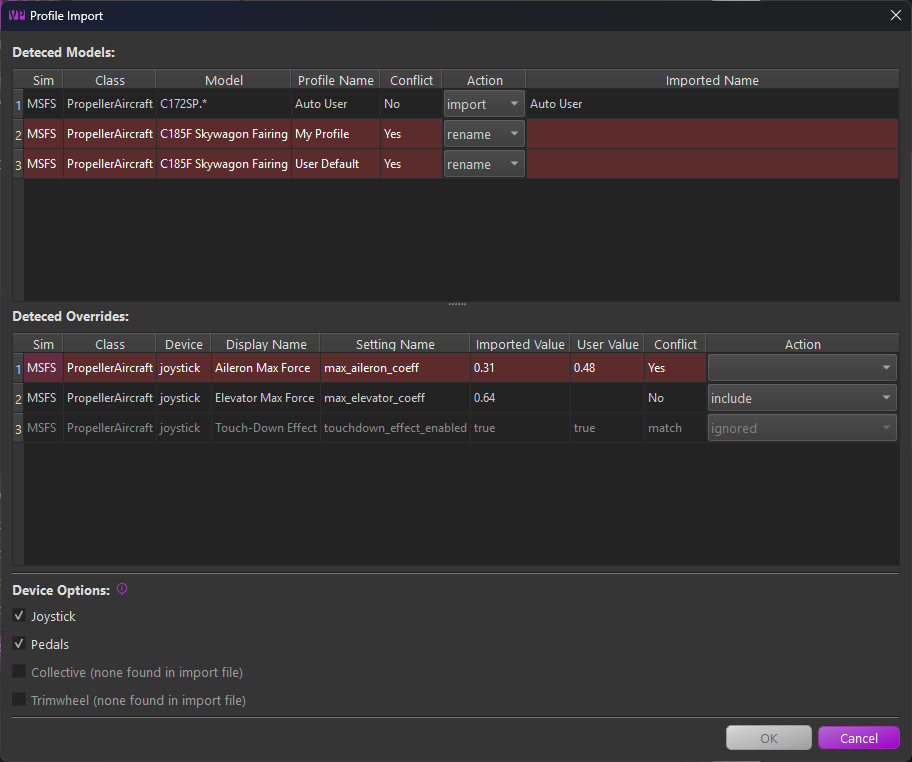{ width="680px" height="568px" }

Any line highlighted in **red** indicates a conflict that must be resolved before importing.

There are three main sections:

- **Detected Models**  
    This section lists all aircraft models and profiles found in the imported file.

    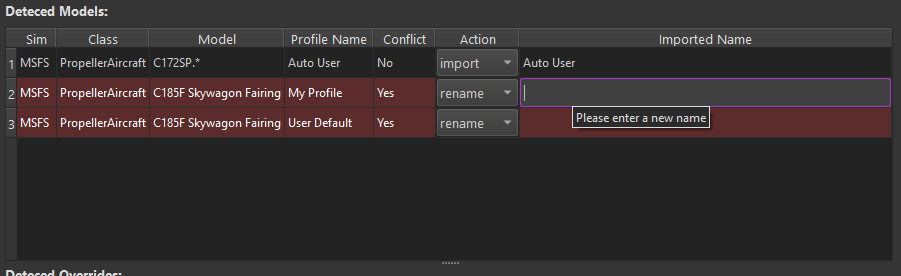{ width="629px" height="192px" }

    - The **Action** column pulldown lets you change the import behavior. You can **import** as is, **rename**, **skip**, or, if there is a profile name conflict, **overwrite** your existing profile of the same name.
    - To resolve a conflict, either set the action to **rename** and enter a new name in the "**imported name**" field, or choose to skip or overwrite.

- **Detected Overrides**  
    This section displays any simulator or class-level overrides included in the incoming settings file.

    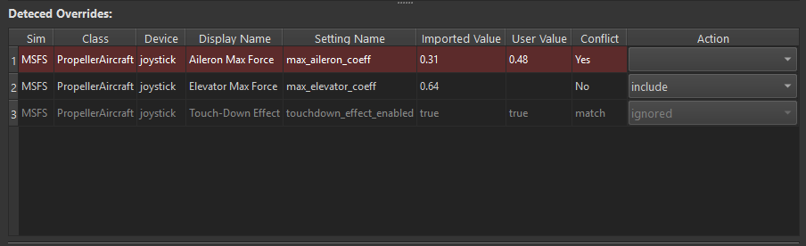{ width="618px" height="189px" }

    - Conflicting settings are highlighted in **red**. These are settings where a matching override already exists in your configuration. The current user value and the incoming value are shown in their respective columns. You can choose to **overwrite** or **exclude** the setting using the **actions** dropdown.
    - Settings marked as "**match**" in the conflict column are identical to your existing override and will be ignored.
    - For all other incoming settings, you can choose to **include** or **exclude** each entry via the **action** setting.

- **Device Options**  
    This section allows you to filter out settings for specific device types. If a device type is not present in the incoming file, its toggle will be disabled.

    If a device type is disabled, any override settings or profiles that only contain settings for that device will be excluded from the import.

    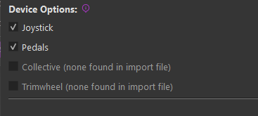{ width="367px" height="165px" }
