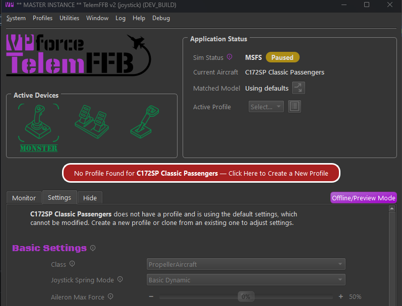
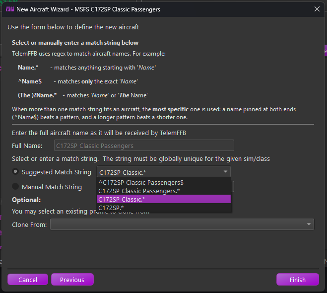
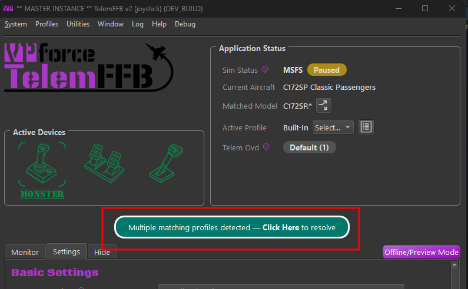
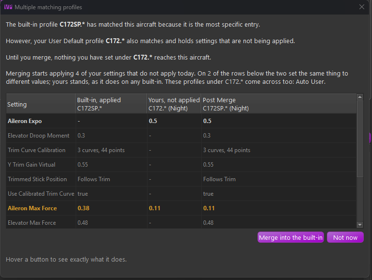
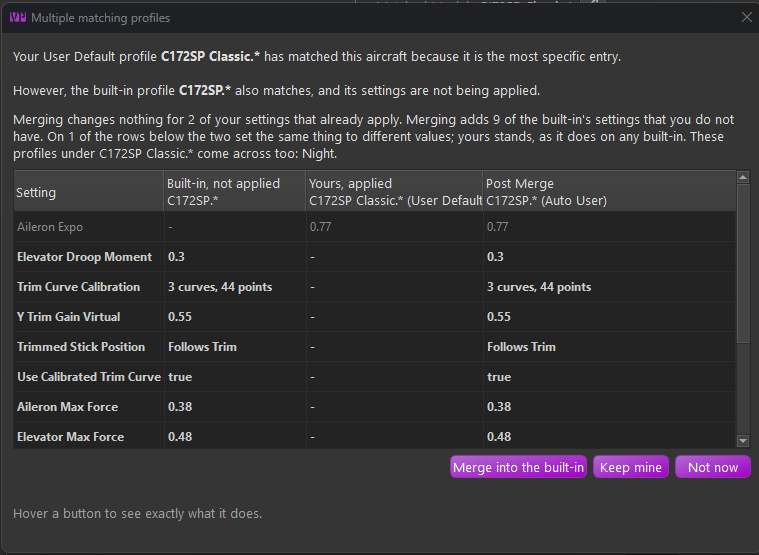
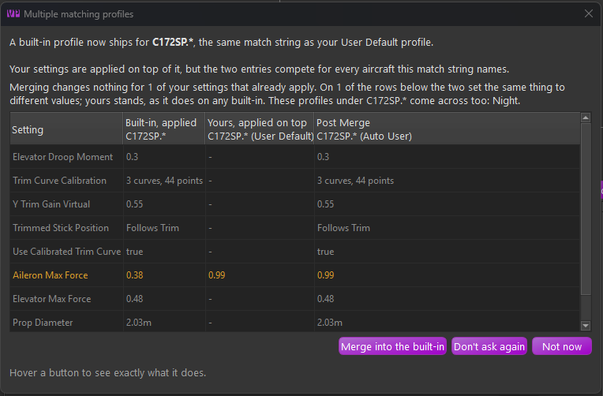
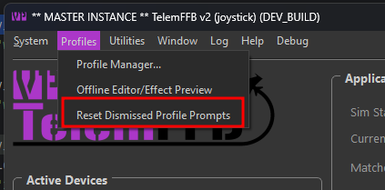
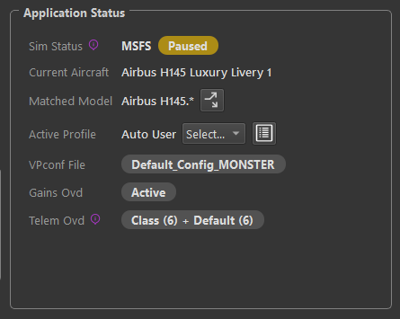
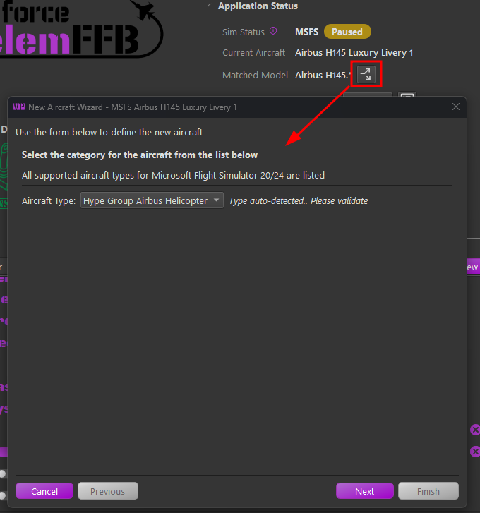
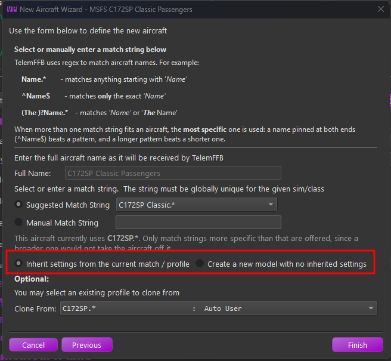

# Aircraft Profiles

## How TelemFFB Matches an Aircraft

Every aircraft profile has a **match string**. When an aircraft loads, TelemFFB compares each match string with the aircraft name the simulator reports. That name is shown as **Current Aircraft** in the status area. The match string that wins is shown as **Matched Model**.

A match string is a regular expression, and matching starts at the beginning of the name. `Cessna 172` therefore matches `Cessna 172`, `Cessna 172 Skyhawk` and any livery whose name starts that way. `Cessna 172` and `Cessna 172.*` behave the same. Only `^Cessna 172$` matches that one name and nothing longer.

### Which match string wins

Several match strings can fit the same aircraft. The most specific one wins:

1. An exact match string, written as `^Name$`, beats every other form.
2. Otherwise, the match string with the longer run of fixed text wins. `737-600.*` beats `737.*`.
3. If two match strings fix the same text, the one that requires it at the start of the name wins. `C-17.*` beats `.*C-17.*`.
4. If they are still equal, the built-in profile wins over yours. Within one file, the earlier entry wins.

!!! note "Only the winning profile applies"

    Settings and [telemetry overrides](telem-overrides.md) come from the one profile that matched. A broader profile that also fits the name adds nothing. The Settings tab shows what is in effect.

    Anything the winning profile leaves unset comes from your class and sim overrides, then from the shipped defaults. See [How Settings Work](settings-model.md).

!!! tip "Checking a match"

    The log line `Pattern Match:` names the winning match string each time an aircraft loads.

## Adding New Aircraft Support

While TelemFFB has default profiles for many aircraft already, there are many hundreds of possible aircraft between all of the simulators that are supported. So, inevitably you will run into an aircraft that does not already have a built-in profile.

There are two ways to add support for new or unknown aircraft to TelemFFB:

- Dynamically when a new aircraft is loaded in a simulator
- Via the Profile Manager, independent of any running sim

### Accessing the New Aircraft Dialog

#### Dynamically from Main Window (Recommended)

When you load an aircraft that matches no profile, the main window shows a red **No Profile Found for** prompt that names the aircraft. Click it to open the New Aircraft Wizard. Use this method where you can, because TelemFFB already knows the exact name the simulator sends.

Until the profile exists, the controls on the Settings tab are disabled. An unknown aircraft has no profile to store a change in. The aircraft still gets the sim defaults and, where the simulator reports the aircraft type, the defaults for that class.

{ width="650px" }

#### Adding New Aircraft via Profile Manager

Open the Profile Manager and select the "New Aircraft Wizard" button. This method is not recommended, because it is difficult to know the exact name TelemFFB will receive from a given simulator.

{ width="335px" height="126px" }

{ width="415px" height="353px" }

### The Add New Aircraft Wizard

After accessing the wizard via one of the two methods above, simply follow the steps in the wizard to add the new aircraft.

**Page 1:**

1. **If manually adding a new aircraft**, select the simulator on the first page.

**Page 2:**

1. Select the appropriate aircraft class for the aircraft you are adding.

    - Note that for MSFS, the aircraft type will be auto-detected based on telemetry data. However, you should validate that the selection is correct.
    - This matters most for aircraft with special treatment, such as those from **HPG**, **FlyInside** and **CowanSim**. The simulator reports them as plain helicopters. They need their own TelemFFB class to work fully. See [Aircraft with Special Treatment](msfs-xp-special-aircraft.md) for the full roster.

**Page 3:**

1. **If manually adding a new aircraft**, enter the full aircraft name that will be sent via telemetry from the simulator.

    - If auto-detected, this will already be filled out for you.
2. Choose a match string for the aircraft. See [How TelemFFB Matches an Aircraft](#how-telemffb-matches-an-aircraft) for the rules.

    - The wizard suggests match strings built from the aircraft name, most specific first. The list starts with the exact form, `^Full Name$`. It continues with the whole name followed by `.*`, then drops one word at a time from the end.
    - The wizard preselects the suggestion that drops the last word. The last word of a name is usually the livery, the variant or the registration, and a match string that includes it fits only that one aircraft. If dropping a word would leave only the manufacturer, the wizard keeps the whole name.
    - Pick a shorter suggestion to cover a family of liveries or variants with one profile. Pick the exact form to cover one aircraft only.
    - You can also type your own match string. The field turns red when the string does not match the aircraft name.

    { width="600px" }

3. Optional: clone from an existing aircraft.

    - The new aircraft starts with a copy of the chosen profile's settings and telemetry overrides.

    !!! note "Classes that must be cloned"

        For **HPG** and **FlyInside** aircraft, cloning from one of the built-in profiles is mandatory. Some of the telemetry sources those classes read differ per aircraft, so they live in the aircraft's profile.

        The other special classes carry their telemetry sources on the class itself. For those, selecting the correct class on Page 2 is enough.

## When Your Profile and a Built-In Both Match

TelemFFB updates ship new built-in profiles. One of them may cover an aircraft that you already made a profile for. Both then match the aircraft, and TelemFFB asks you what to do.

The main window shows a **Multiple matching profiles detected** prompt. If the window is hidden or minimized, a tray notification appears as well. Click the prompt to open the dialog.

{ width="650px" }

The more specific of the two match strings names the aircraft, and the built-in wins a tie. The dialog says which one matched and why.

{ width="760px" }

### Reading the dialog

The table lists every setting and telemetry override that either profile holds. It has three value columns:

- **Built-in** - what the built-in profile sets.
- **Yours** - what your active profile sets.
- **Post Merge** - what would be in effect after a merge.

Each column heading names its match string and profile. The heading also says whether that side is applied today.

- Rows that a merge would change are shown in bold.
- A row where the two profiles set the same thing to different values is a conflict, shown in amber. Your value stands after a merge, as it does on any built-in profile.
- Values are compared by meaning. `0.5` and `0.50` are the same value, and so are `10kt` and `5.1444m/s`.
- If the built-in profile ships with notes, they appear above the table.

Hover any button to see exactly what it does.

### Your choices

| Which profile names the aircraft | Your settings today | Buttons offered |
|---|---|---|
| Yours, because it is more specific | In effect | Merge, Keep mine, Not now |
| The built-in, with the identical match string | In effect, on top of the built-in | Merge, Don't ask again, Not now |
| The built-in, in every other case | Not in effect | Merge, Not now |

- **Merge into the built-in** - your profiles become user profiles of the built-in, which then names the aircraft. Nothing you set is lost.
- **Keep mine** and **Don't ask again** - leave everything as it is. TelemFFB remembers the answer.
- **Not now** - close without deciding. The prompt returns the next time the aircraft loads. Closing the dialog window does the same.

{ width="700px" }

{ width="700px" }

A permanent "no" is offered only while your settings still reach the aircraft. In the last row of the table they reach nothing, so a permanent "no" would hide that. The prompt stays until you merge.

### What a merge does

- Every profile under your match string moves to the built-in, not only the active one.
- **User Default**, the base profile of an aircraft you added, becomes **Auto User**. That is the profile a slider change on a built-in aircraft creates. Your other profiles keep their names. If the built-in already has a profile of the same name, the incoming one gets a suffix that says where it came from.
- Your telemetry overrides move with the profiles.
- Each moved profile's notes record the match string it came from.
- The profile that was active stays active.

What happens to your old match string depends on how much it covered:

- If it covered exactly what the built-in covers, it is removed. `AH-6J` and `AH-6J.*` are such a pair.
- If it was broader, it stays in place. It may be the only profile that names your other aircraft, so the merge copies from it.
- If it was the identical string, nothing moves. Your separate aircraft entry is dropped and its settings become a user profile of the built-in. The values in effect do not change.

### Changing your mind

TelemFFB remembers an answer for the pair of match strings, not for one aircraft. The answer covers every aircraft that both match strings fit.

- A "Keep mine" or "Don't ask again" answer lapses when a later release changes what the built-in profile does. TelemFFB then asks again, so a built-in that gains something useful is not hidden by an old answer. A change to the built-in's notes alone does not count.
- To be asked again now, choose **Profiles → Reset Dismissed Profile Prompts**. The prompt returns at once for the loaded aircraft, and on the next load for the others. Your configuration does not change. The item is greyed out when there is nothing to reset.
- A merge cannot be reset, because it changed your configuration. The moved profiles stay where they are.

{ width="400px" }

The answers are kept in `match_history.json`, beside your user configuration in `%LOCALAPPDATA%\VPForce-TelemFFB`. The file is not part of an exported profile. A configuration reset clears it.

## Giving the Loaded Aircraft Its Own Profile

A broad profile can cover many liveries or variants of an aircraft. Sometimes one of them needs settings of its own. The **split button** beside **Matched Model** in the status area does this without any hand-editing.

{ width="400px" }

The button is available once a profile names the loaded aircraft. It is disabled on child instances and in the offline editor. When nothing matches, the **No Profile Found for** prompt takes its place.

Click the button to open the New Aircraft Wizard, already filled in for the loaded aircraft:

{ width="600px" }

1. Check the aircraft class. It is preselected from the profile in effect now. Click **Next**.

2. Choose the match string.

    - The wizard offers only match strings that are more specific than the current one. A broader or equal match string would lose to the current profile, and the new profile would never apply.
    - If you type your own match string and it is not specific enough, the field turns red and its tooltip says why.

3. Choose what the new profile starts from.

    - **Inherit settings from the current match / profile** copies the settings and telemetry overrides of the profile in effect now. Use this when the aircraft is close to its neighbors and needs a few changes. The **Clone From** list shows the profile it copies.
    - **Create a new model with no inherited settings** starts with the aircraft class and nothing else. Use this when the aircraft matched the wrong profile. This choice is not available for classes that must be cloned.

{ width="600px" }

After you finish, the new profile names the aircraft at once. The other aircraft that the broader profile covers are not affected.

!!! note

    A profile made this way does not trigger the **Multiple matching profiles** prompt. Both profiles are yours, and the wizard already asked what to copy.

## Profile Manager

TelemFFB supports multiple settings profiles for any given aircraft, all centrally managed through the Profile Manager.

In the main window of the profile manager is a tree list of all of the built-in default, user created default and individual profiles. Built-in profiles are fixed and can not be deleted, exported or modified. They can be cloned into new profiles, but the original built-in settings will be retained in the built-in profile.

Only aircraft for simulators that are enabled in the ***system settings*** will be shown in the list.

{ width="568px" height="565px" }

There is a series of radio buttons that will change the scope of the displayed profiles.

{ width="390px" height="120px" }

- **Active\\Inactive checkboxes**

    - Filter the list of profiles to show Active, Inactive or both. The active profile is the profile that will be used when the aircraft is loaded in a simulator

- **Show All**
    - Displays all built-in and user default profiles
- **Show Built-in**
    - Displays only the built-in profiles
- **Show User**
    - Displays only user created aircraft and user profiles
- **Show Currently Loaded Aircraft**
    - If an aircraft is currently loaded in TelemFFB, this shows only profiles related to that specific aircraft

The profile types are as follows:

- **Built-in**

    - Built-in profiles are those included by default with TelemFFB. When an aircraft is loaded, the default profile will be used if there is no user defined profile

- **User Aircraft**

    - User Aircraft are the base profile for user created aircraft entries. When you use the new aircraft wizard, either dynamically when a new aircraft is loaded or via the button on the profile manager page, a new "User Aircraft" entry will be created.
    - These behave just like profiles and can be modified, deleted, exported and cloned

- **Settings Profile**

    - Settings Profiles are unique sets of settings for a given aircraft. You can create multiple settings profiles and easily switch between them either by setting them active from the profile manager, or by selecting them from the profile drop down on the main page in the application status area

### Managing Profiles
There are various buttons along the right side of the window that are used for managing the profiles. It is possible to multi-select profiles either by click-dragging or by ctrl+click on individual profiles. The action buttons on the right will enable or disable depending on what is available based on the combination of profiles that are selected.

When multiple profiles are selected:

- If any built-in profiles are part of the selection, only the export action is available. However, any selected built-in profiles will be excluded from the resulting export wizard.
- If there are no built-in profiles selected, only the Delete and Export actions are available.
- All other actions are only available when a single profile is selected.

#### Deleting Profile(s)

To delete one or more profiles, select the profile(s) that you would like to delete and then press the delete action button. If any of the profiles being deleted are the active profile, you will be prompted to select a new active profile for that aircraft.

#### Cloning a Profile

To clone a profile, select the single source profile and press the clone action button. Enter a new name for the profile. Optionally, set the "make active" flag in the window to make the newly created profile active for that aircraft.

#### Activating a Profile

To make a profile active, select the desired profile and press the Activate action button.

#### Renaming a Profile

To rename a profile, select the desired settings profile and press the Rename action button. Note that Built-in and User Aircraft profile types cannot be renamed.

#### Editing a Profile

To edit a profile, select the desired profile entry and press the Edit action button. This will put TelemFFB into offline editing mode and load that aircraft profile in the editor window.

### Exporting Profile(s)

To export one or more profiles, first select the profiles that you would like to export and then choose the Export action button. This will load the export wizard dialog:

{ width="334px" height="474px" }

The resulting window will display the profiles to be exported along with the export options:

- **Override Options**

    - **Include Sim Overrides**  
      Enable this option to include any sim level default overrides that would apply to the selected aircraft profiles. This will ensure that the profile, once imported, will match exactly with how the settings work in your configured setup.

    - **Include Class Overrides**  
      Enable this option to include any class level default overrides that would apply to the selected aircraft profiles. This will ensure that the profile, once imported, will match exactly with how the settings work in your configured setup.

- **Export Mode**

    - **Single File**  
      All settings will be exported into a single XML file containing all of the aircraft and settings. You will be given the opportunity to name the exported file.

    - **Multiple Files**  
      Each aircraft will export into a single file. In this mode, you will select the export location. The files will be auto-named, including the sim and aircraft IDs for each aircraft.

- **Included Devices**  
  These options will include or exclude settings for specific devices. If you have multiple devices but only want to export your Joystick settings, disable the checkboxes for the other devices.

### Importing Profile(s)

The import wizard provides a comprehensive set of options and information for the incoming settings in the selected export file.

{ width="680px" height="568px" }

Any line highlighted in **red** indicates a conflict that must be resolved before importing.

There are three main sections:

- **Detected Models**  
    This section lists all aircraft models and profiles found in the imported file.

    { width="629px" height="192px" }

    - The **Action** column pulldown lets you change the import behavior. You can **import** as is, **rename**, **skip**, or, if there is a profile name conflict, **overwrite** your existing profile of the same name.
    - To resolve a conflict, either set the action to **rename** and enter a new name in the "**imported name**" field, or choose to skip or overwrite.

- **Detected Overrides**  
    This section displays any simulator or class-level overrides included in the incoming settings file.

    { width="618px" height="189px" }

    - Conflicting settings are highlighted in **red**. These are settings where a matching override already exists in your configuration. The current user value and the incoming value are shown in their respective columns. You can choose to **overwrite** or **exclude** the setting using the **actions** dropdown.
    - Settings marked as "**match**" in the conflict column are identical to your existing override and will be ignored.
    - For all other incoming settings, you can choose to **include** or **exclude** each entry via the **action** setting.

- **Device Options**  
    This section allows you to filter out settings for specific device types. If a device type is not present in the incoming file, its toggle will be disabled.

    If a device type is disabled, any override settings or profiles that only contain settings for that device will be excluded from the import.

    { width="367px" height="165px" }
