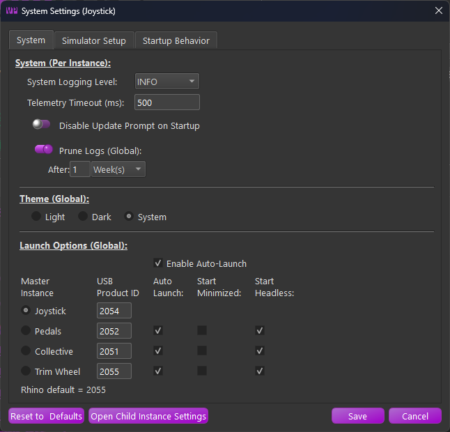

# Configuration

## The TelemFFB Configuration

There are two locations where user configuration settings are stored for TelemFFB.

**System Settings:**

The system settings are stored in the registry at:

-    `HKEY_CURRENT_USER\Software\VPforce\TelemFFB`

**User Aircraft Settings:**

The user aircraft/profile settings are stored in the user appdata folder located at:

-   `%LOCALAPPDATA%\VPForce-TelemFFB`

More detail on the system settings and user configuration are given below.

**System Settings**

Do not manually edit the registry, however it is useful to know where the settings are stored. All of the settings configured in the System→System Settings menu are stored in this location.

**User Aircraft Profiles/Configurations**

TelemFFB uses an xml based configuration model. There is a default configuration file bundled with the application that defines all of the available configuration settings for all simulators and aircrafts as well as the default values for any given sim/aircraft class combination. There are also a large number of default aircraft profiles available across all of the supported simulators.

The user configuration is a "delta" based configuration file. Only those settings that have been modified from the default values for the sim/class/aircraft are added to the user configuration. If a particular setting has not been modified in the user profile, the values from the default configuration file are used.

## System Settings

In the System Menu, choose System Settings:
{ width="549px" height="527px" }

### System Page

### System

These settings are unique per device instance of TelemFFB

-   **System Logging Level**

    -   Control the logging level for an instance of TelemFFB

-   **Telemetry Timeout**

    -   Control the telemetry timeout value for an instance of TelemFFB

-   **Update Prompt Control**

    -   Enable/Disable the new-update prompt for an instance of TelemFFB when starting up.

-   **Prune Logs**

    -   Enable log pruning. Archived log zip files that are older than the configured threshold will be automatically deleted upon TelemFFB startup.

### Theme Options

!!! note
    The Theme Options are global and are only visible in the Master instance of TelemFFB

-   **Light** - Use the light color palette theme
-   **Dark**- Use the dark color palette theme
-   **System** (default) - Use the Windows system defined app theme dark/light mode

### Launch Options

!!! note
The Launch Options are global and are only visible in the Master instance of TelemFFB

These settings are global for any instance of TelemFFB and affect how the application starts up and communicates with one or more FFB devices.

-   **Enable Auto-Launch**

    -   Tick this checkbox to enable the auto-launch feature which will start multiple instances of TelemFFB to communicate with multiple FFB devices. See the section on ***running with multiple FFB*** devices for details.

-   **Master Instance Radio Buttons**

    -   Independently of the auto-launch feature, the selected radio button defines the device that TelemFFB will connect to when it is launched.

    -   When combined with the auto-launch feature, the selected device will act as the master instance for any additional spawned instances of TelemFFB.

-   **USB Product ID**

    -   Enter the USB Product ID that is configured for a given device (as configured in VPforce FFB Configurator)

-   **Instance Auto Launch Options**

    -   Auto Launch

        -   Enable or disable auto-launching of an instance when the master instance loads.

    -   Start Minimized

        -   Start the selected instance with its window minimized

    -   Start Headless

        -   Start the selected instance with its window hidden (can be revealed from the master instance **window** menu)

### Simulator Setup Page

These settings are global for any instance of TelemFFB.

#### DCS

-   **Enable**

    -   Enable/disable support for DCS

-   **Auto DCS Setup**

    -   When enabled, TelemFFB will automatically add entries into the DCS export script in the users save games folder structure. It will also copy the export script DLL package into the DCS save games folder

#### Microsoft Flight Simulator (20/24)

-   **Enable**

    -   Enable/disable support for MSFS.

    -   No further configuration is required

#### X-Plane (11/12)

-   **Enable**

    -   Enable/disable support for X-Plane

-   **Auto X-Plane setup**

    -   When enabled, TelemFFB will automatically install the custom telemetry plugin to the configured X-Plane installation path

-   **X-Plane Install Path**

    -   As there is no registry entry to discover the installed path for X-Plane, browse for and select the root X-Plane install path. This is required for the auto setup script to succeed

#### IL-2 Sturmovik

-   **Enable**

    -   Enable/disable support for IL-2

-   **Pause IL2 Effects on Focus Loss**

    -   When enabled, TelemFFB will enter a pause state when focus is lost on the IL2 game window. (Enabled by default)

!!! note
    While disabling can aid in adjusting effects in real time, when the IL2 window loses focus, it also loses all inputs. **This may result in odd behavior and stuck effects while the window is out of focus**

-   **Auto IL-2 Telemetry Setup**

    -   If enabled, TelemFFB will automatically set up the required configuration in IL2 to support telemetry export

-   **IL-2 Install Path**

    -   As there is no registry entry to discover the installed path for IL-2, browse for and select the root IL-2 install path. This is required for the auto setup script to succeed

#### BMS (Beta support)

-   **Enable**

    -   Enable/disable support for BMS.

    -   No further configuration is required

### Startup Behavior Page

#### Startup Behavior

-   **Start with Windows (Global, Master Only)**

    -   When enabled, an entry will be added to the Windows registry
        that will start TelemFFB automatically when Windows starts

    !!! note
        Only available with the EXE distribution of TelemFFB. This option will be disabled when running from source.

-   **Start in System Tray (Global, Master Only)**

    -   When enabled, TelemFFB will start up minimized to the system
        tray. The main window can be recalled by double-clicking the
        system tray icon or from the right-click context menu on the
        system tray icon.

    !!! note
        This is mutually exclusive with the Start Minimized option. Only one or the other may be enabled.

-   **Start Minimized (Global, Master Only)**

    -   When enabled, TelemFFB will start with its main window visible,
        but minimized to the taskbar.

    !!! note
        This is mutually exclusive with the Start in System Tray option. Only one or the other may be enabled.

-   **Closing App Sends to Tray (Global, Master Only)**

    -   When enabled, pressing the window close button will simply
        minimize the application to the system tray.

    -   You can fully exit TelemFFB from the System menu or from the
        right-click context menu on the system tray icon.

These settings are unique per instance of TelemFFB

-   **Restore Window Position**

    -   When enabled, TelemFFB will remember where the window was positioned the last time it was run and restore the window to that same position

-   **Restore Last Tab View**

    -   When enabled, TelemFFB will remember the window size for each tab the last time it was run. It will also restore these sizes and remember the last tab that was viewed the last time it was run.

#### Configurator Profile Options

-   **VPForce Configurator Profiles**

    -   Define a profile to load on TelemFFB startup and/or exit

    -   See the section on ***Dynamic Configurator Profiles*** for more details
