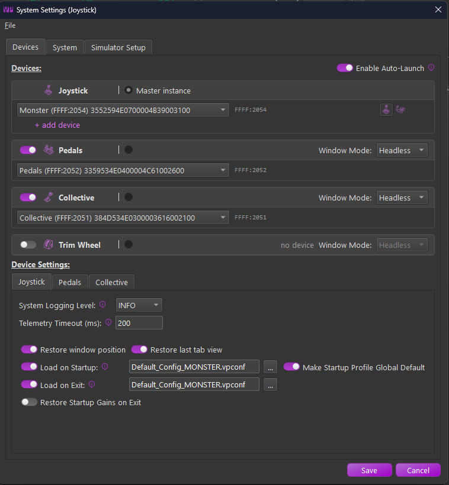
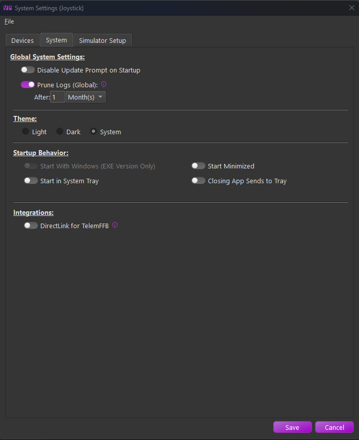

# System Settings

In the System Menu, choose System Settings. The dialog opens from the **master instance** and configures everything, including the settings of every device instance. Child instances no longer carry their own settings dialog.

The dialog has three tabs:

- **Devices** - which device each instance connects to, how the instances launch, and each device's own settings.
- **System** - global application settings and startup behavior.
- **Simulator Setup** - per-simulator connections and the DirectInput Tap.

!!! note
    For where these settings are stored on disk, see [How Settings Work](settings-model.md).

!!! note "Most changes apply without a restart"
    Saving the dialog applies most changes immediately; device selections switch live. TelemFFB prompts for a restart only when a saved change actually needs one: changing which device is the master instance, the instance auto-launch options, or the theme.

## Import, Export, and Reset

The dialog's **File** menu backs up and restores the whole configuration:

- **Export Settings...**

    - Writes every stored setting to a JSON file, master and child instances alike, since the whole configuration lives in one store. The file is a complete system-settings backup, suitable for migrating to another machine. Window positions and similar UI state are not portable and are left out.

- **Import Settings...**

    - Loads an export file into the dialog without committing anything. The imported values land in the form exactly as if you had clicked them in, so saving runs every normal check: validation, the live device switch, restart notices, the DirectInput Tap reconcile. Review the tabs, then **Save** to apply or **Cancel** to discard. Devices in the file that are not currently connected survive the import; TelemFFB reconnects them when they appear.

- **Reset to Defaults**

    - Fills the form with the default values. Like an import, nothing is written until you Save.

## Devices Tab

{ width="650px" }

### Devices

The **Devices** area holds one **card per device role**: joystick, pedals, collective, trim wheel. Each card carries the device selector, the device's USB ids, and its launch controls: the master-instance marker, the card's auto-launch switch, and a **Window Mode** selection (Normal, Minimized, or Headless). A global **Enable Auto-Launch** switch sits above the cards. The joystick card can hold up to three devices for per-aircraft switching.

[Devices & Instances](devices-instances.md) covers the cards, auto-assignment, multiple joysticks, and the launch options in detail.

### Device Settings

Below the cards, the **Device Settings** area has one tab per configured device. Each device's page holds the settings that apply to that instance alone:

- **System Logging Level**

    - Logging verbosity for the instance (INFO or DEBUG).

- **Telemetry Timeout (ms)**

    - How long the instance waits for telemetry before treating the sim as stopped.

- **Restore window position** / **Restore last tab view**

    - Remember and restore the instance's window position, per-tab window sizes, and last viewed tab.

- **VPforce Configurator profiles**

    - **Load on Startup** - a Configurator profile to load when TelemFFB starts, with **Make Startup Profile Global Default** to use it as the fallback profile.
    - **Load on Exit** - a profile to load when TelemFFB exits.
    - **Restore Startup Gains on Exit** - re-push the gain values read from the device at startup when TelemFFB exits, leaving the device as it was found. Disabled by default.

    See [VPforce Configurator Integration](vpconf-profiles.md) for how these interact with per-aircraft profiles and gain overrides.

## System Tab

{ width="650px" }

### Global System Settings

- **Theme**

    - **Light** - the light color palette.
    - **Dark** - the dark color palette.
    - **System** (default) - follow the Windows app theme.

- **Prune Logs (Global)**

    - Enable log pruning. Archived log zip files older than the configured threshold are deleted at TelemFFB startup.

- **Disable Update Prompt on Startup**

    - Suppress the new-update prompt at startup. The master instance performs the update check, so this is a global setting.

### Startup Behavior

- **Start with Windows**

    - Add a Windows registry entry that starts TelemFFB automatically when Windows starts.

    !!! note
        Only available with the EXE distribution of TelemFFB. This option is disabled when running from source.

- **Start in System Tray**

    - Start minimized to the system tray. Recall the main window by double-clicking the tray icon or from its right-click context menu.

- **Start Minimized**

    - Start with the main window minimized to the taskbar.

    !!! note
        Start in System Tray and Start Minimized are mutually exclusive; only one may be enabled.

- **Closing App Sends to Tray**

    - The window close button minimizes the application to the system tray instead of exiting. Exit TelemFFB from the System menu or from the tray icon's right-click context menu.

### Integrations

- **DirectLink for TelemFFB**

    - List DirectInput Force Feedback devices (shown with a `[DI]` prefix) alongside VPforce hardware in the device selectors, so they can be assigned to any role. Requires **DirectLink**, a separate product distributed on its own; a status line below the toggle reports the installed version. Most VPforce users can leave this off - it exists to drive non-VPforce hardware.

## Simulator Setup Tab

One page per simulator (DCS, MSFS, X-Plane, IL-2, and BMS), each with its enable switch, auto-setup options, and install paths. [Connecting Your Simulator](sim-setup.md) covers each simulator's page.

The DCS, IL-2, and BMS pages also hold the **DirectInput Tap** section for that simulator; see [The DirectInput Tap](dinput-tap.md).
