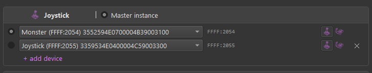
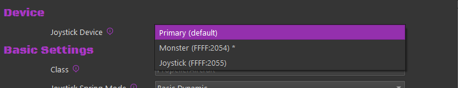

# Devices & Instances

TelemFFB runs **one instance per FFB device**. If you fly with a single VPforce joystick base, one instance is all there is and you can mostly ignore this page. If you also have VPforce-powered pedals or a collective, a separate instance drives each device, and TelemFFB manages them for you.

## Master and child instances

The instance you launch is the **master**. It owns everything global:

- The System Settings dialog opens from the master and configures everything, including each child instance's own settings; child instances no longer carry a settings dialog of their own.
- Auto-launching, monitoring, and revealing the **child** instances that drive your additional devices.

Child instances each connect to their own device and render effects for it, driven by the same simulator telemetry. They can run with a normal window, minimized, or headless (no window at all).

## How TelemFFB finds your devices

In most cases, you do not need to configure anything: on startup, the master instance enumerates the connected VPforce devices and **auto-assigns** any unassigned device role.

- Assignment is by the device's name as configured in VPforce Configurator: a name containing *Joystick*, *Pedals*, *Collective*, or *Trim* assigns the device to that role.
- Each device takes at most one role, and auto-assignment never overrides an assignment you have already made.
- A device whose name identifies no role is not guessed at; assign it yourself on the Devices tab. On a first launch, TelemFFB reports the auto-assignment result and opens System Settings either way, so you can review and save the assignments ([Quick Start](quick-start.md#first-launch-system-settings)).

To assign devices manually, or fix an auto-assignment, each device role has a **selector pulldown** on its card on the **Devices** tab, listing the connected VPforce devices. Pick the device for each role directly. If you pick a device that is already assigned to another role, TelemFFB asks whether to override the other assignment or cancel.

## The Devices tab

These settings are found on the **Devices** tab of **System → System Settings**. They control which device each instance connects to and which instances start automatically.

{ width="650px" }

The tab holds one **card per device role**: joystick, pedals, collective, trim wheel. Each card carries:

- **Device selector**

    - Select the connected device for the role. Auto-assigned devices appear pre-selected. The card shows the selected device's USB ids (`VID:PID`); the selector is the source of truth, so there is nothing to type.

- **Master instance marker**

    - The radio marker defines the device TelemFFB connects to when launched, the master instance. The master's card hides the launch controls below, because the master launches itself.

- **Auto Launch**

    - The global **Enable Auto-Launch** switch above the cards turns the feature on; each card's own switch controls whether that device's instance starts when the master loads. A card whose auto-launch is off collapses to its header.

- **Window Mode**

    - How the instance's window starts: **Normal** (a regular window), **Minimized** (started minimized to the taskbar), or **Headless** (no window at all; the instance runs invisibly, and everything is configured from the master).

Below the cards, the **Device Settings** area holds each device's per-instance settings: logging level, telemetry timeout, window restore options, and Configurator profiles. See [System Settings](configuration.md#device-settings).

## Multiple joysticks (MSFS & X-Plane)

If you fly with more than one stick (a center stick, a yoke, and a side stick, for example), the joystick slot can hold up to three configured devices, and each aircraft can choose which one it uses.

### Configuring alternate devices

On the **Devices** tab, the joystick card has a **+ add device** button. Each added row gets its own device selector and icon.

{ width="650px" }

- The radio marker on a row marks the **primary** device. The primary is the default: every aircraft and class uses it unless its own [Device selection](#choosing-a-device-per-aircraft) says otherwise, and it is the device the joystick instance connects to on startup.
- Selecting the marker on another row makes that device the primary when you save. The switch applies immediately; no restart is required.
- The **x** button removes an alternate row. The primary row cannot be removed, only replaced.

### Choosing a device per aircraft

With more than one joystick configured, aircraft settings gain a **Device** section with a **Joystick Device** selector.

{ width="550px" }

- **Primary (default)** uses whichever device is marked primary in System Settings. The `*` in the list shows which named device that currently is.
- Picking a named device switches to it while that aircraft is loaded, and back to the primary afterward. Nothing changes in System Settings.

!!! note
    The Device section only appears when more than one joystick device is configured. With a single stick there is nothing to choose, and the section stays hidden.

If you later replace a configured device in System Settings, TelemFFB offers to update the aircraft settings that reference the old one.

## Device recovery

A device can drop off while TelemFFB runs: a cable gets pulled, a hub resets, or the device is power cycled. TelemFFB recovers without a restart.

- **A device that drops off** shows a yellow icon. TelemFFB looks for it by its USB identity, not by the port it was on, so plugging it into a different port or hub works. The retries slow down the longer the device stays away.
- **A device that is missing at startup** shows a red icon. TelemFFB keeps checking and opens the device when it appears.
- **After a power cycle** the firmware has lost what it held in memory. TelemFFB sends the active [VPforce Configurator profile](vpconf-profiles.md), the gain overrides and the configured deadzone again. The effects that were running resume.
- **If a different VPforce device is connected** while the configured one is missing, TelemFFB asks once whether to use it instead. Answer Yes and the selection is saved, the same as choosing it on the device card.

Changing a device on the Devices tab also takes effect at once. See [System Settings](configuration.md).

## Working with child instances

After starting TelemFFB with auto-launch enabled, all of the device icons appear in the master instance's **Active Devices** area. From there you can monitor each device's status and switch between devices to configure their settings; each device has its own settings for every aircraft, so your pedals and joystick are tuned independently. See [Active Devices Area](ui-overview.md#active-devices-area) for details.

To bring up the window of a minimized or headless child instance:

- use the master instance's **Window** menu, or
- right-click the system tray icon and use the **Instances** menu.
