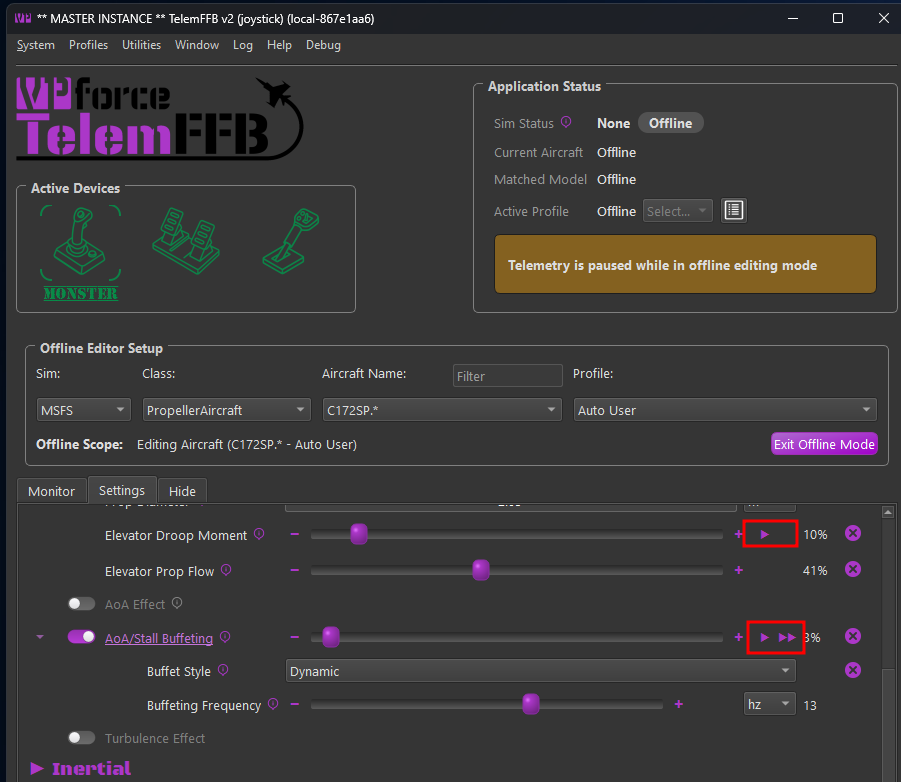
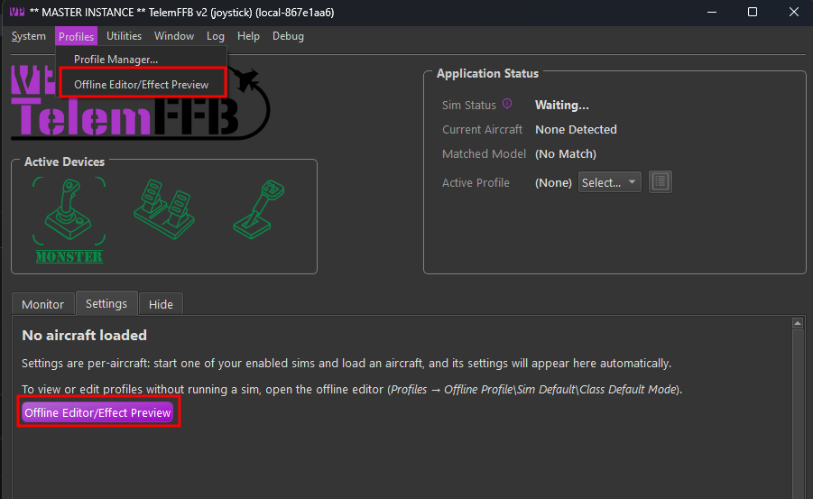
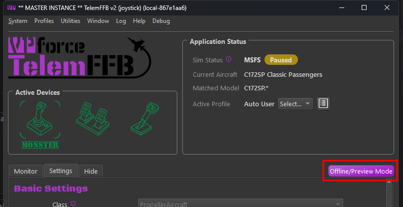
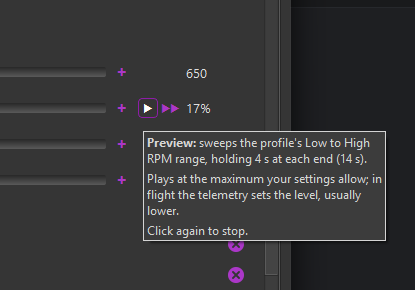

# Effect Preview

Effect Preview plays one effect on your device with no simulator running. TelemFFB feeds the effect a short script of synthetic telemetry for the condition it responds to, and you feel the result based on the strength of your current setting. That lets you tune an effect on its own, without having to load into a flight and reproduce the conditions that generate the effect via real telemetry.

Settings are not adjustable while the preview is running.  If you want to adjust the intensity, stop the effect first, then make your adjustment and re-run the preview.

Previews are available in the offline editor mode only. A **▶** button sits next to the intensity slider of every effect that can be previewed.

{ width="650px" }

## Accessing the offline editor / preview mode

### From the Profiles menu

When no aircraft is loaded, the offline editor can be accessed via the **Profiles → Offline Editor/Effect Preview** menu item or from the button in the unpopulated settings area.  Once opened, select the sim, class, aircraft and profile you want to target in the **Offline Editor Setup** area.

{ width="650px" }

### From a loaded aircraft

With an aircraft loaded in the sim, there is an **Offline/Preview Mode** button above the settings area that will open the offline editor already set to that aircraft and profile.  From there you can directly access the previews for the effects and adjust your settings as desired.

{ width="650px" }

!!! note "Telemetry pauses in offline mode"
    While the offline editor is open, TelemFFB pauses telemetry. Previews use their own effect table, so a paused sim session in the background is not disturbed. Click **Exit Offline Mode** to resume.

## Play a preview

1. Click **▶** next to an effect's intensity slider. The slider handle turns green and the effect controls are disabled while the preview plays.
2. The button reads **■** while the preview plays. Click it to stop early.
3. Adjust the slider and play again.

Hover over the **▶** button for a description of what the preview does: the flight condition it plays, the reference speeds or RPM it uses, and how long each phase lasts.

{ width="415px" }

!!! important "Preview versus flight"
    A preview synthesizes its telemetry and plays the effect at its current intensity setting. In flight the same effect follows the real telemetry, so it can feel weaker or stronger than the preview depending on the flight conditions.

!!! note "Effect controls are disabled while running"
    A preview reads its settings once when it starts and composes the synthesized telemetry. While it plays, the slider, its **-**/**+** buttons and its reset button are locked until it ends.

### Play on every device

When two or more of your devices are running and carry the same setting, a **▶▶** button appears next to **▶**. It plays the preview on all of those devices together. Hover over it to see which devices it plays on.

To adjust the effect for a given device, use the Active Device selector to switch to the desired device and adjust or preview again from there.

## Constant-force previews

Constant force effects have the potential to fling the stick around and move in unexpected ways.  As a safety measure, there is an additional guard in place when previewing these effects to ensure you are ready for them to start.  It is advised to maintain a firm grip on the controls when running the effects.

!!! warning "Hold the controls"
    A constant-force preview asks you to confirm before it starts. Grasp the controls firmly before you click **OK**. The preview adds a light centering spring so the axis has something to push against, and no other spring.

## What can be previewed

Each preview is scripted to reach the effect's configured intensity and stay there long enough to judge it: sweeps hold at each end, holds run at the peak, motion effects run the full travel and land the end clunk, and weapon effects fire short bursts or single releases. Rotor effects assume a rotor turning at 300 rpm with the profile's **Rotor Blade Count**.

Each effect links to its entry in the [Effects Reference](effects-overview.md).

### Aerodynamics

| Effect | Sims | The preview plays |
|---|---|---|
| [AoA/Stall Buffeting](effects-aerodynamics.md#aoastall-buffeting) | DCS, BMS, MSFS, XP | AoA rising from the buffet onset to the stall over 3 s, 4 s held at the stall, 1 s recovering |
| [ETL Effect](effects-aerodynamics.md#etl-effect) | DCS, BMS, MSFS, XP | one acceleration through the ETL speed band |
| [VRS Effect](effects-aerodynamics.md#vrs-effect) | DCS, BMS, MSFS | a descent steepening from the VRS onset to its maximum over 3 s, then held 3 s |
| [Blade Slap](effects-aerodynamics.md#blade-slap) | DCS, MSFS, XP | blade-vortex interaction at its worst: the band-center speed on a shallow descent, 5 s |
| [Overspeed Shake](effects-aerodynamics.md#overspeed-shake) | DCS, BMS, MSFS, XP | 5 s of full shake, 15 m/s past the onset speed |
| [Turbulence Effect](effects-aerodynamics.md#turbulence-effect-experimental) | MSFS, XP | 8 s of moderate turbulence, a few m/s of vertical and lateral gusts (constant force) |
| [Wind Effect](effects-aerodynamics.md#wind-effect) | DCS, BMS | 8 s of gusts on a steady 8 m/s breeze (constant force) |
| [Elevator Droop](effects-aerodynamics.md#elevator-droop) | DCS, IL2, BMS | rolling out from 20 kt to a stop over 2 s, then 3 s standing at the full droop force (constant force) |
| [Elevator Droop Moment](effects-aerodynamics.md#elevator-droop-moment) | MSFS, XP | stationary with the engine off, at 1 g: the full elevator moment for 5 s (constant force) |
| [AoA Reduction](effects-aerodynamics.md#aoa-reduction) | MSFS, XP | AoA rising from the critical onset to its maximum over 3 s, then held 3 s: the push forward (constant force) |

### Inertial

| Effect | Sims | The preview plays |
|---|---|---|
| [Deceleration Effect](effects-inertial.md#deceleration-effect) | DCS, IL2, BMS, MSFS, XP | a braking run: 1.5 s building to the maximum, held 1 s, released over 1.5 s (constant force) |
| [Simulated Lateral Force](effects-inertial.md#simulated-lateral-force) | MSFS, XP | 0.3 g of sideslip held for 5 s: the roll push at the profile's lateral gain (constant force) |

### Ground

| Effect | Sims | The preview plays |
|---|---|---|
| [Runway Rumble](effects-ground.md#runway-rumble) | DCS, BMS, MSFS, XP | rolling on a rough surface for 4 s (constant force) |
| [Touch-Down Effect](effects-ground.md#touch-down-effect) | DCS, BMS, MSFS, XP | one firm landing at the profile's maximum G (constant force) |
| [Nosewheel Shimmy](effects-ground.md#nosewheel-shimmy) | MSFS | full brakes at twice the shimmy onset speed, 5 s |

### Mechanical\Airframe

| Effect | Sims | The preview plays |
|---|---|---|
| [Heli Engine/Rotor Rumble](effects-mechanical.md#heli-enginerotor-rumble) | DCS, BMS, MSFS, XP | rotor turning at 300 rpm with the engine running, 5 s |
| [Afterburner Rumble](effects-mechanical.md#afterburner-rumble) | DCS, BMS, MSFS, XP | afterburner lit for 5 s |
| [Engine Rumble - Shake Telemetry (IL-2)](effects-mechanical.md#engine-rumble-shake-telemetry-il-2) | IL2 | the sim's propeller or jet engine shake at full amplitude, 5 s; one preview per effect |
| [Propeller Rumble](effects-mechanical.md#propeller-rumble) | DCS, IL2, MSFS, XP | a sweep from the profile's low to high RPM, holding 4 s at each end (14 s) |
| [Jet Engine Rumble](effects-mechanical.md#jet-engine-rumble) | DCS, IL2, BMS, MSFS, XP | a sweep from 60% idle to full power, holding 4 s at each end (14 s) |
| [Canopy Motion](effects-mechanical.md#canopy-motion) | DCS, XP | the canopy closing over 3 s, with the clunk as it seats |
| [Damage Effect](effects-mechanical.md#damage-effect) | DCS, IL2, BMS | an irregular stream of hits over 5 s, different every press |
| [Flaps Motion](effects-mechanical.md#flaps-motion) | DCS, IL2, BMS, MSFS, XP | flaps traveling from up to full over 3 s |
| [Fuel Boom/Door Motion](effects-mechanical.md#fuel-boomdoor-motion) | DCS | the boom or door extending over 3 s, with the clunk |
| [Gear Buffet](effects-mechanical.md#gear-buffet) | DCS, BMS, MSFS, XP | gear down at the top of the buffet speed band, 5 s |
| [Gear Motion](effects-mechanical.md#gear-motion) | DCS, IL2, BMS, MSFS, XP | one gear cycle, up to down, with the clunk as it locks |
| [Speedbrake Buffet](effects-mechanical.md#speedbrake-buffet-speedbrake-motion) | DCS, BMS, XP | the speedbrake fully deployed at 100 m/s for 5 s |
| [Speedbrake Motion](effects-mechanical.md#speedbrake-buffet-speedbrake-motion) | DCS, BMS, XP | the speedbrake traveling from retracted to deployed over 3 s |
| [Spoiler Buffet](effects-mechanical.md#spoiler-buffet-spoiler-motion) | DCS, BMS, MSFS, XP | spoilers fully deployed at the profile's upper speed threshold for 5 s |
| [Spoiler Motion](effects-mechanical.md#spoiler-buffet-spoiler-motion) | DCS, BMS, XP | spoilers traveling from retracted to deployed over 3 s |
| [Stick Shaker](effects-mechanical.md#stick-shaker) | DCS, BMS, MSFS | 5 s in the stall warning |
| [Tailhook Motion](effects-mechanical.md#tailhook-motion-wing-fold-motion) | DCS | the hook extending over 3 s, with the clunk as it seats |
| [Wing Fold Motion](effects-mechanical.md#tailhook-motion-wing-fold-motion) | DCS | the wings folding on the ground over 3 s, with the clunks |

### Weapons

| Effect | Sims | The preview plays |
|---|---|---|
| [Gunfire](effects-weapons.md#gunfire) | DCS, BMS | three 2 s bursts with pauses between, slow to fast: a 600 rpm cannon, a 1500 rpm cannon, then a 6000 rpm rotary cannon |
| [Weapons Release](effects-weapons.md#weapons-release) | DCS, BMS | three weapon releases a second apart |
| [Countermeasures](effects-weapons.md#countermeasures) | DCS, BMS | four flares half a second apart |

### IL-2 Shake Master

IL-2's replacement shake effects live under [IL2 Shake Master](effects-basic.md#il2-shake-master) in Basic Settings. Each of its intensity sliders has a preview.

| Effect | Sims | The preview plays |
|---|---|---|
| Buffet | IL2 | the sim's stall buffet at full amplitude and 12 Hz, scaled by the profile's factor, 5 s |
| Runway Rumble | IL2 | rolling on a rough surface for 4 s (constant force) |
| Weapons: gunfire | IL2 | three 2 s bursts with pauses between; in dynamic gunfire mode a 30 mm cannon, a 20 mm cannon, then a 7.92 mm machine gun, in basic mode the fixed-rate shake three times |
| Weapons: bomb release | IL2 | one bomb release |
| Weapons: rocket launch | IL2 | one rocket launch |

## What cannot be previewed

Effects that only make sense against live flight have no preview, and you tune them in the sim:

- the G-Force Effect, which follows the aircraft's load factor
- spring modes, trim following and force trim, which depend on the sim's control state
- the AoA Effect

## FAQ

**Q: Why is the ▶ button grayed out?**  
**A:** Hover over it for the reason: either no FFB device is connected, or telemetry is streaming.

**Q: Why does this slider have no ▶ button?**  
**A:** The effect cannot be previewed on a bench, or is not available in the selected sim. See [What cannot be previewed](#what-cannot-be-previewed).

**Q: Can I move the slider while the preview plays?**  
**A:** No. The preview reads its settings when it starts, so the row stays locked until it ends.

**Q: The preview feels different from the effect in flight. Why?**  
**A:** A preview plays the effect at its configured intensity under the reference condition in its tooltip. In flight the real telemetry drives the effect, and your flight conditions may sit below or above that reference.

**Q: Does a preview change my configuration?**  
**A:** No. A preview only plays what the current settings say. Changes you make between previews save the same way as any other edit in the offline editor.
