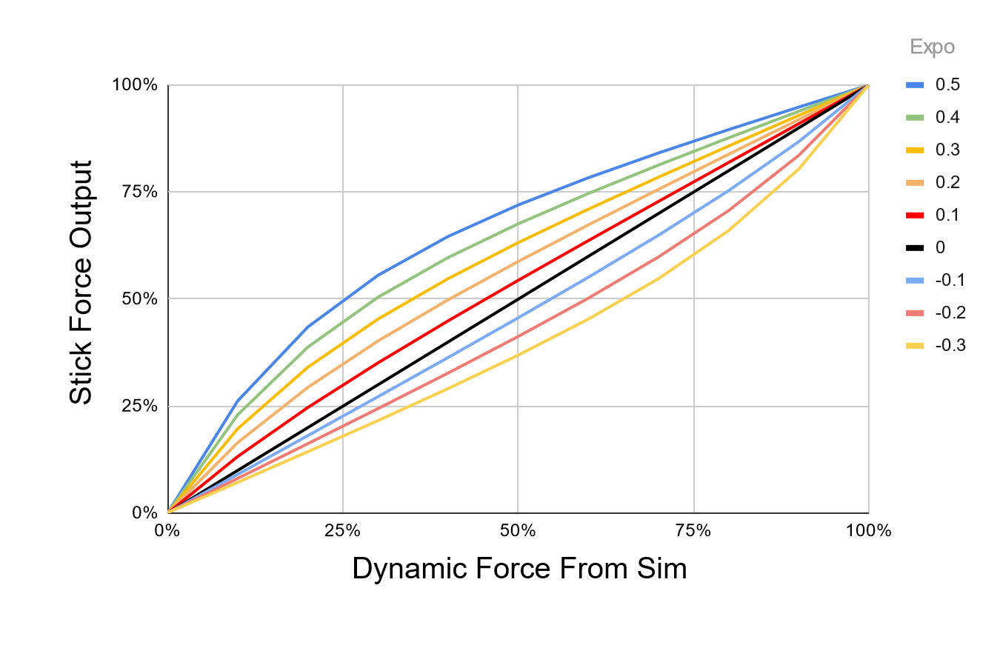
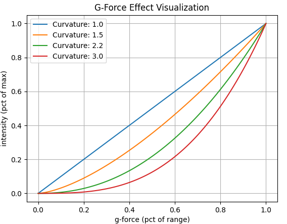
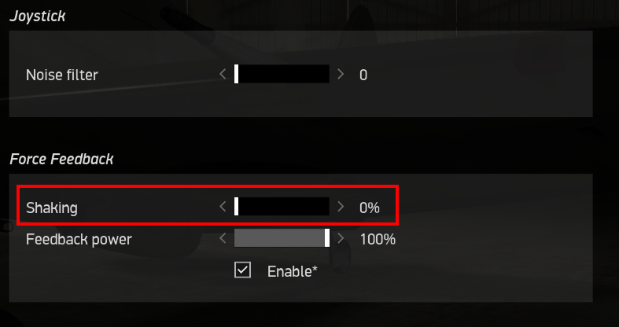

# Effects Reference

## Effects Documentation

This section explains each effect and its settings. It is a work in progress. A majority of the effects will apply to all simulators. Where applicable, each effect setting has a comment in-line with the default setting to indicate which simulator(s) it applies to.

Dictionary of All Settings, in alphabetical order:

###  Afterburner Rumble

-   DCS, MSFS, XPLANE Fixed Wing

-   Afterburner rumble effect. Slider controls max intensity

###  Aileron Expo

-   MSFS, XPLANE Fixed Wing

-   Exponential value for use in dynamic airflow forces calculations. 100% of the set **Aileron Max Force** is achieved at the aircraft's V~NE~ speed read from telemetry, which may be changed with the **V**~**NE**~** Override **setting. Since Rhino cannot produce the actual real-life forces that could be reached, Expo amplifies those forces at lower speeds, where the feeling of control authority is quickly lost at stall speeds for example. An Expo value of 0.5 doubles stick forces at 25% of V~NE~. For some jets, you might want diminished forces until closer to V~NE~, so you can set a negative Expo value.

{ width="513px" height="320px" }

### Aileron Max Force

-   MSFS, XPLANE Fixed Wing

-   Aileron maximum scalar for use in dynamic airflow force calculations. The handle will fade from gray to green as Max force is reached, and the handle will show a percentage of dynamic force applied. Max Force is a percentage of the spring force value in VPforce Configurator, so your total stick force multiplier at any time is Configurator Spring % x Max Force (slider position) x Dynamic Force (% shown in handle)

### AoA Effect

-   DCS, MSFS, XPLANE Fixed Wing

-   Enable or disable the dynamic Angle of Attack (AoA) based force effect

    -   **AoA Effect Gain** Amount of calculated AOA effect to apply

    -   **AoA Effect Max Force** Maximum constant force to apply for the
        AoA effect

### AoA Reduction

-   DCS, MSFS, XPLANE Fixed Wing

-   Simulates the increased forward stick pressure that is applied on some fighter aircraft when a critical angle of attack is exceeded. The effect will monitor the AoA and apply a linear force, up to the maximum defined value starting at the 'start' AoA and maxing out at the 'max' AoA. This is a percentage of the constant force value in VPforce Configurator

    -   **Critical AoA Max Speed** AoA at which applied force maxes out

    -   **Critical AoA Start Speed** AoA at which to begin applying
        force

### AoA/Stall Buffeting

-   DCS, MSFS, XPLANE Fixed Wing

-   Peak AoA buffeting intensity

### Autopilot Following

-   MSFS, XPLANE Fixed Wing

-   Requires **Axis Control** and **Trim Following** - Enable physical stick following of autopilot movements. 

!!! note
    Autopilot following is only available for fixed-wing aircraft and HPGHelicopters at this time

**How it works**:

-   Elevator AP following is reliant on the trim value, as APs use the elevator trim

-   Aileron/Rudder

    -   Control surface deflection is read from the sim (as induced by AP control)
    -   Control surface deflection is used to calculate physical axis position
    -   Physical position is sent to joystick/rudder

-   The AP induced physical control inputs are dampened to prevent out of control oscillations in turbulence or in aircraft with extra sensitive controls.
!!!note
    **Invert Aileron Autopilot Axis**: If aircraft becomes unstable with AP Following and wants to flip inverted, try this option

### Axis Control

-   MSFS, XPLANE

-   The trim/autopilot following features requires that TelemFFB be the source of the axis position for MSFS. As such, the following settings will enable and configure the sending of the axis positions via simconnect.

!!! warning
    You must un-bind your axes in MSFS or SPAD.next for this feature to work

The input range used by MSFS is -16383 to +16384. Axis curves are not supported in this implementation, however you can utilize the scaling settings to adjust the sensitivity of the physical axis. A (unreasonable) scale value of %50 would send a range of -/+8192 over the full range of the physical axis, resulting in less sensitive control inputs at the expense of range of movement.

**X Axis Scale** Scaling of axis position sent to game, 0-100%.
**Y Axis Scale** Scaling of axis position sent to game, 0-100%.
**Rudder (X) Axis Scale** Scaling of axis position sent to game, 0-100%.

The following simconnect events are used to send the axis position data:

Fixed Wing (or with **Use Legacy Bindings** in Helicopter Classes):
`AXIS_AILERONS_SET`
`AXIS_ELEVATOR_SET`
`AXIS_RUDDER_SET`

Helicopter:
`AXIS_CYCLIC_LATERAL_SET`
`AXIS_CYCLIC_LONGITUDINAL_SET`
`ROTOR_AXIS_TAIL_ROTOR_SET`

###  Buffet Onset AoA

-    DCS
-   AoA when buffeting starts

### Canopy Motion

-    DCS

-   Peak vibration intensity when canopy is moving

### Center on Pause/Slew

-   MSFS, XPLANE

-   Force spring centering when in pause/slew mode When disabled, you will need to bring the axis close to center to re-establish axis control

### Class

-   Aircraft Type, can be one of PropellerAircraft, TurbojetAircraft, GliderAircraft, JetAircraft, Helicopter, or HPGHelicopter. Choices based on sim availability.

### Collective AP Spring Gain

-   MSFS, XPLANE Heli
-   Defines the strength of the spring force to use when the collective trim release button is NOT pressed. See **Special HPG Helicopter Implementation** section

### Collective Dampening Gain

-   MSFS, XPLANE Heli - Defines the strength of the dampening effect to apply to the collective axis when the collective trim release is pressed See ***Special HPG Helicopter Implementation*** section

### Command Runner

-   Execute a shell command when the aircraft loads. Can be used to kick off another process, execute a batch script or any other action executable as a shell command.

### Configurator File

-   Load a specific .vpconf file (created with VPForce Configurator) When using this function, it will remain active until set again by another sim, class, or model setting.

### Co-Pilot/RIO Spring Override

-   DCS

-   With this feature you can temporarily override the spring when moving away from the pilot seat. Optionally, you can confine the functionality to a button that must be held.

### Countermeasure Release

-   DCS

-   Peak intensity for countermeasure release effect

### Damage Effect

-   DCS, IL2

-   Plays a short random direction, random intensity bump each time damage is detected on the aircraft. 
!!! note
    Note that with the randomized nature of the intensity, some hits will be lower and some higher than the defined value

### Deceleration Effect

-   DCS, IL2
-   Monitors the deceleration G-forces on the aircraft and, if the aircraft is on the ground will apply a forward force (away from pilot) equal to the deceleration G-force up to, but not exceeding **Deceleration Max Force**. Deceleration effect pulls the stick forward when on the ground and decelerating

### Elevator Droop Moment

-   MSFS - Strength of elevator droop at rest (pushes stick forward)

### Elevator Expo

-   MSFS, XPLANE Fixed Wing

-   Elevator expo value, See **Aileron Expo**

### Elevator Max Force

-   MSFS, XPLANE Fixed Wing

-   Elevator maximum value, see **Aileron Max Force**

### Elevator Prop Flow

-   MSFS, XPLANE Fixed Wing

-   Scaling of dynamic airflow effects on elevator

### ETL Effect

-   DCS, MSFS, XPLANE Heli
-   Enable Effective Translational Lift Shimmy

    -   **ETL Start Speed** speed at which the ETL effect will start - m/s
    -   **ETL Stop Speed** speed at which the ETL effect will stop - m/s

### Flaps Motion

-   Peak vibration intensity when flaps are moving

### FlyByWire (FBW)

-   MSFS, XPLANE

-    Identifies aircraft as Fly-By-Wire. No airflow forces will be felt. ***Do not use together with Spring Center (not FBW)*** Gains are a percentage of the spring force value in VPforce Configurator

    -   **FBW Aileron Gain** Fixed spring gain for FBW aircraft.
    -   **FBW Elevator Gain** Fixed spring gain for FBW aircraft.
    -   **FBW Rudder Gain** Fixed spring gain for FBW aircraft.

### Force Trim

- MSFS, XPLANE Gliders & Helis
- Many gliders have a lever actuated trim positioning system that recenters the elevator trim to hold the control stick where the lever is released. Some helicopters have a similar function. Configure the buttons to use for Trim Release and optionally Reset. The implementation is identical to how hardware trim works when configured inside VPforce Configurator, however the benefit of doing it inside TelemFFB is that it is dynamically enabled when loading a glider or helicopter.

    -   **Cyclic Spring Gain** - (Helicopters) - Percent of VPforce Configurator spring value (0-100%)
    -   **Aileron Force Trim**- (Gliders) - Enable force trim on aileron axis
    -   **Elevator Force Trim** - (Gliders) - Enable force trim on elevator axis
    -   **Force Trim Release Button** - Button \# to hold to release spring while moving axis. For HPG Helicopters, see section **Special HPG Helicopter Implementation**
    -   **Force Trim Reset Button** Button \# to recenter spring trims (optional)

### G Force Effect (Custom Curve)

-   DCS/IL2/XPLANE/MSFS Fixed Wing
-   Unlike the ***"legacy" g-force effect***, this new version of the effect does not use an expo curve to calculate the output force. Rather, a force is calculated based on the current g loading as it exists between the min and max G settings. The physical stick deflection is then used to determine how much of this calculated force to apply at any given point in time.
-   For example, if the current G loading is half way between min and max, that would result in %50 calculated force. If the stick is pulled back %50, this is factored with the original force value to determine the final output force (0.5 * 0.5 = %25). This happens in real time on every simulation frame. As you pull "harder", the g loading will increase, but the amount of the G loading which gets applied to the effect will also increase as the stick is pulled farther aft.

    -   Maximum Intensity - This is the maximum force (as a percent of the configurator CONSTANT force slider) that will be applied
    -   Start Gs - The G loading where the effect will start playing
    -   Maximum Gs - The G loading where the strength will reach maximum value
    -   Y Axis Max Point - Percentage of stick deflection that will result in %100 of the calculated force to be applied to the effect.
    -   Enable Negative Gs - Enable the effect for negative G (\<1.0)

        -   Sub settings for this option are identical except the values will be negative

### G Force Effect (Exponential Curve)

-   The G-Force loading effect simulates the increasing force that is required to pull back on the stick as the G forces increase during a dive pull-out or hard turn. Slider value is a percentage of the constant force value in VPforce Configurator.

    -   **Minimum Gs -** The G loading where the effect will start
        playing

    -   **Maximum Gs -** G loading where the strength will reach maximum
        value

    -   **G Force Curvature** - affects the onset characteristics of the force effect. A value of 1.0 is a linear increase in force across the defined g range. Increasing the curvature value will result in a flatter increase at the beginning of the range followed by an ever increasing force as the effect approaches the top of the range.

Example values (default is 2.2):

{ width="411px" height="320px" }

### Gear Buffet

-   DCS, MSFS, XPLANE

-   Peak intensity for gear drag buffeting effect

### Gear Motion

-   Peak vibration intensity when gear is moving, and clunks at end of
    travel.

### Gun Vibration

-   DCS

-   Peak intensity for gunfire effect

### Hands Off Deadzone

-   MSFS HPG Helis

-   Distance at which hands-off resumes (MUST be lower than hands-on)
    See ***Special HPG Helicopter Implementation ***
    section

### Hands On Deadzone

-   MSFS HPG Helis

-   Distance required to trigger a hands-on condition See ***Special HPG
    Helicopter Implementation *** section

### Heli Engine/Rotor Rumble

-   DCS, MSFS

-   Rumble intensity for helicopter engine/rotor effect

### IL2 Shake Master

Sims Supported: **IL2**

-   While the majority of the settings for use in IL-2 are similar or
    identical to those that are used in DCS and MSFS, there are
    several that differ.

-   IL-2 has several native FFB effects that can overlap with what
    TelemFFB is capable of generating. Specifically weapons release,
    runway rumble and buffeting. The benefit of implementing these in
    TelemFFB is that each effect is individually configurable both
    from an enable/disable perspective as well as the intensity.

    - **Buffeting -** Common setting for all buffeting (stall, gear, etc) - (IL2 limitation)
    - **Runway Rumble**
    - **Weapon Effects**

These three effects are generated by IL-2 by default. If you wish to use the effects generated by TelemFFB in lieu of those generated by IL-2, you can enable the master setting in the TelemFFB config and then disable the 'shaking' effects in the IL-2 FFB settings as follows. Navigate to Settings→Input Devices and move the 'Shaking' slider to 0.

{ width="531px" height="280px" }

### Jet Engine Rumble

-   Set intensity of jet engine rumble effect.

    -   **Jet Engine Rumble Freq** Vibration Frequency

### Nosewheel Shimmy

-   Sets intensity of the nosewheel shimmy effect

    -   **Nosewheel Shimmy min brakes**

    -   **Nosewheel Shimmy min speed**

### Overspeed Shake

-   Sets the shake intensity when overspeed occurs

    -   **Overspeed Shake Start Speed**

### Override Configurator Sliders

This feature allows you to override the gain sliders that are currently set via VPforce Configurator when loading into an aircraft. See the dedicated section ***Dynamic Configurator Gains*** for details.

### Override DCS Spring

Sims Supported:

-   **DCS**

Allows to override the spring forces set by DCS and apply a static spring force. Useful for 3rd party mods that do not support FFB.

### Pedal Spring Mode

Sims Supported: **DCS**, **IL2**

In addition to pedal trimming, TelemFFB now implements dynamic switching between 3 different modes for Helicopters (No Spring), Jets (Static Spring) and Prop aircraft (Dynamic Spring). The modes may be overridden on a per aircraft basis by adding the applicable mode setting to that aircraft section in the configuration. In Dynamic Spring mode, force is based on Pedal Spring Gain, between 0 and Vs speed (%25 of force) and Vs and Vne speeds (remaining %75)

All of the DCS warbirds have default values built into the application for the V speeds. It is possible to override the default internal V~S~ and V~NE~ speeds as well as the spring gains.

- **Pedal Spring Gain** - Percent of spring setting in VPForce Configurator
- **Pedal Dampening Gain** - Percent of damper setting in VPForce Configurator

To change the V speeds or add V speeds to a non-warbird type aircraft, or adjust the gain values, you can edit the following settings in **Advanced Pedal Mode Settings**:

-   Stall Speed V~S~
-   V~S~ Gain
-   Never Exceed Speed V~NE~
-   V~NE~ Gain

### Pedal Trimming

Sims Supported: **DCS**

DCS does not properly support FFB pedals. As such, the following implementation has been added to TelemFFB to enable both correctly behaving spring forces as well as trimming for fixed wing aircraft that have rudder trimmers. Helicopter trimming is not currently supported as there are currently no viable methods to deal with the "double input" effect that is generated by the "instant trim" option for those helicopters which support pedal trimming. Additionally, helicopters like the Mi-24 implement an approximation of the real helicopter's "foot microswitch" logic which detects when the pilot\'s feet are on the pedals. None of the modes for this simulation of that switch logic are conducive to integrating with FFB trim following. The shining light is that with the auto-switching to springless mode for helicopters, pedal trimming is not really necessary. Default is ON for Propeller and Jet aircraft.

### Prop Diameter

Sims Supported: **MSFS**, **XPLANE**

-   Aircraft Prop Diameter, used in dynamic airflow calculations

### Propeller Rumble

-   Enable Propeller Rumble
-   The two RPM and intensity settings work together to define how the effect behaves. At the **Low RPM** value, the rumble effect will be played at **Low Intensity**. As the RPM increases, the intensity will **decrease **proportionally all the way up to the **High RPM** value, where the intensity will reach **High Intensity**. Note that these are not floor values. If the RPM drops below **Low RPM**, the intensity will increase above **Low Intensity**.
-   Generally speaking, high frequency vibrations will feel stronger at equal intensities. The "High RPM" intensity should be **lower** than the "Low RPM" intensity

    -   **Engine Rumble High RPM** - high RPM threshold
    -   **Engine Rumble High Intensity** peak intensity of engine rumble
        at high RPM

    -   **Engine Rumble Low RPM** low RPM threshold
    -   **Engine Rumble Low Intensity** peak intensity of engine rumble
        at low RPM

### Rotor Blade Count

-   Count of helicopter rotor blades, used in ETL and Heli Rumble.

### Rudder Expo

Sims Supported: **MSFS**, **XPLANE** Fixed Wing

-   Rudder expo value. See [Aileron Expo](#aileron-expo)

### Rudder Max Force

Sims Supported: **MSFS**, **XPLANE** Fixed Wing

-   Rudder maximum value. See [Aileron Max Force](#aileron-max-force)

### Rudder Prop Flow

Sims Supported: **MSFS**, **XPLANE** Fixed Wing

-   Scaling of dynamic effects on rudder

### Runway Rumble

-   Peak runway rumble intensity

### Speedbrake Buffet

-   Peak intensity for speed brake buffeting effect

### Speedbrake Motion

-   Peak intensity for speed brake motion effect

### Spoiler Buffet

-   Peak buffeting intensity when spoilers deployed

### Spoiler Motion

-   DCS F14 Only

-   Peak vibration intensity when spoilers are moving

### Spring Centering (not FBW)

Sims Supported: **MSFS**, **XPLANE**

-   Enable spring centering for aircraft while maintaining dynamic
    forces. ****Do not use together with FBW**.** Gains are a
    percentage of the spring force value in VPforce Configurator

**Aileron Spring Gain** - Aileron spring gain

**Elevator Spring Gain** Elevator spring gain

**Rudder Spring Gain **- Rudder spring gain

### Stall AoA

-   **DCS, IL2**

-   Stall Angle of Attack

### Trim Following

-   MSFS, XPLANE
-   Requires **Axis Control** - Enable physical stick movement with in-game trims.
-   How it works:

    -   Trim position is read from the sim
    -   Physical stick center point is calculated using the 'physical' position gain
    -   Physical stick center is sent to the joystick/pedals
    -   Virtual stick position is calculated using the 'virtual' position gain
    -   Virtual stick position is sent to MSFS

- **X Trim Gain Physical** - Aileron/Cyclic Lateral physical movement scalar (100%)
- **X Trim Gain Virtual** - Aileron trim movement of virtual (in-game) controls
- **Y Trim Gain Physical** - Elevator/Cyclic Lon. physical movement scalar (100%)
- **Y Trim Gain Virtual** - Elevator trim movement of virtual in-game controls. 
>Out of these six settings, this is perhaps the most important one, since elevator trim is so commonly used

    Adjust Y Trim Gain Virtual so that moving the elevator trim in-game does not pitch aircraft when the stick is not physically moved. It helps to set spring force to 0 in Configurator (just Apply, do not Store) to find the best value for this parameter, because you don't want any motion of the stick while trimming. To configure, fly aircraft straight and level at cruise speed. Keep the stick in one position and slowly apply nose-down trim. If the nose goes up, raise the virtual % - if the nose goes down, lower the virtual % - the value might be negative. 
    You are aiming for no nose-up or nose-down with trim input. Adjust the trim and observe the reaction again. It will take a few iterations. The goal is to have the trim adjustment have no effect with the stick not moving. You can adjust by 5%, 1% when you are close. 
    Enjoy your new realistic trim!

- **Rudder Trim Gain (physical)** - Rudder physical trim movement scalar (100%)
- **Rudder Trim Gain (virtual)** - Rudder trim movement of virtual (in-game) controls

### Trim Workaround

-   DCS
-   Some DCS modules do not properly implement joystick following for trim inputs. This feature mimics the trim movement by moving the physical joystick with the trim

### Uncoordinated Turn Effect

-   MSFS
-   Simulate body acceleration effect on stick in uncoordinated turns

### Use Legacy Bindings

-   MSFS Only
-   For helicopters that still use aileron/elevator or rudder bindings
-   Requires **Axis Control**

### VNE Override

-   MSFS, XPLANE Fixed Wing

-   Overrides V~NE~ read from telemetry for dynamic force calculations

### VRS Effect

-   MSFS, XPLANE Helis
-   Vortex Ring State effect

### Weapon Effect Direction

-   DCS
-   Direction of applied force for weapons effects \| range 0-359 or set to -1 for random

### Weapon Release

-   DCS
-   Peak intensity for weapons release effect, 0 to disable

### Wind Effect

-   DCS

-   Adjust the maximum intensity the wind effect can attain

## Troubleshooting

### Digital Combat Simulator (DCS)

#### No telemetry received from DCS

If you are not receiving telemetry from DCS, please ensure the following:

- Check the DCS export.lua script

    - Verify the TelemFFB export line exists in your DCS export.lua (the script TelemFFB installs).
    - Edit the export.lua ordering: move the TelemFFB entry up or down (sometimes a script loaded before/after can interfere). Try TelemFFB at the top, then try it at the bottom.
    - Temporarily disable or remove other custom export scripts to see if one of them conflicts.

- Restart services after edits

    - After changing export.lua you must restart DCS (and restart TelemFFB). Try both sequences: start TelemFFB first then DCS, and vice‑versa.

- Confirm TelemFFB settings and instance

    - In TelemFFB System → Simulator Setup, ensure DCS support is enabled.
    - If running multiple instances, confirm the master/child instance selection and that the instance handling DCS is active.

- Check logs

    - Open TelemFFB logs (System → Open Config/Log directory) and look for export/connect errors

        - Check the DCS log for the exact string `telemFFB installed` — this should print when the TelemFFB export module loads.
        - Inspect the TelemFFB log for any errors or exceptions (stack traces, import errors, or repeated warnings). Include these logs when requesting support.
        - Inspect any DCS export/script logs for errors related to loading `export.lua` (syntax errors, load failures, or runtime exceptions).

    - Permissions / antivirus / file corruption

        - Ensure DCS and TelemFFB can read `export.lua` (no permission or UAC issues).
        - Temporarily disable or whitelist TelemFFB and the export script in antivirus/firewall if you suspect blocking.
        - If `export.lua` appears corrupted, restore from backup or reinstall the export script (use TelemFFB Auto DCS Setup).

    - Version / installation sanity checks

        - Confirm you have the correct TelemFFB build for your DCS version.
        - Re-run TelemFFB's Auto DCS Setup to reinstall the export scripts and DLLs.
        - Backup your user config (`userconfig.xml`), then try reinstalling TelemFFB as a last resort.

    - Quick debug steps

        - Start DCS to the main menu, verify TelemFFB shows "Sim enabled" (or similar), then enter a mission and watch for telemetry.
        - Test in a minimal environment: temporarily remove other custom export scripts/mods, install only TelemFFB's `export.lua`, restart DCS and TelemFFB.
        - If it still fails, capture and attach:

            - TelemFFB log file(s)
            - DCS log(s) showing whether `telemFFB installed` appears
            - A copy of your `export.lua` (or the snippet that references TelemFFB)

    - Use the built‑in support bundle

        - TelemFFB can create a support bundle (Help → Create Support Bundle). This produces a timestamped zip containing logs, system settings and user config.
        - Generate the bundle and attach it when requesting help — it accelerates diagnosis and usually contains the needed logs/configs.

    If these steps don't resolve the issue, provide the TelemFFB log(s), the generated support bundle (or raw logs), and your `export.lua` contents — ordering/conflicts in `export.lua` are a very common cause and typically reveal the root cause quickly.

### Microsoft Flight Simulator (FS2020/FS2024)

#### Axis Flutter, Jitter, or Sudden Reversal in MSFS

If you experience flutter, strong jitter, or sudden reversal on **any axis** (elevator/pitch, aileron/roll, or rudder) in Microsoft Flight Simulator (MSFS/FS2024)—even when stationary on the ground—while the axes appear perfectly smooth and proportional in Windows Devices and Printers, this is almost always caused by a control binding conflict in the simulator.

**Root Cause:**

MSFS does not natively support force feedback, so TelemFFB takes exclusive control of the axes to provide dynamic FFB and effects. If the same axis is also bound in the MSFS controls menu, the simulator will attempt to read both the physical device input and the virtual position set by TelemFFB. This results in a feedback loop or conflict, causing strong fluttering, jitter, or unpredictable behavior on any affected axis—especially at the extremes of travel.

In contrast, Windows Devices and Printers simply shows the raw hardware input, which is why the axis appears smooth and normal there.

**Solution:**

You must ensure that **all axes controlled by TelemFFB are unbound** in the MSFS controls menu. This includes elevator (pitch), aileron (roll), and rudder axes. If these axes remain bound in MSFS, the simulator will conflict with the values TelemFFB is sending, resulting in erratic movement.

**Steps to resolve:**

1. Open MSFS and go to the Controls Options menu.
2. Select your Rhino device from the list of controllers.
3. For each axis that TelemFFB is controlling (typically elevator, aileron, and rudder), remove or clear any in-game axis bindings. The axis should not be assigned to any in-game control.
4. Save your changes and restart the simulator if needed.

!!! note
    For X-Plane, this is not an issue because there is an override toggle in the sim that allows TelemFFB to take exclusive control of the axes. In MSFS, you must manually unbind the axes to avoid conflicts.

If you continue to experience issues after unbinding the axes, double-check that no duplicate or hidden bindings remain, and ensure that only TelemFFB is controlling the device axes during flight.
