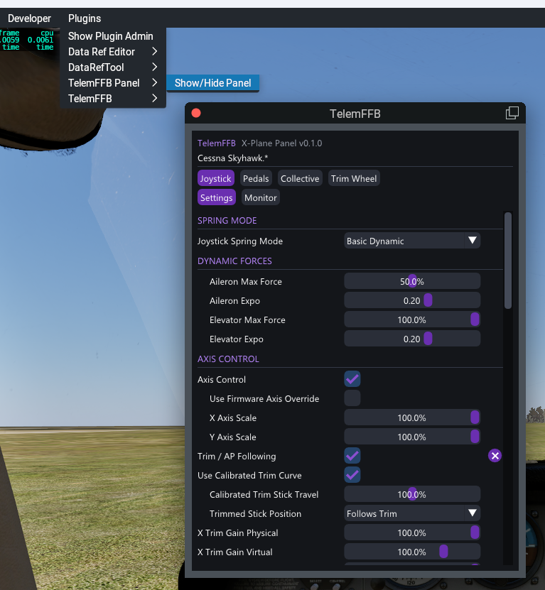

# In-Sim Settings Panel

TelemFFB includes an in-sim settings panel for Microsoft Flight Simulator and X-Plane. The panel shows the current aircraft's TelemFFB settings and lets you change them without leaving the cockpit. Its **Monitor** view shows the active effects and the live telemetry. The controls are sized for VR laser-pointer and controller use.

In MSFS, the panel is a toolbar window. In X-Plane, it is a plugin window. Both talk to a small local HTTP server built into TelemFFB. This server runs only while MSFS or X-Plane is the connected sim.

## Enable the Panel Server

Each sim has its own switch.

1. Open **System → System Settings → Simulator Setup**.
2. On the **MSFS** or **X-Plane** page, enable the sim.
3. Enable **Start in-sim settings panel server**. This setting is on by default.

## Install the Panel in MSFS

TelemFFB can install the panel for you.

1. Open **System → System Settings → Simulator Setup → MSFS**.
2. Under **In-sim panel installs**, TelemFFB shows one block for each MSFS 2020/2024 copy it finds (Microsoft Store or Steam). Each block has the path to the Community folder of that copy, and its install status.
3. Click **Install** in the block of the copy you want. If a version is already installed, this button reads **Update** or **Reinstall** instead.
4. Confirm the prompt. TelemFFB copies the panel into that copy's Community folder.
5. Restart MSFS for the change to take effect.

{ width="650px" }

!!! note "Panel version"
    Each block shows the installed panel version, alongside the version TelemFFB can install: **Not installed**, **Installed: *version* (up to date)**, or **Installed: *version* -> *version* available**. Click **Update** when a newer version is available.

### When TelemFFB Cannot Find the Community Folder

If the path in a block is empty or wrong, type the correct path in the field, or click **...** to browse to the folder. If the selected folder does not look like an MSFS Community folder, TelemFFB asks whether to use it anyway, because add-on linkers and custom package paths are valid Community folders. Click **Install** to install the panel at that path. Click **Save** to keep the path for the next time.

If TelemFFB finds no MSFS copy at all, it shows **No MSFS 2020/2024 install detected (Microsoft Store or Steam).** and one block with an empty field, **Path to MSFS Community folder:**. Type or browse to your Community folder, then click **Install**.

### Install the Panel Manually in MSFS

If the installer cannot write to your Community folder, copy the panel in yourself:

1. Find the `vpforce-telemffb-panel` folder inside your TelemFFB install directory, at `assets\msfs-panel\vpforce-telemffb-panel`.
2. Copy this whole folder into your MSFS Community folder.
3. Restart MSFS.

!!! tip "Finding your Community folder"
    The Community folder location depends on your MSFS version and edition (Microsoft Store or Steam). Check `UserCfg.opt` for your installed packages path, or see Microsoft's documentation for the exact location on your system.

## Install the Panel in X-Plane

In X-Plane, the panel is a plugin of its own, separate from the TelemFFB telemetry plugin. TelemFFB installs it into each X-Plane install from the [X-Plane installs](sim-setup.md#x-plane-installs) list.

1. Close X-Plane.
2. Open **System → System Settings → Simulator Setup → X-Plane**.
3. Under **X-Plane installs**, find the install you want. Its **Panel** line reads **not installed**.
4. Click **Install** on that line, then confirm the prompt.
5. Start X-Plane.

When TelemFFB has a newer panel than the one installed, the **Panel** line reads **update available** and shows an **Update** button. TelemFFB also offers the update when it starts.

### Install the Panel Manually in X-Plane

1. Close X-Plane.
2. Find the `TelemFFB-Panel` folder inside your TelemFFB install directory, at `assets\xplane-plugin\TelemFFB-Panel`.
3. Copy this whole folder into `Resources\plugins` in your X-Plane folder.
4. Start X-Plane.

## Using the Panel

### Open the Panel

- **MSFS** - open the toolbar at the top of the screen and select the **VPforce Settings** icon.
- **X-Plane** - select **Plugins → TelemFFB Panel → Show/Hide Panel**. To open the panel from a key or a VR controller button, bind the X-Plane command `TelemFFB/panel/toggle`. In VR, the panel goes into the headset with X-Plane.

The panel loads the current aircraft's TelemFFB settings once TelemFFB detects that aircraft. Until then, it shows a waiting message. In X-Plane, if TelemFFB is not running or its panel server is off, the panel says so.

{ width="500px" }

{ width="500px" }

### Settings View

- **Device buttons** - with more than one device, select **Joystick**, **Pedals**, **Collective** or **Trim Wheel** to show that device's settings and effects.
- **×** - marks a setting you changed. Click it to return the setting to its default.
- **Button settings** - click **Click to bind**, then press the button on your device within 5 seconds.
- **Configuration errors** - an error that TelemFFB shows in its status area also shows at the top of the panel, until you correct it.
- **Panel size** - in MSFS, **− / +** makes the whole panel smaller or larger, from 100% to 500%. The size is remembered separately for VR and for the desktop view. In X-Plane, drag an edge of the window.

Settings that set up a device or an aircraft are not on the panel. These include the custom axis and telemetry variables, axis control for each device, and the VPforce Configurator overrides. Change them in the desktop app.

Changes you make in the panel save to the same profile the desktop Settings dialog uses. If the aircraft's active profile is **Built-In**, TelemFFB creates a new **Auto User** profile for it, the same as when you change a setting from the desktop app.

### Monitor View

Select **Monitor** to see what TelemFFB is doing for the selected device.

- **Active Effects** - each effect that plays now, with the same type badges and intensity as the desktop [Monitor tab](ui-overview.md#monitor-tab).
- **Telemetry** - the live telemetry values. **Favorites** shows only the items you starred, and **All** shows every item. Click the star beside an item to add it to your favorites or remove it. The panel and the desktop Monitor tab share one list of favorites.
