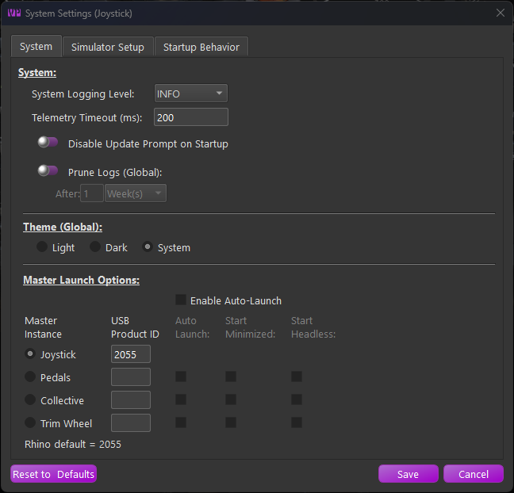

# Installation

## TelemFFB and Antivirus Software

### Why Antivirus Software May Flag This Application

This application is packaged using [**PyInstaller**](https://pyinstaller.org/), a tool that bundles Python applications into standalone Windows executables. Occasionally, Windows Defender or other antivirus software may flag the generated .exe file as potentially malicious. This is a common issue across many open-source and independent software projects and **does not mean the application is unsafe**.

#### What Causes False Positives?

There are a few key reasons why antivirus software might misidentify
the executable:

1.  **Heuristic Scanning** Security suites often use heuristic analysis to flag behaviors typical of malware (e.g., dynamic imports, compressed binaries, network or file system access). PyInstaller-packaged apps often exhibit similar patterns due to how Python and its libraries are bundled.

2.  **Bundled Dependencies** This app includes numerous open-source Python libraries, which are all extracted and compiled into a single executable. This results in a large and complex binary - sometimes resembling known malware in structure - especially when compression or UPX is used.

3.  **Lack of Widespread Use or Code Signing** Applications that are new or not widely installed are more likely to be flagged. Additionally, because this application is not signed with a commercial code signing certificate, Windows may mark it as "unrecognized" or "unknown publisher," increasing suspicion.

4.  **Frequent Builds** Every build generates a slightly different binary (even without code changes), which antivirus vendors haven't yet seen. As a result, they may temporarily flag it until it's verified as safe by more users.

**How We Ensure Safety**

-   All source code is openly available and auditable.
-   Dependencies are widely used Python packages from the [Python Package Index (PyPI)](https://pypi.org/).
-   Builds are produced in a clean environment to prevent contamination.

**What You Can Do**

-   **Allow the app manually** if it's flagged and you trust the source.
-   **Submit the executable to Microsoft or your antivirus vendor** for review. This helps improve detection accuracy over time.
-   Check with [VirusTotal](https://www.virustotal.com/) to independently verify whether the file is flagged across multiple engines.

## First-Time Setup

**New Installations:**

TelemFFB does not have an installer. It is distributed as a zip file package. Simply download the latest version from the [GitHub Releases](https://github.com/walmis/VPforce-TelemFFB/releases) page and extract it where you want the application to reside.

The first time you install and launch TelemFFB, you will be greeted by the system settings window. Follow the guidelines in the ***systems setting section*** for setting up TelemFFB.

{ width="587px" height="563px" }
