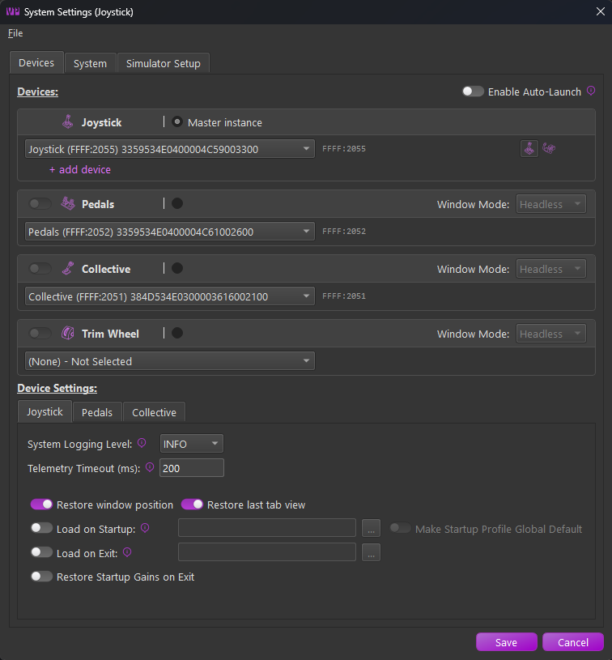

# Installation

## Installing TelemFFB

TelemFFB does not have an installer. It is distributed as a zip file package. Simply download the latest version from the [GitHub Releases](https://github.com/walmis/VPforce-TelemFFB/releases) page and extract it where you want the application to reside.

!!! warning "Extract into a dedicated folder"
    The auto-updater manages **everything** in the folder that contains `VPforce-TelemFFB.exe`, so TelemFFB must live in a folder of its own, for example `C:\TelemFFB` or a `TelemFFB` folder on your Desktop.

    Do not extract the files directly onto your Desktop, into Documents or Downloads, into a drive root, or into Program Files, and do not start the application from inside the zip file. TelemFFB detects these locations and refuses to start, explaining where to move the files.

The first time you install and launch TelemFFB, you will be greeted by the system settings window. Follow the guidelines in the [System Settings](configuration.md) section for setting up TelemFFB; the [Quick Start](quick-start.md) walks through the first-launch steps in order.

{ width="587px" height="563px" }

!!! note
    If your antivirus flags the executable, see [TelemFFB and Antivirus Software](#telemffb-and-antivirus-software) below. This is a known false-positive pattern with PyInstaller-packaged applications.

## Running TelemFFB from Source

Most users should download the release executable from the [GitHub Releases](https://github.com/walmis/VPforce-TelemFFB/releases) page as described above. However, developers, testers, and anyone who wants to run an unreleased branch can run TelemFFB directly from source instead.

!!! note
    Running TelemFFB from source uses the exact same user configuration and system settings as the compiled release version. There is no separate config to manage; changes made while running from source will carry over to the release executable, and vice versa.

### Install Python

TelemFFB currently requires **Python 3.12**. It is the version used to compile the official release builds.

!!! warning "Newer Python versions will not work yet"
    The numpy version pinned in `requirements.txt` is not compatible with Python versions newer than 3.12. Do not use Python 3.13 or newer until the build environment and the numpy requirement are updated.

1. Download a **3.12.x** installer from the [python.org downloads page](https://www.python.org/downloads/). The page promotes the newest release at the top, so scroll down to the release list and pick the latest 3.12.x version.
2. Run the installer. On the first screen, check **"Add python.exe to PATH"** before clicking **Install Now**.
3. Verify the installation by opening a terminal (PowerShell or Command Prompt) and running:

    ```
    python --version
    ```

    This should print `Python 3.12.x`.

!!! tip "More than one Python version installed?"
    You do not need a version manager on Windows; the `py` launcher that installs with Python selects versions directly. Verify 3.12 is available with `py -3.12 --version`, and if plain `python` reports a different version, substitute `py -3.12` for `python` (and `py -3.12 -m pip` for `pip`) in every command below.

### Clone the repository

If you don't already have Git installed, download and install it from [git-scm.com](https://git-scm.com/downloads). The default options in the installer are appropriate for most users.

Open a terminal in the folder where you want the project to live, then clone the repository:

```
git clone https://github.com/walmis/VPforce-TelemFFB.git
cd VPforce-TelemFFB
```

!!! note
    All of the remaining steps must be run from inside the `VPforce-TelemFFB` folder created by the clone. If you open a new terminal window or session, make sure to `cd` into that folder first before continuing.

### (Optional) Check out a specific branch

By default, the clone checks out the `wip` branch. To work with a different branch (for example, to test an in-progress feature), make sure you're in the `VPforce-TelemFFB` folder, then list the available branches and check out the one you need:

```
git fetch
git branch -a
git checkout <branch-name>
```

Replace `<branch-name>` with the name of the branch you want to use.

### Install dependencies

From the `VPforce-TelemFFB` folder, run:

```
pip install -r requirements.txt
```

!!! note "If pip fails with a compiler error"
    On 64-bit Python 3.12, every dependency installs as a prebuilt package. If pip instead tries to compile one and fails with `Microsoft Visual C++ 14.0 or greater is required`, first confirm you are running 64-bit Python 3.12; a different version or a 32-bit install is the usual cause. If the compile requirement is genuine, install the [Build Tools for Visual Studio](https://visualstudio.microsoft.com/visual-studio-build-tools/) with the **Desktop development with C++** workload, then run the `pip install` command again.

### Run TelemFFB

With dependencies installed, launch the application from the `VPforce-TelemFFB` folder with:

```
python main.py
```

The first time you run the program, it may prompt you to install an export script in your `Saved Games\DCS` folder for telemetry data collection; accept this if you intend to use TelemFFB with DCS.

### Updating your source checkout

To pull the latest changes on your current branch:

```
git pull
```

To discard local changes and reset to the latest version of the branch:

```
git reset --hard origin/<branch-name>
```

## TelemFFB and Antivirus Software

### Why Antivirus Software May Flag This Application

This application is packaged using [**PyInstaller**](https://pyinstaller.org/), a tool that bundles Python applications into standalone Windows executables. Occasionally, Windows Defender or other antivirus software may flag the generated .exe file as potentially malicious. This is a common issue across many open-source and independent software projects and **does not mean the application is unsafe**.

#### What Causes False Positives?

There are a few key reasons why antivirus software might misidentify
the executable:

1. **Heuristic Scanning** Security suites often use heuristic analysis to flag behaviors typical of malware (e.g., dynamic imports, compressed binaries, network or file system access). PyInstaller-packaged apps often exhibit similar patterns due to how Python and its libraries are bundled.

2. **Bundled Dependencies** This app includes numerous open-source Python libraries, which are all extracted and compiled into a single executable. This results in a large and complex binary, sometimes resembling known malware in structure, especially when compression or UPX is used.

3. **Lack of Widespread Use or Code Signing** Applications that are new or not widely installed are more likely to be flagged. Additionally, because this application is not signed with a commercial code signing certificate, Windows may mark it as "unrecognized" or "unknown publisher," increasing suspicion.

4. **Frequent Builds** Every build generates a slightly different binary (even without code changes), which antivirus vendors haven't yet seen. As a result, they may temporarily flag it until it's verified as safe by more users.

**How We Ensure Safety**

- All source code is openly available and auditable.
- Dependencies are widely used Python packages from the [Python Package Index (PyPI)](https://pypi.org/).
- Builds are produced in a clean environment to prevent contamination.

**What You Can Do**

- **Allow the app manually** if it's flagged and you trust the source.
- **Submit the executable to Microsoft or your antivirus vendor** for review. This helps improve detection accuracy over time.
- Check with [VirusTotal](https://www.virustotal.com/) to independently verify whether the file is flagged across multiple engines.
