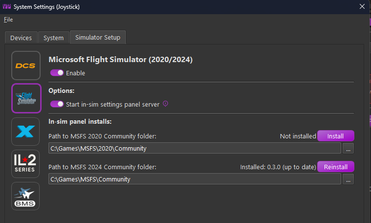
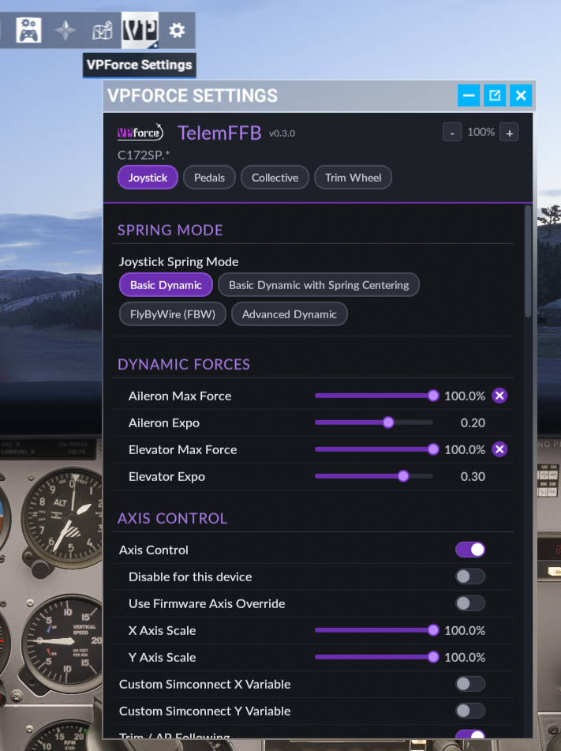

# MSFS In-Sim Toolbar Panel

TelemFFB includes an in-sim toolbar panel for Microsoft Flight Simulator. The panel shows the current aircraft's TelemFFB settings and lets you change them without leaving the cockpit. Toggles, choice pills, and sliders are sized for VR laser-pointer and controller use.

The panel talks to a small local HTTP server built into TelemFFB. This server runs only while MSFS is the active sim.

## Enable the panel server

1. Open **System → System Settings → Sim Setup**.
2. On the **MSFS** tab, enable **MSFS**.
3. Enable **Start in-sim settings panel server**. This setting is on by default.

## Install the panel

TelemFFB can install the panel for you.

1. Open **System → System Settings → Sim Setup → MSFS**.
2. Under **In-sim panel installs**, TelemFFB shows one block for each MSFS 2020/2024 copy it finds (Microsoft Store or Steam). Each block has the path to the Community folder of that copy, and its install status.
3. Click **Install** in the block of the copy you want. If a version is already installed, this button reads **Update** or **Reinstall** instead.
4. Confirm the prompt. TelemFFB copies the panel into that copy's Community folder.
5. Restart MSFS for the change to take effect.

{ width="650px" }

!!! note "Panel version"
    Each block shows the installed panel version, alongside the version TelemFFB can install: **Not installed**, **Installed: *version* (up to date)**, or **Installed: *version* -> *version* available**. Click **Update** when a newer version is available.

## When TelemFFB cannot find the Community folder

If the path in a block is empty or wrong, type the correct path in the field, or click **...** to browse to the folder. If the selected folder does not look like an MSFS Community folder, TelemFFB asks whether to use it anyway, because add-on linkers and custom package paths are valid Community folders. Click **Install** to install the panel at that path. Click **Save** to keep the path for the next time.

If TelemFFB finds no MSFS copy at all, it shows **No MSFS 2020/2024 install detected (Microsoft Store or Steam).** and one block with an empty field, **Path to MSFS Community folder:**. Type or browse to your Community folder, then click **Install**.

## Install the panel manually

If the installer cannot write to your Community folder, copy the panel in yourself:

1. Find the `vpforce-telemffb-panel` folder inside your TelemFFB install directory, at `assets\msfs-panel\vpforce-telemffb-panel`.
2. Copy this whole folder into your MSFS Community folder.
3. Restart MSFS.

!!! tip "Finding your Community folder"
    The Community folder location depends on your MSFS version and edition (Microsoft Store or Steam). Check `UserCfg.opt` for your installed packages path, or see Microsoft's documentation for the exact location on your system.

## Using the panel in MSFS

Open the toolbar at the top of the screen and select the **VPforce Settings** icon. The panel loads the current aircraft's TelemFFB settings once TelemFFB detects that aircraft. Until then, it shows **Waiting for TelemFFB / MSFS aircraft...**

{ width="500px" }

- **Device buttons** - with more than one device, select **Joystick**, **Pedals**, **Collective** or **Trim Wheel** to show that device's settings.
- **×** - marks a setting you changed. Click it to return the setting to its default.
- **− / +** - makes the whole panel smaller or larger, from 100% to 500%. The size is remembered separately for VR and for the desktop view.

Changes you make in the panel save to the same profile the desktop Settings dialog uses. If the aircraft's active profile is **Built-In**, TelemFFB creates a new **Auto User** profile for it, the same as when you change a setting from the desktop app.
