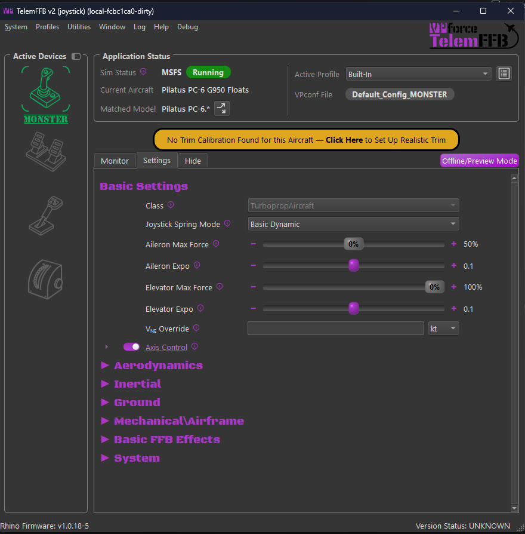
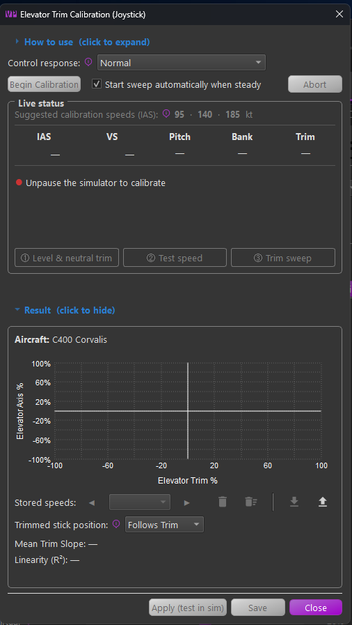
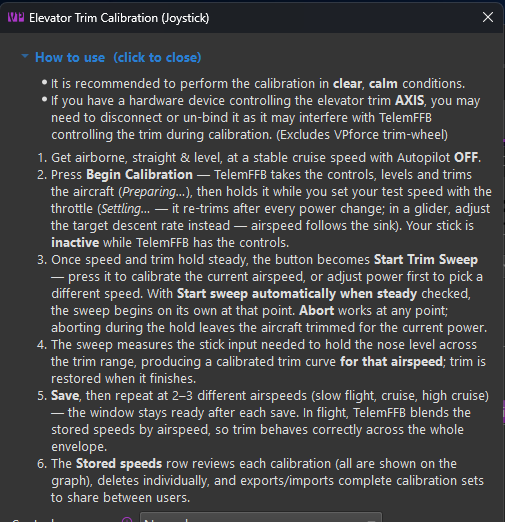
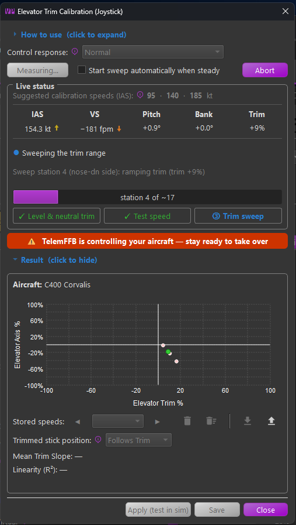
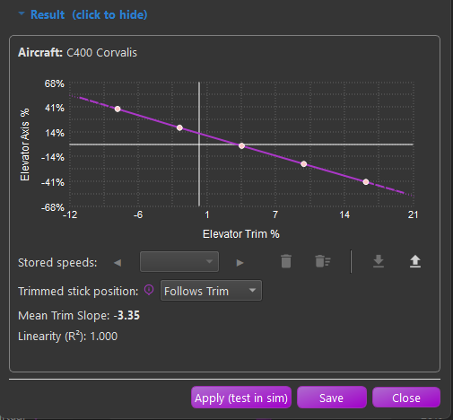

# Automatic Trim Calibration

Tuning elevator trim following by hand is slow and error prone. The **Elevator Trim Calibration** tool measures it for you. TelemFFB flies the aircraft, levels and trims it, and holds it at a test speed you choose. It then sweeps the elevator trim across its range and records the stick input needed to hold the nose level at each step. The result is a calibrated trim curve for that airspeed.

Calibrate at two or three airspeeds. In flight, TelemFFB blends the stored calibrations by airspeed.

!!! warning
    During a calibration, **TelemFFB is flying your aircraft**. It moves the trim and the elevator and aileron axes, and your stick is inactive until it hands control back. Keep the autopilot off, stay ready to take over, and press **Abort** if anything looks wrong. Only calibrate with safe altitude and clear airspace.

!!! note
    Calibration applies to the elevator (Y) axis of a joystick and runs from the master TelemFFB instance. It is available for fixed-wing aircraft in MSFS and X-Plane.

## Before You Start

- Calibrate in clear, calm weather if you can. Turbulence and gusts disturb the measurements.
- Be airborne, straight and level, at a stable cruise speed, with the autopilot **off**. 
- If a hardware device controls the elevator trim **axis** in the sim, unbind or disconnect it. It can fight TelemFFB for the trim during the run. A VPforce trim wheel is the exception; TelemFFB pauses it for you.
- **Axis Control** and **Trim / AP Following** must be enabled for the aircraft (see [Trim & Autopilot Following](msfs-xp-trim-following.md)). A calibration can run without them, but the result has no effect in flight. The tool shows a warning banner when either is off.

## Opening the Tool

There are three ways to open the tool:

- **Utilities → Elevator Trim Calibration...**
- On the Settings tab, under **Trim / AP Following → Use Calibrated Trim Curve**, the **Trim Curve Calibration** row has a **Calibrate...** button. It reads **View / Recalibrate...** once the aircraft has a stored calibration.
- When you load a fixed-wing aircraft with no stored calibration, the amber prompt **No Trim Calibration Found for this Aircraft** appears above the tabs. Click it to open the tool. The prompt goes away when you save a calibration, and returns if you delete the last one. See [Prompts](ui-overview.md#prompts).

{ width="600px" }

Many built-in profiles already include a calibration. These include several MSFS default aircraft and the X-Plane 12 Cessna 172, Cirrus SR22 and Van's RV-10. For these aircraft the prompt does not appear, and the tool opens on the stored calibrations.

## The Calibration Window

{ width="480px" }

From top to bottom, the window has:

- **How to use**: a short version of this page. Click the heading to expand or collapse it.

    { width="480px" }

- **Control response**: how strongly TelemFFB flies the aircraft during the run. See [Control Response](#control-response).
- **Glider descent rate**: shown for gliders only. See [Gliders](#gliders).
- **Begin Calibration**, the **Start sweep automatically when steady** checkbox, and **Abort**.
- **Live status**: suggested test speeds, the current flight values, a status line, and three step lamps.
- **Result**: the graph, the stored calibrations, and the result values. Click the heading to collapse it on a small screen. A new result always opens it again.
- **Apply (test in sim)**, **Save** and **Close**.

### Live Status

The top row lists **Suggested calibration speeds (IAS)**, calculated from the aircraft's data received via telemetry:

- The low speed is 1.3 times the clean stall speed.
- The high speed comes from the design cruise speed in MSFS, or from just below the top of the green arc in X-Plane.

The suggestions are optional, and the low and high speeds matter most. A speed has a stored calibration within 5kt is crossed out.
Below the suggestions are the live values: **IAS**, **VS**, **Pitch**, **Bank** and **Trim**. Two of them carry an indicator:

- **IAS** has a trend arrow. It points up or down as the airspeed changes, and grows and turns from green to amber to red as the change gets faster. A flat green dash means the airspeed is steady. During a run, IAS also shows how far the speed has drifted from the start, in amber from 5% and in red from 10%.
- **VS** has a readiness indicator. A flat green dash means the vertical speed is inside the range the next step accepts. Outside that range, an arrow points the way the aircraft is climbing or descending, and turns from amber to red as the error grows. Before you press **Begin Calibration** the range is ±500 fpm. During the run it is about ±100 fpm. Hover over the indicator to see the current error and range.

The status line has a colored light and one sentence about the current phase or what is missing. A grey line under it shows the calibration's detailed progress. During the sweep, a progress bar counts the measuring stations.

The three step lamps at the bottom show where the run is: **Level & neutral trim**, **Test speed** and **Trim sweep**. A lamp's color tells you who acts:

- Blue: In Progress.
- Amber: Waiting for user action.
- Green: Step is ready or complete.

## Running a Calibration

1. Get the aircraft straight and level at a stable speed. When the status light turns green and reads **Ready to calibrate**, press **Begin Calibration**.
2. TelemFFB takes the controls. It makes a few small inputs to learn how the aircraft responds, levels it, and finds the trim setting that holds it level. The button reads **Preparing…** and the first lamp is blue.
3. TelemFFB holds the aircraft level while you set the test speed with the throttle. It re-trims after every power change. The button reads **Settling…** and the second lamp is amber. Let the airspeed settle; MSFS can take a minute or more to reach a new speed after a power change.
4. When speed and trim have held steady for a few seconds, the lamp turns green and the button becomes **Start Trim Sweep**. Press it to calibrate at the current airspeed, or change power first to pick another speed.
5. TelemFFB confirms the airspeed is steady, then sweeps the trim across its range. The button reads **Measuring…** and the progress bar counts the stations. When the sweep finishes, TelemFFB puts the trim back where it was and returns the controls to you.

Check **Start sweep automatically when steady** to skip step 4. The sweep then starts as soon as speed and trim are steady.

{ width="480px" }

### Aborting

Press **Abort** at any time. If you abort while TelemFFB holds the aircraft at the test speed, it leaves the aircraft trimmed for the current power. If you abort in any other phase after TelemFFB has moved the trim, it puts the trim back where it was.

TelemFFB also aborts the run on its own, and hands back control, when:

- the sim pauses, the autopilot engages, or the aircraft is on the ground
- telemetry stops arriving, or the aircraft does not report a value the calibration needs
- pitch or roll moves too far from level, or the airspeed drifts out of range
- the trim does not respond to commands, or moves erratically
- the elevator reaches its limit before enough points are measured

The result area then shows **Last run aborted:** and the reason.

Some aircraft cannot be calibrated. Examples are aircraft whose trim can overpower full elevator, aircraft with very sensitive trim, and aircraft with automatic trim that cannot be turned off.

### Control Response

**Control response** sets how strongly TelemFFB flies the aircraft:

- **Normal** suits most aircraft.
- **Reduced** is for sensitive aircraft that porpoise or bounce while TelemFFB levels them. **Minimal** is for very sensitive or aerobatic aircraft.
- **Increased** is for sluggish or heavy aircraft with a slow porpoise that gets worse when you lower the response.

If a run aborts because of a pitch oscillation, try the next lower setting. If a slow porpoise gets worse as you lower it, go the other way. TelemFFB also lowers its own control gains when it detects a growing oscillation. You can change the setting during a run until the sweep starts.

### Gliders

A glider cannot hold level flight, so for a glider TelemFFB holds a steady descent instead. Set the sink rate in **Glider descent rate**. The default is -100 fpm, and the range is -1000 to 0 fpm.

A glider has no throttle, so the descent rate also sets the test speed. Choose a steeper descent to fly faster or a shallower one to fly slower, and start the sweep once the speed settles. You can change the descent rate until the sweep starts. It returns to the default each time you open the tool.

## Reading the Result

When the sweep finishes, the graph shows the measured points and the fitted curve. The horizontal axis is the elevator trim, and the vertical axis is the elevator input needed to hold the nose level.

{ width="480px" }

- **Mean Trim Slope** is the average slope of the measured line: how much the elevator input changes per unit of trim. Use it to compare runs and speeds.
- **Linearity (R²)** shows how straight the measured response is. A value near 1.000 means a straight line. A lower value means the response bends, and the curve follows the bend.

Notes under the values point out anything worth checking:

- The airspeed drifted during the sweep, which can skew the measurement. Test the result with **Apply**, and re-run with steadier power if trim following seems off.
- Some points are shown in amber. The aircraft was still climbing or descending slightly when they were measured, so the curve may be slightly off near those trim settings.
- The trim response is asymmetric: stronger on one side of neutral than the other. This is normal when the nose-up and nose-down trim limits differ, and the curve captures it.
- Saving will replace a stored calibration within 5 knots of this run, or add this run as another stored speed.

## Testing and Saving

**Apply (test in sim)** applies the result live without saving it. To test it:

1. Fly straight and level and let the aircraft settle.
2. Hold the stick still in one place.
3. Slowly run the trim nose-up, then nose-down, across its range.

With a good calibration the nose stays level as you trim. The stick force relieves, but the aircraft does not pitch. If the nose drifts, run the calibration again.

**Save** adds the result to the aircraft's stored calibrations, turns on **Use Calibrated Trim Curve**, and saves the **Trimmed stick position**. If a stored calibration is within 5 knots of the new one, TelemFFB asks whether to replace it. **Apply** asks the same question.

After a save, the window is ready for the next run. Change power, let the speed settle, and calibrate again. Two or three speeds usually cover the aircraft: slow flight, cruise and high cruise. In flight, TelemFFB blends between the two stored speeds nearest the current airspeed. Below the slowest or above the fastest stored speed, it uses that calibration as it is.

## Stored Calibrations

The **Stored speeds** row manages the aircraft's saved calibrations. The graph draws all of them and highlights the one selected in the list.

- Use the arrows or the list to select a calibration.
- The trash can deletes the selected calibration. You can also right-click its curve on the graph. Deleting the last calibration turns off the calibrated curve until you calibrate again.
- The second trash can deletes all stored calibrations.
- **Export** writes the stored calibrations and the trimmed stick position to a file you can share.
- **Import** loads a shared file and replaces the stored calibrations. If the file was made for a different sim or aircraft profile, TelemFFB lists the differences and asks before importing.

### Trimmed Stick Position

**Trimmed stick position** sets where the stick rests when the aircraft is in trim:

- **Follows Trim**: the stick moves with the trim, aft when trimmed slow and forward when trimmed fast. This matches aircraft where the yoke is linked to a trim tab or cable.
- **Stays Centered**: the stick rests at center whenever the aircraft is in trim. This matches moving-stabilizer, fly-by-wire and spring-cartridge aircraft. Jets default to this mode.

Stick forces are the same in both modes: zero force in trim, force when out of trim. Only the resting position changes. A change applies and saves at once, without a run. The same setting is on the Settings tab under **Use Calibrated Trim Curve**.

## Calibrations in the Offline Editor

You can open the tool from the offline editor. Choose a sim, class and aircraft in **Offline Editor Setup** first. The tool then shows that aircraft's stored calibrations. You can export and import them, but you cannot delete them or change the trimmed stick position.

## Aircraft With Custom Trim Systems (MSFS)

A calibration writes the trim the same way the aircraft's trim wheel does. It uses the aircraft's Trim Wheel device settings: **Use Axis instead of Direct**, **Custom Simconnect Y Variable** and **+/- Range Y Scaling**. They apply whether or not you own a trim wheel. Profiles for aircraft that ignore direct trim writes ship with these settings, so calibration works on them without changes.

When TelemFFB's debug mode is active, the window also shows these trim settings and a **Record diagnostic trace** checkbox. The trace saves a per-frame record of the run to the TelemFFB log folder. Attach it when you report an aircraft that will not calibrate.

!!! note "X-Plane"
    Automatic calibration works in X-Plane as well as MSFS. The tool sets the elevator trim through the TelemFFB X-Plane plugin. Use a current version of the plugin; it supplies the pitch, vertical speed and trim values the calibration needs.
