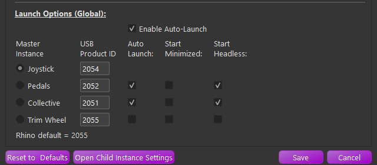

# Running with Multiple Devices

## Running TelemFFB with multiple VPforce FFB devices

With the availability of the VPforce DIY kits, people are developing their own FFB devices such as rudder pedals, and even collectives. While DCS does not support FFB on the rudder or collective axes (nor MSFS or IL2), it is still possible to play all of the effects that TelemFFB offers through any VPforce device.

By default, TelemFFB attempts to connect to the VID:PID address that is specific to the Rhino Joystick Base. The VID for all VPforce control boards is 'FFFF'. The default PID for the Rhino Joystick Base is '2055'. The PID can be viewed (and modified) in the VPforce FFB Configurator utility.

In the system settings Launch Options section, you can configure the PID values for each of your FFB devices.

{ width="527px" height="231px" }

You can also choose which additional devices you would like to automatically launch when the master instance of TelemFFB is started. These additional child instances can be started in normal, minimized or headless modes.

After starting TelemFFB using the auto-launch mode, you will see all of the device icons listed in the Device Status area. See the ***Active Device Area*** documentation for details on monitoring and switching between devices for configuration.
