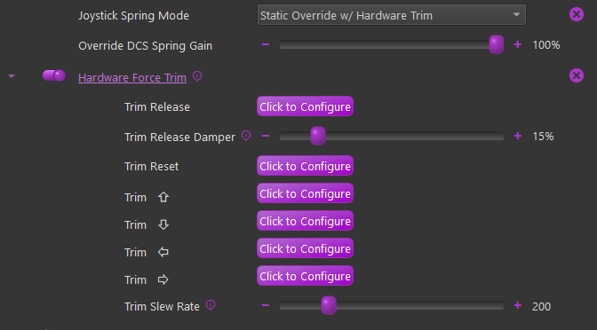

# DCS

### DCS

#### Joystick Spring Mode

Several different spring modes are available. Different options will be available depending on the selection

-   **None (Game Managed)** - (Default)

    -   No Spring effect is supplied by TelemFFB. The game is left to manage its own spring

-   **Static Override w/ Hardware Trim**

    -   A static spring with configurable gain is started and will override the game spring effect.
    -   Hardware force trim settings are available

{ width="469px" height="260px" }

-   **Advanced Dynamic**

    -   See the ***Advanced Dynamic Spring** documentation

#### Pedal Spring Mode

DCS does not natively support FFB pedals. TelemFFB has implemented basic FFB capabilities.

The following modes are supported

-   **None (Game Managed) - NOT RECOMMENDED as the game does not support pedal FFB**

-   **No Spring - (Helicopter default)**

    -   A "zero gain" spring effect will be started to override the game spring effect

-   **Static Spring (Jet default)**

    -   A configurable static gain spring effect will be started.

-   **Dynamic Spring (Prop/Turboprop default)**

    -   A spring effect will be started that stiffens as airspeed increases. The speed range at which the spring stiffens is pre-defined based on published aircraft speed envelope data

-   **Dynamic w/ Custom Speeds**

    -   Same as Dynamic but with configurable speed ranges

-   **Advanced Dynamic**

    -   See the ***Advanced Dynamic*** Spring section

#### Low Hydraulic Pressure Effect

See the documentation for this effect in the ***MSFS Low Hydraulic Pressure Effect Section*** above. The effect works largely the same way for DCS.

Support is currently limited to:

-   UH-1, SA342, Mi-8, Mi-24, KA-50

-   A-10C, AV-8B, F-14, F15ESE

The primary difference is that for each DCS aircraft, the telemetry must be individually sourced in a unique way per aircraft. As such, the supported aircraft are limited at this time. See the TelemFFB release notes for the supported aircraft.

For DCS Aircraft, the Hydraulic System Threshold setting has already been coarsely configured for each of the supported aircraft, depending on how the data is being read and what the normal values are.

#### Autopilot Oscillation with FFB

Some DCS aircraft experience pitch or roll oscillations when engaging autopilot modes (attitude hold, altitude hold, etc.) with an FFB joystick connected. This is caused by a mismatch between the physical stick position and the virtual stick position in the simulator — the autopilot commands a stick position through the spring effect, the FFB device overshoots or lags slightly, and the autopilot overcorrects. DCS has inherent lag in its virtual control loop that amplifies this feedback loop, producing several oscillation cycles before stabilizing — or in some cases, never fully stabilizing.

This behavior is a DCS-side limitation in how the simulator's autopilot interacts with DirectInput force feedback. It is not caused by the Rhino hardware, VPforce Configurator, or TelemFFB.

**Diagnostic check:**

1. Open the DCS controls indicator with `RCtrl+Enter`
2. Engage the autopilot mode and observe the stick position
3. If the stick input visibly lags behind or hunts around the commanded trim position, the autopilot-FFB control loop is unstable

**What you can try:**

- Ensure **DCS Axis Tune deadzone** is set to `0` — do not stack the DCS deadzone on top of a firmware deadzone, as this can make the oscillation worse
- **Enable Adaptive Recentering** in VPforce Configurator (Effects tab) — this automatically adjusts the stick center to match the current trim point, reducing the position mismatch that drives the oscillation
  
!!! warning "Adaptive Recentering Exception"
    If using **HPG Force Mode** (experimental), ensure Adaptive Recentering is **disabled** in the VPforce Configurator, as it can interfere with the force-based hands-on detection hysteresis.

- For supported aircraft, TelemFFB's **Dynamic Deadzone** automatically activates a deadzone when the autopilot engages, preventing the stick from feeding small position errors back into the AP control loop. The deadzone is removed when the AP disengages, restoring full precision
- Not all aircraft are affected equally — the behavior depends on how each module implements autopilot control surfaces

For detailed troubleshooting steps including input deadzone configuration and manual stick synchronization, see [Autopilot Misbehaving or Disengaging Unexpectedly](../rhino/troubleshooting-maintenance.md#autopilot-misbehaving-or-disengaging-unexpectedly).

!!! note
    TelemFFB's **Autopilot Following** feature (axis control + trim/AP tracking) is available for MSFS and X-Plane only. It does not apply to DCS. However, TelemFFB's **Dynamic Deadzone** feature does work in DCS for supported aircraft.
