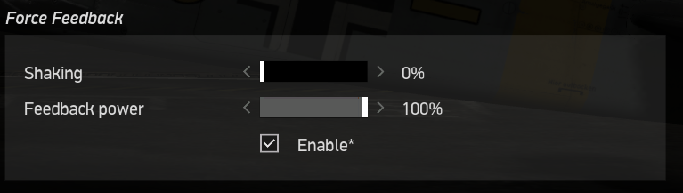
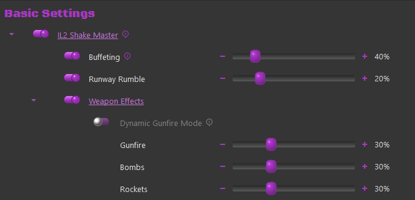

# IL-2

### IL-2

#### Duplicate 'Shake' effects

IL2 implements FFB for dynamic stick forces and some very basic shake effects. TelemFFB implements duplicate (but far more configurable) effects which overlap with those that are implemented by IL2. To enable these specific settings, enable the "IL-2 Shake Master" setting in TelemFFB.

!!! note
    It is recommended to set the "Shaking" intensity in the IL-2 FFB control settings to 0 if you enable these settings in TelemFFB.

This can be found in Settings→Input Devices within the IL2 configuration

{ width="445px" height="126px" }

The IL2 Shake Master settings

{ width="423px" height="204px" }

Each setting individually controls the intensity of that effect type:

-   **Buffeting** - Controls the intensity of AoA Stall Buffeting

-   **Runway Rumble** - Controls the intensity of bumping induced while taxiing

-   **Weapons Effects (Master Toggle)**

    -   **Dynamic Gunfire Mode**

        -   When Enabled, the shell size and weight are used to calculate a dynamic effect frequency. In general, smaller lighter rounds will produce a higher frequency effect than larger, slower rounds.

            -   Direct "rounds per second" telemetry is not available from the sim

    -   **Gunfire** - Controls the intensity of the gunfire/canon effect
    -   **Bombs** - Controls the intensity of the bomb-drop effect
    -   **Rockets** - Controls the intensity of the rocket firing effect
