# MSFS & X-Plane

### MSFS and X-Plane

Both Microsoft Flight Simulator and X-Plane lack native force feedback support, but TelemFFB bridges this gap by leveraging their robust telemetry export capabilities. This section covers the advanced features and configuration options specific to these simulators, including trim and autopilot following, dynamic spring curves, and helicopter force trim emulation. The settings and workflows described here enable you to achieve sophisticated force feedback behavior that closely simulates real aircraft dynamics and control characteristics.

#### Trim and Autopilot Following

TelemFFB supports trim and autopilot following in MSFS and X-planes, with special caveats for MSFS. In order for TelemFFB to emulate movement of the joystick/pedals in response to trim or autopilot inputs, it needs to be able to control the axis position that MSFS is seeing from the joystick device. This is required since these simulators have no concept of FFB or axis offsets and will interpret any intentional deflection of an axis as ***deflection of the control surface*** and not just a response to the trim input. This is counteracted in software by limiting the amount of physical movement of the joystick that is actually communicated to MSFS.

**For MSFS:**

!!! note
    Trim and Autopilot following in MSFS is an ***experimental feature*** and may not work correctly with all aircraft. Some aircraft may require custom tuning of the gain settings to achieve the desired effect.

!!! important
    Since MSFS does not have a specific override toggle for external axis control, this means that in order to use this feature of TelemFFB, ***you must unbind your joystick or pedal axes inside of MSFS***. Otherwise, the internal joystick position will conflict with what is being sent by TelemFFB.

**For X-Plane:**

It is **not required to unbind your axes for X-Plane** since there are override toggles as part of the SDK. When the feature is enabled in TelemFFB, the axis is overridden.

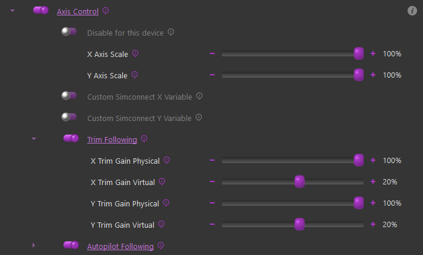{ width="680px" height="410px" }

To enable Trim and/or Autopilot following, simply enable the "Axis Control" feature and then in the sub-settings, enable Trim or Autopilot following accordingly.

-   **Axis Scale:**

    -   These sliders can be used to adjust the scale of the axis as sent to MSFS. A value of %50 will result in %50 control deflection in the sim with %100 physical deflection

-   **Custom Axis Variables:**

    -   Some aircraft do not use the standard simconnect events for their axes, or use custom LVAR variables. You can use these checkboxes to override the default variable that is sent or input a custom LVAR. Use "VARNAME" for simvars or "L:VARNAME" for LVARS

-   **Trim Following Gains**:

    -   X/Y Gain Physical

        -   These gain settings affect how much the physical axis will move in response to the trim value. A gain of %100 will result in full travel of the physical axis with full travel of the trim

    -   X/Y Gain Virtual

        -   These gain settings define how much of the physical movement is translated to the simulator over the simconnect session. A value of %50 means that only %50 of the physical movement of the axis will be sent to the simulator, resulting in the virtual axis moving %50 as much as the physical axis.

**How it works at a high level:**

-   **Trim Following**

    -   Trim position is read from the sim

    -   Physical stick center point is calculated using the 'physical'
        position gain

    -   Physical stick center is sent to the joystick/pedals

    -   Virtual stick position is calculated using the 'virtual'
        position gain

    -   Virtual stick position is sent to MSFS

-   **AP Following**

    -   Elevator AP following is reliant on the trim value, as APs use the elevator trim

    -   Aileron/Rudder

        -   Control surface deflection is read from the sim (as induced by AP control)

        -   Control surface deflection is used to calculate physical axis position

        -   Physical position is sent to joystick/rudder

    -   The AP induced physical control inputs are dampened to prevent out of control oscillations in turbulence or in aircraft with extra sensitive controls.

**Tips on configuring the trim settings**

Physical & Virtual configuration should be done for each plane.

Suggested starting points:

* X Gain Physical = 50%
* X Gain Virtual = 20%
* Y Gain Physical = 100%
* Y Gain Virtual = 20%
* Rudder Gain Physical = 50%
* Rudder Gain Virtual = 20%

Joystick..X and Rudder..X can typically be left as default, since many planes do not even have in-cockpit trims on those axes, and if they do they are set and forget. The elevator trim however is interacted with a great deal and joystick..Y must be tuned per plane for realistic results.

Fly the plane, and trim for level flight at cruise speed.

In VPForce configurator (or knob if you have it set to control spring or master gain), temporarily set spring to 0% and set friction to a value high enough that your stick stays in place when you let go of it. Apply (do not store) the setting.

Without moving the Rhino joystick, use your trim buttons/keys/axis to nose down the plane.

If the nose goes up, adjust **Y Gain Virtual** 10% higher.

If the nose goes down, adjust **Y Gain Virtual** 10% lower. It may be required to go negative.

Adjust the trim and observe the reaction again. It will take a few iterations. The goal is to have the trim adjustment have no effect with the stick not moving. You can adjust by 5%, 1% when you are close. Enjoy your new realistic trim!

Under Autopilot Following, there are settings for deadzone and gain. You must move the controls further than the deadzone setting for the values to be sent to the sim. Gain adjusts the ratio between in-sim movement to physical stick movement.

!!! note 
    Some planes may require use of the axis position instead of reported trim position. You can try toggling the switch if it behaves erratically.

{ width="629px" height="192px" }

#### Aileron/Elevator/Rudder Gain Settings

There are multiple ways the axis spring gains can be configured for
aircraft in MSFS/X-Plane.

**Basic Dynamic** - Spring gain changes based on increasing/decreasing dynamic pressure as airspeed changes, includes additional dynamic forces related to slip, AoA and g-forces.

**Basic Dynamic + Spring Centered** - Adds a fixed gain centering force to the Dynamic spring effects. Where the standard Dynamic effect can reach 0 spring and 0 airspeed, the addition of the base centering force will set the lower boundary of the spring effect to the configured value

**Fly By Wire (FBW)** - Static spring force is configured per axis based on the settings.

**Advanced Dynamic** - See the **Advanced Spring** configuration section of the manual

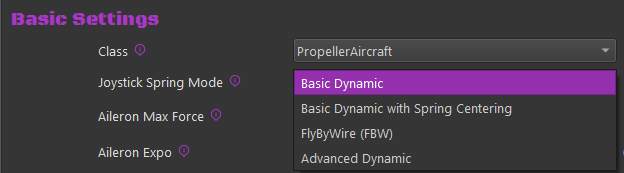{ width="520px" height="144px" }

#### Dynamic

There are settings which directly affect the max force per axis as well as an "exponent" setting which affects the curve at which the gain will be applied over the speed envelope of the aircraft.

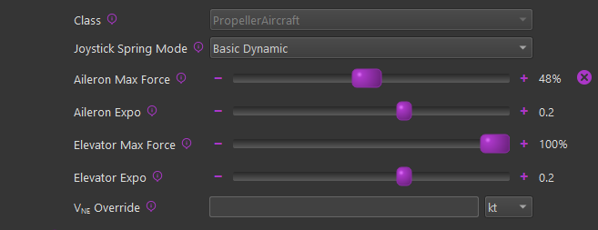{ width="482px" height="186px" }

**Max Force Settings**

The "Max Force" settings will effectively set the spring gain that will be achieved at the V~NE~ (never exceed) speed of the aircraft, although the calculation is more sophisticated than a basic linear gain-to-speed mapping. It uses the known aircraft info to determine the dynamic pressure (Q) that should be achieved at V~NE~ for the aircraft and then feeds that information into the dynamic forces calculation to determine the final spring gain at any given point in time.

100% of the configured **Max Force** is achieved at the aircraft's V~NE~ speed as read from telemetry. In the event that the V speeds defined in the aircraft's configuration files are incorrect, or if you want to override the value, it can be changed with the **V**~**NE**~** Override **setting.

The Max Force adjustment slider handle will fade from gray to green as Max Force is reached, and the handle will show a percentage of dynamic force applied.

**Expo Settings**

Since Rhino cannot produce the actual real-life forces that could be reached, Expo amplifies those forces at lower speeds, where the feeling of control authority is quickly lost at stall speeds for example. An Expo value of 0.5 doubles stick forces at 25% of V~NE~. For some jets, you might want diminished forces until closer to V~NE~, so you can set a negative Expo value.

{ width="513px" height="320px" }

#### Dynamic + Spring Centered

The "Spring Centered" option will still leverage the Dynamic
adjustments mentioned above, however there will be a minimum spring
gain set on a given axis based on the sliders.

With this configured, the dynamic spring gain will range from a
low-point of the "Spring Centered" gain value to a high-point of the
Max Force setting in the dynamic adjustment settings.

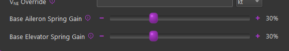{ width="576px" height="102px" }

#### Fly By Wire (FBW)

Enabling the FBW option will override any configurations in the
Dynamic and/or Spring Centered settings and apply a fixed gain value
on a given axis. When this mode is active, the spring gain is static
and will not vary based on airspeed or any other aerodynamic
conditions.

{ width="573px" height="127px" }

#### Turbulence Effect

The turbulence effect simulates the small, rapid wind disturbances that aircraft experience in turbulent air.

This effect adds dynamic, randomized force feedback pulses that vary in strength and direction based on changing airflow, creating a more realistic "gusty" flight feel.

**How it works**

When turbulence is enabled, the simulator's relative wind data is constantly analyzed for short-term fluctuations.

These micro-changes are processed through a high-pass filter to isolate rapid wind shifts (gusts) and then converted into corresponding force impulses on your control stick or yoke.

The result is a tactile simulation of air buffeting and gust response.

**Adjustable Parameters:**

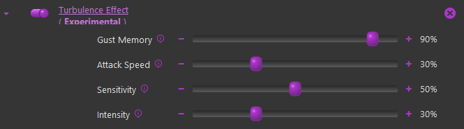{ width="597px" height="167px" }

**Gust Memory:**
Controls how long each wind gust continues to influence the controls.

-   **Low values** → Gusts fade quickly, producing short, choppy bumps.

-   **High values** → Gusts linger longer, giving a rolling, "bumpy air" feel.
    *(Internally adjusts the high-pass filter's decay rate.)*

**Attack Speed:**
Determines how quickly new gusts take effect when wind changes occur.

-   **Lower values** → Forces build up gradually (softer turbulence).
-   **Higher values** → Immediate, sharper responses to gusts. *(Adjusts how fast the filtered wind deltas are integrated into the effect.)*

**Sensitivity:**
Sets how easily the system reacts to small wind variations.

-   **Lower values** → More sensitive; small wind shifts create noticeable feedback.
-   **Higher values** → Less sensitive; ignores small fluctuations and reacts only to larger gusts. *(Affects the maximum delta threshold used to normalize gust strength.)*

**Intensity:**
Controls the maximum strength of the turbulence force.

-   **Lower values** → Light, subtle vibrations.
-   **Higher values** → Strong, distinct buffeting forces. *(Acts as a global amplitude multiplier for the generated forces.)*

!!! tip
    *   Try starting with moderate values:\ Gust Memory: 70%, Attack Speed: 40%, Sensitivity: 50%, Intensity: 30%.
    *   Increasing **Intensity** without balancing **Sensitivity** can make turbulence feel overly harsh or "random."
    *   Because this feature relies on simulator wind telemetry, the effect will be minimal in calm-weather conditions.

#### Helicopter Force Trim

Helicopter force trim emulation is supported for both MSFS and X-Plane. To enable this feature of TelemFFB, enable the Force Trim checkbox and then in the sub-settings, configure a button on your joystick to serve as the trim release button.

!!! note
    If you enable force trim, but do not set a button, you will see an error indication for the simulator. The Trim Release button is **mandatory**, the Trim Reset button is **optional**.

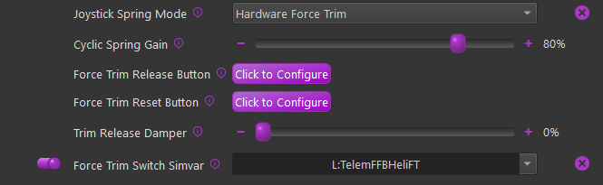{ width="539px" height="166px" }

-   **Cyclic Spring Gain**

    -   Sets the spring gain force when FT is engaged

-   **Force Trim Release Button**

    -   Configures the button to be used as trim release

-   **Force Trim Reset Button**

    -   (Optional) - Configure a button to reset the trim to center

-   **Trim Release Damper**

    -   Enables a dampening effect when the FT button is pressed and held.

    -   This is slightly different than a "dampening" effect. It uses a
        constant center-updating spring effect to apply the dampening
        force

-   **Force Trim Switch Simvar**

    -   When enabled, TelemFFB will watch the configured L:Var and
        enable/disable the hardware force trim based on the 0/1 state
        of said variable.

    -   Some aircraft (like the Taug UH-1) have a switch in the cockpit.
        The default profile for this aircraft already has the correct
        L:Var mapped.

    -   You can use 3rd party software such as SPAD.neXt to use a
        hardware switch to toggle `L:TelemFFBHeliFT` for any
        aircraft. This will simulate having a FT enable/disable switch

#### Low Hydraulic Pressure Effect

This effect allows the configuration of damper, inertia, and friction forces above and beyond those which are set by the base damper/inertia/friction settings in TelemFFB.

!!! note
    In order for this effect to work, the Damper/Inertia/Friction effects must also be enabled.

!!! note
    Care must be taken when increasing these forces. Particularly with Inertia and Friction. Adding too much of these forces can quickly lead to motor instability ssues, resulting in motor fault protection shutdown.

!!! note
    It is important to understand that all of these slider settings are limited by what is configured in the active VPForce Configurator profile. If your basic damper/inertia/friction forces are enabled at %100 in TelemFFB, there will be no room for the low pressure effect to increase them further.

TelemFFB monitors the data in the "**HydSys**" telemetry and will linearly apply these effect values in place of the standard values between the threshold setting value and a 'HydSys' value of 0. If the HydSys value is a list, the effect uses the max value to determine whether or not the pressure is below the threshold.

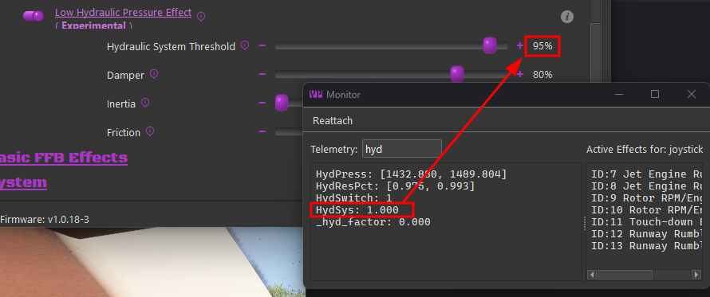{ width="561px" height="235px" }

When setting the Hydraulic System Threshold setting for a new aircraft, you must first determine what "normal" is, by inspecting the **HydSys** telemetry value under normal conditions. Then set the Hydraulic System Threshold slider to a value *less than* the normal operational value. If the HydSys value drops below the threshold, the effects force settings will begin taking effect.

#### (MSFS Only) - Special FFB Implementation for Hype Performance Group Airbus Helicopters

In collaboration with HPG, this implementation in TelemFFB was developed as a true-to-life representation of piloting the Airbus H145 and H160 aircraft.

The VPforce Rhino will work with the AFCS and act as the auto trim motor does, slowly moving the joystick as required to keep the SEMAs within their range of travel. The Rhino is also integrated with the force trim release system and the "hands on" spring override detection system. Force trim for hand-flying is also supported.

Both the Cyclic and Collective axes (if you have a VPforce powered collective) are integrated with the AFCS. The Tail Rotor axis is also supported.

Excerpt from the [HPG H145 user guide](https://davux.com/docs/h145/AFCS.html#afcs-autoflight-system):

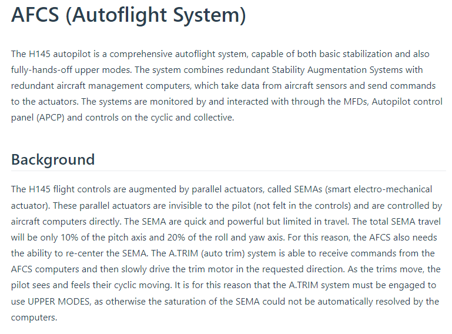{ width="624px" height="461px" }

As part of this implementation, there are certain requirements and recommended settings in the MSFS control bindings, the HPG Helicopter settings (iPad) and in TelemFFB.

!!! note
    Because of the unique aspects of this implementation, when either the H145 or H160 profiles are loaded, a series of aircraft specific `L:Vars` are subscribed to. These `L:Vars` are part of the default profiles for the H145 and H160 aircraft. As such, it is important that if you load a livery that does not match the default profiles, that you **clone** from the existing default profile. If you simply create a new entry of type "HPGHelicopter", it will not work properly.

**VPForce Configurator Settings:**

1.   You must ensure that there is enough spring force enabled in the profile to properly center the joystick
2.   Joystick:

    -   If the joystick sags away from center due to grip weight or low spring force:

        -   use the 'balance springs' feature to counteract the grip weight
        -   use the 'adaptive centering' feature to assist bringing the stick to center position when you are not holding it.
3.   Collective & Pedals:

    -   In order to properly emulate AFCS control, spring force MUST be enabled on both the collective and the pedals

**TelemFFB Settings:**

-   **Axis Control** must be enabled.

    -   This is required for both the Cyclic axes and the Collective axis (if you are using a VPforce powered Collective)
    -   You must UNBIND the axes in MSFS

-   **Force Trim** must be enabled

    -   you must also set your force trim binding in the force trim sub-configuration in TelemFFB

-   **Cyclic**

    -   **Hands-On Deadzone**
    -   **Hands-Off Deadzone**
-   **Collective**

    -   **Collective AP Spring Gain**
    -   **Collective Dampening Gain**

**MSFS Settings**:

-   You must **UNBIND **your Cyclic axes in MSFS to prevent conflicts with TelemFFB sending the axis position
-   If using a VPforce powered Collective,

    -   You must **UNBIND **your Collective axis in MSFS to prevent conflicts with TelemFFB sending the axis position
    -   You must **BIND** a button on your collective to act as collective trim release. Pressing the trim release is required to manipulate the real helicopters collective and that is modeled in TelemFFB. The binding in MSFS is `AUTOTHROTTLE DISCONNECT`

**HPG H160/H145 Settings:**

Depending on the version of the helicopter you have installed, the tablet options may differ. Use the tablet settings below depending on what your tablet options look like.

Older Versions:

In the tablet settings inside the aircraft, the following must be configured for proper behavior:

-   Cyclic:

    -   Cyclic Control set to **'No Springs'**
    -   Follow-Up trim set to **'OFF' **(you may need to temporarily
        enable Centering Springs to set this)

    -   SAS Stability level

        -   For the **H160**: between -80 and -60
        -   For the **H145**: between -50 and -20
-   Collective

    -   SAS Stability level -100

Newer Versions:

Newer versions of the HPG helicopters have more options that assist with FFB implementations. You will want to set:

-   Hands on Detection: **'None'**
-   Cyclic Trim System: **'Hardware'**
-   Cyclic Followup Trim: **'Both'**

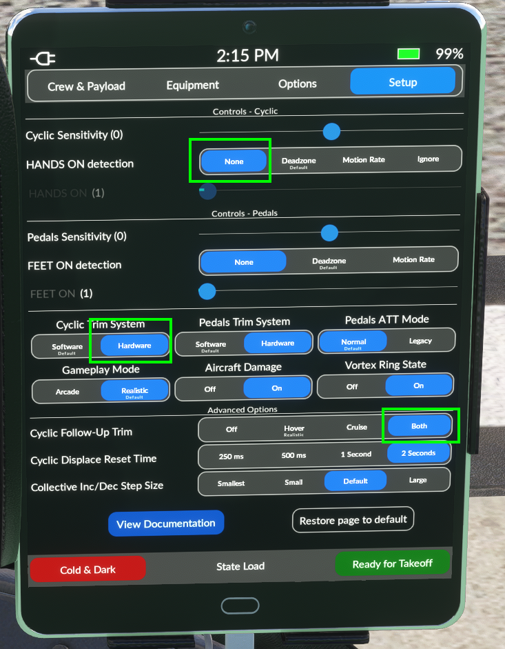{ width="494px" height="635px" }

#### Force Mode (Experimental)

New in version 2.0, along with the latest v1.0.18 Rhino firmware is an experimental version of the hands on/off detection that is used in the HPG Class aircraft.
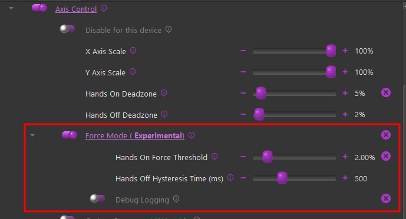{ width="488px" height="263px" }

The latest firmware allows us to track the force output for the axis in % of max, which can give a much more granular indication of user hands-on controls as compared to a pure deflection based calculation.

Because the configurator Adaptive Recentering feature "forces" the stick as close to the exact center as possible, having it enabled typically results in a higher "standing force" reading. Because of this, it is recommended to **disable **the **Adaptive Recentering** figure in configurator when flying the HPG helicopters in Force Mode

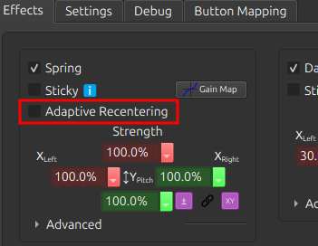{ width="232px" height="180px" }

Rather than a hard hands-off threshold, it uses a time based hysteresis. This prevents flapping of hands on/off when passing through the center point.

-   **Hands On Force Threshold:**

    -   Recommended value of %3 or less
    -   This value is indicative of the total force that would be achieved with full deflection of the stick.

-   **Hands Off Hysteresis Time:**

    -   Recommended value - 500ms
    -   The time, in milliseconds that, after hands-on has been triggered, that the force must be ***below***** **the force threshold in order to trigger hands-off

-   **Debug Logging:**

    -   Logs the hands on/off state on every simulation frame. Useful when fine tuning the threshold value

#### (MSFS Only) - Special FFB Implementation for FlyInside Helicopters

In collaboration with FlyInside, TelemFFB uses vibration variables from the flight model. ETL, VRS, and other buffeting and engine vibrations are not used. Instead there is a Vibration control under Mechanical/Airframe:

{ width="652px" height="67px" }
