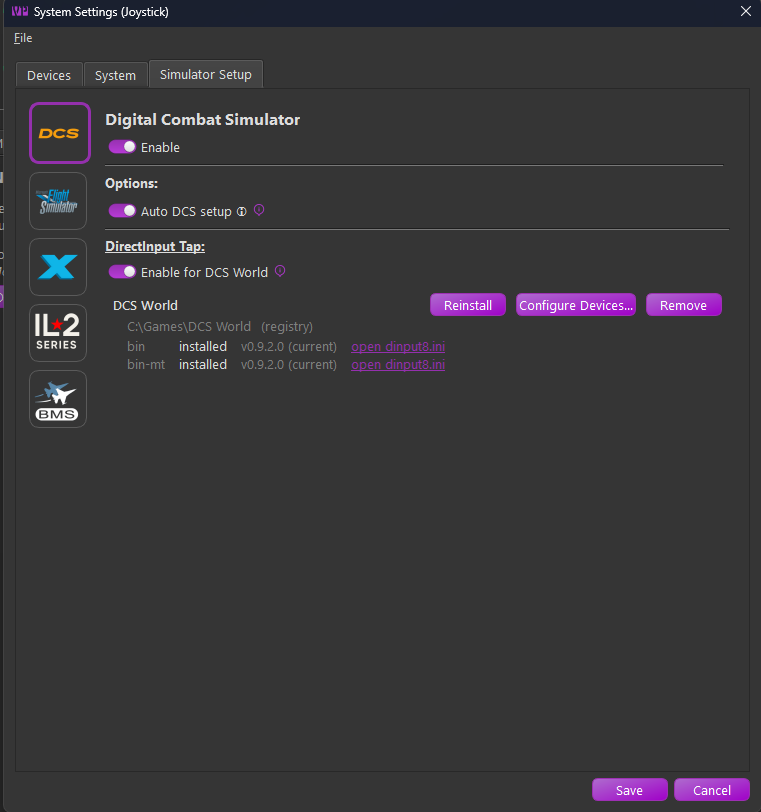

# Connecting Your Simulator

These settings are found on the **Simulator Setup** tab of **System → System Settings** and are global for any instance of TelemFFB. Each simulator has its own page on the tab.

{ width="650px" }

Enable each simulator you fly. For the sims that need an export script or plugin (DCS, X-Plane, IL-2), the auto-setup options install it for you.

**Verifying the connection:** start the simulator and load a flight. The TelemFFB status area should show **Running** with the detected aircraft name, and the Monitor tab should show live telemetry values. See [Device/Instance Status Indications](ui-overview.md#deviceinstance-status-indications) if it does not.

## DCS

- **Enable**

    - Enable/disable support for DCS

- **Auto DCS Setup**

    - When enabled, TelemFFB will automatically add entries into the DCS export script in the users save games folder structure. It will also copy the export script DLL package into the DCS save games folder

- **DirectInput Tap**

    - Capture DCS's own force feedback effects and render them through TelemFFB; see [The DirectInput Tap](dinput-tap.md)

## Microsoft Flight Simulator (20/24)

- **Enable**

    - Enable/disable support for MSFS. No further configuration is required to connect TelemFFB to MSFS.

- **Start in-sim settings panel server**

    - Starts a local HTTP server, active only while MSFS is the connected sim, that powers the optional [In-Sim Toolbar Panel](msfs-toolbar-panel.md). Enabled by default.

## X-Plane (11/12)

- **Enable**

    - Enable/disable support for X-Plane

- **Auto X-Plane setup**

    - When enabled, TelemFFB will automatically install the custom telemetry plugin to the configured X-Plane installation path

- **X-Plane Install Path**

    - As there is no registry entry to discover the installed path for X-Plane, browse for and select the root X-Plane install path. This is required for the auto setup script to succeed

## IL-2 Sturmovik

Both **IL-2 Great Battles** and **IL-2 Korea** are supported, each with its own options group on the IL2 tab.

- **Enable**

    - Enable/disable support for IL-2

- **IL-2 Telemetry Port**

    - The UDP port TelemFFB listens on for IL-2 telemetry (default: 34385)

- **IL2 Sturmovik Options** / **IL2 Korea Options**

    - Each game has a discrete configuration group with the same two settings:

        - **Auto Telemetry Setup**

            - If enabled, TelemFFB will automatically set up the required configuration in that game to support telemetry export

        - **IL-2 Install Path**

            - As there is no registry entry to discover the installed path, browse for and select the root install path for that game. This is required for the auto setup script to succeed

- **Telemetry Forwarding**

    - TelemFFB can forward the telemetry streams it receives from IL-2 to additional destinations, so other applications (for example, motion software) can consume the same data while TelemFFB owns the telemetry port.

    - **Enable**

        - Enable/disable telemetry forwarding

    - **Destinations**

        - Use **Add** and **Delete Entry** to manage one or more forwarding destinations. Each entry has an **IP**, a **UDP Port**, and a selection of which streams to forward:

            - **Telemetry** - the IL-2 `telemetrydevice` stream
            - **Motion** - the IL-2 `motiondevice` stream
            - **FFB** - the IL-2 `ffbdevice` stream (IL-2 Korea only)

- **DirectInput Tap**

    - Each IL-2 title has its own tap section for capturing the game's force feedback effects and rendering them through TelemFFB; see [The DirectInput Tap](dinput-tap.md)

## BMS (Beta support)

- **Enable**

    - Enable/disable support for BMS.

    - No further configuration is required

- **DirectInput Tap**

    - Capture BMS's native force feedback effects and render them through TelemFFB; see [The DirectInput Tap](dinput-tap.md)
