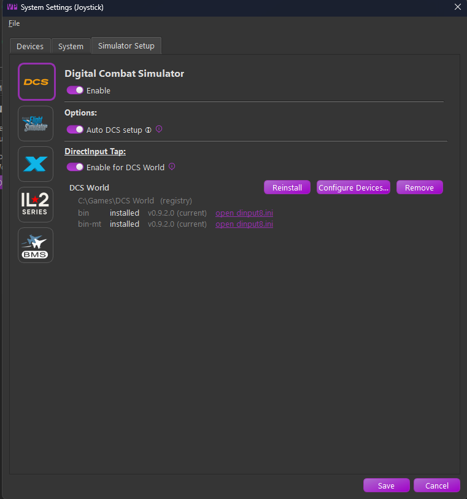
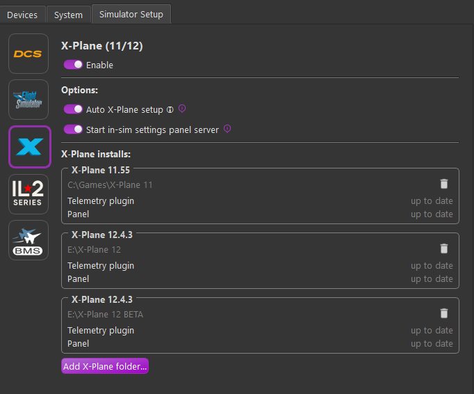

# Connecting Your Simulator

These settings are found on the **Simulator Setup** tab of **System → System Settings** and are global for any instance of TelemFFB. Each simulator has its own page on the tab.

{ width="650px" }

Enable each simulator you fly. For the sims that need an export script or plugin (DCS, X-Plane, IL-2), the auto-setup options install it for you.

**Verifying the connection:** start the simulator and load a flight. The TelemFFB status area should show **Running** with the detected aircraft name, and the Monitor tab should show live telemetry values. See [Device/Instance Status Indications](ui-overview.md#device-status) if it does not.

## DCS

- **Enable**

    - Enable/disable support for DCS

- **Auto DCS Setup**

    - When enabled, TelemFFB will automatically add entries into the DCS export script in the users save games folder structure. It will also copy the export script DLL package into the DCS save games folder

- **DirectInput Tap**

    - Capture DCS's own force feedback effects and render them through TelemFFB; see [The DirectInput Tap](dinput-tap.md)

## Microsoft Flight Simulator (20/24) { #msfs }

- **Enable**

    - Enable/disable support for MSFS. No further configuration is required to connect TelemFFB to MSFS.

- **Start in-sim settings panel server**

    - Starts a local HTTP server, active only while MSFS is the connected sim, that powers the optional [In-Sim Settings Panel](in-sim-panel.md). Enabled by default.

## X-Plane (11/12) { #x-plane }

- **Enable**

    - Enable/disable support for X-Plane

- **Auto X-Plane setup**

    - When enabled, TelemFFB keeps its telemetry plugin current in your X-Plane installs. At startup, it offers to update the plugin in each install that has an older version. If no install has the plugin, it offers to install it in all of them.

- **Start in-sim settings panel server**

    - Starts a local HTTP server, active only while X-Plane is the connected sim, that powers the optional [In-Sim Settings Panel](in-sim-panel.md). Enabled by default. When enabled, TelemFFB also offers panel updates at startup.

### X-Plane Installs

TelemFFB lists each X-Plane install on this PC. It finds them from the record that the X-Plane installer keeps. Each install shows its version, its folder, and the state of the two TelemFFB plugins:

- **Telemetry plugin** - sends telemetry to TelemFFB and applies axis control. X-Plane needs this plugin for force feedback.
- **Panel** - the optional [In-Sim Settings Panel](in-sim-panel.md).

Each plugin line reads **up to date**, **update available**, or **not installed**. To put the current version into an install, close X-Plane, then click **Update** or **Install** on the plugin line.

{ width="650px" }

- **Add X-Plane folder...** - adds an install that is not in the list. Select the X-Plane folder, the one that contains the `Resources` folder.
- **Trash can icon** - removes an install from the list. TelemFFB does not change anything in the folder, and it stops offering plugin updates for that install. To list the install again, add its folder with **Add X-Plane folder...**.

Click **Save** to keep the changes to the list.

## IL-2 Sturmovik and IL-2 Korea

The **IL2** page has a block of settings for each game: IL-2 Sturmovik Great Battles and IL-2 Korea. TelemFFB treats the two games as separate sims, each with its own aircraft profiles and settings.

- **Enable IL-2 Sturmovik** / **Enable IL-2 Korea**

    - Turns on support for that game. Both are off until you turn them on. The other fields in a game's block are available only while its switch is on.

- **Auto Telemetry setup**

    - When this is on, TelemFFB checks the game's `startup.cfg` each time it starts. If the telemetry or motion settings in that file are missing or do not match, TelemFFB shows the changes and asks before writing them. For IL-2 Korea it also checks the FFB settings, which send the game's force feedback data. Close the game before you accept the changes.

- **Telemetry Port**

    - The UDP port the game sends its telemetry to: 34385 for IL-2 Sturmovik and 34386 for IL-2 Korea by default. The port is how TelemFFB tells the two games apart, so they must use different ports. With both games on, **Save** refuses two equal ports.
    - With **Auto Telemetry setup** on, TelemFFB writes the port into the game's `startup.cfg`. If IL-2 Korea still sends to the IL-2 Sturmovik port, TelemFFB offers at startup to move it to the Korea port. Until you accept, TelemFFB cannot tell Korea from Great Battles, and it asks again on the next start.

- **IL-2 Install Path**

    - The game's main folder. TelemFFB cannot find IL-2 installs on its own, so select the folder with the **...** button. For IL-2 Sturmovik, select the folder that holds `data\startup.cfg`. For IL-2 Korea, select the standalone install folder (with `game\data\startup.cfg`) or the Steam folder (with `data\startup.cfg`). TelemFFB rejects a folder that does not hold the game's `startup.cfg`.
    - **Auto Telemetry setup** and the DirectInput Tap both use this path, so the field is available when either of them is on.

- **Telemetry Forwarding**

    - Sends a copy of the IL-2 data that TelemFFB receives to other programs, such as motion software, while TelemFFB keeps the telemetry port. Forwarding applies to both games.
    - **Enable** turns forwarding on. If the destination list is empty, **Save** asks you to add a destination or turn forwarding off.
    - **Add** creates a destination from the **IP**, the **UDP Port** and the streams you check. **Delete Entry** removes the selected destination. The streams are:

        - **Telemetry**: the `telemetrydevice` stream
        - **Motion**: the `motiondevice` stream
        - **FFB**: the `ffbdevice` stream, which only IL-2 Korea sends

- **DirectInput Tap**

    - **Enable for IL-2 Sturmovik Great Battles** and **Enable for IL-2 Korea** set up the tap for each game separately. See [The DirectInput Tap](dinput-tap.md).

## BMS (Beta Support)

- **Enable**

    - Enable/disable support for BMS.

    - No further configuration is required

- **DirectInput Tap**

    - Capture BMS's native force feedback effects and render them through TelemFFB; see [The DirectInput Tap](dinput-tap.md)
