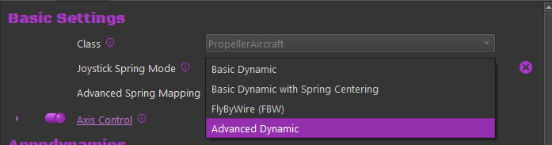
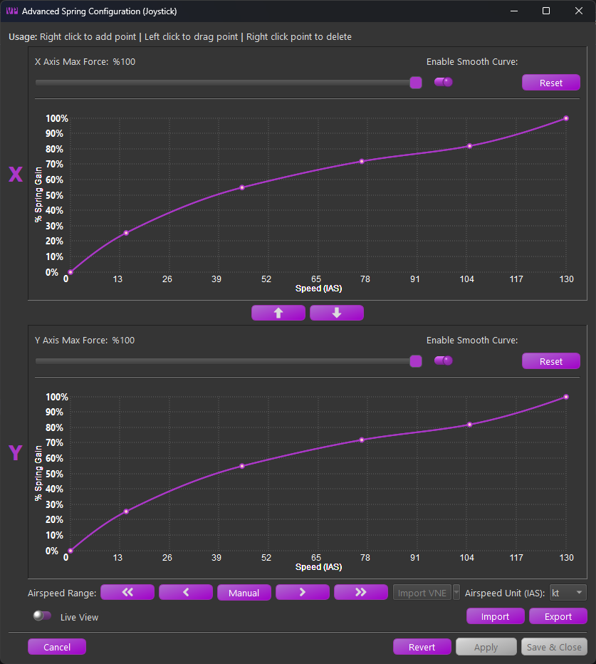
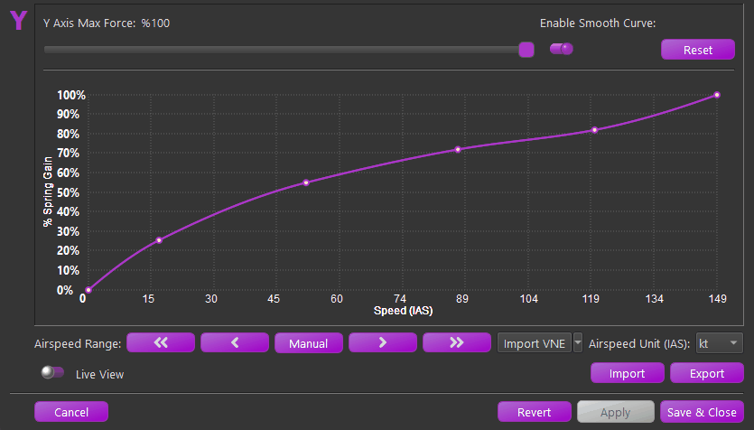
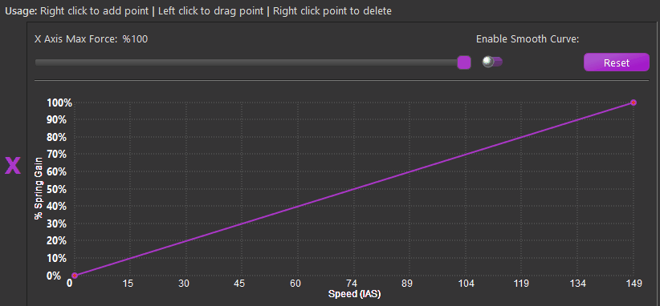
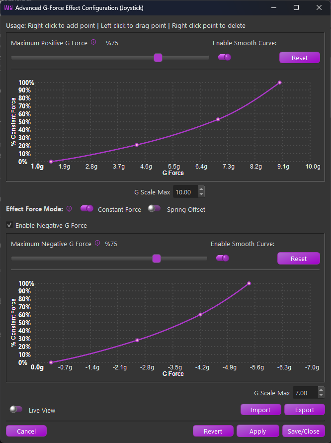

# Advanced Spring & G-Force Curves

## Advanced Dynamic Spring Curve Dialog

The advanced spring setting is new in TelemFFB 2.0 and supported across all simulators in some form or fashion. It allows users to define the spring gain mapping via visual curve/slope across a custom airspeed envelope.

To enable the Advance Spring mode, change the **Joystick Spring Mode** for the desired aircraft to the "**Advanced Dynamic**" mode. Then choose the **Edit Settings** button to open the configuration dialog.

{ width="401px" height="105px" }
{ width="413px" height="462px" }

The form is separated into the X and Y axis configurations. Each axis may be configured separately, although the airspeed scale will be the same for each axis.
Within each axis configuration the following controls are available:

-   **Max Force:**

    -   The maximum applied spring gain where the configured curve meets %100 on the Y scale.

-   **Enable Smooth Curve:**

    -   Switch between linear segmented and smooth-curved configurations.

    !!! note
        At least 4 points are required to enable smooth curve mode.

-   **Reset**

    -   Resets the curve back to a simple 2 point linear curve

Between the two curve configurations, use the ⬆️and ⬇️buttons to copy the X or Y axis curve up or down to the other axis.

Along the bottom there are several additional controls

-   **Airspeed Range**

    -   **⏪- **Decrease 100 "units"
    -   **◀️- **Decrease 10 "units"
    -   **Manual **- Enter the airspeed range manually
    -   **▶️- **Increase 10 "units"
    -   **⏩- **Increase 100 "units
    -   **Import VNE (MSFS/XPlane Only)**

        -   Import the published (or calculated) VNE from the aircraft telemetry.
        -   The sim must be active and telemetry must be flowing to enable the button.

-   **Airspeed Unit**

    -   Set the airspeed units used by the curves. Regardless of the configured unit, the settings will be scaled to work properly with the live airspeed of the aircraft (usually in m/s as received from the sim)

-   **Import**

    -   Import a curve setting that was previously exported from TelemFFB

-   **Export**

    -   Export a curve setting that can be shared or imported into another aircraft

-   **Live View**

    -   When Live View is enabled, an additional crosshair will appear on the graph when the sim is loaded and telemetry is flowing from the aircraft. The crosshairs will indicate the calculated spring gain at the current airspeed based on the saved curve.

!!! note
    Note that curve modifications are not instant. If the curve has been modified, it must be applied or saved for the modifications to take effect

{ width="564px" height="322px" }

### Working with the Curves

The actual curve editor is a custom widget written entirely in python. The curve uses the Akami algorithm as opposed to other traditional spline methods for its tighter control on overshoot interpolation wildly affecting portions of the curve outside of the segment being edited.

Its use is fairly straight forward with some conditions:

-   A minimum of 4 points are required to enable curve smoothing

-   The curve must not exceed 0% or %100 spring gain. The widget will prohibit further movement of a point if it will cause **any** point of the curve to exceed the limits

-   The widget prohibit smooth curve if the resulting curve would exceed limits

-   The widget will not let you add a point that will result in the curve exceeding the limits

The curve controls are as follows:

-   **Add Point**

    -   To add a point, **right-click** on the graph where you would like the point to be added

-   **Move/Drag Point**

    -   To move a point, left-click on the point and drag the point where you would like

-   **Delete Point**

    -   To delete a point, right-click on the desired point and select delete from the popup menu.

{ width="523px" height="243px" }

## Advanced Custom Curve G-Force Effect Dialog

Also new in TelemFFB 2.0 is a new way of configuring the G-Force effect. Many aircraft do not have a linear, or even similar g-loading response and as such, the legacy exponential curve g-force effect produces lackluster or erratic behavior.

To enable, select "Custom Curve" as the G-Force Effect and select the Edit Settings button

{ width="456px" height="76px" }

Using the same new curve widget as the Advanced Spring Curve feature, a new custom curve G-Effect was created.

{ width="382px" height="512px" }

The form is separated into Positive and Negative G scale
configurations.

-   **Maximum Force Slider:**

    -   Adjust the overall intensity of the effect. Depending on the selected "Force Mode" configuration, it will either adjust the maximum constant force effect application or how much spring center offset is applied to produce the effect.

-   **Enable Smooth Curve:**

    -   Switch between linear segmented and smooth-curved configurations.

    !!! note
        At least 4 points are required to enable smooth curve mode.

-   **Reset**

    -   Resets the curve back to a simple 2 point linear curve

In between the positive and negative configurations:

-   **Effect Force Mode:**

    -   **Constant Force**

        -   In this mode, a dynamically changing constant force effect is applied based on the curve point at a given G-loading.

    -   **Spring Offset**

        -   In this mode, when the G-Effect is playing, a temporary spring center point offset is applied, shifting the center point in the direction required to induce a strengthening of the spring.

### Working with the Curves

See the ***Advanced Custom Spring*** section for guidance on using the curve editor
