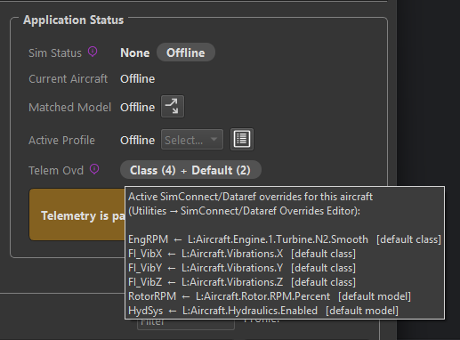
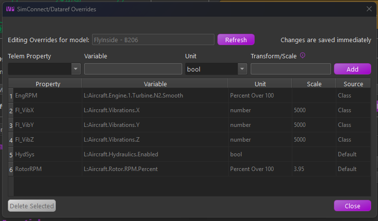
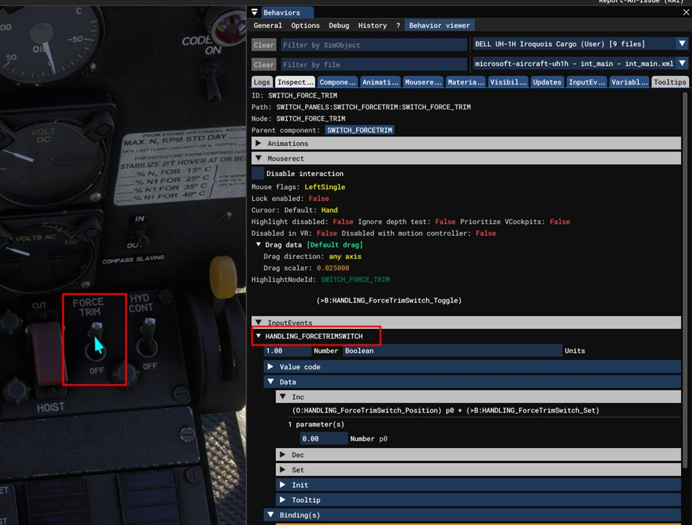
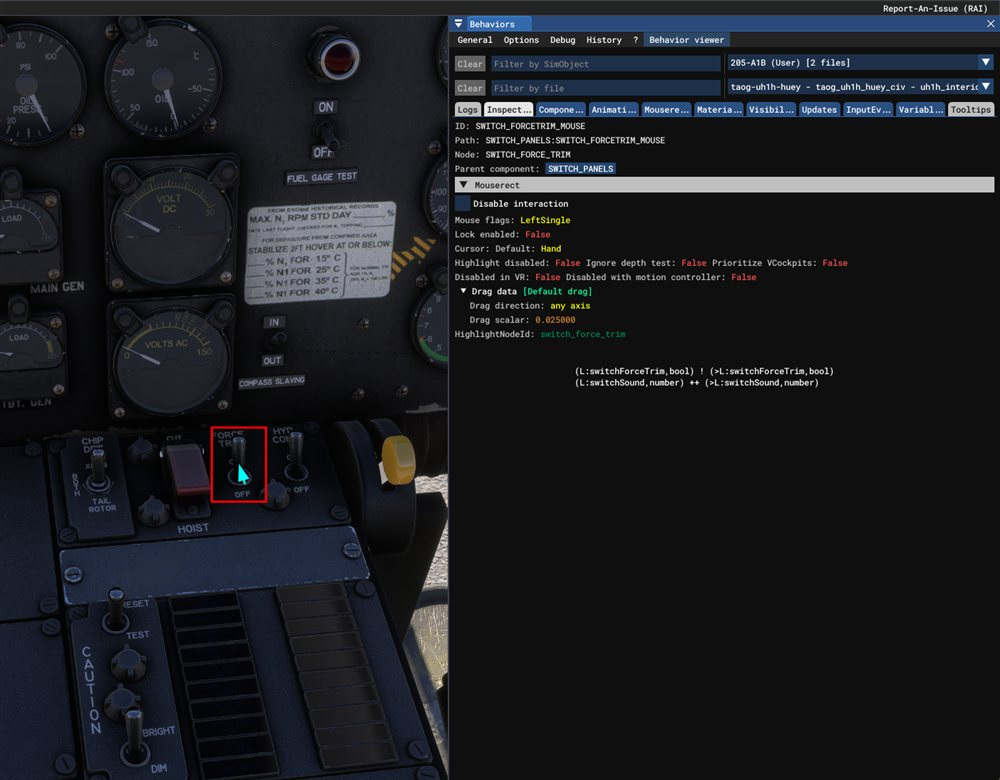

# Telemetry Overrides

An advanced MSFS/X-Plane feature: change **where a telemetry item's data comes from**, or subscribe to **additional** telemetry items. Open the editor from **Utilities → SimConnect/Dataref Overrides Editor**, with an aircraft loaded (or selected in the offline editor). Your overrides are stored against the aircraft's match string, and changes are saved and applied immediately. TelemFFB also ships overrides of its own, for single aircraft and for whole aircraft classes.

{ width="427px" }

## Why it exists

TelemFFB's effects consume a fixed set of telemetry items (the names you see in the Monitor tab). Normally each item is wired to a standard SimConnect variable or X-Plane dataref, but not every aircraft populates the standard sources:

- **Source overrides.** Sophisticated addon aircraft often implement their own systems in custom variables and leave the standard ones stale. The classic case is the **autopilot indication**: an addon whose AP never drives the standard `AUTOPILOT MASTER` simvar breaks every AP-aware TelemFFB feature until you override `APMaster` to read the addon's own variable. The same applies to custom engine and flight models (RPM, thrust, accelerations).
- **Additional subscriptions.** An override whose Telem Property is a *new* name creates a new telemetry item. This is how the special aircraft implementations (the HPG helicopters, for example) receive their custom `L:Var`s. The aircraft class or the shipped profile carries the required overrides.

## How it works

- **MSFS** - the override replaces (or adds) the variable in TelemFFB's SimConnect subscription set. The Variable field takes a SimVar name (`VARNAME`), an LVar (`L:VARNAME`) or an [input event](#input-events-b-variables) (`B:EVENT_NAME`); the Unit is the SimConnect unit to request (`bool`, `enum`, `number`, `Percent Over 100`, `degrees`, `meters/second`).
- **X-Plane** - TelemFFB instructs its X-Plane plugin to subscribe to the given dataref (Unit: `int` or `float`) and export it under the telemetry item's name.

Either way, the result flows into the same telemetry item the effects already consume; verify it live in the **Monitor tab**. When an aircraft with active overrides loads, the status area shows a **Telem Ovd** pill with a count for each tier, for example `Class (6) + Default (6) + User (1)`. Hover it to list every active override and the tier it comes from.

{ width="500px" }

## Where an aircraft's overrides come from

An aircraft's overrides are built from three tiers. A later tier replaces an earlier one where both name the same telemetry item:

1. **Class** - overrides that ship with the aircraft's class. A special class reads telemetry items that only it needs, so it carries them itself. Every aircraft assigned to the class gets them.
2. **Default** - overrides that ship with the built-in profile that matched the aircraft.
3. **User** - your own overrides, stored under that same match string.

Only the profile that matched contributes. A broader profile that also fits the aircraft name adds nothing, the same as for settings. See [How TelemFFB Matches an Aircraft](aircraft-profiles.md#how-telemffb-matches-an-aircraft).

An override belongs to the simulator it was made for. An MSFS override never reaches an X-Plane aircraft that happens to share the name.

The **Source** column of the editor names the tier of each row.

{ width="760px" }

!!! important "A new profile for a special aircraft"
    You may need a profile of your own for a special aircraft, for example for a livery whose name the built-in match string does not fit.

    - **Class** overrides come with the class. Select the correct class in the New Aircraft Wizard and the new profile has them.
    - **Default** overrides belong to one built-in profile. A new profile gets them only if you **clone it from that built-in profile**. A profile made from scratch does not have them, and every effect that depends on those telemetry items silently loses its data.

    [Aircraft with Special Treatment](msfs-xp-special-aircraft.md) lists which aircraft need the clone. The wizard enforces it for HPG and FlyInside aircraft.

## The editor fields

- **Telem Property** - the telemetry item to feed. The dropdown lists the standard overridable items, but the field is editable, which enables two more forms:
    - `Name:index` targets one element of a *list* telemetry item; the screenshot overrides `AccBody:0/1/2` (the X/Y/Z body accelerations) individually.
    - A name not in the list creates a **new** telemetry item under that name.
- **Variable** - the SimVar/LVar (MSFS) or dataref path (X-Plane) to read.
- **Unit** - the unit/type to request, per sim as above.
- **Transform/Scale** - converts the raw value into the range the telemetry item expects. Leave blank for the raw value, enter a **number** for a simple multiplier, or (MSFS) a **math expression** using `x` as the input, e.g. `(x - 50) * 0.02` maps 0-100 onto −1-1. Standard operators and parentheses only; for X-Plane the conversion is a numeric multiplier applied by the plugin.

!!! important "The transform must make the value equivalent to the original"
    TelemFFB's effects expect each telemetry item in the **units, range, and sign of its original standard source**: an override changes where the data comes from, not what the consumers expect. Whatever format the replacement variable uses natively, it is your job (via the Transform/Scale) to deliver an equivalent value. In the example below, the addon's body accelerations arrive in m/s² where the standard item is in g, hence the 0.102 (≈1/9.81) scale. An override that "works" but skips this conversion feeds every dependent effect distorted data.

The table below the fields lists every override in effect for the aircraft. Its **Source** column reads **Class**, **Default** or **User**, the [three tiers](#where-an-aircrafts-overrides-come-from). Hover a Source cell for a reminder of what the tier means.

Rows from the Class and Default tiers ship with TelemFFB and are shown **greyed out**. They show what the aircraft already subscribes, and they cannot be deleted.

- To change a shipped override, select its row, edit the fields and click **Add**. Your row replaces the shipped one for this aircraft. Delete your row to return to the shipped value.
- Your own rows can be selected and deleted. A deleted override stops being subscribed at once.
- The editor adds and removes rows for the selected aircraft only. With only a class selected in the offline editor, it shows the class rows for reference.

## A worked example

The A2A Comanche is an addon with its own physics and systems model, so its built-in profile re-sources several telemetry items from the addon's variables. This is how such a set looks in the editor and in the Monitor tab:

{ width="760px" }

| Override | Why |
|---|---|
| `APMaster` ← `L:ApDisableAileron` | The addon's AP state lives in its own LVar; the standard AP simvar would read stale. Restores AP-aware behavior. |
| `AccBody:0/1/2` ← `L:FM_BodyAcceleration X/Y/Z`, scale `0.102` | The addon computes its own body accelerations; 0.102 ≈ 1/9.81 converts m/s² to g, the range the effects expect. |
| `PropRPM` ← `L:Eng1_PropRPM` | The custom engine model's RPM, not the standard prop simvar. |
| `PropThrust` ← `L:Eng1_ForceZ`, scale `4.45` | Thrust from the custom model, scaled into the expected units. |

## Input events (`B:` variables)

Many MSFS 2024 cockpit controls do not exist as a SimVar or an LVar. The simulator exposes them as **input events**. TelemFFB reads an input event wherever it takes a variable, when the name is written with a `B:` prefix, for example `B:LIGHTING_NAVIGATION_LIGHT`.

The most common use is a cockpit switch setting: the [Force Trim Switch Simvar](msfs-xp-helicopters.md#helicopter-force-trim) on helicopters, or the [Controls Lock](effects-mechanical.md#controls-lock) variable. A telemetry override can read one as well.

### Finding the variable for a cockpit control

1. Turn on the simulator's developer mode and open the **Behaviors** window from the developer menu.
2. With the window open, point the mouse at the control in the cockpit and press **Ctrl+G**. The **Inspector** tab shows that control.
3. Read the Inspector from the top down:

    - Ignore the **ID**, **Path** and **Node** lines. They name parts of the 3D model, not variables.
    - If there is an **InputEvents** section, expand it. The name in its header is the input event, shown with its current value beside it. Enter it with the `B:` prefix, for example `B:HANDLING_FORCETRIMSWITCH`.
    - Use that header name only. The names under **Binding(s)**, and any `B:` name in the mouse code, end in `_Toggle`, `_Set`, `_Inc`, `_On` and so on. Those are actions the aircraft accepts, not values it reports, and reading one returns nothing.
    - If there is no InputEvents section, the control is written the older way. Expand the code shown under **Mouserect** or **Tooltips** and look for the `L:` variable it writes, for example `(>L:switchForceTrim, bool)`. Enter that variable as it appears, `L:switchForceTrim`.

The same switch on two versions of one aircraft shows both cases. On the 2024 built-in UH-1H the Inspector has an InputEvents section, so the variable is `B:HANDLING_FORCETRIMSWITCH`. The event's own code still drives the older `L:switchForceTrim` underneath, so that variable works on this version too. Prefer the input event where one exists: it is the interface the aircraft publishes, while the L:var behind it may change in an update.

{ width="760px" }

On the 2020 version of the same helicopter there is no InputEvents section. The code under Tooltips writes an L:var, so the variable is `L:switchForceTrim`, and that is the only choice:

{ width="760px" }

- Set the unit to `number`. An input event always reports a number. The Transform/Scale field works as it does for any other variable.
- Several settings and telemetry items can read the same input event.

!!! note

    Input events belong to the loaded aircraft. If the aircraft does not define the event you named, TelemFFB logs a warning that names it, and the telemetry item stays empty.

## Cautions

- An override changes the input for **every effect** that consumes that telemetry item; a wrong variable or scale can quietly distort several effects at once. Sanity-check the value in the Monitor tab against what you expect (units and sign included).
- Core flight-dynamics items (attitude, airspeed, AoA and similar) are deliberately absent from the dropdown; overriding the fundamentals is rarely the right fix.
