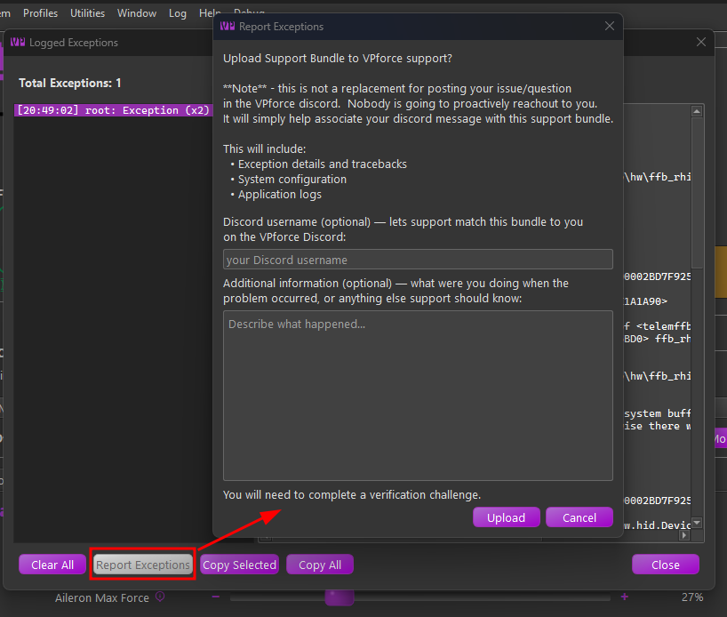

# Troubleshooting & Getting Help

Most real-world problems are simulator connection issues, and the detailed checklists for those live in [Game-Specific Troubleshooting](../rhino/game-specific-troubleshooting.md). This page is the map: how to tell what kind of problem you have, where the diagnostics are, and how to get help.

## Read the status area first

The main window's status area narrows the problem immediately:

- **Running** - the sim is connected and telemetry is flowing. If something feels wrong, it is configuration, not connectivity; check the loaded settings via **Current Aircraft**, **Matched Model**, and **Active Profile**.
- **Paused** - telemetry stopped arriving, or the sim is paused.
- **Error** - a configuration problem. The error message shown alongside describes the condition and how to resolve it.

See [Device/Instance Status Indications](ui-overview.md#deviceinstance-status-indications) for details. The **Monitor tab** shows the raw telemetry and every active effect in real time, useful for confirming what TelemFFB is actually receiving and playing.

## Device problems

The icons in the **Active Devices** area show the state of each device:

- **Yellow** - the device dropped off. TelemFFB retries on its own and recovers when the device returns, on the same USB port or a different one.
- **Red** - the configured device was not found at startup, or the instance has an error. Check the USB connection and the device's power. TelemFFB picks the device up as soon as it appears; a restart is not needed.

After a power cycle the firmware has lost everything it held in memory. TelemFFB sends the active VPforce Configurator profile, the gain overrides and the deadzone again. See [Device recovery](devices-instances.md#device-recovery).

If another VPforce device is connected while the configured one is missing, TelemFFB asks once whether to use that device instead.

## Simulator connection problems

Verify the sim is enabled in [Connecting Your Simulator](sim-setup.md), then use the detailed per-sim checklists:

- **DCS** - [FFB not working](../rhino/game-specific-troubleshooting.md#ffb-not-working) · [Not receiving telemetry](../rhino/game-specific-troubleshooting.md#not-receiving-telemetry) · [Autopilot misbehaving](../rhino/game-specific-troubleshooting.md#autopilot-misbehaving-or-disengaging-unexpectedly)
- **MSFS** - [Axis flutter / controls not responding](../rhino/game-specific-troubleshooting.md#controls-not-responding-correctly-axis-flutter) · [A feature doesn't work with a specific aircraft](../rhino/game-specific-troubleshooting.md#a-feature-doesnt-work-with-a-specific-aircraft)
- **IL-2** - [Not receiving telemetry](../rhino/game-specific-troubleshooting.md#not-receiving-telemetry_1)
- **X-Plane** - [Not receiving telemetry](../rhino/game-specific-troubleshooting.md#not-receiving-telemetry_2)
- **BMS** - [Falcon BMS](../rhino/game-specific-troubleshooting.md#falcon-bms)

## Exception Tracking & Reporting

TelemFFB tracks runtime errors as they happen. When an error is logged, a red **Errors** counter appears in the status bar along the bottom edge of the main window; it is hidden when there is nothing to see. Click it to open the **Logged Exceptions** viewer:

{ width="700px" }

The left pane lists the errors from this session (up to 100); selecting one shows the full detail (timestamp, module, message, and complete traceback) in the right pane. Two behaviors keep the list readable:

- **Deduplication** - repeated occurrences of the same error collapse into a single entry with an occurrence count, rather than flooding the list.
- **Child forwarding** - in multi-device setups, errors raised by child instances are forwarded to the master, so every device's errors are visible in one place. The module prefix on each entry tells you which instance raised it.

The buttons along the bottom: **Copy Selected** / **Copy All** put the error text on the clipboard (handy for pasting into a Discord post), **Clear All** empties the list and hides the status-bar counter, and **Report Exceptions** submits the errors to VPforce directly:

{ width="650px" }

!!! important "A report is not a request for help"

    Uploading a bundle does not open a conversation. Nobody at VPforce watches the uploads and reaches out. The bundle exists so that when you post your problem on the [#TelemFFB-User](https://discord.com/channels/965234441511383080/968208779084701716) channel, support can pull up the logs that go with your message. Post on Discord, and mention that you uploaded a bundle.

The dialog has two optional fields:

- **Discord username** - lets support match your uploaded bundle to you on the VPforce Discord. The name also becomes part of the uploaded file name, so it is visible right in the support channel. TelemFFB remembers it until you close the application; it is never saved to disk.
- **Additional information** - describe what you were doing when the problem occurred, or anything else support should know. Your notes travel inside the bundle, where support reads them before digging into the logs.

**Report Exceptions** builds a support bundle (the exception details and tracebacks, your system configuration, the application logs, and anything you entered above) and uploads it to VPforce support. After the upload, a verification page opens in your browser; the report is only submitted once you complete the challenge there.

## Reading the log

**Log → Open Console Log** shows the live log. Two kinds of entries help with specific problems:

- **`Main thread stalled`** - the main window stopped responding for three seconds. TelemFFB writes what every part of the application was doing at that moment, once per stall, and notes when the window recovers. Include the log in a support request; these entries name the cause. Dragging a window or holding a title-bar button does not trigger them.
- **`axis contention`** (MSFS) - with [Axis Control](msfs-xp-axis-spring.md) enabled, TelemFFB checks whether something else is also moving the axis it drives. A line marked `CONTENDED` names an axis that a second source is writing, which is usually a control binding left mapped inside MSFS, or an external tool. A line marked `clean` means no second source was seen. An `unverified` line asks you to move the control through its range first.

## Getting help

The single most important factor in getting your problem solved quickly is **how you ask**. Read **[How to Get Effective Support](../rhino/troubleshooting-maintenance.md#how-to-get-effective-support)**; it is short, and following it usually turns a multi-day back-and-forth into a single exchange. The essentials:

- **Describe exactly what happens and when** - "stick goes limp with no centering force in the F-16 after AP engage", not "FFB doesn't work". One problem per request, and say what you have already tried.
- **Include VPforce Configurator screenshots** - Effects, Settings, and Debug tabs. Without them, diagnosis is guesswork.
- **Attach a TelemFFB support bundle**: **Help → Create Support Bundle** produces a timestamped zip of your logs, system settings, and user config; it usually contains everything needed for diagnosis.
- Post on the **[#TelemFFB-User](https://discord.com/channels/965234441511383080/968208779084701716)** channel of the VPforce Discord.

For reference: **System → Open Config/Log directory** opens the folder holding logs and your settings (`%LOCALAPPDATA%\VPForce-TelemFFB`); older logs are archived into daily zip files.

## FAQ

**Q: Does DCS native force feedback need TelemFFB running?**  
**A:** No. DCS sends its native FFB effects directly to the device. TelemFFB adds supplemental effects on top; see [the DCS guide](sim-dcs.md#understanding-native-dcs-ffb-telemffb-and-vpforce-configurator).

**Q: My antivirus flags the TelemFFB executable. Is it safe?**  
**A:** This is a known false-positive pattern with PyInstaller-packaged applications. See [TelemFFB and Antivirus Software](installation.md#telemffb-and-antivirus-software).

**Q: How do I update TelemFFB without losing my settings?**  
**A:** Extract the new version over (or beside) the old one. Your settings live in `%LOCALAPPDATA%\VPForce-TelemFFB` and the registry, not in the application folder, so they survive updates.

**Q: Running from source and the release build: separate settings?**  
**A:** No, they share the same configuration. Changes made in one carry over to the other.
