# Application UI Overview

## General Application Overview

TelemFFB is laid out with a menu bar, the application status area, device status/selection area and the various tabs at the bottom. Refer to the sections below for details on each.

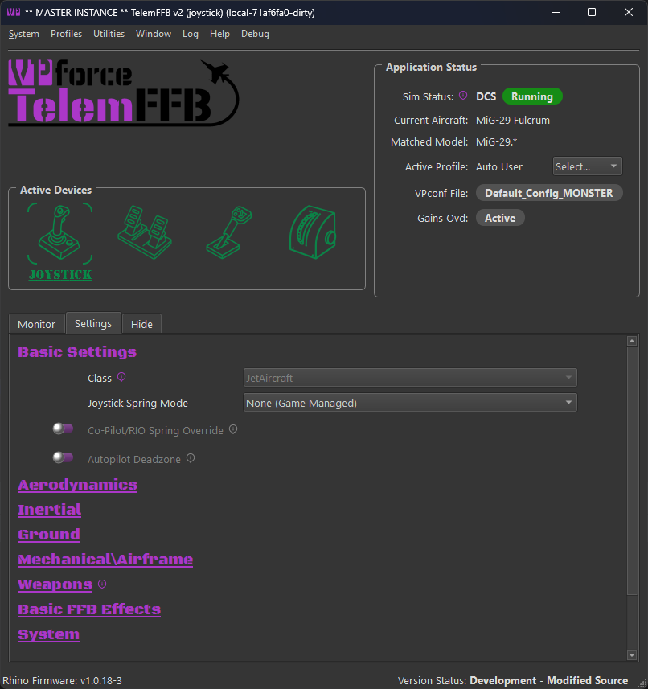{ width="565px" height="600px" }

## The Menus

### System Menu

-   **System Settings** - covered ***here***

-   **Open Config/Log directory** - opens the folder in your user local appdata where logs and settings are stored

-   **Reset Window Size/Position** - resets the window sizes to default. TelemFFB will remember and store the window size and position across executions of the application.

-   **Quit TelemFFB** - closes the application and stops all effects.

### Profiles Menu

-   **Profile Manager**

    -   Launches the aircraft profile manager. From here you can add, clone, rename, export, import, edit or delete user created aircraft profiles

    -   See ***Profile Manager*** documentation

-   **Offline Profile\\Sim Default\\Class Default editor**

    -   Puts the application into offline editing mode. While in offline editing mode, telemetry is paused.

    -   See ***Offline Manager*** documentation

### Utilities Menu

-   **Reset all Effects** - Reset the VPforce device and clean up any lingering effects.

    !!! warning
        Destructive to any active effects being generated by a simulator.

-   **Install Latest TelemFFB** - Start the auto-update process. Only active if an update is available and the update prompt is disabled or was dismissed on startup.

-   **Download Other Versions** - opens a webpage where you can select legacy versions to download.

-   **Reset User Config** - Removes all user configured settings from TelemFFB and reverts to 'factory defaults' for all effects settings. Note that when this is executed, a date-time stamped backup of the existing user configuration is saved in the TelemFFB folder in AppData/Local

-   **Launch VPForce Configurator** - Cross launches the VPforce
    configurator app to set up your device

### Window Menu

The window menu only shows if the TelemFFB instance is acting as the master instance for other VPforce devices (pedals, collective, etc)

-   **Show Child Instance Windows**

    -   Forces the child instance device windows to become visible if they are hidden/minimized

-   **Hide Child Instance Windows**

    -   Re-hides the child instance device windows.

### Log Menu

-   **Open Console Log**

    -   Open the log window for the instance of TelemFFB

-   **Open Child Console** (if more than one VPforce device is in use)

    -   Opens the log window for the selected child device instance of TelemFFB

### Help Menu

-   **Release Notes** - shows any release notes for this version of TelemFFB

-   **Documentation** - opens this manual

-   **Create Support Bundle** - Opens a file dialog and creates a zip file containing your TelemFFB system settings, any user settings you have stored, and your Log folder..

## Application Main Window

### Active Devices Area

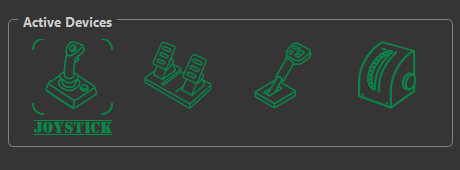{ width="371px" height="137px" }

The active devices area is both a way to switch the master instance configuration scope between devices as well as a device/instance status tracker for the primary and child devices and their TelemFFB instances.

###  Switching Between Devices:

To switch between devices for configuration, simply click on the appropriate device icon. When clicked, the configuration elements in the settings page below will update to reflect the settings for that device.

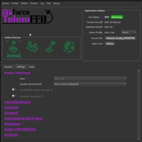{ width="329px" height="329px" }

### Device/Instance Status Indications

The device icons serve the dual purpose of displaying the status of both the device connection as well as the individual TelemFFB instances which are ultimately controlling the multiple devices.

**Green Status Icon:**

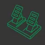{ width="55px" height="55px" }

A green status icon indicates that the device is properly connected to its instance of TelemFFB and the child instance of TelemFFB is healthy

**Yellow Status Icon:**

{ width="47px" height="53px" }

A yellow status icon indicates that the device is no longer connected to its instance of TelemFFB

**Red Status Icon:**

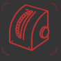{ width="54px" height="54px" }

A red status icon indicates that the child instance of TelemFFB has crashed, or there is an error condition present for that instance.

### Application Status Area

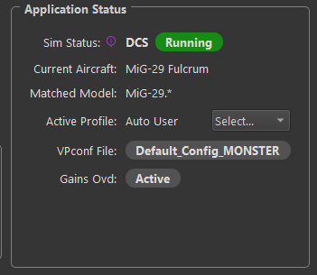{ width="304px" height="264px" }

-   **Sim Status**

    -   Shows the currently connected simulator and the active status

    -   Possible Status'

        -   **Waiting **- No telemetry has been received from any enabled simulator

        -   **Running **- Sim is connected and Telemetry is flowing

        -   **Paused **- Telemetry is no longer being received from the connected simulator and/or the simulator is in a paused state

        -   **Error **- A configuration error condition is present.
            Generally, there will be an error status message displayed indicating what the error is and how to resolve it.

-   **Current Aircraft**

    -   Displays the name of the aircraft as received in the telemetry and the profile

-   **Matched Model**

    -   Displays the match string that correlates to the aircraft profile that has been loaded for the detected aircraft

-   **Active Profile**

    -   Displays the actively selected user profile name

-   **VPconf File (if dynamic VPconf files are in use):**

    -   Displays the name of the last vpconf file that was pushed to the device

-   **Gains Ovd:**

    -   Shows active status if the Configurator Gains Override setting is in use and active.

### Hide Tab

The Hide tab is the simplest and reduces information shown to the bare minimum:

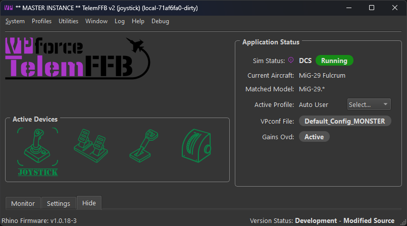{ width="525px" height="291px" }

### Monitor Tab

The Monitor tab shows received telemetry data and effects that are
currently active:

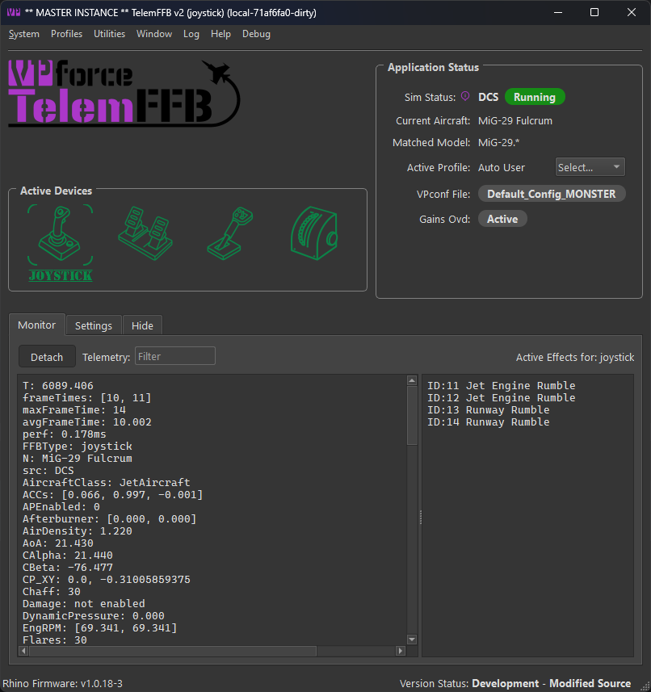{ width="516px" height="548px" }
!!!note 
    You can also detach the monitor tab from the main window and display it separately along side the main TelemFFB window. This can be useful for monitoring the active effects while you are making adjustments on the settings tab.

### Settings Tab

The Settings tab allows you to edit all possible forces and effects for the current aircraft loaded in the simulator. This section describes the interface, details about each setting are in other parts of the manual. Changing any setting has an immediate effect.

{ width="606px" height="644px" }

The effects setting page has multiple sections with settings grouped together by logical effect type. The categories are defined as follows:

-   **Basic**

    -   Basic effects primarily consist of spring related configurations. This is where you will find settings like the joystick spring mode and various in-game spring override settings

-   **Aerodynamics**

    -   These effects are typically related to aerodynamic conditions such as AoA, stall buffeting, elevator droop, ETL, VRS, overspeed, etc.

-   **Inertial**

    -   Inertial effects are those that are related to acceleration vector data such as the g-force effect, and deceleration effect

-   **Ground**

    -   Ground effect types will be related to the aircraft interaction with the surface. Effects such as ground rumble and the touchdown effect can be found here

-   **Mechanical\\Airframe**

    -   These effects typically are related to mechanical aspects of the aircraft such as gear, flaps, canopy motion.

-   **Weapons**

    -   Here you will find the settings for weapon based effects for combat simulators

-   **Basic FFB Effects**

    -   These effects are not telemetry driven. In this section you can enable and configure basic FFB effects such as dampening, friction and inertia

-   **System**

    -   The system section has non-effect based configurations such as configurator gain overrides, dynamic vpconf profile selection and other settings that can be configured per-aircraft.

### Modifying settings in real time

Effect sliders have a toggle to enable or disable that effect. You can quickly toggle on/off an effect. When the setting is off, your intensity setting is retained. **The handle will also turn green when that effect is active**.

Example

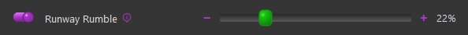{ width="594px" height="45px" }

Some settings have additional parameters. You will see an expander button next to them and a clickable hyperlink for the effect name. **Click the expander** **or the hyperlink** to see additional settings, and again to collapse:

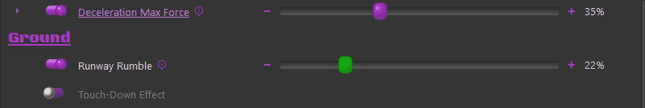{ width="628px" height="106px" }

Any setting you have modified will show a 'x' icon on the right side. You can **click this icon** to return the setting to the default:

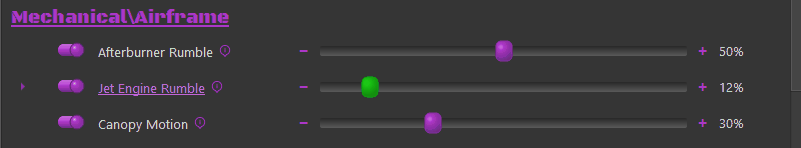{ width="629px" height="115px" }

If you have a setting that you would like to apply to all aircraft of the same class, or for the entire sim, you can right-click on the delete button and choose to move the setting up to the class default or the sim default level. Once you have done so, an information icon will be visible where the delete button was, indicating that the setting has an override from defaults at the sim or class level. Hovering over the information icon will display the override level.

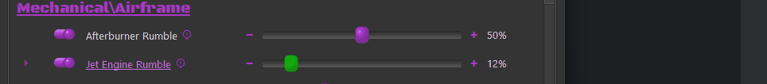{ width="680px" height="75px" }

For settings where a unit is used, there is a dropdown of acceptable units:

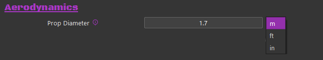{ width="566px" height="106px" }

Some settings require a grip button assignment before use. **Click the button** on the screen and then press the desired grip button before the timer expires:

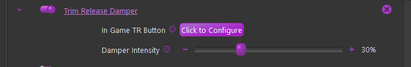{ width="638px" height="105px" }

Once the button is set, you can right-click on the X to apply to class or sim as shown above if you use the same grip and button for other aircraft.

## System Tray

When TelemFFB starts, a system tray icon with a context menu is added to the windows taskbar. By default, the icon will be accessible from the expander button in the system tray. You may choose to drag the icon into the pinned icon areas of your task bar so that it is always visible.

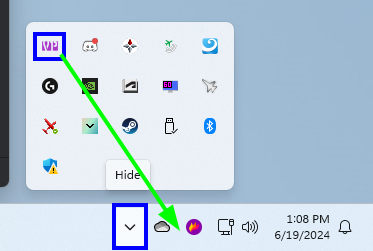{ width="247px" height="166px" }

You can force the TelemFFB window to show by double-clicking the icon or from the context menu.

When you start a simulator, the system tray icon will change colors to indicate the current status of the sim, very similar to the status indicator icons in the main TelemFFB window.

*{ width="20px" height="20px" }*

*{ width="20px" height="20px" }*

*{ width="20px" height="20px" }*

There will also be a system
    tray notification with the error information and the error message
    will be visible on the TelemFFB main window.

### System Tray Context Menu

Right-clicking on the system tray icon will open the context window. There are several items.

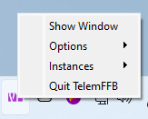{ width="163px" height="131px" }

-   **Show Window**

    -   Forces the TelemFFB window to show itself if it is hidden and also come to the front if it is minimized or hidden by other windows.

-   **Options**

    -   Provides options for toggling the Start to / Close to tray options. These toggles are identical to the checkboxes in the system settings page. If you change the options here, they will take effect immediately and you will see the change reflected in the system settings.

-   **Instances**

    -   If you are running with multiple VPforce devices, this menu will have options to explicitly show the window for each of the additional instances of TelemFFB

-   **Quit TelemFFB**

    -   Exits the application
