# Application UI Overview

## General Application Overview

The TelemFFB main window has these parts, from top to bottom:

- The **menu bar**, with the VPforce logo at its right-hand end.
- The **Application Status** box: the simulator, the loaded aircraft and profile, and any error message.
- **Prompts** that ask you to do something, when there is something to do.
- The **Monitor**, **Settings** and **Hide** tabs.
- The **status bar**.

The device icons are in the **Active Devices** side panel along the left edge of the window. You can move them to one of several other places; see [Where the Devices Are Shown](#device-panel). Refer to the sections below for details on each part.

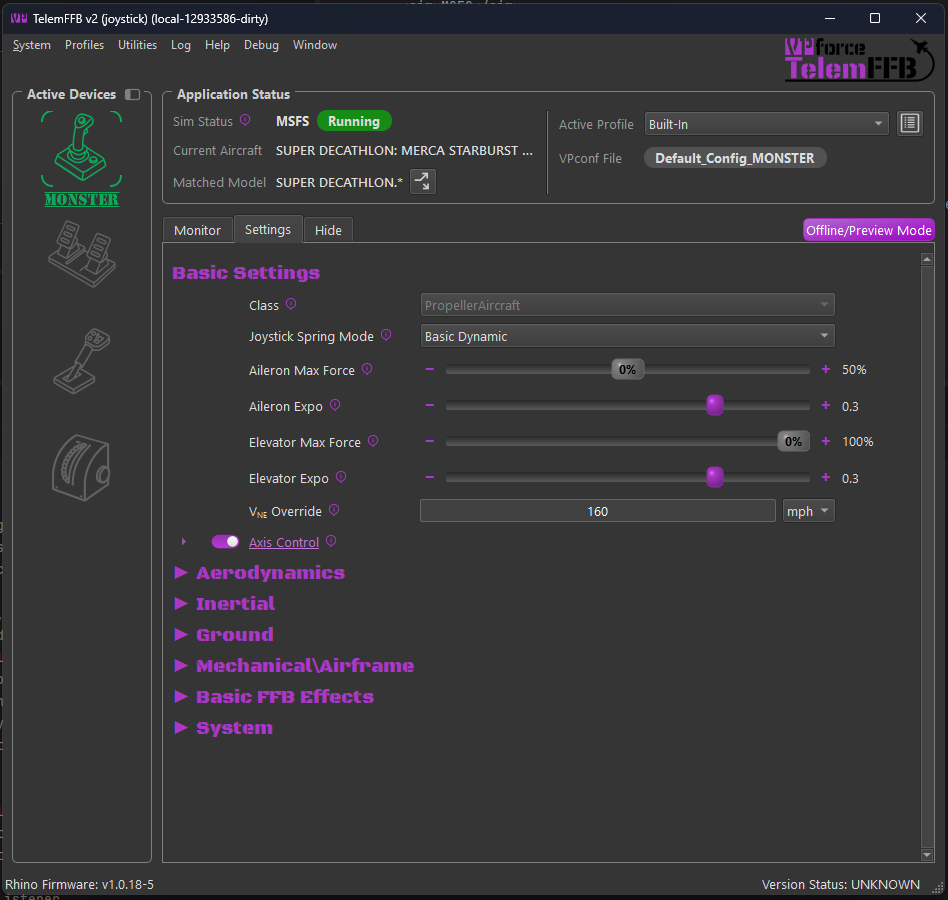{ width="600px" }

## The Menus

### System Menu

- **System Settings** - see [System Settings](configuration.md). This item is on the master instance only, because the master's dialog holds the settings of every device.

- **Open Config/Log directory** - opens the folder in your user local appdata where logs and settings are stored

- **Reset Window Size/Position** - resets the window sizes to default. TelemFFB will remember and store the window size and position across executions of the application.

- **Quit TelemFFB** - closes the application and stops all effects. On a child instance, the item is **Quit the *Device* Instance**, and it closes only that instance.

### Profiles Menu

- **Profile Manager**

    - Launches the aircraft profile manager. From here you can add, clone, rename, export, import, edit or delete user created aircraft profiles

    - See ***Profile Manager*** documentation

- **Offline Editor/Effect Preview**

    - Puts the application into offline editing mode. While in offline editing mode, telemetry is paused.

    - Edits sim defaults, class defaults, or a specific aircraft and profile without that aircraft being loaded. See [Offline Editor](settings-model.md#offline-editor).

    - Effects can be played on the device from here. See [Effect Preview](effect-preview.md).

- **Reset Dismissed Profile Prompts**

    - Brings back every **Multiple matching profiles** prompt that you answered with "Keep mine" or "Don't ask again". Your configuration does not change. The item is greyed out when there is nothing to reset. See [Overlapping Profiles](aircraft-profiles.md#overlapping-profiles).

### Utilities Menu

- **Reset all Effects** - Reset the VPforce device and clean up any lingering effects.

    !!! warning
        Destructive to any active effects being generated by a simulator.

- **Install Latest TelemFFB** - Start the auto-update process. Only active if an update is available and the update prompt is disabled or was dismissed on startup.

- **Reset User Config** - Removes all user configured settings from TelemFFB and reverts to 'factory defaults' for all effects settings. Note that when this is executed, a date-time stamped backup of the existing user configuration is saved in the TelemFFB folder in AppData/Local

- **Launch VPForce Configurator** - Cross launches the VPforce
    configurator app to set up your device

- **SimConnect/Dataref Overrides Editor** - changes where a telemetry item's data comes from, for MSFS and X-Plane aircraft. See [Telemetry Overrides](telem-overrides.md).

- **Elevator Trim Calibration...** - opens the trim calibration tool for MSFS and X-Plane fixed-wing aircraft. See [Automatic Trim Calibration](msfs-xp-trim-calibration.md).

- **DirectInput Tap Monitor...** - shows whether a game sends its effects through the [DirectInput Tap](dinput-tap.md), which devices the wrapper captured, and what each effect slot receives. The window keeps a time-stamped log of each change. Use **Save Log...** to save the log and send it to support.

### Window Menu

- **Devices** (master instance) - chooses where the device icons are shown. See [Where the Devices Are Shown](#device-panel).

- **Show Child Instance Windows** (master instance, with other VPforce devices in use)

    - Forces the child instance device windows to become visible if they are hidden/minimized

- **Hide Child Instance Windows** (master instance, with other VPforce devices in use)

    - Re-hides the child instance device windows.

- **Hide Window** (child instance)

    - Hides the window of that child instance.

### Log Menu

- **Open Console Log**

    - Open the log window for the instance of TelemFFB

- **Open Child Logs** (if more than one VPforce device is in use)

    - Has one item for each child device instance, for example **Pedals log**. Select an item to open the log window of that instance.

### Help Menu

- **Release Notes** - shows any release notes for this version of TelemFFB

- **Documentation** - opens this manual

- **Create Support Bundle** - Opens a file dialog and creates a zip file containing your TelemFFB system settings, any user settings you have stored, and your Log folder..

## Application Main Window

### Active Devices Area

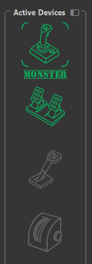{ width="158px" }

The active devices area is both a way to switch the master instance configuration scope between devices as well as a device/instance status tracker for the primary and child devices and their TelemFFB instances.

The **Active Devices** side panel always shows all four device roles: joystick, pedals, collective and trim wheel. A role that has no device configured shows a grey icon. A grey icon does not respond to a click.

The label under each icon names the hardware that holds the role. In the other places the devices can be shown, the icons are smaller and have no label; hover an icon to see its name.

### Detachable/Dockable Device Panel { #device-panel }

The device icons can be shown in one of seven places. Everywhere except the **Side panel**, they appear as the **device strip**: a compact row of small icons.

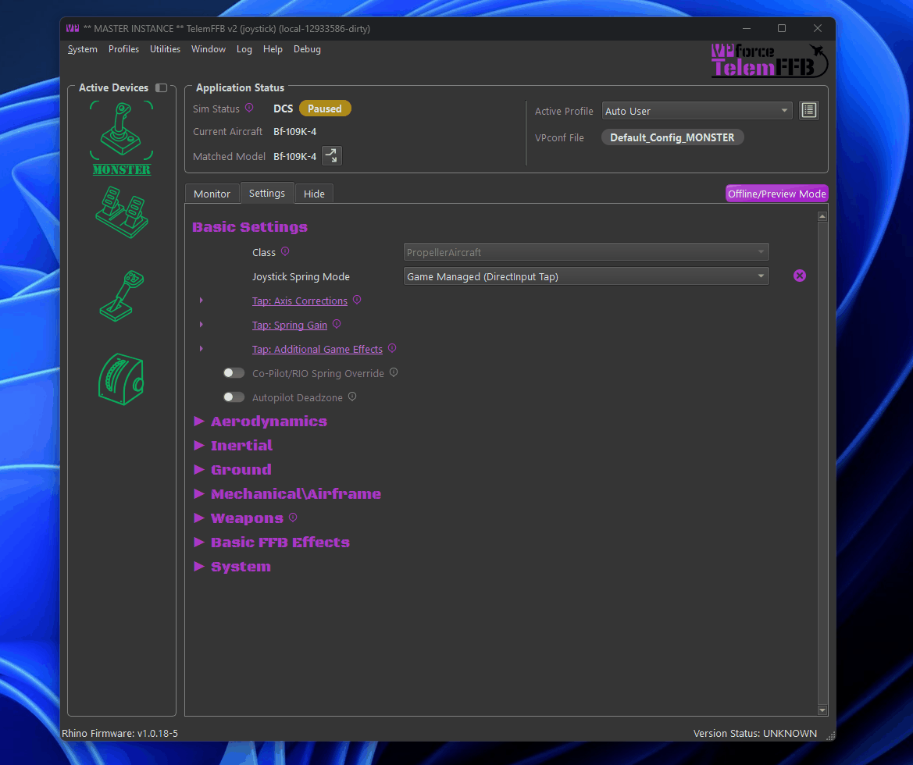{ width="700px" }

| Place | Where the devices appear |
|---|---|
| **Side panel** | The **Active Devices** panel along the edge of the window, with a label under each icon. This is the default. |
| **Side panel (compact)** | A narrow column of small icons along the edge of the window. |
| **Menu bar** | The device strip at the right-hand end of the menu bar, beside the logo. |
| **Application status box** | The device strip in the **Application Status** box, below **Matched Model**. |
| **Monitor/Settings header** | The device strip at the right-hand end of the header of the Monitor or Settings page. |
| **Bottom of the window** | The device strip in a row of its own below the tabs, at the right-hand end. |
| **Floating strip** | The device strip in a small window of its own, which you can move anywhere. |

To change the place, do one of these steps:

- In the **Window** menu, open **Devices** and select a place.
- Right-click the device icons, wherever they are shown, and select **Show devices: *place***.
- Click the **view glyph**: the small window-and-panel symbol. The glyph is in the title of the Active Devices panel, and beside the device strip when you move the mouse over the strip. On the Active Devices panel, a click changes to the compact place that you used last. On the device strip, a click changes back to the Active Devices panel.
- Drag the view glyph away from its position. The device strip starts to float, and you continue to drag it.

**Side panels on the right** (in the **Devices** menu and in the right-click menu) moves both side panels to the right edge of the window.

#### Moving and Docking the Floating Strip

Drag the floating strip by its grip or its edges. A click on an icon still selects that device.

While you drag the strip over the main window, each place where it can dock is highlighted, and a tooltip below the strip names that place, for example **Dock: Menu bar**. Release the strip to dock it there. To keep the strip floating at that position, hold **Ctrl** while you release it.

Right-click the floating strip for two more options:

- **Keep inside the main window** - the strip stays inside the main window, moves with it and minimizes with it. This is the default.
- **Keep on top of other windows** - available when the strip is not kept inside the main window. Use it to put the strip over a simulator or on a different monitor.

!!! note
    - With one device configured, the icons show status only. A click on an icon does nothing, because there is no other device to switch to. All seven places are still available.
    - On the **Hide** tab, the side panel and the docked device strip are hidden. A floating strip that is not kept inside the main window stays visible.
    - A child instance always shows its own device in its **Application Status** box. Where the devices are shown is set on the master instance.

### Switching Between Devices

To switch between devices for configuration, click the device icon, wherever the devices are shown. The configuration elements on the Settings tab change to the settings for that device, and the Monitor tab shows the telemetry and effects of that device. See [Monitor Tab](#monitor-tab).

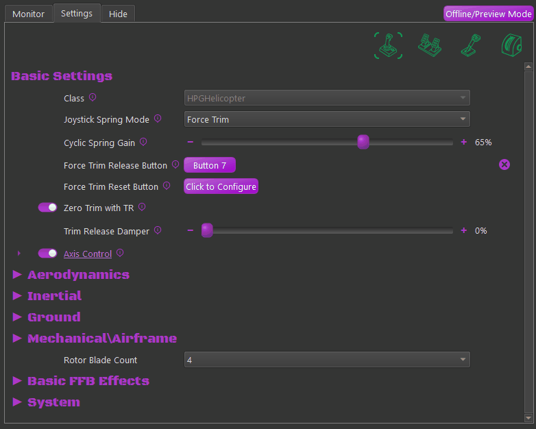{ width="600px" }

### Device/Instance Status Indications { #device-status }

The device icons serve the dual purpose of displaying the status of both the device connection as well as the individual TelemFFB instances which are ultimately controlling the multiple devices. The small icons of the device strip use the same colors.

The icon pulses when its state changes. Hover an icon to read its current state.

**Green Status Icon:**

{ width="55px" height="55px" }

A green status icon indicates that the device is properly connected to its instance of TelemFFB and the child instance of TelemFFB is healthy

**Yellow Status Icon:**

{ width="47px" height="53px" }

A yellow status icon indicates that the device was connected and has dropped off. TelemFFB looks for it again on its own, so no restart is needed. See [Device recovery](devices-instances.md#device-recovery).

**Red Status Icon:**

{ width="54px" height="54px" }

A red status icon indicates one of three things: the configured device was not found when TelemFFB started, the child instance of TelemFFB has crashed, or there is an error condition present for that instance. A device that was not found is picked up as soon as it appears.

**Grey Status Icon:**

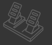{ width="55px" }

A grey icon indicates that no device is configured for that role. To configure a device, see [Devices and Instances](devices-instances.md).

### Application Status Area

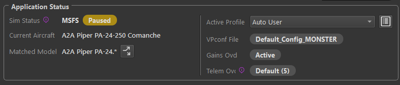{ width="700px" }

The **Application Status** box has two columns. The left column shows what the simulator is doing. The right column shows the profile and the overrides in use.

- **Sim Status**

    - Shows the currently connected simulator and the active status. Hover the **Sim Status** label to see which simulators are enabled and which are disabled.

    - Possible Status'

        - **Waiting... **- No telemetry has been received from any enabled simulator

        - **Running **- Sim is connected and Telemetry is flowing

        - **Paused **- Telemetry is no longer being received from the connected simulator and/or the simulator is in a paused state

        - **Error **- A configuration error condition is present.
            Generally, there will be an error status message displayed indicating what the error is and how to resolve it. See [Configuration errors](#configuration-errors).

        - **Offline **- The offline editor is open. See [Offline Editor](settings-model.md#offline-editor).

- **Current Aircraft**

    - Displays the name of the aircraft as received in the telemetry and the profile

- **Matched Model**

    - Displays the match string of the aircraft profile that matched the detected aircraft. When several match strings fit, the most specific one wins; see [How TelemFFB Matches an Aircraft](aircraft-profiles.md#how-telemffb-matches-an-aircraft).

    - The **fork button** beside it gives the loaded aircraft a more specific profile of its own. See [Forking a Profile](aircraft-profiles.md#forking-a-profile).

- **Active Profile**

    - On the master instance, a dropdown list of the profiles for the loaded aircraft. The selected profile is the active profile. Select a different profile to make it active. Select **Add New...** to create a new profile for the aircraft. The list is available when a profile matches the aircraft.

    - On a child instance, the field shows the name of the active profile. The master instance selects the profile.

    - The **notes button** beside it opens the [Profile Notes](#profile-notes).

- **VPconf File (if dynamic VPconf files are in use):**

    - Displays the name of the last vpconf file that was pushed to the device

- **Gains Ovd:**

    - Shows active status if the Configurator Gains Override setting is in use and active.

- **Telem Ovd:**

    - Shown when the loaded aircraft has active [telemetry overrides](telem-overrides.md), with a count for each tier. "Class (4) + Default (2) + User (1)" means four overrides from the aircraft class, two from the built-in profile and one of your own. Hover for the full list. The [overrides guide](telem-overrides.md#where-an-aircrafts-overrides-come-from) explains the tiers.

In the offline editor, the fields show **Offline**, and an orange banner below them says that telemetry is paused.

#### Configuration Errors

When a configuration error is present, **Sim Status** shows **Error**, and a red message area opens below **Active Profile**. The message names the device it applies to, for example **Joystick:**, then says what is wrong and how to correct it.

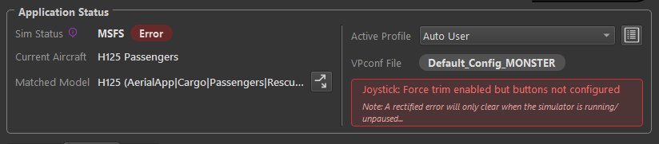{ width="700px" }

- If several errors are present at the same time, the box shows one at a time. When you correct that error, the next one shows.
- The [exception viewer](troubleshooting.md#exception-tracking-reporting) lists all of them.
- A corrected error clears only while the simulator is running and not paused, because TelemFFB checks for the error in the live telemetry. A note below the message says this.

### Profile Notes

The status area includes a **notes button** for the loaded aircraft profile.

{ width="550px" }

- Some shipped default profiles carry **curated notes**: special considerations for the aircraft, or an explanation of why its default settings differ from otherwise similar aircraft.
- You can **add your own notes** to any aircraft profile. The dialog shows the inherited notes read-only (shipped notes and any user-default note), with an editable section for the active profile's own note.
- When you load an aircraft that has notes to read, the notes icon **flashes green**; click it to view or edit.

### Prompts

A prompt appears below the **Application Status** box when TelemFFB needs you to do something. Click the prompt to do it.

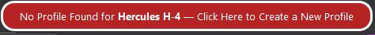{ width="474px" }  
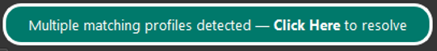{ width="406px" }  
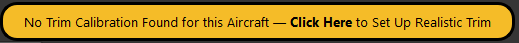{ width="519px" }

- **No Profile Found for *aircraft*** (red) - the loaded aircraft matches no profile. The controls on the Settings tab are disabled until you create one, because there is no profile to store a change in. Click the prompt to open the [New Aircraft Wizard](aircraft-profiles.md#adding-new-aircraft-support).
- **Multiple matching profiles detected** (teal) - one of your own profiles and a built-in profile both match the aircraft. Click the prompt to [choose what to do](aircraft-profiles.md#overlapping-profiles).
- **No Trim Calibration Found for this Aircraft** (amber) - the loaded MSFS or X-Plane fixed-wing aircraft has no stored trim calibration. Click the prompt to open the [Elevator Trim Calibration](msfs-xp-trim-calibration.md) tool. This prompt shows on the master instance, when it drives a joystick.

Prompts show only on the master instance.

### Monitor Tab

The Monitor tab shows the telemetry that TelemFFB receives, and the effects that are active on the device:

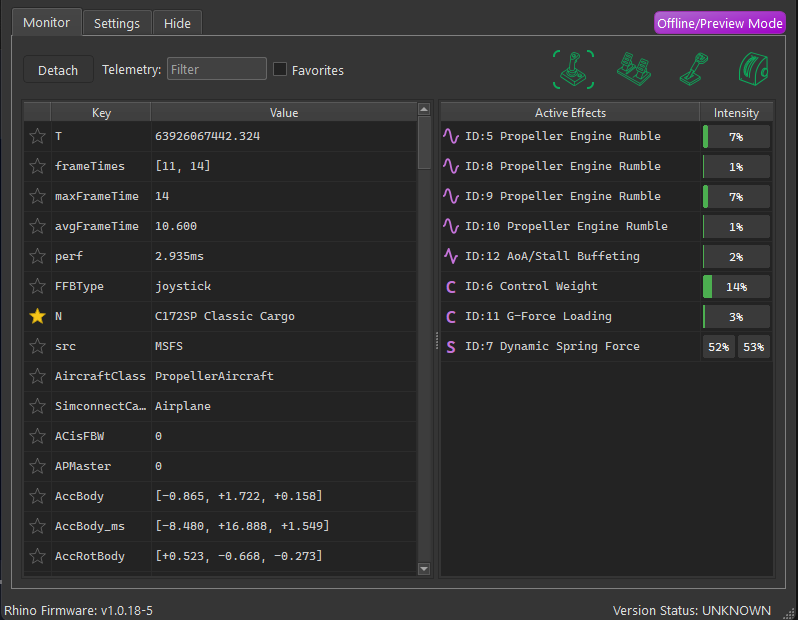{ width="600px" }

The header of the tab has these controls:

- **Detach** - moves the Monitor tab into a window of its own. See [Detaching the Monitor tab](#detaching-the-monitor-tab).
- **Filter** - shows only the telemetry items that you type. Type a comma-separated list; case does not matter. For example, `aoa, ias, rpm`.
- **Favorites** - shows only the telemetry items that you marked as favorites.
- **Device:** - on a master instance with child devices, names the device whose telemetry and effects the tab shows. It is hidden when the device strip is in the page header, because the strip highlights the same device.

Before telemetry arrives, the tab shows **Waiting for data...** and which simulators are enabled.

#### Telemetry

The telemetry table has one row for each telemetry item, with its **Key** and **Value**. Values that can be negative always show a sign, so the digits do not move when a value changes between positive and negative.

To copy telemetry, select cells or rows and press **Ctrl+C**.

**Favorites:** click the star at the left of a row to mark that item as a favorite. Click the star again to remove it. Select **Favorites** in the header to show only your favorites. Your favorites are the same for all of your devices, and TelemFFB keeps them between sessions.

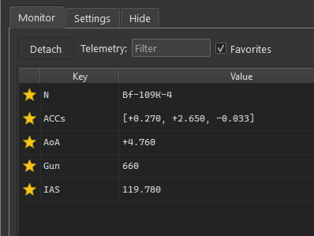{ width="398px" }

#### Active Effects

The **Active Effects** table lists each effect that plays on the device, grouped by type:

1. Periodic effects (vibrations).
2. Constant-force effects.
3. Spring, spring adjuster and detent effects.
4. Damper, inertia and friction effects.

A badge beside each name shows the effect type: a waveform for a periodic effect, and a letter for the other types. The image below shows every badge, with the name of the type in place of an effect name. Hover an effect name to see its type written out.

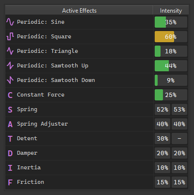{ width="400px" }

The **Intensity** column shows how strong each effect is now:

- **Periodic and constant-force effects** show a bar and a percentage of the device's full scale. Hover the cell to see the value as a percentage of full scale. For an effect that is linked to a setting, the hover text also shows the value as a percentage of your setting, and the position of the setting's slider.
- **Spring, spring adjuster, detent, damper, inertia and friction effects** show the gain of each axis in two cells: X, then Y. A copied row reads `X 50% Y 30%`. A dash marks an axis the effect does not use. These effects have no strength of their own: the force they make depends on the position or the speed of the stick.

!!! note "Why the intensity can read low"
    Most sliders are scaled: a slider at 30% can set a value of 0.12, not 0.30. Some effects also divide their strength between the X and Y axes. The intensity column shows the real output of the device, so an effect at 6% can be correct for a slider at 30%.

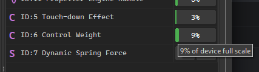{ width="427px" }

#### Child Device Data

On the master instance, click the icon of a child device to see the data of that device. While you look at a child device, the child instance sends its telemetry to the master, and the Monitor tab shows it. This includes items that only the child calculates.

If the child does not send its telemetry, the **Device:** indicator shows **(no data)** after the device name, and the telemetry table shows the master's own telemetry.

#### Detaching the Monitor Tab

You can detach the Monitor tab from the main window and show it beside the main TelemFFB window. This is useful to watch the active effects while you change settings on the Settings tab.

To detach the tab, do one of these steps:

- Click **Detach** in the header of the tab.
- Right-click the **Monitor** tab and select **Detach**.
- Press **Ctrl+Shift+M**.

The detached window has a device strip of its own, so you can switch devices from it. To put the tab back, click **Reattach**, or close the window.

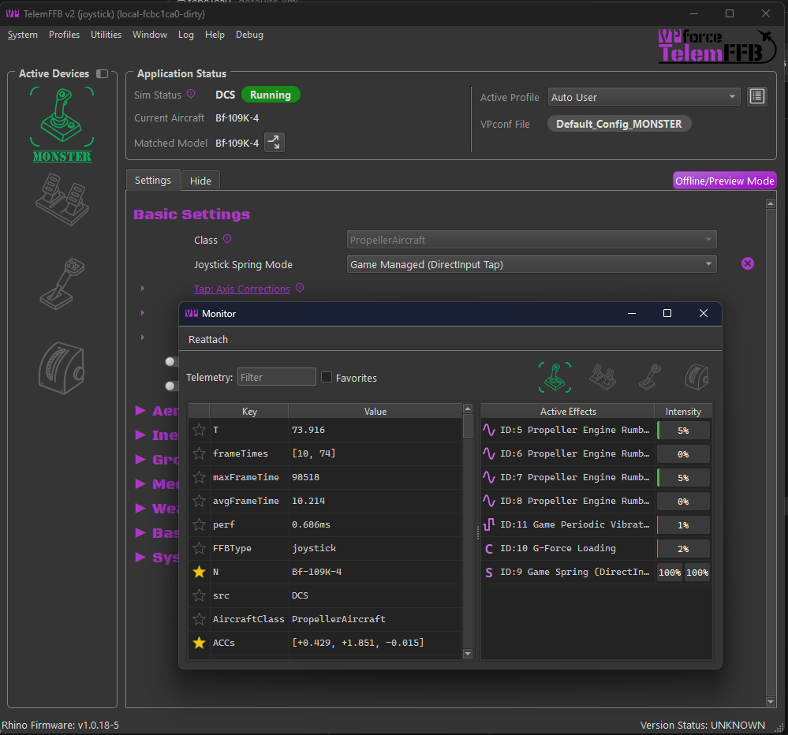{ width="700px" }

### Hide Tab

The Hide tab is the simplest and reduces information shown to the bare minimum: the menu bar, the **Application Status** box, any [prompts](#prompts) and the tab bar. The device side panel and the docked device strip are hidden on this tab.

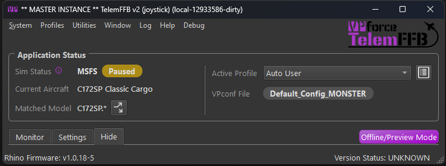{ width="600px" }

### Settings Tab

The Settings tab allows you to edit all possible forces and effects for the current aircraft loaded in the simulator. This section describes the interface; every effect and setting is documented in the [Effects Reference](effects-overview.md), which mirrors the Settings tab section for section. Changing any setting has an immediate effect.

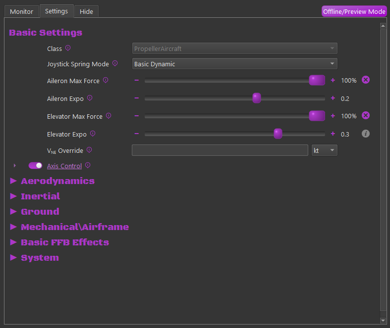{ width="600px" }

When the loaded aircraft matches no profile, the controls on this tab are disabled. The **No Profile Found for** prompt above the tabs opens the wizard that creates one. See [Prompts](#prompts).

With an aircraft loaded, an **Offline/Preview Mode** button is at the right-hand end of the tab bar. It opens the offline editor on that aircraft, where each effect can be played on the device with a **▶** button. See [Effect Preview](effect-preview.md).

The effects setting page has multiple sections with settings grouped together by logical effect type. The categories are defined as follows; each links to its reference page:

- **[Basic](effects-basic.md)**

    - Basic effects primarily consist of spring related configurations. This is where you will find settings like the joystick spring mode and various in-game spring override settings

- **[Aerodynamics](effects-aerodynamics.md)**

    - These effects are typically related to aerodynamic conditions such as AoA, stall buffeting, elevator droop, ETL, VRS, overspeed, etc.

- **[Inertial](effects-inertial.md)**

    - Inertial effects are those that are related to acceleration vector data such as the g-force effect, and deceleration effect

- **[Ground](effects-ground.md)**

    - Ground effect types will be related to the aircraft interaction with the surface. Effects such as ground rumble and the touchdown effect can be found here

- **[Mechanical\\Airframe](effects-mechanical.md)**

    - These effects typically are related to mechanical aspects of the aircraft such as gear, flaps, canopy motion.

- **[Weapons](effects-weapons.md)**

    - Here you will find the settings for weapon based effects for combat simulators

- **[Basic FFB Effects](effects-ffb.md)**

    - These effects are not telemetry driven. In this section you can enable and configure basic FFB effects such as dampening, friction and inertia

- **[System](effects-system.md)**

    - The system section has non-effect based configurations such as configurator gain overrides, dynamic vpconf profile selection and other settings that can be configured per-aircraft.

### Modifying Settings in Real Time

Effect sliders have a toggle to enable or disable that effect. You can quickly toggle on/off an effect. When the setting is off, your intensity setting is retained. **The handle will also turn green when that effect is active**.

Example

{ width="594px" height="45px" }

Some settings have additional parameters. You will see an expander button next to them and a clickable hyperlink for the effect name. **Click the expander** **or the hyperlink** to see additional settings, and again to collapse:

{ width="628px" height="106px" }

Any setting you have modified will show a 'x' icon on the right side. You can **click this icon** to return the setting to the default:

{ width="629px" height="115px" }

If you have a setting that you would like to apply to all aircraft of the same class, or for the entire sim, you can right-click on the delete button and choose to move the setting up to the class default or the sim default level. Once you have done so, an information icon will be visible where the delete button was, indicating that the setting has an override from defaults at the sim or class level. Hovering over the information icon will display the override level.

{ width="680px" height="75px" }

To remove a class or sim override, right-click the information icon and select **Remove setting from the *sim* *class* class** or **Remove setting from the *sim* sim level**. Confirm the removal. Every aircraft that used the override then goes back to the value below it. You do not have to open the offline editor to do this.

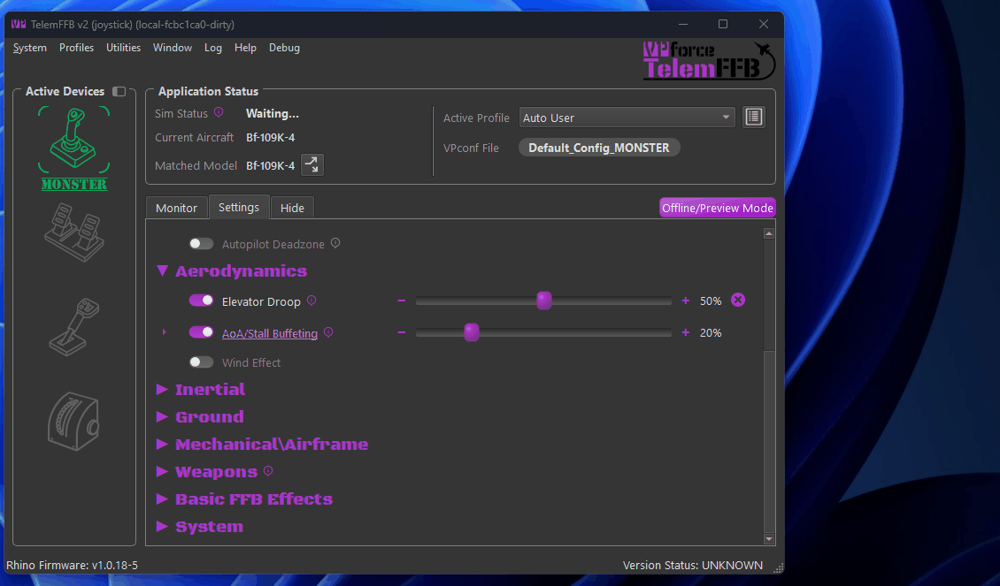{ width="700px" }

For settings where a unit is used, there is a dropdown of acceptable units:

{ width="566px" height="106px" }

Some settings require a grip button assignment before use. **Click the button** on the screen and then press the desired grip button before the timer expires:

{ width="638px" height="105px" }

Once the button is set, you can right-click on the X to apply to class or sim as shown above if you use the same grip and button for other aircraft.

## Status Bar

Along the very bottom edge of the main window:

{ width="700px" }

- **Rhino Firmware** - the firmware version of the connected device (or "Device Disconnected").
- **Errors** - a red counter that appears only when TelemFFB has logged runtime errors. Click it to open the exceptions viewer; see [Exception Tracking & Reporting](troubleshooting.md#exception-tracking-reporting).
- **Version Status** - whether this TelemFFB build is up to date; when an update is available, the text becomes a clickable link.

## System Tray

When TelemFFB starts, a system tray icon with a context menu is added to the windows taskbar. By default, the icon will be accessible from the expander button in the system tray. You may choose to drag the icon into the pinned icon areas of your task bar so that it is always visible.

{ width="247px" height="166px" }

You can force the TelemFFB window to show by double-clicking the icon or from the context menu.

When you start a simulator, the system tray icon will change colors to indicate the current status of the sim, very similar to the status indicator icons in the main TelemFFB window.

*{ width="20px" height="20px" }*

*{ width="20px" height="20px" }*

*{ width="20px" height="20px" }*

!!! note
    An error also triggers a system tray notification. The error message appears on the TelemFFB main window.

### System Tray Context Menu

Right-clicking on the system tray icon will open the context window. There are several items.

{ width="163px" height="131px" }

- **Show Window**

    - Forces the TelemFFB window to show itself if it is hidden and also come to the front if it is minimized or hidden by other windows.

- **Options**

    - Provides options for toggling the Start to / Close to tray options. These toggles are identical to the checkboxes in the system settings page. If you change the options here, they will take effect immediately and you will see the change reflected in the system settings.

- **Instances**

    - If you are running with multiple VPforce devices, this menu will have options to explicitly show the window for each of the additional instances of TelemFFB

- **Quit TelemFFB**

    - Exits the application
