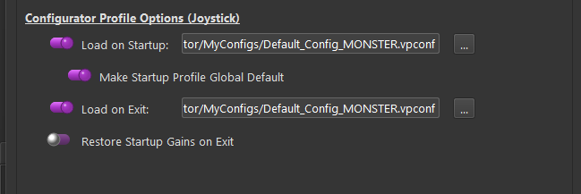
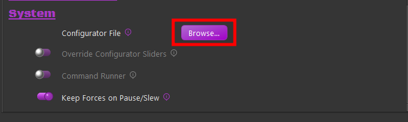
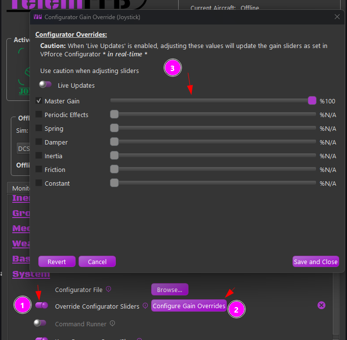

# VPforce Configurator Profiles & Gain Overrides

## Dynamic VPforce Configurator Profile Assignment

Often it is desirable to have different VPforce Configurator settings in place for different aircraft, types of aircraft or simulators.

While this can be accomplished manually by simply loading a profile in Configurator and then applying it, that is a tedious process.

Fortunately, this process can be automated using TelemFFB. There are a variety of ways that VPforce Configurator profiles (hereafter called vpconf/configurator profiles) can be automatically loaded onto your device via TelemFFB.

!!! note
    It is important to understand the hierarchical effect of defining configurator profiles and various levels of specificity.

The startup/exit profiles will *always* load on startup/exit.

The "global default" will always load if a prior aircraft/class/sim loaded a specific profile and a newly loaded aircraft does not have any other more specific definition.

The more specific the definition, the higher the precedence. A configurator profile defined for a specific aircraft will supersede all other profiles when that aircraft is loaded.

Similarly, "aircraft class" (helicopter/prop/jet, etc) will supersede "sim" (DCS, MSFS, etc).

### Startup/Exit configurator profiles

In the system settings options there are fields where you can select discrete profiles that TelemFFB will always push to the device when it starts, or when it exits. This can be useful for keeping a low force profile on your device while not in use, but loading a profile with higher effect settings gains when you start TelemFFB.

{ width="584px" height="195px" }

### Global Default configurator profile

Also in the system settings, you can set the TelemFFB startup profile to be used as a global default for any aircraft or sim. This is useful if you only have one or two specific aircraft that you wish to apply custom profiles to. When an aircraft with a custom profile is loaded, TelemFFB will push the profile defined for that aircraft to the device. At some point later, if another aircraft is loaded and it does not have a profile defined at either the Aircraft, Class or Simulator level, TelemFFB will automatically revert the configuration on the device to the global default value.

### Assigning a configurator profile to a specific aircraft

When loaded into an aircraft, or with the sim, class, or specific aircraft/profile selected in offline mode, simply select the Configurator File selection button in the TelemFFB settings tab System section and browse to the configurator profile. This will be stored in your user configuration and every time that aircraft is loaded, TelemFFB will push the profile to your device.

{ width="411px" height="123px" }

## Dynamic Configurator Gain Overrides

In addition to (or in lieu of) pushing a whole VPforce Configurator ("vpconf") profile to the device, you can also configure dynamic adjustments to the individual effect type gains as if you were adjusting them directly from the configurator app.

As with any other setting in TelemFFB, this can be done at the Sim, Aircraft Class or specific aircraft level.

For Sim/Aircraft Class, these must be accessed from the
***Offline/Global Sim/Class Editor***.

For individual aircraft, it is easiest done straight from the settings page on the main window.

### How it works

First, it is important to understand how this works.

-   There is always a baseline set of gains stored in TelemFFB while
    running:

    -   The current gain values on the device are captured when TelemFFB is started.

    -   Any time a VPforce Configurator ("vpconf") profile is pushed to the device by TelemFFB, the new gains on the device are read and remembered by TelemFFB for later use.

        -   This includes VPforce Configurator profiles that are pushed as the "TelemFFB startup Profile", and any that are pushed as part of a Sim/Class/Aircraft configuration

-   If an aircraft that has a Configurator Gain Override configured is loaded

    -   The gain values will be set ***after*** any "vpconf" profile is pushed. This means that the gain overrides will supersede the "vpconf" profile gain settings.

-   Subsequently, if an aircraft that ***does not have*** a Configurator
    Gain Override configured is loaded into the sim

    -   TelemFFB will revert the gain settings on the device to the last baseline value. This will either be the gains that were read at startup, or the gains that were read after the last time a configurator profile was loaded.

-   When exiting, TelemFFB will re-push the gain values that were initially read on startup so as to leave the device in the same condition it was found.

### Example Configurations

Several examples follow in an attempt to describe the behavior of the Configurator Gain Overrides and its interaction with the ***Dynamic VPForce Configurator Profile*** feature. Each example walks through the behavior from startup of TelemFFB, through 2 different aircrafts loading with different settings and finally exiting TelemFFB.

**Example 1**

Simplified using a single effect type in the example. Synopsis below:

-   TelemFFB not running
-   Current Spring Gain on device - %50
-   No "startup vpconf" configured.
-   No "vpconf" specified for example loaded aircraft
-   First example aircraft has spring gain override configured at %100

-   Start TelemFFB

    -   Spring effect gain read at %50 and value stored for later use
-   Load aircraft with override configured with spring at %100

    -   Spring gain of %100 gets set to device
-   Load aircraft with *no* override configured

    -   TelemFFB pushes original %50 that was read on startup
-   Exit TelemFFB

    -   TelemFFB pushes original %50 that was read on startup as final
        measure to ensure same state as startup.

**Example 2**

Simplified using a single effect type. Synopsis below

-   TelemFFB not running
-   Current Spring Gain on device - %50
-   "startup vpconf" configured with spring gain = %75
-   No "vpconf" specified for example loaded aircraft
-   First example aircraft has spring gain override configured at %100
-   Start TelemFFB

    -   Spring effect gain read at %50 and value stored for later use
-   Startup VPconf Profile pushed

    -   Spring effect gain read at %75 and value stored for later use
-   Load aircraft with override configured with spring at %100

    -   Spring gain of %100 gets set to device
-   Load aircraft with *no* override configured

    -   TelemFFB pushes spring gain %75 that was read after the startup
        vpconf was pushed

-   Exit TelemFFB

    -   TelemFFB pushes original %50 that was read on startup as final
        measure to ensure same state as startup.

**Example 3**

Simplified using a single effect type. Synopsis below

-   TelemFFB not running
-   Current Spring Gain on device - %50
-   "startup vpconf" configured with spring gain at %75
-   First example aircraft has "vpconf" configured with spring gain %80 **and** a spring gain override set at %40
-   Start TelemFFB

    -   Spring effect gain read at %50 and value stored for later use
-   Startup VPconf Profile pushed

    -   Spring effect gain read at %75 and value stored for later use
-   Load aircraft with vpconf set at %80 and spring gain override configured at %40

    -   TelemFFB pushes new vpconf

        -   new gains are read and stored for later use
    -   TelemFFB pushes gains from the override config
    -   The net result is that the gains on the device will be whatever is in the override config since it happens last

-   Load aircraft with **no** gain override and *no* vpconf configured

    -   The following behavior depends on the state of the "***Global
        Default***" setting for the "vpconf startup"
        profile.

    -   If Global Default is enabled:

        -   Since no vpconf profile is configured for new aircraft, the
            Global Default ("startup") profile is pushed to the
            device.

            -   Since the startup vpconf was pushed with spring gain =
                %75, we read and update our stored gain settings from
                the device

    -   If Global Default is disabled

        -   Since no vpconf profile is configured for the new aircraft
            and Global Default is disabled, the vpconf settings and
            stored gain values (spring = %80) from the previous
            aircraft will persist.

    -   TelemFFB pushes spring gain %75 if Global Default is enabled or
        %80 if Global Default is disabled. Both of these pushes are
        redundant since those gain values are already on the device,
        but this is the way the logic works to account for cases when
        there are gain overrides but no vpconf overrides.

-   Exit TelemFFB

    -   TelemFFB pushes original %50 that was read on startup as final measure to ensure same state as startup.

|          |                                       |     |           |
|----------|---------------------------------------|-----|-----------|
| Configurator | Master Gain                        |    |  100%     |
| Configurator | Spring Gain                        |    |  <del>50%</del>    |
| TelemFFB | Startup vpconf spring gain            |     | <del>75%</del>   |
| TelemFFB | Configurator Spring Gain Override     |     | 80%       |
| TelemFFB | Aircraft spring gain                  | x   | 40%       |
|          | ==Final Force==                           |     | 75%       |

### Configuring The Gains

Configuring the Gain Overrides is very simple and similar to configuring the equivalent sliders in VPforce Configurator with one major difference. That is, adjusting the slider takes effect (very nearly) immediately. There is a small delay where the slider must be stationary in order for the command to be sent to avoid spamming the device with hundreds of commands.

To access the override dialog

1.  Enable the "Override Configurator Sliders" toggle (1)

2.  Press the "Configurator Gains Override" button (2)

{ width="487px" height="478px" }

To override a given effect gain slider, simply tick the checkbox and adjust the slider to your liking. If you enable the Live Updates option, You will feel the effects of the change immediately.

The button behavior is as follows

-   **Revert Button**

    -   The revert button will disable all of the override checkboxes and set the gains back to their stored baseline values. This will be either the gains read on startup or when the last "vpconf" profile was pushed

-   **Cancel Button**

    -   The cancel button will undo any changes that were made since the override window as opened. It will the close the window

-   **Save and Close Button**

    -   The save button will write the settings as they are currently configured to the user configuration file for the currently loaded aircraft.
